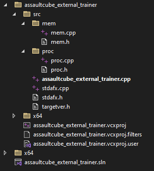
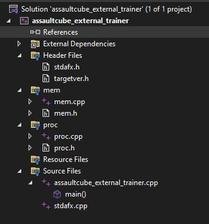

# External Trainer
- Checkout official [Guided Hacking website](https://guidedhacking.com) for more tutorials
- Checkout official [Guided Hacking Youtube channel](https://www.youtube.com/@GuidedHacking)
## Project
- The following mini-project is walkthrough from [Guided Hacking](https://guidedhacking.com)
  - You can check the videos linked below in the [references](#References)
### Software
- [Assault Cube 1.2.0.2](https://github.com/assaultcube/AC/releases/tag/v1.2.0.2)
- [Cheat Engine](https://www.cheatengine.org/)
- [Visual Studio Community](https://visualstudio.microsoft.com/) 
- [ReClass.NET](https://github.com/ReClassNET/ReClass.NET)
### Source Code
#### Structure
- Folder View



- Solution View



#### Proc
- `proc.h`
```cpp
#pragma once
#include "stdafx.h"

namespace proc {

DWORD GetProcId(const wchar_t* procName);

uintptr_t GetModuleBaseAddress(DWORD procId, const wchar_t* modName);

uintptr_t FindDMAAddy(HANDLE hProc, uintptr_t ptr, std::vector<unsigned int> offsets);

}
```
- `proc.cpp`
```cpp
#include "stdafx.h"
#include "proc.h"

DWORD proc::GetProcId(const wchar_t* procName) {
	DWORD procId = 0;
	HANDLE hSnap = CreateToolhelp32Snapshot(TH32CS_SNAPPROCESS, 0);

	if (hSnap != INVALID_HANDLE_VALUE) {
		PROCESSENTRY32 procEntry;
		procEntry.dwSize = sizeof(procEntry);

		if (Process32First(hSnap, &procEntry)) {
			do {
				if (!_wcsicmp(procEntry.szExeFile, procName)) {
					procId = procEntry.th32ProcessID;
					break;
				}
			} while (Process32Next(hSnap, &procEntry));
		}
	}
	CloseHandle(hSnap);
	return procId;
}

uintptr_t proc::GetModuleBaseAddress(DWORD procId, const wchar_t* modName) {
	uintptr_t modBaseAddr = 0;
	HANDLE hSnap = CreateToolhelp32Snapshot(TH32CS_SNAPMODULE | TH32CS_SNAPMODULE32, procId);

	if (hSnap != INVALID_HANDLE_VALUE) {
		MODULEENTRY32 modEntry;
		modEntry.dwSize = sizeof(modEntry);

		if (Module32First(hSnap, &modEntry)) {
			do {
				if (!_wcsicmp(modEntry.szModule, modName)) {
					modBaseAddr = (uintptr_t)modEntry.modBaseAddr;
					break;
				}
			} while (Module32Next(hSnap, &modEntry));
		}
	}
	CloseHandle(hSnap);
	return modBaseAddr;
}

uintptr_t proc::FindDMAAddy(HANDLE hProc, uintptr_t ptr, std::vector<unsigned int> offsets) {
	uintptr_t addr = ptr;
	for (unsigned int i = 0; i < offsets.size(); ++i)
	{
		ReadProcessMemory(hProc, (BYTE*)addr, &addr, sizeof(addr), 0);
		addr += offsets[i];
	}
	return addr;
}
```
#### Mem
- `mem.h`
```cpp
#pragma once
#include "stdafx.h"

namespace mem {
	void PatchEx(BYTE* dst, BYTE* src, unsigned int size, HANDLE hProcess);

	void NopEx(BYTE* dst, unsigned int size, HANDLE hProcess);

}
```
- `mem.cpp`
```cpp
#include "stdafx.h"
#include "mem.h"

void mem::PatchEx(BYTE* dst, BYTE* src, unsigned int size, HANDLE hProcess) {
	DWORD oldProtect;
	VirtualProtectEx(hProcess, dst, size, PAGE_EXECUTE_READWRITE, &oldProtect);
	WriteProcessMemory(hProcess, dst, src, size, nullptr);
	VirtualProtectEx(hProcess, dst, size, oldProtect, &oldProtect);

}

void mem::NopEx(BYTE* dst, unsigned int size, HANDLE hProcess) {
	BYTE* nopArray = new BYTE[size];
	memset(nopArray, 0x90, size);

	PatchEx(dst, nopArray, size, hProcess);
	delete[] nopArray;
}
```
#### Header Files
- `stdafx.h`
```cpp
#pragma once

#include "targetver.h"

#include <iostream>
#include <vector>
#include <Windows.h>
#include <TlHelp32.h>
```
- `targetver.h`
```cpp
#pragma once

// Including SDKDDKVer.h defines the highest available Windows platform.

// If you wish to build your application for a previous Windows platform, include WinSDKVer.h and
// set the _WIN32_WINNT macro to the platform you wish to support before including SDKDDKVer.h.

#include <SDKDDKVer.h>
```
#### Source Files
- `stdafx.cpp`
```cpp
#include "stdafx.h"
```
- `assaultcube_external_trainer.cpp`
```cpp
#include "stdafx.h"
#include "proc/proc.h"
#include "mem/mem.h"

int main() {
	HANDLE hProcess = 0;
	uintptr_t moduleBase = 0, localPlayerPtr = 0, healthAddr = 0;
	bool bHealth = false, bAmmo = false, bRecoil = false;
	const int newValue = 1337;

	//Get ProcId of the target process
	DWORD procId = proc::GetProcId(L"ac_client.exe");

	if (procId) {
		//Get Handle to Process
		hProcess = OpenProcess(PROCESS_ALL_ACCESS, NULL, procId);

		//Getmodulebaseaddress
		moduleBase = proc::GetModuleBaseAddress(procId, L"ac_client.exe");

		//Resolve address
		localPlayerPtr = moduleBase + 0x10f4f4;

		//Resolve base address of the pointer chain
		healthAddr = proc::FindDMAAddy(hProcess, localPlayerPtr, { 0xF8 });
	}
	else {
		std::cout << "Process not found, press enter to exit\n";
		return 0;
	}

	DWORD dwExit = 0;
	while (GetExitCodeProcess(hProcess, &dwExit) && dwExit == STILL_ACTIVE) {
		//Health continuous write
		if (GetAsyncKeyState(VK_F1) & 1) {
			bHealth = !bHealth;
		}

		//unlimited ammo patch
		if (GetAsyncKeyState(VK_F2) & 1) {
			bAmmo = !bAmmo;

			if (bAmmo) {
				//FF 06 = inc [esi]
				mem::PatchEx((BYTE*)(moduleBase + 0x637e9), (BYTE*)"\xFF\x06", 2, hProcess);
			}

			else {
				//FF 0E = dec [esi]
				mem::PatchEx((BYTE*)(moduleBase + 0x637e9), (BYTE*)"\xFF\x0E", 2, hProcess);
			}
		}

		//no recoil NOP
		if (GetAsyncKeyState(VK_F3) & 1) {
			bRecoil = !bRecoil;

			if (bRecoil) {
				mem::NopEx((BYTE*)(moduleBase + 0x63786), 10, hProcess);
			}

			else {
				//50 8D 4C 24 1C 51 8B CE FF D2; the original stack setup and call
				mem::PatchEx((BYTE*)(moduleBase + 0x63786), (BYTE*)"\x50\x8D\x4C\x24\x1C\x51\x8B\xCE\xFF\xD2", 10, hProcess);
			}
		}

		if (GetAsyncKeyState(VK_F4) & 1) {
			return 0;
		}

		//Continuous write
		if (bHealth) {
			mem::PatchEx((BYTE*)healthAddr, (BYTE*)&newValue, sizeof(newValue), hProcess);
		}

		Sleep(10);
	}

	std::cout << "Process not found, press enter to exit\n";
	return 0;

}
```
### Explanation
- TBA
#### Proc and Mem source files
#### Cheat Engine
#### Reversing Recoil

## References
- [Part 1](https://www.youtube.com/watch?v=wiX5LmdD5yk&t=898s&pp=ygUXZ3VpZGVkIGhhY2tpbmcgZXh0ZXJuYWw%3D)
- [Part 2](https://www.youtube.com/watch?v=UMt1daXknes&t=836s&pp=ygUXZ3VpZGVkIGhhY2tpbmcgZXh0ZXJuYWw%3D)
- [Precompiled headers](https://stackoverflow.com/questions/6096384/how-to-fix-pch-file-missing-on-build)