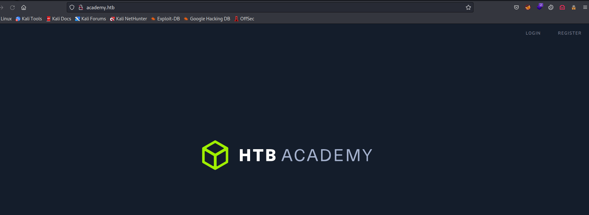
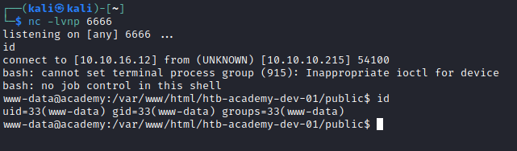
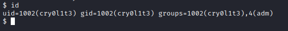
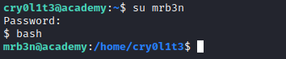
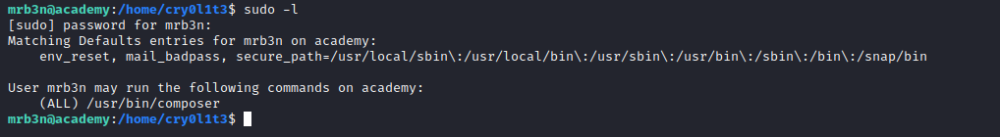

# Academy
## Enumeration
- ```Nmap```
```
└─$ nmap -sC -sV -Pn 10.10.10.215
Starting Nmap 7.93 ( https://nmap.org ) at 2023-07-05 17:02 BST
Nmap scan report for 10.10.10.215 (10.10.10.215)
Host is up (0.18s latency).
Not shown: 998 closed tcp ports (conn-refused)
PORT   STATE SERVICE VERSION
22/tcp open  ssh     OpenSSH 8.2p1 Ubuntu 4ubuntu0.1 (Ubuntu Linux; protocol 2.0)
| ssh-hostkey: 
|   3072 c090a3d835256ffa3306cf8013a0a553 (RSA)
|   256 2ad54bd046f0edc93c8df65dabae7796 (ECDSA)
|_  256 e16414c3cc51b23ba628a7b1ae5f4535 (ED25519)
80/tcp open  http    Apache httpd 2.4.41 ((Ubuntu))
|_http-server-header: Apache/2.4.41 (Ubuntu)
|_http-title: Did not follow redirect to http://academy.htb/
33060/tcp open  mysqlx?
| fingerprint-strings:
|   DNSStatusRequestTCP, LDAPSearchReq, NotesRPC, SSLSessionReq, TLSSessionReq, X11Probe, afp:
|     Invalid message"
|_    HY000
1 service unrecognized despite returning data. If you know the service/version, please submit the following fingerprint at https://nmap.org/cgi-bin/submit.cgi?new-service :
SF-Port33060-TCP:V=7.80%I=7%D=11/9%Time=5FA927A7%P=x86_64-pc-linux-gnu%r(N
SF:ULL,9,"\x05\0\0\0\x0b\x08\x05\x1a\0")%r(GenericLines,9,"\x05\0\0\0\x0b\
SF:x08\x05\x1a\0")%r(GetRequest,9,"\x05\0\0\0\x0b\x08\x05\x1a\0")%r(HTTPOp
...[snip]...
SF:x05HY000")%r(giop,9,"\x05\0\0\0\x0b\x08\x05\x1a\0");
Service Info: OS: Linux; CPE: cpe:/o:linux:linux_kernel
Service Info: OS: Linux; CPE: cpe:/o:linux:linux_kernel

Service detection performed. Please report any incorrect results at https://nmap.org/submit/ .
Nmap done: 1 IP address (1 host up) scanned in 36.95 seconds
```

- Web server



- `gobuster`
```
└─$ gobuster dir -u http://academy.htb -w /usr/share/seclists/Discovery/Web-Content/directory-list-2.3-medium.txt -t 50 -x php,txt --no-error
===============================================================
Gobuster v3.5
by OJ Reeves (@TheColonial) & Christian Mehlmauer (@firefart)
===============================================================
[+] Url:                     http://academy.htb
[+] Method:                  GET
[+] Threads:                 50
[+] Wordlist:                /usr/share/seclists/Discovery/Web-Content/directory-list-2.3-medium.txt
[+] Negative Status codes:   404
[+] User Agent:              gobuster/3.5
[+] Extensions:              php,txt
[+] Timeout:                 10s
===============================================================
2023/07/05 17:37:00 Starting gobuster in directory enumeration mode
===============================================================
/.php                 (Status: 403) [Size: 276]
/images               (Status: 301) [Size: 311] [--> http://academy.htb/images/]
/index.php            (Status: 200) [Size: 2117]
/login.php            (Status: 200) [Size: 2627]
/register.php         (Status: 200) [Size: 3003]
/home.php             (Status: 302) [Size: 55034] [--> login.php]
/admin.php            (Status: 200) [Size: 2633]
/config.php           (Status: 200) [Size: 0]
```

## Foothold
- I started with registering to the Web Server
  - `roleid` is the most interesting parameter


- Let's change `roleid` to `1`
  - We can access `admin.php`


- Let's check `dev-staging-01.academy.htb`
  - We have `laravel` framework running
  - And found an `APP_Key`


- There is a [CVE-2018-15133](https://github.com/aljavier/exploit_laravel_cve-2018-15133/blob/main/pwn_laravel.py)
  - We can exploit it
  - There is a nice [post](https://www.programmersought.com/article/29875427507/) explaining the CVE
  - Also check this [post](https://www.truesec.com/hub/blog/from-s3-bucket-to-laravel-unserialize-rce) explaining the attack


- I spawn my own reverse shell so I can upgrade it




## User 1
- Enumerate for privesc
  - We got `db` password


- If we check for password reuse, we successfully login as `cry0l1t3`
  - Password spray: `crackmapexec ssh 10.10.10.215 -u user.list -p 'mySup3rP4s5w0rd!!'`
  - `cry0l1t3:mySup3rP4s5w0rd!!`


## User 2
- Groups
  - According to [docs], `Group adm is used for system monitoring tasks. Members of this group can read many log files in /var/log, and can use xconsole`



- Let's read logs
  - There is a tool `aureport`, which can be used with `--tty` to show logs which include passwords in plain text based on following [post](https://support.oracle.com/knowledge/Oracle%20Linux%20and%20Virtualization/2239220_1.html)


- Use the creds and pwn another user
  - `mrb3n:mrb3n_Ac@d3my!`



## Root
- Check `sudo` rights



- Follow the [instructions] and get root


