# Admirer
## Enumeration
- `nmap`
```
└─$ nmap -sC -sV -Pn 10.10.10.187
Starting Nmap 7.93 ( https://nmap.org ) at 2023-07-03 18:30 BST
Nmap scan report for 10.10.10.187 (10.10.10.187)
Host is up (0.17s latency).
Not shown: 997 closed tcp ports (conn-refused)
PORT   STATE SERVICE VERSION
21/tcp open  ftp     vsftpd 3.0.3
22/tcp open  ssh     OpenSSH 7.4p1 Debian 10+deb9u7 (protocol 2.0)
| ssh-hostkey: 
|   2048 4a71e92163699dcbdd84021a2397e1b9 (RSA)
|   256 c595b6214d46a425557a873e19a8e702 (ECDSA)
|_  256 d02dddd05c42f87b315abe57c4a9a756 (ED25519)
80/tcp open  http    Apache httpd 2.4.25 ((Debian))
| http-robots.txt: 1 disallowed entry 
|_/admin-dir
|_http-server-header: Apache/2.4.25 (Debian)
|_http-title: Admirer
Service Info: OSs: Unix, Linux; CPE: cpe:/o:linux:linux_kernel

Service detection performed. Please report any incorrect results at https://nmap.org/submit/ .
Nmap done: 1 IP address (1 host up) scanned in 39.52 seconds

```
- Web server


- `gobuster`
```
└─$ gobuster dir -u http://10.10.10.187 -w /usr/share/seclists/Discovery/Web-Content/directory-list-2.3-medium.txt -t 50 -x php,txt --no-error
===============================================================
Gobuster v3.5
by OJ Reeves (@TheColonial) & Christian Mehlmauer (@firefart)
===============================================================
[+] Url:                     http://10.10.10.187
[+] Method:                  GET
[+] Threads:                 50
[+] Wordlist:                /usr/share/seclists/Discovery/Web-Content/directory-list-2.3-medium.txt
[+] Negative Status codes:   404
[+] User Agent:              gobuster/3.5
[+] Extensions:              php,txt
[+] Timeout:                 10s
===============================================================
2023/07/03 18:33:05 Starting gobuster in directory enumeration mode
===============================================================
/assets               (Status: 301) [Size: 313] [--> http://10.10.10.187/assets/]
/.php                 (Status: 403) [Size: 277]
/index.php            (Status: 200) [Size: 6051]
/images               (Status: 301) [Size: 313] [--> http://10.10.10.187/images/]
/robots.txt           (Status: 200) [Size: 138]
```

- Nothing on `FTP` 


## Foothold
- If we check `robots.txt` we find `admin-dir` and possible username `waldo`


- But we can't visit that page

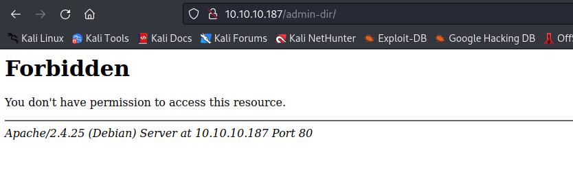

- Let's `gobuster` the `admin-dir` path
  - Just like it was stated in the `robots.txt`
```
└─$ gobuster dir -u http://10.10.10.187/admin-dir -w /usr/share/seclists/Discovery/Web-Content/directory-list-2.3-medium.txt -t 50 -x php,txt --no-error
===============================================================
Gobuster v3.5
by OJ Reeves (@TheColonial) & Christian Mehlmauer (@firefart)
===============================================================
[+] Url:                     http://10.10.10.187/admin-dir
[+] Method:                  GET
[+] Threads:                 50
[+] Wordlist:                /usr/share/seclists/Discovery/Web-Content/directory-list-2.3-medium.txt
[+] Negative Status codes:   404
[+] User Agent:              gobuster/3.5
[+] Extensions:              txt,php
[+] Timeout:                 10s
===============================================================
2023/07/03 18:37:24 Starting gobuster in directory enumeration mode
===============================================================
/.php                 (Status: 403) [Size: 277]
/contacts.txt         (Status: 200) [Size: 350]
/.php                 (Status: 403) [Size: 277]
/credentials.txt      (Status: 200) [Size: 136]
```

- Let's `curl` those endpoints


- Creds didn't work for `ssh`, but work for `ftp`
  - Let's download files

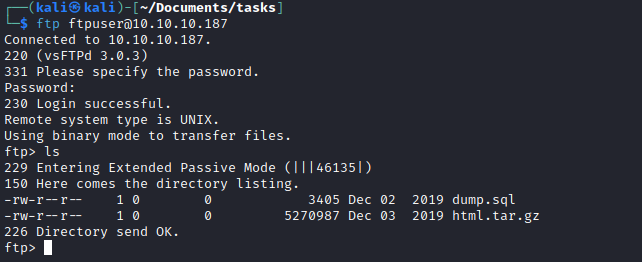


- Start checking the files
  - `index.php` has creds, but they don't work neither for `ssh` nor `ftp`


- We also have a new directory `/utility-scripts`
  - Another pair of creds, which don't work 
  - Tried `gobuster` the directory, nothing was found

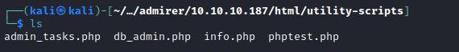


- Digging through `google` resulted in [Adminer](https://www.adminer.org/)
  - Considering the name of the box `Admirer` and `db_admin` file in `/utility-scripts` could be a viable path
  - From the `dump.sql` we know that the `admirerdb` is the database 
  - If we try to connect to database using the creds found, we have no success


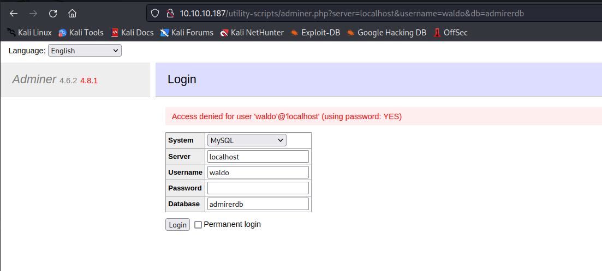

- We can make `Adminer` connect to our database

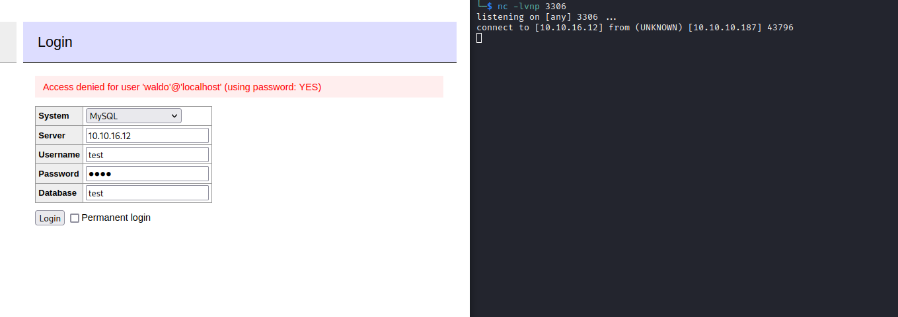

- Let's configure and start `mysql`

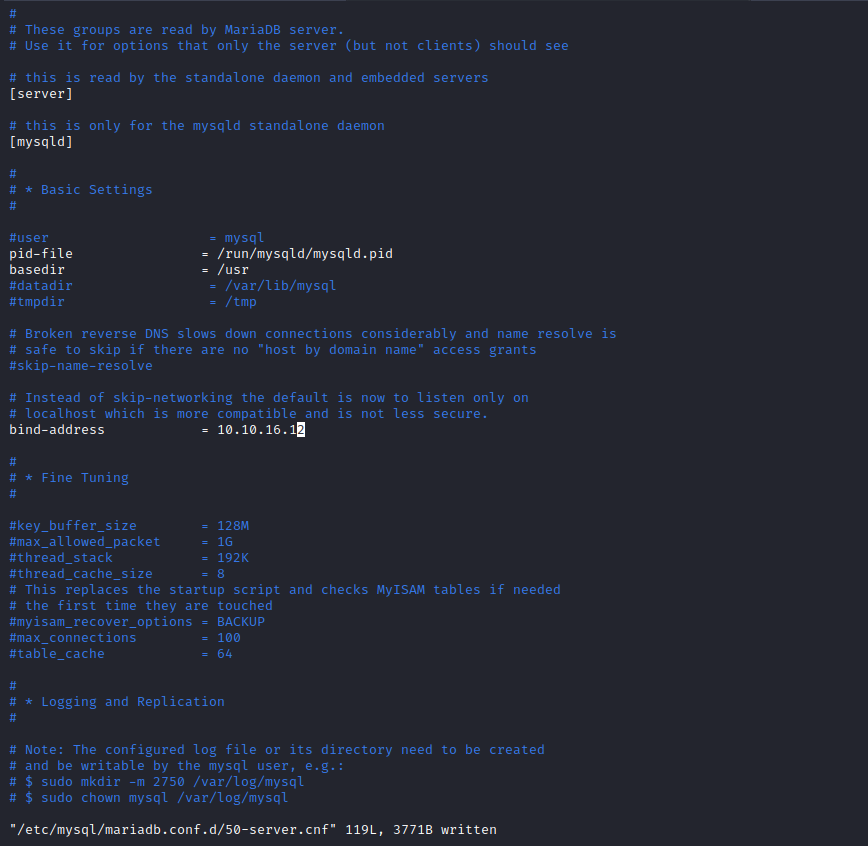


- Connect to database for additional configuration
  - The following [post] shows how to fix the issue: `Host '10.10.10.187' is not allowed to connect to this MariaDB server`

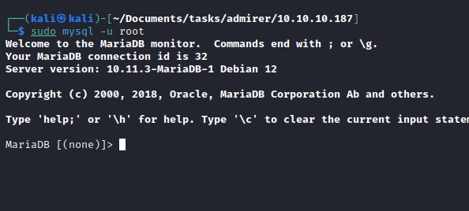
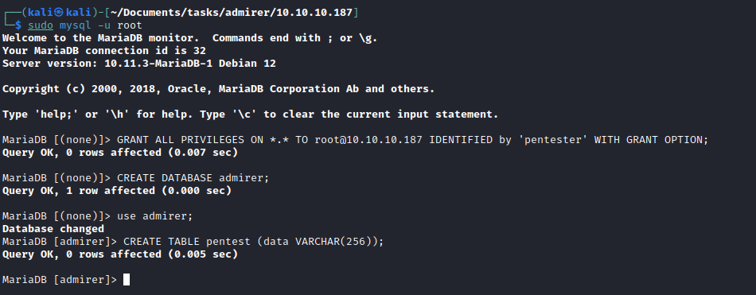

- And we are in


- This [blog](https://infosecwriteups.com/adminer-script-results-to-pwning-server-private-bug-bounty-program-fe6d8a43fe6f) shows how we can get local file access via `Adminer` 
  - I tried loading `/etc/passwd`, but no success
  - Then I remembered that `waldo` had hardcoded creds in `index.php`, so I tried loading them.
  - The creds were different from the ones that we had from `ftp` backup
  - `waldo:&<h5b~yK3F#{PaPB&dA}{H>`


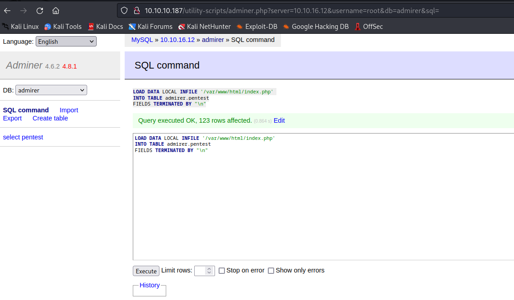
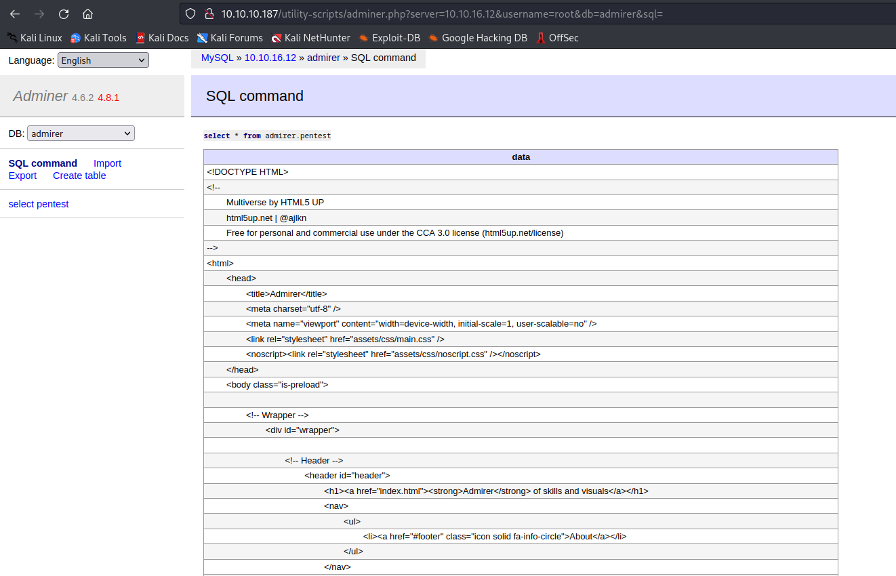


- Let's connect to `ssh`

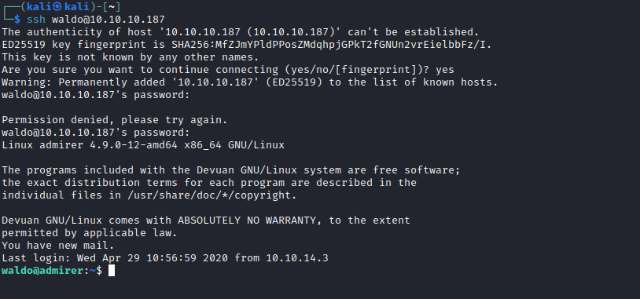

## Root
- Let's check `sudo` rights

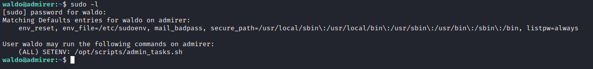

- There is a `SETENV` option that I never seen before
  - If we check [man page](https://linux.die.net/man/5/sudoers)
    - `...if SETENV has been set for a command, the user may disable the env_reset option from the command line via the -E option...`
  - We have `env_reset`
    - `...By default, the env_reset option is enabled.  This causes commands to beexecuted with a new, minimal environment....`
  - And `secure_path`
    - `...secure_path Path used for every command run from sudo. If you don’t trust the people running sudo to have a sane PATH environment variable you may want to use this...`
  - It implies that we should abuse environmental variables
  - So let's check the scripts
    - We have `admin_task.sh` 
      - That handles the user input and performs the backup of specific files/directories based on the option chosen
    - And `backup.py` that use `make_archive` function from `shutil` and archives `/var/www/html` directory
      - The script is used in option `6`

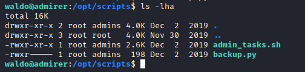


- We can try to exploit `backup.py` (option 6 in the `admin_tasks.sh`) by changing `PYTHONPATH` and pass it `sudo` 
  - Currently `PYTHONPATH` is empty
    - Setting it, will make python to look for modules in the current directory, then in the directory that we defined
  - But `PYTHONPATH` is in the sudo's default table of "bad" variables
    - Yet there is a way to bypass it which is described [here](https://stackoverflow.com/questions/35824788/sudo-e-does-not-pass-pythonpath)
  - We also need to find a writable directory where we can work
    - We can use `/var/tmp`
  
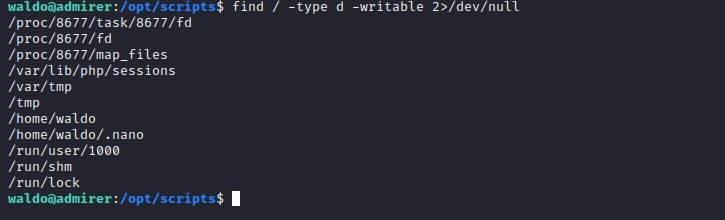

- Let's create a python script `shutil.py` with a `make_archive` in `/var/tmp`
  - I decided to copy `/bin/bash` and set it owned by root and SUID.

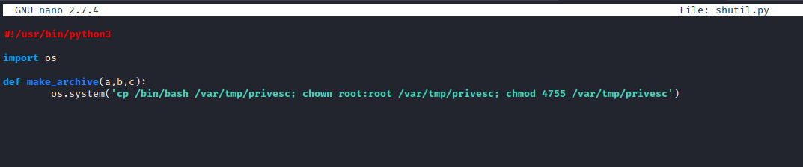

- Let's run the script
  - `sudo PYTHONPATH=/var/tmp /opt/scripts/admin_tasks.sh 6`
  - Run our `bash` file and get the flag

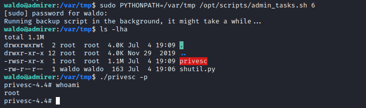
