# Bagel
## Enumeration
- `nmap`
```
└─$ nmap -p22,5000,8000 -sC -sV -Pn 10.10.11.201 -T4
Starting Nmap 7.93 ( https://nmap.org ) at 2023-05-25 19:15 BST
Nmap scan report for 10.10.11.201 (10.10.11.201)
Host is up (0.11s latency).

PORT     STATE SERVICE  VERSION
22/tcp   open  ssh      OpenSSH 8.8 (protocol 2.0)
| ssh-hostkey: 
|   256 6e4e1341f2fed9e0f7275bededcc68c2 (ECDSA)
|_  256 80a7cd10e72fdb958b869b1b20652a98 (ED25519)
5000/tcp open  upnp?
| fingerprint-strings: 
|   GetRequest: 
|     HTTP/1.1 400 Bad Request
|     Server: Microsoft-NetCore/2.0
|     Date: Thu, 25 May 2023 18:15:19 GMT
|     Connection: close
|   HTTPOptions: 
|     HTTP/1.1 400 Bad Request
|     Server: Microsoft-NetCore/2.0
|     Date: Thu, 25 May 2023 18:15:35 GMT
|     Connection: close
|   Help, SSLSessionReq, TerminalServerCookie: 
|     HTTP/1.1 400 Bad Request
|     Content-Type: text/html
|     Server: Microsoft-NetCore/2.0
|     Date: Thu, 25 May 2023 18:15:46 GMT
|     Content-Length: 52
|     Connection: close
|     Keep-Alive: true
|     <h1>Bad Request (Invalid request line (parts).)</h1>
|   RTSPRequest: 
|     HTTP/1.1 400 Bad Request
|     Content-Type: text/html
|     Server: Microsoft-NetCore/2.0
|     Date: Thu, 25 May 2023 18:15:19 GMT
|     Content-Length: 54
|     Connection: close
|     Keep-Alive: true
|     <h1>Bad Request (Invalid request line (version).)</h1>
|   TLSSessionReq: 
|     HTTP/1.1 400 Bad Request
|     Content-Type: text/html
|     Server: Microsoft-NetCore/2.0
|     Date: Thu, 25 May 2023 18:15:47 GMT
|     Content-Length: 52
|     Connection: close
|     Keep-Alive: true
|_    <h1>Bad Request (Invalid request line (parts).)</h1>
8000/tcp open  http-alt Werkzeug/2.2.2 Python/3.10.9
| fingerprint-strings: 
|   FourOhFourRequest: 
|     HTTP/1.1 404 NOT FOUND
|     Server: Werkzeug/2.2.2 Python/3.10.9
|     Date: Thu, 25 May 2023 18:15:20 GMT
|     Content-Type: text/html; charset=utf-8
|     Content-Length: 207
|     Connection: close
|     <!doctype html>
|     <html lang=en>
|     <title>404 Not Found</title>
|     <h1>Not Found</h1>
|     <p>The requested URL was not found on the server. If you entered the URL manually please check your spelling and try again.</p>
|   GetRequest: 
|     HTTP/1.1 302 FOUND
|     Server: Werkzeug/2.2.2 Python/3.10.9
|     Date: Thu, 25 May 2023 18:15:14 GMT
|     Content-Type: text/html; charset=utf-8
|     Content-Length: 263
|     Location: http://bagel.htb:8000/?page=index.html
|     Connection: close
|     <!doctype html>
|     <html lang=en>
|     <title>Redirecting...</title>
|     <h1>Redirecting...</h1>
|     <p>You should be redirected automatically to the target URL: <a href="http://bagel.htb:8000/?page=index.html">http://bagel.htb:8000/?page=index.html</a>. If not, click the link.
|   Socks5: 
|     <!DOCTYPE HTML PUBLIC "-//W3C//DTD HTML 4.01//EN"
|     "http://www.w3.org/TR/html4/strict.dtd">
|     <html>
|     <head>
|     <meta http-equiv="Content-Type" content="text/html;charset=utf-8">
|     <title>Error response</title>
|     </head>
|     <body>
|     <h1>Error response</h1>
|     <p>Error code: 400</p>
|     <p>Message: Bad request syntax ('
|     ').</p>
|     <p>Error code explanation: HTTPStatus.BAD_REQUEST - Bad request syntax or unsupported method.</p>
|     </body>
|_    </html>
|_http-server-header: Werkzeug/2.2.2 Python/3.10.9
|_http-title: Did not follow redirect to http://bagel.htb:8000/?page=index.html
2 services unrecognized despite returning data. If you know the service/version, please submit the following fingerprints at https://nmap.org/cgi-bin/submit.cgi?new-service :
==============NEXT SERVICE FINGERPRINT (SUBMIT INDIVIDUALLY)==============
SF-Port5000-TCP:V=7.93%I=7%D=5/25%Time=646FA5D2%P=x86_64-pc-linux-gnu%r(Ge
SF:tRequest,73,"HTTP/1\.1\x20400\x20Bad\x20Request\r\nServer:\x20Microsoft
SF:-NetCore/2\.0\r\nDate:\x20Thu,\x2025\x20May\x202023\x2018:15:19\x20GMT\
SF:r\nConnection:\x20close\r\n\r\n")%r(RTSPRequest,E8,"HTTP/1\.1\x20400\x2
SF:0Bad\x20Request\r\nContent-Type:\x20text/html\r\nServer:\x20Microsoft-N
SF:etCore/2\.0\r\nDate:\x20Thu,\x2025\x20May\x202023\x2018:15:19\x20GMT\r\
SF:nContent-Length:\x2054\r\nConnection:\x20close\r\nKeep-Alive:\x20true\r
SF:\n\r\n<h1>Bad\x20Request\x20\(Invalid\x20request\x20line\x20\(version\)
SF:\.\)</h1>")%r(HTTPOptions,73,"HTTP/1\.1\x20400\x20Bad\x20Request\r\nSer
SF:ver:\x20Microsoft-NetCore/2\.0\r\nDate:\x20Thu,\x2025\x20May\x202023\x2
SF:018:15:35\x20GMT\r\nConnection:\x20close\r\n\r\n")%r(Help,E6,"HTTP/1\.1
SF:\x20400\x20Bad\x20Request\r\nContent-Type:\x20text/html\r\nServer:\x20M
SF:icrosoft-NetCore/2\.0\r\nDate:\x20Thu,\x2025\x20May\x202023\x2018:15:46
SF:\x20GMT\r\nContent-Length:\x2052\r\nConnection:\x20close\r\nKeep-Alive:
SF:\x20true\r\n\r\n<h1>Bad\x20Request\x20\(Invalid\x20request\x20line\x20\
SF:(parts\)\.\)</h1>")%r(SSLSessionReq,E6,"HTTP/1\.1\x20400\x20Bad\x20Requ
SF:est\r\nContent-Type:\x20text/html\r\nServer:\x20Microsoft-NetCore/2\.0\
SF:r\nDate:\x20Thu,\x2025\x20May\x202023\x2018:15:46\x20GMT\r\nContent-Len
SF:gth:\x2052\r\nConnection:\x20close\r\nKeep-Alive:\x20true\r\n\r\n<h1>Ba
SF:d\x20Request\x20\(Invalid\x20request\x20line\x20\(parts\)\.\)</h1>")%r(
SF:TerminalServerCookie,E6,"HTTP/1\.1\x20400\x20Bad\x20Request\r\nContent-
SF:Type:\x20text/html\r\nServer:\x20Microsoft-NetCore/2\.0\r\nDate:\x20Thu
SF:,\x2025\x20May\x202023\x2018:15:46\x20GMT\r\nContent-Length:\x2052\r\nC
SF:onnection:\x20close\r\nKeep-Alive:\x20true\r\n\r\n<h1>Bad\x20Request\x2
SF:0\(Invalid\x20request\x20line\x20\(parts\)\.\)</h1>")%r(TLSSessionReq,E
SF:6,"HTTP/1\.1\x20400\x20Bad\x20Request\r\nContent-Type:\x20text/html\r\n
SF:Server:\x20Microsoft-NetCore/2\.0\r\nDate:\x20Thu,\x2025\x20May\x202023
SF:\x2018:15:47\x20GMT\r\nContent-Length:\x2052\r\nConnection:\x20close\r\
SF:nKeep-Alive:\x20true\r\n\r\n<h1>Bad\x20Request\x20\(Invalid\x20request\
SF:x20line\x20\(parts\)\.\)</h1>");
==============NEXT SERVICE FINGERPRINT (SUBMIT INDIVIDUALLY)==============
SF-Port8000-TCP:V=7.93%I=7%D=5/25%Time=646FA5CE%P=x86_64-pc-linux-gnu%r(Ge
SF:tRequest,1EA,"HTTP/1\.1\x20302\x20FOUND\r\nServer:\x20Werkzeug/2\.2\.2\
SF:x20Python/3\.10\.9\r\nDate:\x20Thu,\x2025\x20May\x202023\x2018:15:14\x2
SF:0GMT\r\nContent-Type:\x20text/html;\x20charset=utf-8\r\nContent-Length:
SF:\x20263\r\nLocation:\x20http://bagel\.htb:8000/\?page=index\.html\r\nCo
SF:nnection:\x20close\r\n\r\n<!doctype\x20html>\n<html\x20lang=en>\n<title
SF:>Redirecting\.\.\.</title>\n<h1>Redirecting\.\.\.</h1>\n<p>You\x20shoul
SF:d\x20be\x20redirected\x20automatically\x20to\x20the\x20target\x20URL:\x
SF:20<a\x20href=\"http://bagel\.htb:8000/\?page=index\.html\">http://bagel
SF:\.htb:8000/\?page=index\.html</a>\.\x20If\x20not,\x20click\x20the\x20li
SF:nk\.\n")%r(FourOhFourRequest,184,"HTTP/1\.1\x20404\x20NOT\x20FOUND\r\nS
SF:erver:\x20Werkzeug/2\.2\.2\x20Python/3\.10\.9\r\nDate:\x20Thu,\x2025\x2
SF:0May\x202023\x2018:15:20\x20GMT\r\nContent-Type:\x20text/html;\x20chars
SF:et=utf-8\r\nContent-Length:\x20207\r\nConnection:\x20close\r\n\r\n<!doc
SF:type\x20html>\n<html\x20lang=en>\n<title>404\x20Not\x20Found</title>\n<
SF:h1>Not\x20Found</h1>\n<p>The\x20requested\x20URL\x20was\x20not\x20found
SF:\x20on\x20the\x20server\.\x20If\x20you\x20entered\x20the\x20URL\x20manu
SF:ally\x20please\x20check\x20your\x20spelling\x20and\x20try\x20again\.</p
SF:>\n")%r(Socks5,213,"<!DOCTYPE\x20HTML\x20PUBLIC\x20\"-//W3C//DTD\x20HTM
SF:L\x204\.01//EN\"\n\x20\x20\x20\x20\x20\x20\x20\x20\"http://www\.w3\.org
SF:/TR/html4/strict\.dtd\">\n<html>\n\x20\x20\x20\x20<head>\n\x20\x20\x20\
SF:x20\x20\x20\x20\x20<meta\x20http-equiv=\"Content-Type\"\x20content=\"te
SF:xt/html;charset=utf-8\">\n\x20\x20\x20\x20\x20\x20\x20\x20<title>Error\
SF:x20response</title>\n\x20\x20\x20\x20</head>\n\x20\x20\x20\x20<body>\n\
SF:x20\x20\x20\x20\x20\x20\x20\x20<h1>Error\x20response</h1>\n\x20\x20\x20
SF:\x20\x20\x20\x20\x20<p>Error\x20code:\x20400</p>\n\x20\x20\x20\x20\x20\
SF:x20\x20\x20<p>Message:\x20Bad\x20request\x20syntax\x20\('\\x05\\x04\\x0
SF:0\\x01\\x02\\x80\\x05\\x01\\x00\\x03'\)\.</p>\n\x20\x20\x20\x20\x20\x20
SF:\x20\x20<p>Error\x20code\x20explanation:\x20HTTPStatus\.BAD_REQUEST\x20
SF:-\x20Bad\x20request\x20syntax\x20or\x20unsupported\x20method\.</p>\n\x2
SF:0\x20\x20\x20</body>\n</html>\n");

Service detection performed. Please report any incorrect results at https://nmap.org/submit/ .
Nmap done: 1 IP address (1 host up) scanned in 109.25 seconds
```
- We see 3 ports
  - Let's check port `8000`
  - After scanning through web server, we detect `LFI`


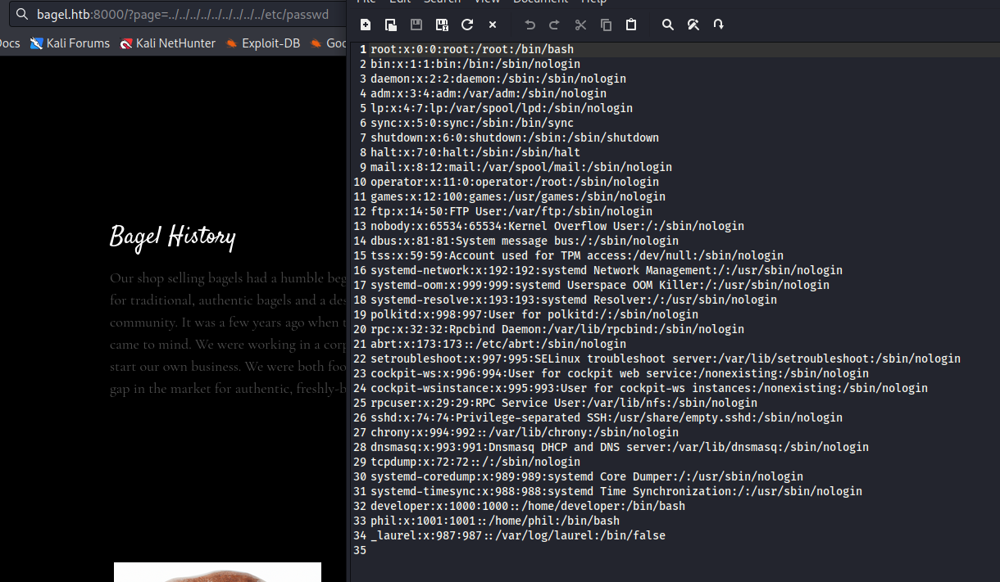

- We see there are 2 users: `developer` and `phil`
## Foothold
- So let's fire up the `Burp Suite` and enumerate the python app (since we saw `http-server-header: Werkzeug/2.2.2 Python/3.10.9`)
  - Check `/proc/self/environ`
  - Check `/proc/self/cmdline`

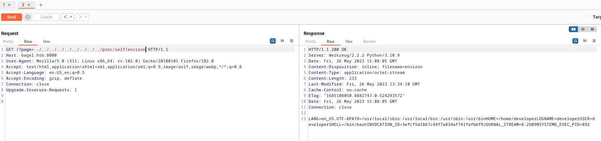
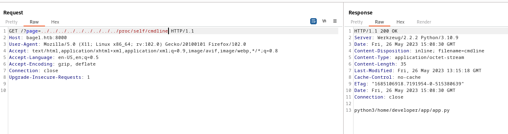

- We see the location of the `app.py`
    - Let's open it and see the content


- We see the comment in the `app.py` about running `dotnet <path to .dll>` 
  - And the websocket running on port `5000`
  - Let's test `websocket`


- I was stuck here for a while, since had no idea what to do next
  - Played with different inputs to `websocket`
  - But then, I remembered about the `dll` comment 
  - So I started utilizing the `LFI` to find the `dll`
  - Since the port was already open means that the process with `dll` was already deployed
  - Thus we scan through all processes and filter for `dll`
  
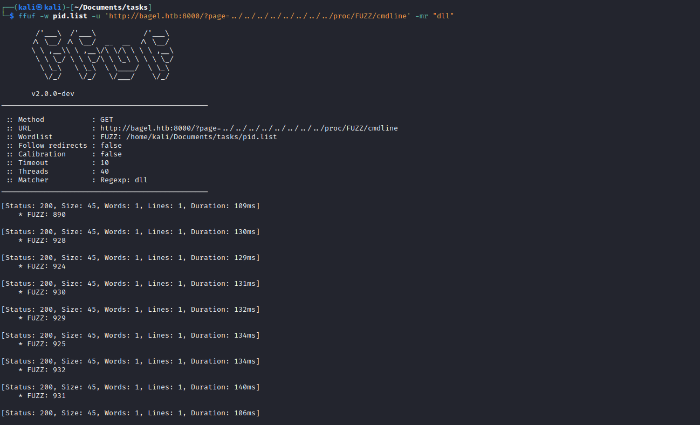

- We get a few hits
  - So let's check them


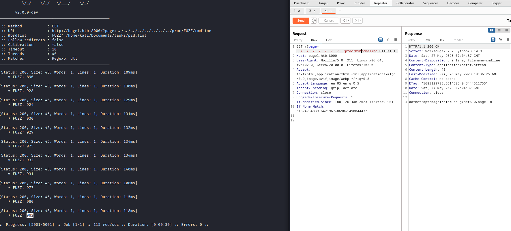
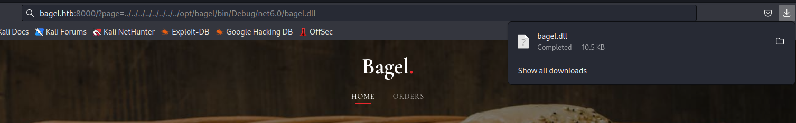

- After finding the location of `dll`, let's download it


- I googled around to find a tool for decompiling the `dll`
  - The `app.py` already had a hint with comment `dotnet`
  - So I found `ilspycmd` which can be run on `Linux` OS
  - If you have `Windows` machine, you can also use [dnSpy](https://github.com/dnSpy/dnSpy)

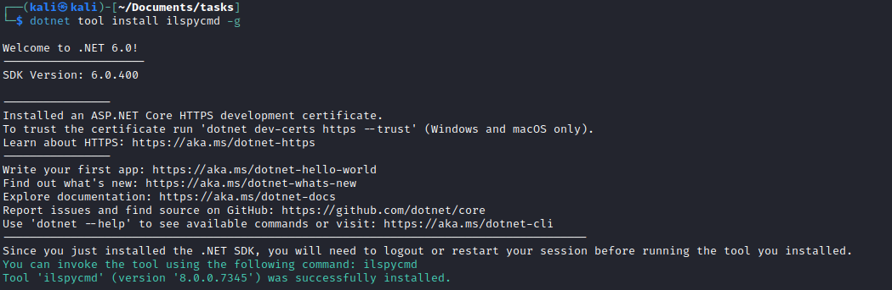

- Let's decompile the `dll`


- The result
  - Take note of password stored in `DB` class
```
using System;
using System.Collections.Generic;
using System.Diagnostics;
using System.IO;
using System.Reflection;
using System.Runtime.CompilerServices;
using System.Runtime.Versioning;
using System.Text;
using System.Threading;
using Microsoft.CodeAnalysis;
using Microsoft.Data.SqlClient;
using Newtonsoft.Json;
using WatsonWebsocket;

[assembly: CompilationRelaxations(8)]
[assembly: RuntimeCompatibility(WrapNonExceptionThrows = true)]
[assembly: Debuggable(DebuggableAttribute.DebuggingModes.Default | DebuggableAttribute.DebuggingModes.DisableOptimizations | DebuggableAttribute.DebuggingModes.IgnoreSymbolStoreSequencePoints | DebuggableAttribute.DebuggingModes.EnableEditAndContinue)]
[assembly: TargetFramework(".NETCoreApp,Version=v6.0", FrameworkDisplayName = "")]
[assembly: AssemblyCompany("bagel")]
[assembly: AssemblyConfiguration("Debug")]
[assembly: AssemblyFileVersion("1.0.0.0")]
[assembly: AssemblyInformationalVersion("1.0.0")]
[assembly: AssemblyProduct("bagel")]
[assembly: AssemblyTitle("bagel")]
[assembly: AssemblyVersion("1.0.0.0")]
namespace Microsoft.CodeAnalysis
{
	[CompilerGenerated]
	[Microsoft.CodeAnalysis.Embedded]
	internal sealed class EmbeddedAttribute : Attribute
	{
	}
}
namespace System.Runtime.CompilerServices
{
	[CompilerGenerated]
	[Microsoft.CodeAnalysis.Embedded]
	[AttributeUsage(AttributeTargets.Class | AttributeTargets.Property | AttributeTargets.Field | AttributeTargets.Event | AttributeTargets.Parameter | AttributeTargets.ReturnValue | AttributeTargets.GenericParameter, AllowMultiple = false, Inherited = false)]
	internal sealed class NullableAttribute : Attribute
	{
		public readonly byte[] NullableFlags;

		public NullableAttribute(byte P_0)
		{
			NullableFlags = new byte[1] { P_0 };
		}

		public NullableAttribute(byte[] P_0)
		{
			NullableFlags = P_0;
		}
	}
	[CompilerGenerated]
	[Microsoft.CodeAnalysis.Embedded]
	[AttributeUsage(AttributeTargets.Class | AttributeTargets.Struct | AttributeTargets.Method | AttributeTargets.Interface | AttributeTargets.Delegate, AllowMultiple = false, Inherited = false)]
	internal sealed class NullableContextAttribute : Attribute
	{
		public readonly byte Flag;

		public NullableContextAttribute(byte P_0)
		{
			Flag = P_0;
		}
	}
}
namespace bagel_server
{
	public class Handler
	{
		public object Serialize(object obj)
		{
			//IL_0003: Unknown result type (might be due to invalid IL or missing references)
			//IL_0008: Unknown result type (might be due to invalid IL or missing references)
			//IL_0015: Expected O, but got Unknown
			return JsonConvert.SerializeObject(obj, (Formatting)1, new JsonSerializerSettings
			{
				TypeNameHandling = (TypeNameHandling)4
			});
		}

		public object Deserialize(string json)
		{
			//IL_0003: Unknown result type (might be due to invalid IL or missing references)
			//IL_0008: Unknown result type (might be due to invalid IL or missing references)
			//IL_0015: Expected O, but got Unknown
			try
			{
				return JsonConvert.DeserializeObject<Base>(json, new JsonSerializerSettings
				{
					TypeNameHandling = (TypeNameHandling)4
				});
			}
			catch
			{
				return "{\"Message\":\"unknown\"}";
			}
		}
	}
	public class Bagel
	{
		private static string _ServerIp = "*";

		private static int _ServerPort = 5000;

		private static bool _Ssl = false;

		private static WatsonWsServer _Server = null;

		private static void Main(string[] args)
		{
			InitializeServer();
			StartServer();
			while (true)
			{
				Thread.Sleep(1000);
			}
		}

		private static void InitializeServer()
		{
			//IL_0010: Unknown result type (might be due to invalid IL or missing references)
			//IL_001a: Expected O, but got Unknown
			_Server = new WatsonWsServer(_ServerIp, _ServerPort, _Ssl);
			_Server.AcceptInvalidCertificates = true;
			_Server.MessageReceived += MessageReceived;
		}

		private static async void StartServer()
		{
			await _Server.StartAsync(default(CancellationToken));
		}

		private static void MessageReceived(object sender, MessageReceivedEventArgs args)
		{
			string json = "";
			if (args.Data != null && args.Data.Count > 0)
			{
				json = Encoding.UTF8.GetString(args.Data.Array, 0, args.Data.Count);
			}
			Handler handler = new Handler();
			object obj = handler.Deserialize(json);
			object obj2 = handler.Serialize(obj);
			_Server.SendAsync(args.IpPort, obj2.ToString(), default(CancellationToken));
		}
	}
	public class Base : Orders
	{
		private int userid = 0;

		private string session = "Unauthorized";

		public int UserId
		{
			get
			{
				return userid;
			}
			set
			{
				userid = value;
			}
		}

		public string Session
		{
			get
			{
				return session;
			}
			set
			{
				session = value;
			}
		}

		public string Time => DateTime.Now.ToString("h:mm:ss");
	}
	public class Orders
	{
		private string order_filename;

		private string order_info;

		private File file = new File();

		public object RemoveOrder { get; set; }

		public string WriteOrder
		{
			get
			{
				return file.WriteFile;
			}
			set
			{
				order_info = value;
				file.WriteFile = order_info;
			}
		}

		public string ReadOrder
		{
			get
			{
				return file.ReadFile;
			}
			set
			{
				order_filename = value;
				order_filename = order_filename.Replace("/", "");
				order_filename = order_filename.Replace("..", "");
				file.ReadFile = order_filename;
			}
		}
	}
	public class File
	{
		private string file_content;

		private string IsSuccess = null;

		private string directory = "/opt/bagel/orders/";

		private string filename = "orders.txt";

		public string ReadFile
		{
			get
			{
				return file_content;
			}
			set
			{
				filename = value;
				ReadContent(directory + filename);
			}
		}

		public string WriteFile
		{
			get
			{
				return IsSuccess;
			}
			set
			{
				WriteContent(directory + filename, value);
			}
		}

		public void ReadContent(string path)
		{
			try
			{
				IEnumerable<string> values = System.IO.File.ReadLines(path, Encoding.UTF8);
				file_content += string.Join("\n", values);
			}
			catch (Exception)
			{
				file_content = "Order not found!";
			}
		}

		public void WriteContent(string filename, string line)
		{
			try
			{
				System.IO.File.WriteAllText(filename, line);
				IsSuccess = "Operation successed";
			}
			catch (Exception)
			{
				IsSuccess = "Operation failed";
			}
		}
	}
	public class DB
	{
		[Obsolete("The production team has to decide where the database server will be hosted. This method is not fully implemented.")]
		public void DB_connection()
		{
			//IL_0008: Unknown result type (might be due to invalid IL or missing references)
			//IL_000e: Expected O, but got Unknown
			string text = "Data Source=ip;Initial Catalog=Orders;User ID=dev;Password=k8wdAYYKyhnjg3K";
			SqlConnection val = new SqlConnection(text);
			string text2 = "INSERT INTO orders (Name,Address,Count,Type) VALUES ('Eliot','Street',4,'Baggel')";
		}
	}
}
```
- Okay, this was the most challenging part
  - After scrolling through `code` my intuition was telling me that we can exploit `deserialization` 
  - Found [hacktricks](https://book.hacktricks.xyz/pentesting-web/deserialization/basic-.net-deserialization-objectdataprovider-gadgets-expandedwrapper-and-json.net), [systemweakness](https://systemweakness.com/exploiting-json-serialization-in-net-core-694c111faa15) and [exploit-notes.hdks.org](https://exploit-notes.hdks.org/exploit/web/security-risk/json-net-deserialization/) articles
  - The hints from the `HTB forum` gave me confidence that I was on the right path
  - So I started playing around with different tools recommended in the `hacktricks` article that could be helpful in exploiting
  - No luck with `RCE`

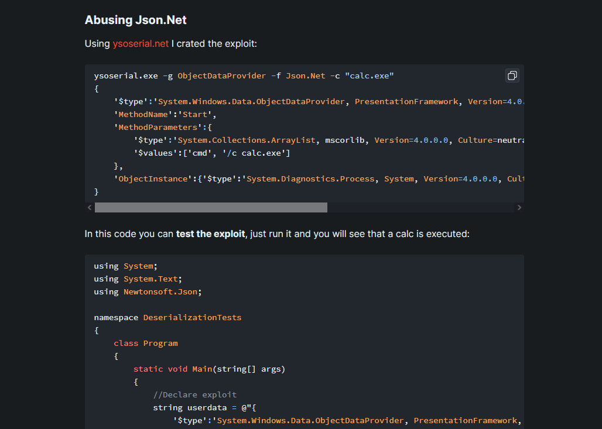


- So I knew my approach was wrong maybe
  - I started reading other articles and [systemweakness](https://systemweakness.com/exploiting-json-serialization-in-net-core-694c111faa15) article was really helpful
  - So we know we have a function that is responsible for `deserialization` 

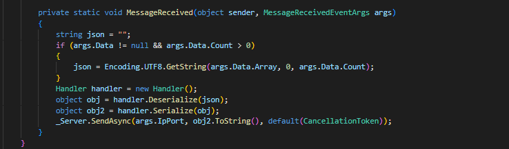

- Now I need to find canditates according to the article
  - And we have one in `Orders` class named `RemoveOrder`

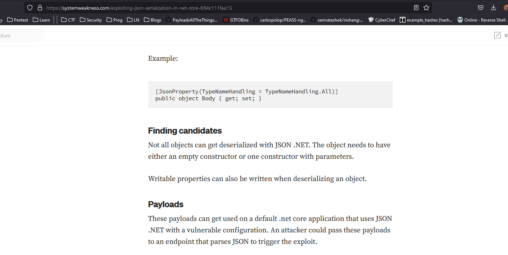
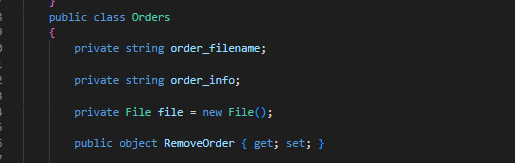

- We know we can deploy `LFI` based on [exploit-notes.hdks.org](https://exploit-notes.hdks.org/exploit/web/security-risk/json-net-deserialization/)

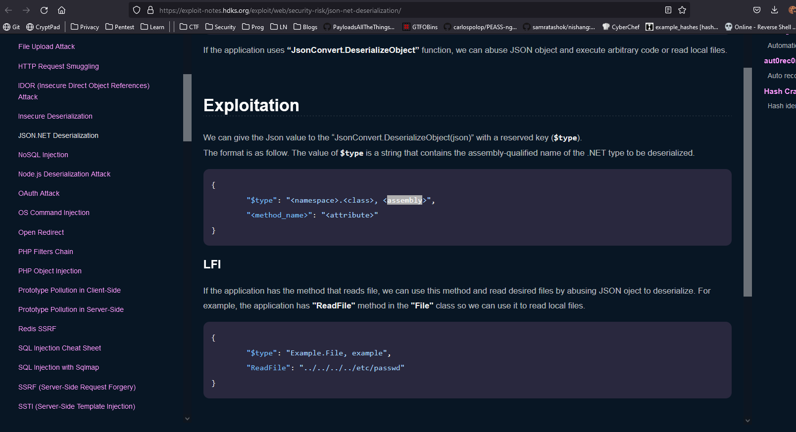

- We have a `File` class that we can use to achieve our goals
  - We use `File`'s `ReadFile` and `set` the `value` to the file we want to read
  - I suggest you to read [0xdf's explanation](https://0xdf.gitlab.io/2023/06/03/htb-bagel.html), since when I solved the box I didn't fully understand the whole magic behind the exploitation
  - I was just trying different combination of payloads until I succeded


- Since the `dll` is running by a different user, we could probably read their `ssh` keys
  - Let's craft the payload to read `id_rsa`
  - And we get `phil's` key

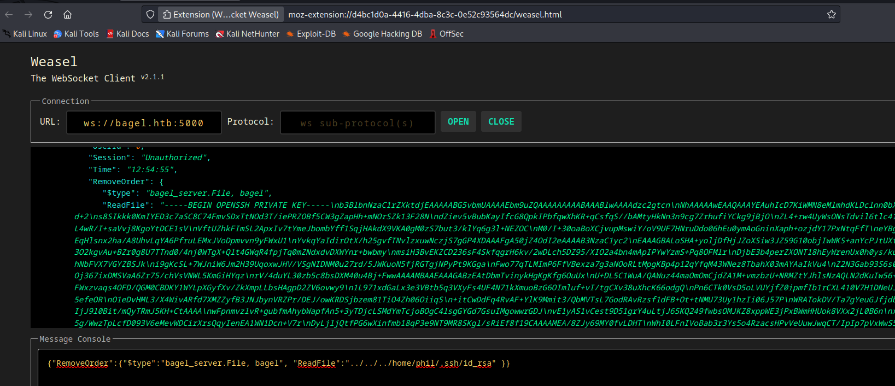

- Use the connect to the box and we get a `foothold`
## User
- Now we saw that there is another user: `developer`
  - Let's try the `password` that was stored in `DB` class, that we saw during decompilation 


## Root
- After privescing to `developer`
  - The first thing I always check is `sudo` rights


- `developer` can execute `dotnet` as `root`
  - Check [GTFOBins](https://gtfobins.github.io/)

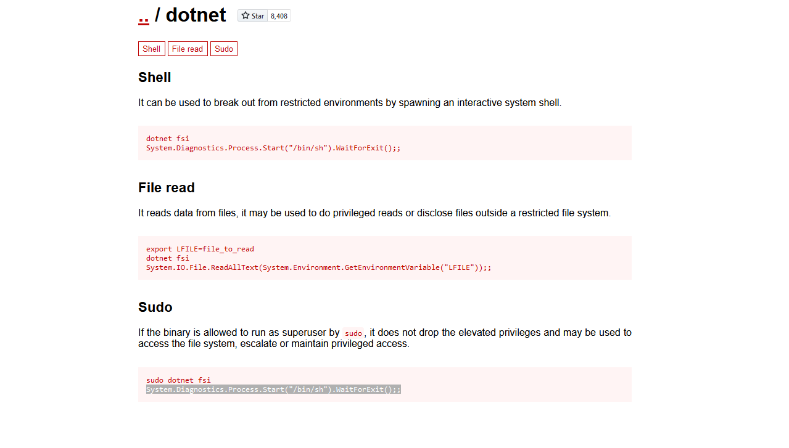

- And we have a root

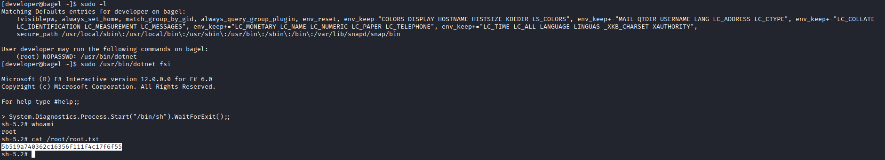

- I will check other writeups to paint the whole picture of the `deserialization` part since I solved it blindly, 
  - So please check other writeups