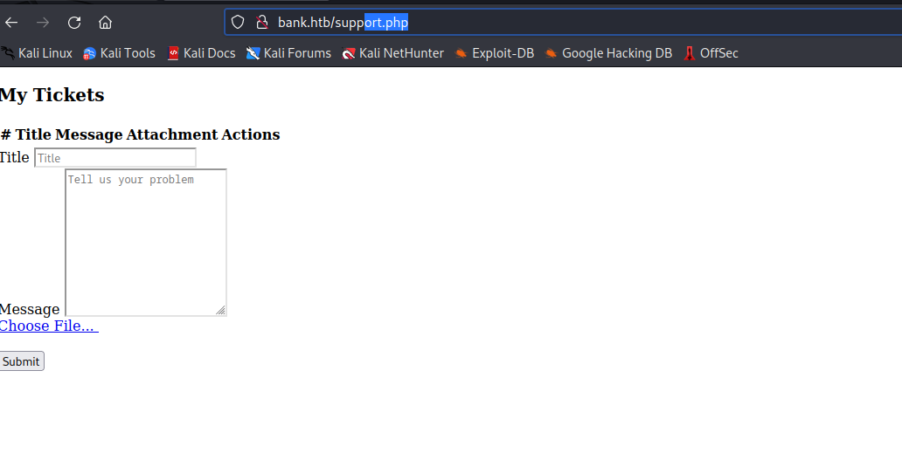

# Bank
## Enumeration
- `nmap`
```
┌──(kali㉿kali)-[~]
└─$ nmap -sC -sV 10.10.10.29  
Starting Nmap 7.93 ( https://nmap.org ) at 2023-06-06 16:18 BST
Nmap scan report for 10.10.10.29 (10.10.10.29)
Host is up (0.12s latency).
Not shown: 997 closed tcp ports (conn-refused)
PORT   STATE SERVICE VERSION
22/tcp open  ssh     OpenSSH 6.6.1p1 Ubuntu 2ubuntu2.8 (Ubuntu Linux; protocol 2.0)
| ssh-hostkey: 
|   1024 08eed030d545e459db4d54a8dc5cef15 (DSA)
|   2048 b8e015482d0df0f17333b78164084a91 (RSA)
|   256 a04c94d17b6ea8fd07fe11eb88d51665 (ECDSA)
|_  256 2d794430c8bb5e8f07cf5b72efa16d67 (ED25519)
53/tcp open  domain  ISC BIND 9.9.5-3ubuntu0.14 (Ubuntu Linux)
| dns-nsid: 
|_  bind.version: 9.9.5-3ubuntu0.14-Ubuntu
80/tcp open  http    Apache httpd 2.4.7 ((Ubuntu))
|_http-server-header: Apache/2.4.7 (Ubuntu)
|_http-title: Apache2 Ubuntu Default Page: It works
Service Info: OS: Linux; CPE: cpe:/o:linux:linux_kernel

Service detection performed. Please report any incorrect results at https://nmap.org/submit/ .
Nmap done: 1 IP address (1 host up) scanned in 29.01 seconds
```
- `dig`
```
┌──(kali㉿kali)-[~]
└─$ dig AXFR bank.htb @10.10.10.29

; <<>> DiG 9.18.12-1-Debian <<>> AXFR bank.htb @10.10.10.29
;; global options: +cmd
bank.htb.               604800  IN      SOA     bank.htb. chris.bank.htb. 5 604800 86400 2419200 604800
bank.htb.               604800  IN      NS      ns.bank.htb.
bank.htb.               604800  IN      A       10.10.10.29
ns.bank.htb.            604800  IN      A       10.10.10.29
www.bank.htb.           604800  IN      CNAME   bank.htb.
bank.htb.               604800  IN      SOA     bank.htb. chris.bank.htb. 5 604800 86400 2419200 604800
;; Query time: 231 msec
;; SERVER: 10.10.10.29#53(10.10.10.29) (TCP)
;; WHEN: Tue Jun 06 16:43:22 BST 2023
;; XFR size: 6 records (messages 1, bytes 171)
```
- After adding records to `/etc/hosts`
```
└─$ gobuster dir -u http://bank.htb/ -w /usr/share/seclists/Discovery/Web-Content/raft-medium-files-lowercase.txt   
===============================================================
Gobuster v3.5
by OJ Reeves (@TheColonial) & Christian Mehlmauer (@firefart)
===============================================================
[+] Url:                     http://bank.htb/
[+] Method:                  GET
[+] Threads:                 10
[+] Wordlist:                /usr/share/seclists/Discovery/Web-Content/raft-medium-files-lowercase.txt
[+] Negative Status codes:   404
[+] User Agent:              gobuster/3.5
[+] Timeout:                 10s
===============================================================
2023/06/06 16:46:01 Starting gobuster in directory enumeration mode
===============================================================
/login.php            (Status: 200) [Size: 1974]
/index.php            (Status: 302) [Size: 7322] [--> login.php]
/logout.php           (Status: 302) [Size: 0] [--> index.php]
/.htaccess            (Status: 403) [Size: 284]
/.                    (Status: 302) [Size: 7322] [--> login.php]
/.html                (Status: 403) [Size: 280]
/support.php          (Status: 302) [Size: 3291] [--> login.php]
/.php                 (Status: 403) [Size: 279]
/.htpasswd            (Status: 403) [Size: 284]
/.htm                 (Status: 403) [Size: 279]
/.htpasswds           (Status: 403) [Size: 285]
/.htgroup             (Status: 403) [Size: 283]
/wp-forum.phps        (Status: 403) [Size: 288]
/.htaccess.bak        (Status: 403) [Size: 288]
/.htuser              (Status: 403) [Size: 282]
/.ht                  (Status: 403) [Size: 278]
/.htc                 (Status: 403) [Size: 279]
/dispatch.fcgi        (Status: 403) [Size: 288]
/mytias.fcgi          (Status: 403) [Size: 286]
/test.fcgi            (Status: 403) [Size: 284]
Progress: 16243 / 16245 (99.99%)
```
```
└─$ gobuster dir -u http://bank.htb/ -w /usr/share/seclists/Discovery/Web-Content/raft-medium-directories-lowercase.txt 
===============================================================
Gobuster v3.5
by OJ Reeves (@TheColonial) & Christian Mehlmauer (@firefart)
===============================================================
[+] Url:                     http://bank.htb/
[+] Method:                  GET
[+] Threads:                 10
[+] Wordlist:                /usr/share/seclists/Discovery/Web-Content/raft-medium-directories-lowercase.txt
[+] Negative Status codes:   404
[+] User Agent:              gobuster/3.5
[+] Timeout:                 10s
===============================================================
2023/06/06 16:49:19 Starting gobuster in directory enumeration mode
===============================================================
/inc                  (Status: 301) [Size: 301] [--> http://bank.htb/inc/]
/uploads              (Status: 301) [Size: 305] [--> http://bank.htb/uploads/]
/assets               (Status: 301) [Size: 304] [--> http://bank.htb/assets/]
/server-status        (Status: 403) [Size: 288]
```
```
┌──(kali㉿kali)-[~]
└─$ gobuster dir -u http://bank.htb/ -w /usr/share/seclists/Discovery/Web-Content/directory-list-2.3-medium.txt -t 50
===============================================================
Gobuster v3.5
by OJ Reeves (@TheColonial) & Christian Mehlmauer (@firefart)
===============================================================
[+] Url:                     http://bank.htb/
[+] Method:                  GET
[+] Threads:                 50
[+] Wordlist:                /usr/share/seclists/Discovery/Web-Content/directory-list-2.3-medium.txt
[+] Negative Status codes:   404
[+] User Agent:              gobuster/3.5
[+] Timeout:                 10s
===============================================================
2023/06/06 17:16:22 Starting gobuster in directory enumeration mode
===============================================================
/uploads              (Status: 301) [Size: 305] [--> http://bank.htb/uploads/]
/assets               (Status: 301) [Size: 304] [--> http://bank.htb/assets/]
/inc                  (Status: 301) [Size: 301] [--> http://bank.htb/inc/]
/server-status        (Status: 403) [Size: 288]
/balance-transfer     (Status: 301) [Size: 314] [--> http://bank.htb/balance-transfer/]
Progress: 220431 / 220561 (99.94%)
```
## Foothold/User
## Root
## Different approach
- There is a different approach to gain a foothold
  - We saw that we receive a full page, but with response headers `301` or `302` status codes
  - We can set `Burp Suite` proxy settings to `Match and Replace` those codes to `200 OK`
  - And we will simply open the page without any redirection


