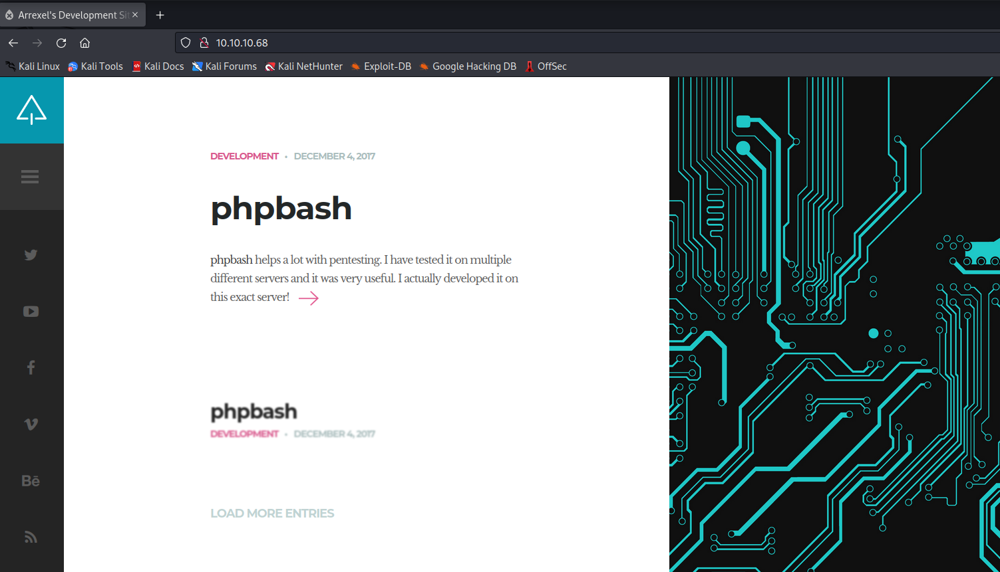
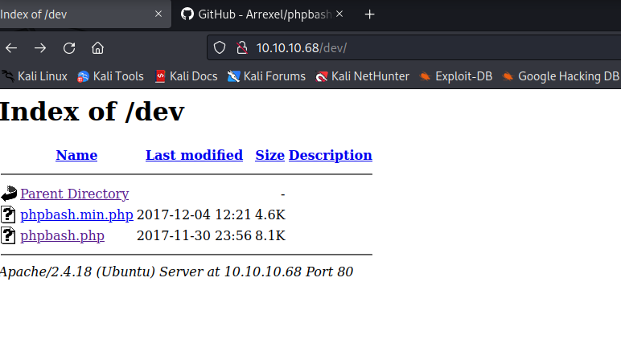
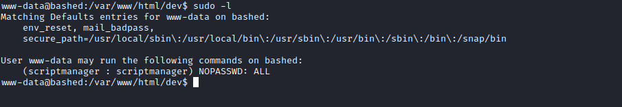
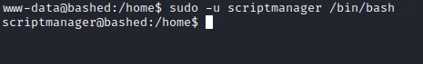
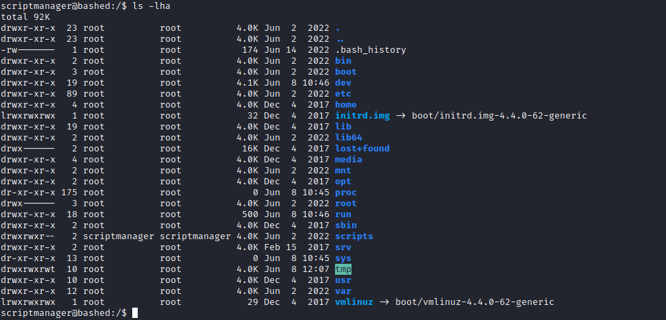
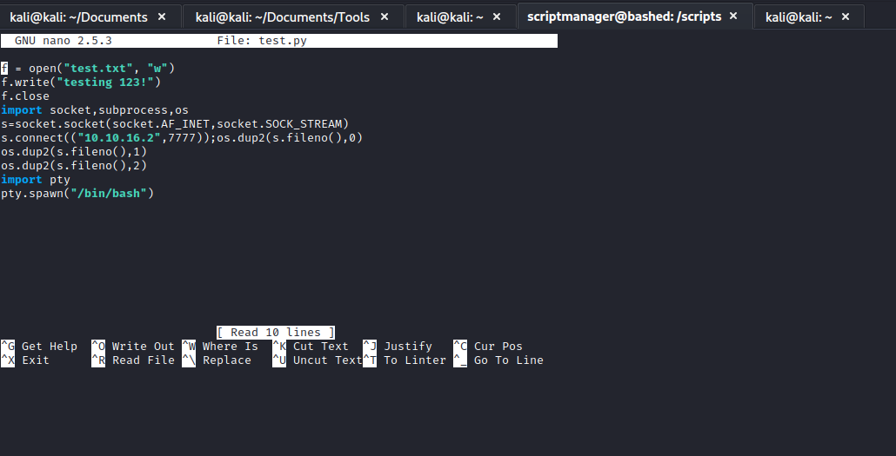
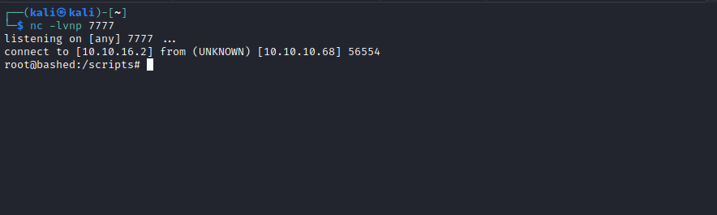

# Bashed
## Enumeration
- `nmap`
```
└─$ nmap -sC -sV 10.10.10.68    
Starting Nmap 7.93 ( https://nmap.org ) at 2023-06-08 18:47 BST
Nmap scan report for 10.10.10.68 (10.10.10.68)
Host is up (0.14s latency).
Not shown: 999 closed tcp ports (conn-refused)
PORT   STATE SERVICE VERSION
80/tcp open  http    Apache httpd 2.4.18 ((Ubuntu))
|_http-server-header: Apache/2.4.18 (Ubuntu)
|_http-title: Arrexel's Development Site

Service detection performed. Please report any incorrect results at https://nmap.org/submit/ .
Nmap done: 1 IP address (1 host up) scanned in 25.87 seconds

```
- `gobuster`
```
└─$ gobuster dir -u http://10.10.10.68/ -w /usr/share/seclists/Discovery/Web-Content/raft-medium-directories-lowercase.txt -t 50 -x php 
===============================================================
Gobuster v3.5
by OJ Reeves (@TheColonial) & Christian Mehlmauer (@firefart)
===============================================================
[+] Url:                     http://10.10.10.68/
[+] Method:                  GET
[+] Threads:                 50
[+] Wordlist:                /usr/share/seclists/Discovery/Web-Content/raft-medium-directories-lowercase.txt
[+] Negative Status codes:   404
[+] User Agent:              gobuster/3.5
[+] Extensions:              php
[+] Timeout:                 10s
===============================================================
2023/06/08 19:48:11 Starting gobuster in directory enumeration mode
===============================================================
/images               (Status: 301) [Size: 311] [--> http://10.10.10.68/images/]
/uploads              (Status: 301) [Size: 312] [--> http://10.10.10.68/uploads/]
/config.php           (Status: 200) [Size: 0]
/dev                  (Status: 301) [Size: 308] [--> http://10.10.10.68/dev/]
/php                  (Status: 301) [Size: 308] [--> http://10.10.10.68/php/]
/js                   (Status: 301) [Size: 307] [--> http://10.10.10.68/js/]
/css                  (Status: 301) [Size: 308] [--> http://10.10.10.68/css/]
/fonts                (Status: 301) [Size: 310] [--> http://10.10.10.68/fonts/]
/server-status        (Status: 403) [Size: 299]
/.php                 (Status: 403) [Size: 290]

```
- `Webserver`



## Foothold/User
- Let's check `dev` directory



- We see `phpbash.php`
  - Let's open it
  - And we get a `webshell`
  - Let's try to upgrade the shell
  - Setup a listener and send a reverse shell payload


## Root
- Enumerate for privesc
  - `sudo -l`
  - We can `sudo` as `scriptmanager`
  - Let's launch bash as `scriptmanager`




- Enumerate as `scriptmanager`
  - We see interesting directory named `/scripts` owned by `scriptmanager`
  - Let's check it




- Open the script and analyse
  - You will see that it creates a `test.txt`
  - Notice that the `test.txt` is owned by `root`
  - It looks like there is an automated process or cronjob that launches `test.py` as a root
    - use `pspy64`
  - So we can change the content of the `test.py` and get reverse shell




