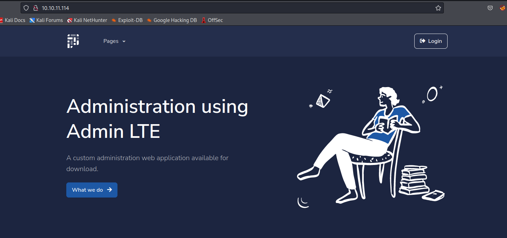
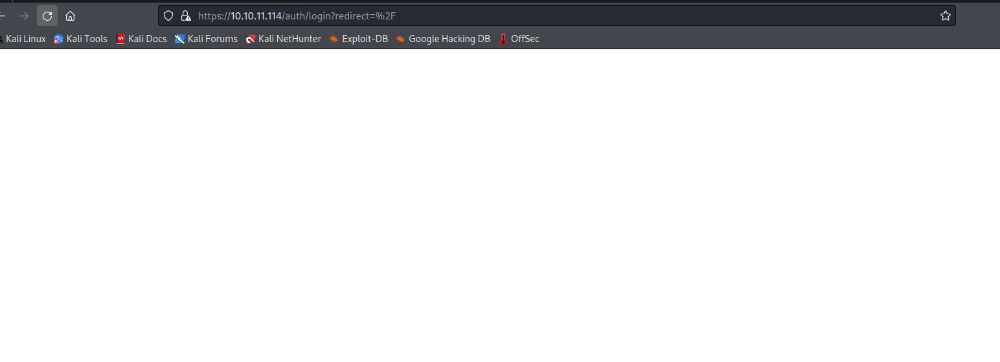
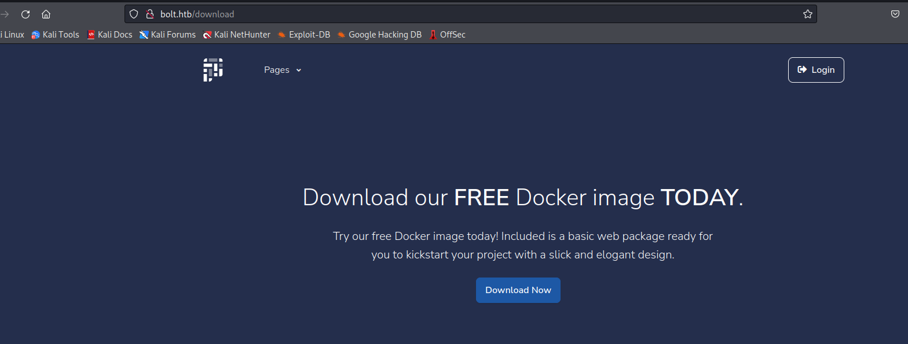

# Bolt
## Enumeration
- `nmap`
```
└─$ nmap -Pn -p- 10.10.11.114 -T4                                                               
Starting Nmap 7.94 ( https://nmap.org ) at 2023-09-23 11:56 BST
Nmap scan report for 10.10.11.114 (10.10.11.114)
Host is up (0.17s latency).
Not shown: 65532 closed tcp ports (conn-refused)
PORT    STATE SERVICE
22/tcp  open  ssh
80/tcp  open  http
443/tcp open  https

Nmap done: 1 IP address (1 host up) scanned in 723.12 seconds

```
```
└─$ nmap -Pn -p22,80,443 -sC -sV 10.10.11.114 -T4
Starting Nmap 7.94 ( https://nmap.org ) at 2023-09-23 12:13 BST
Nmap scan report for 10.10.11.114 (10.10.11.114)
Host is up (0.17s latency).

PORT    STATE SERVICE  VERSION
22/tcp  open  ssh      OpenSSH 8.2p1 Ubuntu 4ubuntu0.3 (Ubuntu Linux; protocol 2.0)
| ssh-hostkey: 
|   3072 4d:20:8a:b2:c2:8c:f5:3e:be:d2:e8:18:16:28:6e:8e (RSA)
|   256 7b:0e:c7:5f:5a:4c:7a:11:7f:dd:58:5a:17:2f:cd:ea (ECDSA)
|_  256 a7:22:4e:45:19:8e:7d:3c:bc:df:6e:1d:6c:4f:41:56 (ED25519)
80/tcp  open  http     nginx 1.18.0 (Ubuntu)
|_http-title:     Starter Website -  About 
|_http-server-header: nginx/1.18.0 (Ubuntu)
443/tcp open  ssl/http nginx 1.18.0 (Ubuntu)
|_ssl-date: TLS randomness does not represent time
|_http-server-header: nginx/1.18.0 (Ubuntu)
| http-title: 400 The plain HTTP request was sent to HTTPS port
|_Requested resource was /auth/login?redirect=%2F
| ssl-cert: Subject: commonName=passbolt.bolt.htb/organizationName=Internet Widgits Pty Ltd/stateOrProvinceName=Some-State/countryName=AU
| Not valid before: 2021-02-24T19:11:23
|_Not valid after:  2022-02-24T19:11:23
Service Info: OS: Linux; CPE: cpe:/o:linux:linux_kernel

Service detection performed. Please report any incorrect results at https://nmap.org/submit/ .
Nmap done: 1 IP address (1 host up) scanned in 22.26 seconds

```

- Web server






- `vhosts`
  - From the request above we saw `passbolt.bolt.htb`
  - Let's check others

```
└─$ wfuzz -u http://bolt.htb -w /usr/share/seclists/Discovery/DNS/subdomains-top1million-20000.txt -H 'Host: FUZZ.bolt.htb' --hh 30341 
 /usr/lib/python3/dist-packages/wfuzz/__init__.py:34: UserWarning:Pycurl is not compiled against Openssl. Wfuzz might not work correctly when fuzzing SSL sites. Check Wfuzz's documentation for more information.
********************************************************
* Wfuzz 3.1.0 - The Web Fuzzer                         *
********************************************************

Target: http://bolt.htb/
Total requests: 19966

=====================================================================
ID           Response   Lines    Word       Chars       Payload                                                                                                                                                                    
=====================================================================

000000038:   302        3 L      24 W       219 Ch      "demo"                                                                                                                                                                     
000000002:   200        98 L     322 W      4943 Ch     "mail"                                                                                                                                                                     

Total time: 604.1514
Processed Requests: 19966
Filtered Requests: 19964
Requests/sec.: 33.04800

```
- Visiting port `443` redirect to `passbolt.bolt.htb`
  - We can use `ffuf` to filter out redirects to `passbolt`
```
└─$ ffuf -u https://10.10.11.114 -H "Host: FUZZ.bolt.htb" -w /usr/share/seclists/Discovery/DNS/subdomains-top1million-20000.txt -fr passbolt

        /'___\  /'___\           /'___\       
       /\ \__/ /\ \__/  __  __  /\ \__/       
       \ \ ,__\\ \ ,__\/\ \/\ \ \ \ ,__\      
        \ \ \_/ \ \ \_/\ \ \_\ \ \ \ \_/      
         \ \_\   \ \_\  \ \____/  \ \_\       
          \/_/    \/_/   \/___/    \/_/       

       v2.0.0-dev
________________________________________________

 :: Method           : GET
 :: URL              : https://10.10.11.114
 :: Wordlist         : FUZZ: /usr/share/seclists/Discovery/DNS/subdomains-top1million-20000.txt
 :: Header           : Host: FUZZ.bolt.htb
 :: Follow redirects : false
 :: Calibration      : false
 :: Timeout          : 10
 :: Threads          : 40
 :: Matcher          : Response status: 200,204,301,302,307,401,403,405,500
 :: Filter           : Regexp: passbolt
________________________________________________

:: Progress: [19966/19966] :: Job [1/1] :: 24 req/sec :: Duration: [0:13:04] :: Errors: 0 ::
                                                                                           
```
- `passbolt.bolt.htb`
  - Port `443`


- `mail.bolt.htb`


- `demo.bolt.htb`


- `bolt.htb`
  - Download the `tar` from `http://bolt.htb/download`





- `gobuster`
```
└─$ gobuster dir -u http://bolt.htb/ -w /usr/share/seclists/Discovery/Web-Content/directory-list-2.3-medium.txt -t 50  --no-error 
===============================================================
Gobuster v3.5
by OJ Reeves (@TheColonial) & Christian Mehlmauer (@firefart)
===============================================================
[+] Url:                     http://bolt.htb/
[+] Method:                  GET
[+] Threads:                 50
[+] Wordlist:                /usr/share/seclists/Discovery/Web-Content/directory-list-2.3-medium.txt
[+] Negative Status codes:   404
[+] User Agent:              gobuster/3.5
[+] Timeout:                 10s
===============================================================
2023/09/23 21:25:00 Starting gobuster in directory enumeration mode
===============================================================
/contact              (Status: 200) [Size: 26293]
/login                (Status: 200) [Size: 9287]
/download             (Status: 200) [Size: 18570]
/index                (Status: 308) [Size: 239] [--> http://bolt.htb/]
/register             (Status: 200) [Size: 11038]
/services             (Status: 200) [Size: 22443]
/profile              (Status: 500) [Size: 290]
/pricing              (Status: 200) [Size: 31731]
/logout               (Status: 302) [Size: 209] [--> http://bolt.htb/]
/sign-in              (Status: 200) [Size: 9287]
/sign-up              (Status: 200) [Size: 11038]

```
```
└─$ gobuster dir -u http://demo.bolt.htb/ -w /usr/share/seclists/Discovery/Web-Content/directory-list-2.3-medium.txt -t 50  --no-error 
===============================================================
Gobuster v3.5
by OJ Reeves (@TheColonial) & Christian Mehlmauer (@firefart)
===============================================================
[+] Url:                     http://demo.bolt.htb/
[+] Method:                  GET
[+] Threads:                 50
[+] Wordlist:                /usr/share/seclists/Discovery/Web-Content/directory-list-2.3-medium.txt
[+] Negative Status codes:   404
[+] User Agent:              gobuster/3.5
[+] Timeout:                 10s
===============================================================
2023/09/23 21:31:21 Starting gobuster in directory enumeration mode
===============================================================
/login                (Status: 200) [Size: 9710]
/register             (Status: 200) [Size: 11066]
/logout               (Status: 302) [Size: 219] [--> http://demo.bolt.htb/login]

```

## Foothold
- Let's analyze `image.tar`
  - It's a docker image
    - https://www.mikulskibartosz.name/what-is-inside-a-docker-image
    - https://theartofmachinery.com/2021/03/18/reverse_engineering_a_docker_image.html
    - https://blog.oddbit.com/post/2015-02-13-unpacking-docker-images/
  - Each directory has `layer.tar`
```
└─$ tree -L 2
.
├── 187e74706bdc9cb3f44dca230ac7c9962288a5b8bd579c47a36abf64f35c2950
│   ├── json
│   ├── layer.tar
│   └── VERSION
├── 1be1cefeda09a601dd9baa310a3704d6309dc28f6d213867911cd2257b95677c
│   ├── json
│   ├── layer.tar
│   └── VERSION
├── 2265c5097f0b290a53b7556fd5d721ffad8a4921bfc2a6e378c04859185d27fa
│   ├── json
│   ├── layer.tar
│   └── VERSION
├── 3049862d975f250783ddb4ea0e9cb359578da4a06bf84f05a7ea69ad8d508dab
│   ├── json
│   ├── layer.tar
│   └── VERSION
├── 3350815d3bdf21771408f91da4551ca6f4e82edce74e9352ed75c2e8a5e68162
│   ├── json
│   ├── layer.tar
│   └── VERSION
├── 3d7e9c6869c056cdffaace812b4ec198267e26e03e9be25ed81fe92ad6130c6b
│   ├── json
│   ├── layer.tar
│   └── VERSION
├── 41093412e0da959c80875bb0db640c1302d5bcdffec759a3a5670950272789ad
│   ├── json
│   ├── layer.tar
│   └── VERSION
├── 745959c3a65c3899f9e1a5319ee5500f199e0cadf8d487b92e2f297441f8c5cf
│   ├── json
│   ├── layer.tar
│   └── VERSION
├── 859e74798e6c82d5191cd0deaae8c124504052faa654d6691c21577a8fa50811.json
├── 9a3bb655a4d35896e951f1528578693762650f76d7fb3aa791ac8eec9f14bc77
│   ├── json
│   ├── layer.tar
│   └── VERSION
├── a4ea7da8de7bfbf327b56b0cb794aed9a8487d31e588b75029f6b527af2976f2
│   ├── json
│   ├── layer.tar
│   └── VERSION
├── d693a85325229cdf0fecd248731c346edbc4e02b0c6321e256ffc588a3e6cb26
│   ├── json
│   ├── layer.tar
│   └── VERSION
├── ferox-http_bolt_htb-1695500633.state
├── manifest.json
└── repositories
```
## User


## Root

