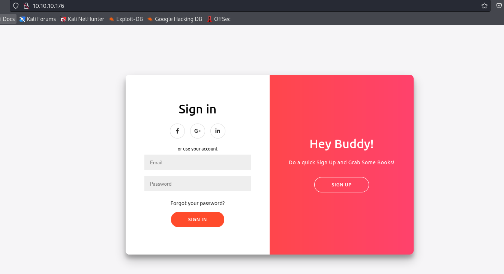

# Book
## Enumeration
- `nmap`
```
└─$ nmap -Pn -p- 10.10.10.176 --min-rate 5000            
Starting Nmap 7.94 ( https://nmap.org ) at 2023-10-28 19:41 BST
Nmap scan report for 10.10.10.176 (10.10.10.176)
Host is up (0.18s latency).
Not shown: 65521 filtered tcp ports (no-response)
PORT     STATE  SERVICE
22/tcp   open   ssh
80/tcp   open   http

Nmap done: 1 IP address (1 host up) scanned in 26.67 seconds
                                                                         
```
```
└─$ nmap -Pn -p22,80 -sC -sV 10.10.10.176 --min-rate 5000
Starting Nmap 7.94 ( https://nmap.org ) at 2023-10-28 19:43 BST
Nmap scan report for 10.10.10.176 (10.10.10.176)
Host is up (0.42s latency).

PORT   STATE SERVICE VERSION
22/tcp open  ssh     OpenSSH 7.6p1 Ubuntu 4ubuntu0.3 (Ubuntu Linux; protocol 2.0)
| ssh-hostkey: 
|   2048 f7:fc:57:99:f6:82:e0:03:d6:03:bc:09:43:01:55:b7 (RSA)
|   256 a3:e5:d1:74:c4:8a:e8:c8:52:c7:17:83:4a:54:31:bd (ECDSA)
|_  256 e3:62:68:72:e2:c0:ae:46:67:3d:cb:46:bf:69:b9:6a (ED25519)
80/tcp open  http    Apache httpd 2.4.29 ((Ubuntu))
|_http-title: LIBRARY - Read | Learn | Have Fun
|_http-server-header: Apache/2.4.29 (Ubuntu)
| http-cookie-flags: 
|   /: 
|     PHPSESSID: 
|_      httponly flag not set
Service Info: OS: Linux; CPE: cpe:/o:linux:linux_kernel

Service detection performed. Please report any incorrect results at https://nmap.org/submit/ .
Nmap done: 1 IP address (1 host up) scanned in 18.12 seconds
```

- Web server



- `gobuster`
```
└─$ gobuster dir -u http://10.10.10.176 -w /usr/share/wordlists/dirbuster/directory-list-2.3-medium.txt -x php,html,txt -t 50 
===============================================================
Gobuster v3.6
by OJ Reeves (@TheColonial) & Christian Mehlmauer (@firefart)
===============================================================
[+] Url:                     http://10.10.10.176
[+] Method:                  GET
[+] Threads:                 50
[+] Wordlist:                /usr/share/wordlists/dirbuster/directory-list-2.3-medium.txt
[+] Negative Status codes:   404
[+] User Agent:              gobuster/3.6
[+] Extensions:              php,html,txt
[+] Timeout:                 10s
===============================================================
Starting gobuster in directory enumeration mode
===============================================================
/search.php           (Status: 302) [Size: 0] [--> index.php]
/home.php             (Status: 302) [Size: 0] [--> index.php]
/.php                 (Status: 403) [Size: 277]
/index.php            (Status: 200) [Size: 6800]
/profile.php          (Status: 302) [Size: 0] [--> index.php]
/docs                 (Status: 301) [Size: 311] [--> http://10.10.10.176/docs/]
/.html                (Status: 403) [Size: 277]
/images               (Status: 301) [Size: 313] [--> http://10.10.10.176/images/]
/books.php            (Status: 302) [Size: 0] [--> index.php]
/feedback.php         (Status: 302) [Size: 0] [--> index.php]
/download.php         (Status: 302) [Size: 0] [--> index.php]
/contact.php          (Status: 302) [Size: 0] [--> index.php]
/admin                (Status: 301) [Size: 312] [--> http://10.10.10.176/admin/]
/db.php               (Status: 200) [Size: 0]
/logout.php           (Status: 302) [Size: 0] [--> index.php]
/collections.php      (Status: 302) [Size: 0] [--> index.php]
/settings.php         (Status: 302) [Size: 0] [--> index.php]

```

## Foothold


## User


##  Root