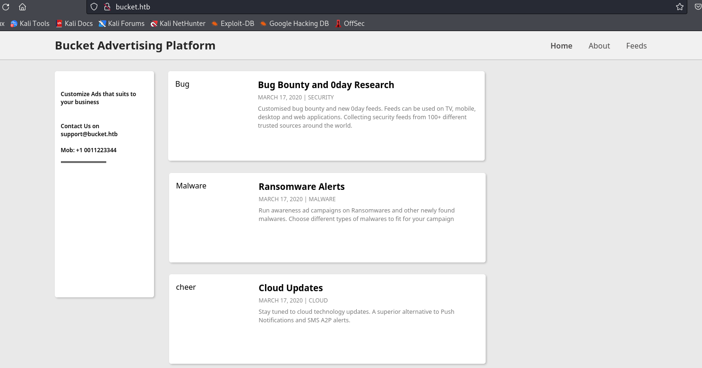

# Bucket
## Enumeration
- `nmap`
```
└─$ nmap -Pn -p- 10.10.10.212 --min-rate 1000 
Starting Nmap 7.94 ( https://nmap.org ) at 2023-10-31 16:05 GMT
Warning: 10.10.10.212 giving up on port because retransmission cap hit (10).
Nmap scan report for 10.10.10.212 (10.10.10.212)
Host is up (0.18s latency).
Not shown: 60507 closed tcp ports (conn-refused), 5026 filtered tcp ports (no-response)
PORT   STATE SERVICE
22/tcp open  ssh
80/tcp open  http

Nmap done: 1 IP address (1 host up) scanned in 157.48 seconds

```
```
└─$ nmap -Pn -p22,80 -sC -sV 10.10.10.212 --min-rate 1000
Starting Nmap 7.94 ( https://nmap.org ) at 2023-10-31 16:25 GMT
Nmap scan report for 10.10.10.212 (10.10.10.212)
Host is up (0.19s latency).

PORT   STATE SERVICE VERSION
22/tcp open  ssh     OpenSSH 8.2p1 Ubuntu 4 (Ubuntu Linux; protocol 2.0)
| ssh-hostkey: 
|   3072 48:ad:d5:b8:3a:9f:bc:be:f7:e8:20:1e:f6:bf:de:ae (RSA)
|   256 b7:89:6c:0b:20:ed:49:b2:c1:86:7c:29:92:74:1c:1f (ECDSA)
|_  256 18:cd:9d:08:a6:21:a8:b8:b6:f7:9f:8d:40:51:54:fb (ED25519)
80/tcp open  http    Apache httpd 2.4.41
|_http-title: Did not follow redirect to http://bucket.htb/
|_http-server-header: Apache/2.4.41 (Ubuntu)
Service Info: Host: 127.0.1.1; OS: Linux; CPE: cpe:/o:linux:linux_kernel

Service detection performed. Please report any incorrect results at https://nmap.org/submit/ .
Nmap done: 1 IP address (1 host up) scanned in 18.32 seconds

```

- Web Server



- `gobuster`
```
└─$ gobuster dir -u http://bucket.htb/ -w /usr/share/wordlists/dirbuster/directory-list-2.3-medium.txt -x txt,html,js,php --no-error -t 50                        
===============================================================
Gobuster v3.6
by OJ Reeves (@TheColonial) & Christian Mehlmauer (@firefart)
===============================================================
[+] Url:                     http://bucket.htb/
[+] Method:                  GET
[+] Threads:                 50
[+] Wordlist:                /usr/share/wordlists/dirbuster/directory-list-2.3-medium.txt
[+] Negative Status codes:   404
[+] User Agent:              gobuster/3.6
[+] Extensions:              js,php,txt,html
[+] Timeout:                 10s
===============================================================
Starting gobuster in directory enumeration mode
===============================================================
/.php                 (Status: 403) [Size: 275]
/.html                (Status: 403) [Size: 275]
/index.html           (Status: 200) [Size: 5344]

```

- `vhosts`
```
└─$ wfuzz -u http://bucket.htb/ -H 'Host: FUZZ.bucket.htb' -w /usr/share/seclists/Discovery/DNS/subdomains-top1million-20000.txt --hw 26
 /usr/lib/python3/dist-packages/wfuzz/__init__.py:34: UserWarning:Pycurl is not compiled against Openssl. Wfuzz might not work correctly when fuzzing SSL sites. Check Wfuzz's documentation for more information.
********************************************************
* Wfuzz 3.1.0 - The Web Fuzzer                         *
********************************************************

Target: http://bucket.htb/
Total requests: 19966

=====================================================================
ID           Response   Lines    Word       Chars       Payload                                                                                                                                                                    
=====================================================================

000000247:   404        0 L      2 W        21 Ch       "s3"
000009532:   400        12 L     53 W       422 Ch      "#www"
000010581:   400        12 L     53 W       422 Ch      "#mail"

Total time: 0
Processed Requests: 19966
Filtered Requests: 19963
Requests/sec.: 0

```

- `gobuster`
```
└─$ gobuster dir -u http://s3.bucket.htb/ -w /usr/share/wordlists/dirbuster/directory-list-2.3-medium.txt -x txt,html,js,php --no-error -t 50 
===============================================================
Gobuster v3.6
by OJ Reeves (@TheColonial) & Christian Mehlmauer (@firefart)
===============================================================
[+] Url:                     http://s3.bucket.htb/
[+] Method:                  GET
[+] Threads:                 50
[+] Wordlist:                /usr/share/wordlists/dirbuster/directory-list-2.3-medium.txt
[+] Negative Status codes:   404
[+] User Agent:              gobuster/3.6
[+] Extensions:              php,txt,html,js
[+] Timeout:                 10s
===============================================================
Starting gobuster in directory enumeration mode
===============================================================
/health               (Status: 200) [Size: 54]
/shell                (Status: 200) [Size: 0]
/shell.js             (Status: 500) [Size: 158]
/shell.html           (Status: 500) [Size: 158]
/shell.txt            (Status: 500) [Size: 158]
/shell.php            (Status: 500) [Size: 158]
```