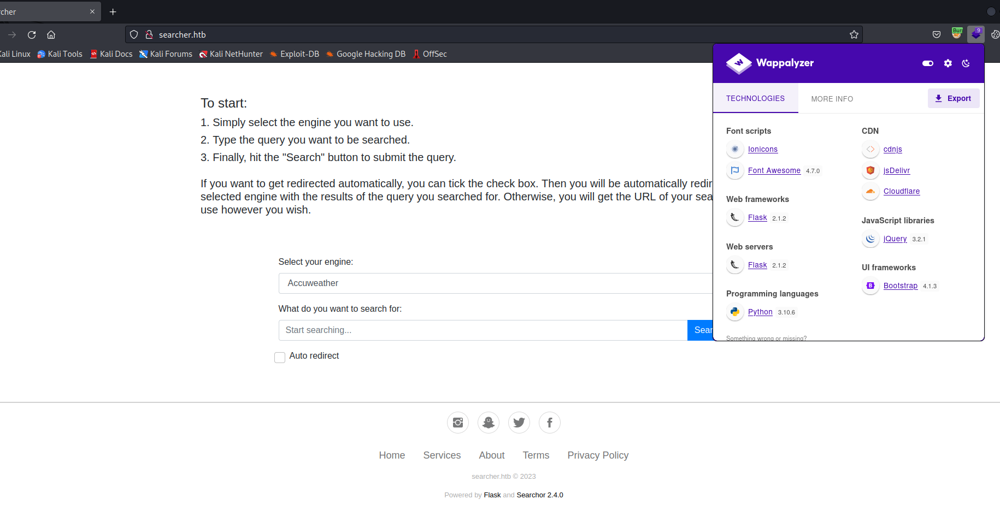
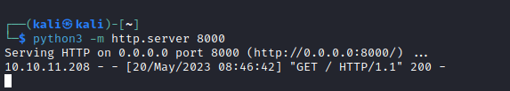
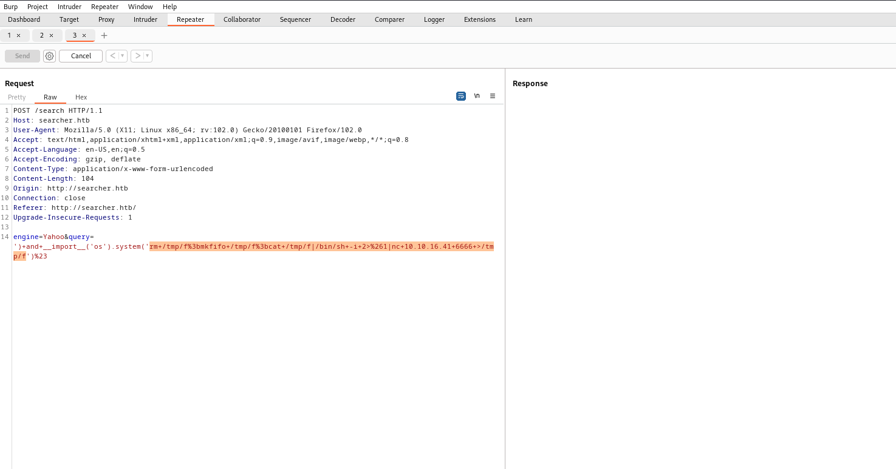
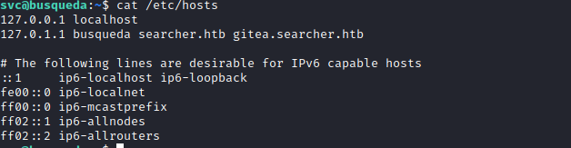
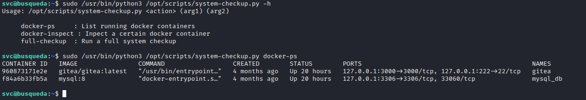
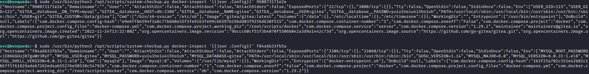
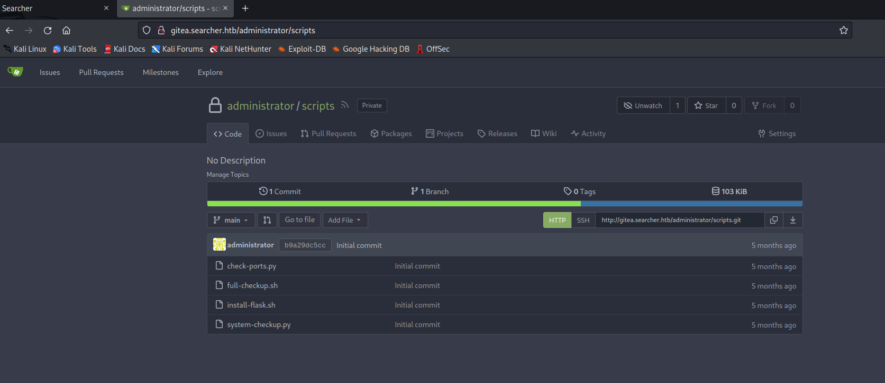
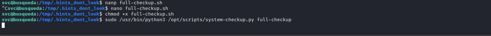

# Busqueda
## Enumeration
- `nmap`
```
┌──(kali㉿kali)-[~]
└─$ nmap -Pn -p- 10.10.11.208 -T4             
Starting Nmap 7.93 ( https://nmap.org ) at 2023-05-20 05:39 EDT
Nmap scan report for 10.10.11.208 (10.10.11.208)
Host is up (0.13s latency).
Not shown: 65533 closed tcp ports (conn-refused)
PORT   STATE SERVICE
22/tcp open  ssh
80/tcp open  http

Nmap done: 1 IP address (1 host up) scanned in 645.26 seconds
```
```
┌──(kali㉿kali)-[~]
└─$ nmap -Pn -p22,80 -sC -sV 10.10.11.208 -T4
Starting Nmap 7.93 ( https://nmap.org ) at 2023-05-20 05:50 EDT
Nmap scan report for 10.10.11.208 (10.10.11.208)
Host is up (0.10s latency).

PORT   STATE SERVICE VERSION
22/tcp open  ssh     OpenSSH 8.9p1 Ubuntu 3ubuntu0.1 (Ubuntu Linux; protocol 2.0)
| ssh-hostkey: 
|   256 4fe3a667a227f9118dc30ed773a02c28 (ECDSA)
|_  256 816e78766b8aea7d1babd436b7f8ecc4 (ED25519)
80/tcp open  http    Apache httpd 2.4.52
|_http-server-header: Apache/2.4.52 (Ubuntu)
|_http-title: Did not follow redirect to http://searcher.htb/
Service Info: Host: searcher.htb; OS: Linux; CPE: cpe:/o:linux:linux_kernel

Service detection performed. Please report any incorrect results at https://nmap.org/submit/ .
Nmap done: 1 IP address (1 host up) scanned in 12.99 seconds

```
- Web Server



- `gobuster`
```
└─$ gobuster dir -u http://searcher.htb -w /usr/share/seclists/Discovery/Web-Content/raft-medium-directories-lowercase.txt
===============================================================
Gobuster v3.5
by OJ Reeves (@TheColonial) & Christian Mehlmauer (@firefart)
===============================================================
[+] Url:                     http://searcher.htb
[+] Method:                  GET
[+] Threads:                 10
[+] Wordlist:                /usr/share/seclists/Discovery/Web-Content/raft-medium-directories-lowercase.txt
[+] Negative Status codes:   404
[+] User Agent:              gobuster/3.5
[+] Timeout:                 10s
===============================================================
2023/05/20 07:56:32 Starting gobuster in directory enumeration mode
===============================================================
/search               (Status: 405) [Size: 153]
/server-status        (Status: 403) [Size: 277]
Progress: 20721 / 26585 (77.94%)[ERROR] 2023/05/20 08:01:21 [!] parse "http://searcher.htb/error\x1f_log": net/url: invalid control character in URL
Progress: 26584 / 26585 (100.00%)
===============================================================
2023/05/20 08:02:43 Finished
===============================================================
```

## Foothold/User
- We know that it's a `flask` app that uses `searchor 2.4.0` library
  - [Post](https://security.snyk.io/package/pip/searchor/2.4.0) descrinbing possible vulnerabilities
  - [Pull Request](https://github.com/ArjunSharda/Searchor/commit/29d5b1f28d29d6a282a5e860d456fab2df24a16b) for `rce` fix


- Let's test it
  - Since we saw `eval` function is used without any sanitazation, we can craft own payload
    - [PoC](https://github.com/nikn0laty/Exploit-for-Searchor-2.4.0-Arbitrary-CMD-Injection) if needed
  - And it looks like it works




- Let's get a reverse shell
  - And we have our foothold




## Root
- We see some creds in `/var/www/app` directory
  - `cody:jh1usoih2bkjaspwe92`


- Moreover we also have additional `vhost`
  - `gitea.searcher.htb`



- If we try `cody`'s password for `svc` it works, now we can check `sudo` rights
  - We can execute `/opt/scripts/system-checkup.py *` as `root`
  - But permissions to that script indicate that I can't read it


- Let's also open `gitea` and check it's content
  - Nothing


- Let's try executing `/opt/scripts/system-checkup.py`
  - We see a `help` menu
  - We can list and inspect `docker` containers running



- Let's inspect containers
  - And we see creds
  - ``
  - `root:jI86kGUuj87guWr3RyF`
  - `gitea:yuiu1hoiu4i5ho1uh`



- We can try using creds for `gitea`
  - `admin:yuiu1hoiu4i5ho1uh` works


- Now we can access `scripts` repo



- Analyze the scripts
  - We have an interesting option in `system-checkup.py`, where it uses `full-checkup.sh` script


- The content of `full-checkup.sh`


- But the file `full-checkup.sh` doesn't exist
  - So we can create our own script anywhere (since the `system-checkup.py` doesn't use full path)
    - I created reverse shell script and ran `sudo python3 /opt/scripts/system-checkup.py full-checkup`
  - And we're root



