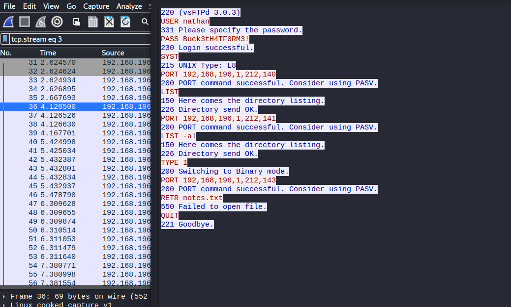
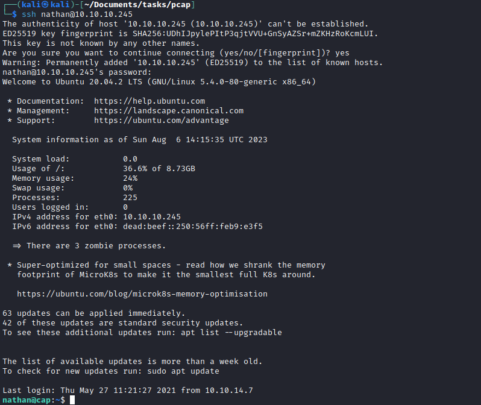
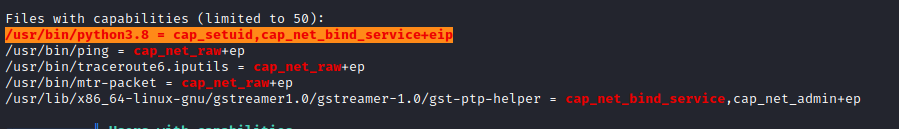

# Cap
## Enumeration
- `nmap`
```
└─$ nmap -sC -sV -Pn 10.10.10.245
Starting Nmap 7.94 ( https://nmap.org ) at 2023-08-06 13:25 BST
Nmap scan report for 10.10.10.245 (10.10.10.245)
Host is up (0.11s latency).
Not shown: 997 closed tcp ports (conn-refused)
PORT   STATE SERVICE VERSION
21/tcp open  ftp     vsftpd 3.0.3
22/tcp open  ssh     OpenSSH 8.2p1 Ubuntu 4ubuntu0.2 (Ubuntu Linux; protocol 2.0)
| ssh-hostkey:
|   3072 fa:80:a9:b2:ca:3b:88:69:a4:28:9e:39:0d:27:d5:75 (RSA)
|   256 96:d8:f8:e3:e8:f7:71:36:c5:49:d5:9d:b6:a4:c9:0c (ECDSA)
|_  256 3f:d0:ff:91:eb:3b:f6:e1:9f:2e:8d:de:b3:de:b2:18 (ED25519)
80/tcp open  http    gunicorn
|_http-title: Security Dashboard
| fingerprint-strings:
|   FourOhFourRequest:
|     HTTP/1.0 404 NOT FOUND
|     Server: gunicorn
|     Date: Sun, 06 Aug 2023 12:35:52 GMT
|     Connection: close
|     Content-Type: text/html; charset=utf-8
|     Content-Length: 232
|     <!DOCTYPE HTML PUBLIC "-//W3C//DTD HTML 3.2 Final//EN">
|     <title>404 Not Found</title>
|     <h1>Not Found</h1>
|     <p>The requested URL was not found on the server. If you entered the URL manually please check your spelling and try again.</p>
|   GetRequest:
|     HTTP/1.0 200 OK
|     Server: gunicorn
|     Date: Sun, 06 Aug 2023 12:35:46 GMT
|     Connection: close
|     Content-Type: text/html; charset=utf-8
|     Content-Length: 19386
|     <!DOCTYPE html>
|     <html class="no-js" lang="en">
|     <head>
|     <meta charset="utf-8">
|     <meta http-equiv="x-ua-compatible" content="ie=edge">
|     <title>Security Dashboard</title>
|     <meta name="viewport" content="width=device-width, initial-scale=1">
|     <link rel="shortcut icon" type="image/png" href="/static/images/icon/favicon.ico">
|     <link rel="stylesheet" href="/static/css/bootstrap.min.css">
|     <link rel="stylesheet" href="/static/css/font-awesome.min.css">
|     <link rel="stylesheet" href="/static/css/themify-icons.css">
|     <link rel="stylesheet" href="/static/css/metisMenu.css">
|     <link rel="stylesheet" href="/static/css/owl.carousel.min.css">
|     <link rel="stylesheet" href="/static/css/slicknav.min.css">
|     <!-- amchar
|   HTTPOptions:
|     HTTP/1.0 200 OK
|     Server: gunicorn
|     Date: Sun, 06 Aug 2023 12:35:46 GMT
|     Connection: close
|     Content-Type: text/html; charset=utf-8
|     Allow: OPTIONS, GET, HEAD
|     Content-Length: 0
|   RTSPRequest:
|     HTTP/1.1 400 Bad Request
|     Connection: close
|     Content-Type: text/html
|     Content-Length: 196
|     <html>
|     <head>
|     <title>Bad Request</title>
|     </head>
|     <body>
|     <h1><p>Bad Request</p></h1>
|     Invalid HTTP Version &#x27;Invalid HTTP Version: &#x27;RTSP/1.0&#x27;&#x27;
|     </body>
|_    </html>
|_http-server-header: gunicorn
1 service unrecognized despite returning data. If you know the service/version, please submit the following fingerprint at https://nmap.org/cgi-bin/submit.cgi?new-service :
SF-Port80-TCP:V=7.94%I=7%D=8/6%Time=64CF93C4%P=x86_64-pc-linux-gnu%r(GetRe
SF:quest,1026,"HTTP/1\.0\x20200\x20OK\r\nServer:\x20gunicorn\r\nDate:\x20S
SF:un,\x2006\x20Aug\x202023\x2012:35:46\x20GMT\r\nConnection:\x20close\r\n
SF:Content-Type:\x20text/html;\x20charset=utf-8\r\nContent-Length:\x201938
SF:6\r\n\r\n<!DOCTYPE\x20html>\n<html\x20class=\"no-js\"\x20lang=\"en\">\n
SF:\n<head>\n\x20\x20\x20\x20<meta\x20charset=\"utf-8\">\n\x20\x20\x20\x20
SF:<meta\x20http-equiv=\"x-ua-compatible\"\x20content=\"ie=edge\">\n\x20\x
SF:20\x20\x20<title>Security\x20Dashboard</title>\n\x20\x20\x20\x20<meta\x
SF:20name=\"viewport\"\x20content=\"width=device-width,\x20initial-scale=1
SF:\">\n\x20\x20\x20\x20<link\x20rel=\"shortcut\x20icon\"\x20type=\"image/
SF:png\"\x20href=\"/static/images/icon/favicon\.ico\">\n\x20\x20\x20\x20<l
SF:ink\x20rel=\"stylesheet\"\x20href=\"/static/css/bootstrap\.min\.css\">\
SF:n\x20\x20\x20\x20<link\x20rel=\"stylesheet\"\x20href=\"/static/css/font
SF:-awesome\.min\.css\">\n\x20\x20\x20\x20<link\x20rel=\"stylesheet\"\x20h
SF:ref=\"/static/css/themify-icons\.css\">\n\x20\x20\x20\x20<link\x20rel=\
SF:"stylesheet\"\x20href=\"/static/css/metisMenu\.css\">\n\x20\x20\x20\x20
SF:<link\x20rel=\"stylesheet\"\x20href=\"/static/css/owl\.carousel\.min\.c
SF:ss\">\n\x20\x20\x20\x20<link\x20rel=\"stylesheet\"\x20href=\"/static/cs
SF:s/slicknav\.min\.css\">\n\x20\x20\x20\x20<!--\x20amchar")%r(HTTPOptions
SF:,B3,"HTTP/1\.0\x20200\x20OK\r\nServer:\x20gunicorn\r\nDate:\x20Sun,\x20
SF:06\x20Aug\x202023\x2012:35:46\x20GMT\r\nConnection:\x20close\r\nContent
SF:-Type:\x20text/html;\x20charset=utf-8\r\nAllow:\x20OPTIONS,\x20GET,\x20
SF:HEAD\r\nContent-Length:\x200\r\n\r\n")%r(RTSPRequest,121,"HTTP/1\.1\x20
SF:400\x20Bad\x20Request\r\nConnection:\x20close\r\nContent-Type:\x20text/
SF:html\r\nContent-Length:\x20196\r\n\r\n<html>\n\x20\x20<head>\n\x20\x20\
SF:x20\x20<title>Bad\x20Request</title>\n\x20\x20</head>\n\x20\x20<body>\n
SF:\x20\x20\x20\x20<h1><p>Bad\x20Request</p></h1>\n\x20\x20\x20\x20Invalid
SF:\x20HTTP\x20Version\x20&#x27;Invalid\x20HTTP\x20Version:\x20&#x27;RTSP/
SF:1\.0&#x27;&#x27;\n\x20\x20</body>\n</html>\n")%r(FourOhFourRequest,189,
SF:"HTTP/1\.0\x20404\x20NOT\x20FOUND\r\nServer:\x20gunicorn\r\nDate:\x20Su
SF:n,\x2006\x20Aug\x202023\x2012:35:52\x20GMT\r\nConnection:\x20close\r\nC
SF:ontent-Type:\x20text/html;\x20charset=utf-8\r\nContent-Length:\x20232\r
SF:\n\r\n<!DOCTYPE\x20HTML\x20PUBLIC\x20\"-//W3C//DTD\x20HTML\x203\.2\x20F
SF:inal//EN\">\n<title>404\x20Not\x20Found</title>\n<h1>Not\x20Found</h1>\
SF:n<p>The\x20requested\x20URL\x20was\x20not\x20found\x20on\x20the\x20serv
SF:er\.\x20If\x20you\x20entered\x20the\x20URL\x20manually\x20please\x20che
SF:ck\x20your\x20spelling\x20and\x20try\x20again\.</p>\n");
Service Info: OSs: Unix, Linux; CPE: cpe:/o:linux:linux_kernel

Service detection performed. Please report any incorrect results at https://nmap.org/submit/ .
Nmap done: 1 IP address (1 host up) scanned in 807.41 seconds

```
- `gobuster`
```
└─$ gobuster dir -u http://10.10.10.245/ -w /usr/share/seclists/Discovery/Web-Content/directory-list-2.3-medium.txt -t 50
===============================================================
Gobuster v3.5
by OJ Reeves (@TheColonial) & Christian Mehlmauer (@firefart)
===============================================================
[+] Url:                     http://10.10.10.245/
[+] Method:                  GET
[+] Threads:                 50
[+] Wordlist:                /usr/share/seclists/Discovery/Web-Content/directory-list-2.3-medium.txt
[+] Negative Status codes:   404
[+] User Agent:              gobuster/3.5
[+] Timeout:                 10s
===============================================================
2023/08/06 14:20:38 Starting gobuster in directory enumeration mode
===============================================================
/data                 (Status: 302) [Size: 208] [--> http://10.10.10.245/]
/ip                   (Status: 200) [Size: 17451]
/netstat              (Status: 200) [Size: 34051]
/capture              (Status: 302) [Size: 220] [--> http://10.10.10.245/data/1]
```

- Web Server


## Foothold/User
- When we visit `/capture`, we got redirected to `/data/1`
  - We can try checking other numbers, where few results in successful pages
  - So we might want to check all possible numbers, since it looks like `IDOR`
  - If we visit `http://10.10.10.245/data/0` and open `pcap` file with wireshark we see the creds for `ftp`
  - `nathan:Buck3tH4TF0RM3!`



- If we try the creds for `ssh`, they work




## Root
- `Linpeas` shows that `python` has `cap_setuid,cap_net_bind_service+eip` capabilities



- [GTFOBins](https://gtfobins.github.io/gtfobins/python/)


