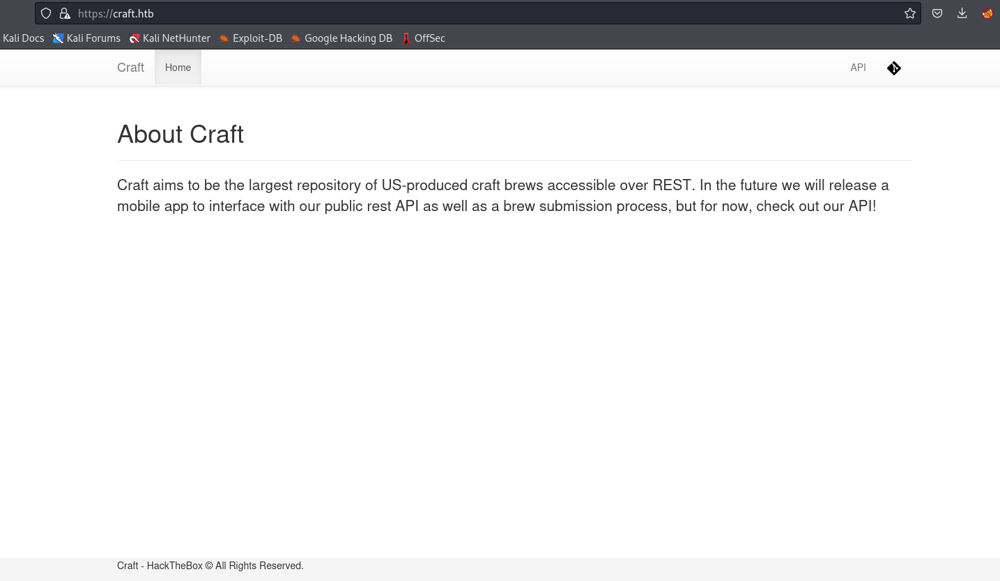

# Craft
## Enumeration
- `nmap`
```
└─$ nmap -Pn -p- 10.10.10.110 --min-rate 5000
Starting Nmap 7.94 ( https://nmap.org ) at 2023-10-26 19:34 BST
Warning: 10.10.10.110 giving up on port because retransmission cap hit (10).
Nmap scan report for 10.10.10.110 (10.10.10.110)
Host is up (0.19s latency).
Not shown: 39240 filtered tcp ports (no-response), 26293 closed tcp ports (conn-refused)
PORT    STATE SERVICE
22/tcp  open  ssh
443/tcp open  https
6022/tcp open  x11  

Nmap done: 1 IP address (1 host up) scanned in 100.87 seconds

```
```
└─$ nmap -Pn -p22,443,6022 -sC -sV 10.10.10.110 --min-rate 5000
Starting Nmap 7.94 ( https://nmap.org ) at 2023-10-26 19:37 BST
Nmap scan report for 10.10.10.110 (10.10.10.110)
Host is up (0.43s latency).

PORT     STATE SERVICE  VERSION
22/tcp   open  ssh      OpenSSH 7.4p1 Debian 10+deb9u6 (protocol 2.0)
| ssh-hostkey: 
|   2048 bd:e7:6c:22:81:7a:db:3e:c0:f0:73:1d:f3:af:77:65 (RSA)
|   256 82:b5:f9:d1:95:3b:6d:80:0f:35:91:86:2d:b3:d7:66 (ECDSA)
|_  256 28:3b:26:18:ec:df:b3:36:85:9c:27:54:8d:8c:e1:33 (ED25519)
443/tcp  open  ssl/http nginx 1.15.8
| tls-nextprotoneg: 
|_  http/1.1
| ssl-cert: Subject: commonName=craft.htb/organizationName=Craft/stateOrProvinceName=NY/countryName=US
| Not valid before: 2019-02-06T02:25:47
|_Not valid after:  2020-06-20T02:25:47
|_http-title: About
| tls-alpn: 
|_  http/1.1
|_http-server-header: nginx/1.15.8
|_ssl-date: TLS randomness does not represent time
6022/tcp open  ssh      (protocol 2.0)
| ssh-hostkey: 
|_  2048 5b:cc:bf:f1:a1:8f:72:b0:c0:fb:df:a3:01:dc:a6:fb (RSA)
| fingerprint-strings: 
|   NULL: 
|_    SSH-2.0-Go
1 service unrecognized despite returning data. If you know the service/version, please submit the following fingerprint at https://nmap.org/cgi-bin/submit.cgi?new-service :
SF-Port6022-TCP:V=7.94%I=7%D=10/26%Time=653AB201%P=x86_64-pc-linux-gnu%r(N
SF:ULL,C,"SSH-2\.0-Go\r\n");
Service Info: OS: Linux; CPE: cpe:/o:linux:linux_kernel

Service detection performed. Please report any incorrect results at https://nmap.org/submit/ .
Nmap done: 1 IP address (1 host up) scanned in 53.33 seconds

```

- Web server
  - We have links to: `gogs.craft.htb` and `api.craft.htb/api`



- `vhosts`
```
└─$ wfuzz -u https://craft.htb -w /usr/share/seclists/Discovery/DNS/subdomains-top1million-20000.txt -H 'Host: FUZZ.craft.htb' --hw 268 
 /usr/lib/python3/dist-packages/wfuzz/__init__.py:34: UserWarning:Pycurl is not compiled against Openssl. Wfuzz might not work correctly when fuzzing SSL sites. Check Wfuzz's documentation for more information.
********************************************************
* Wfuzz 3.1.0 - The Web Fuzzer                         *
********************************************************

Target: https://craft.htb/
Total requests: 19966

=====================================================================
ID           Response   Lines    Word       Chars       Payload                                                                                                                                                                    
=====================================================================

000000051:   404        4 L      34 W       233 Ch      "api"
000005934:   404        1 L      4 W        19 Ch       "vault"  
```
