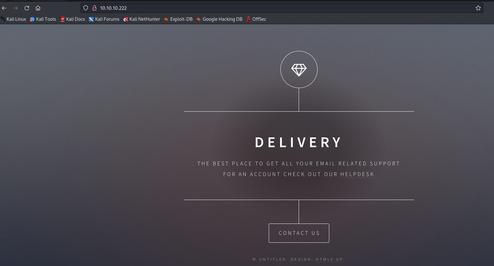
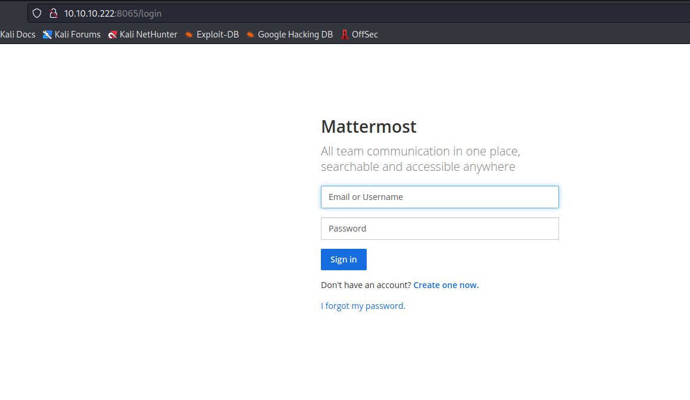
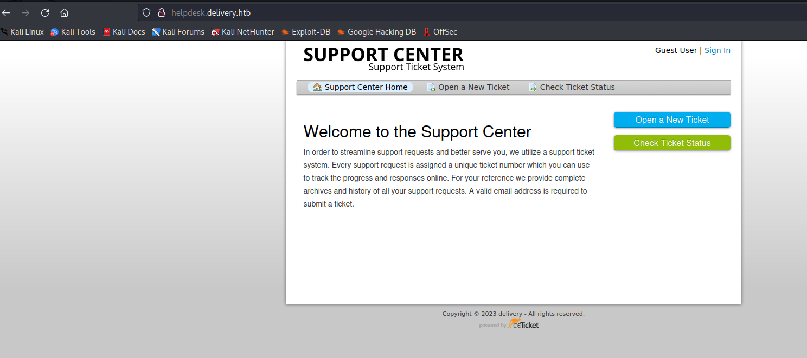
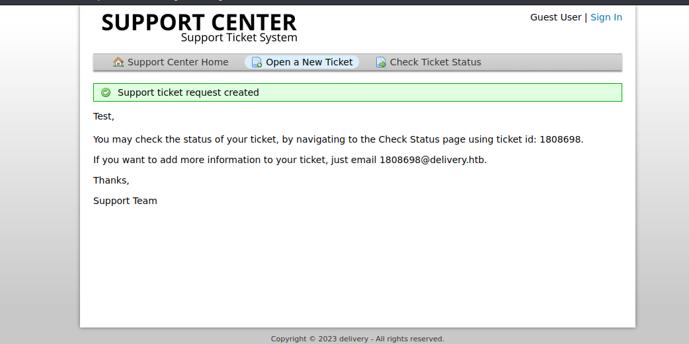
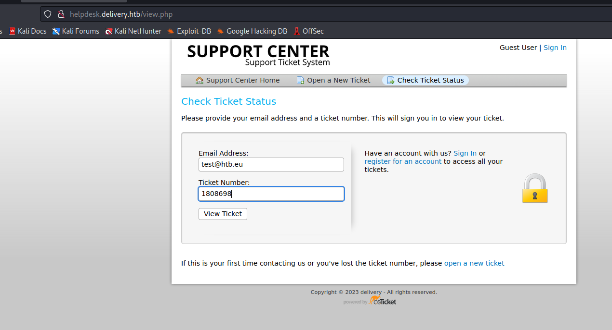
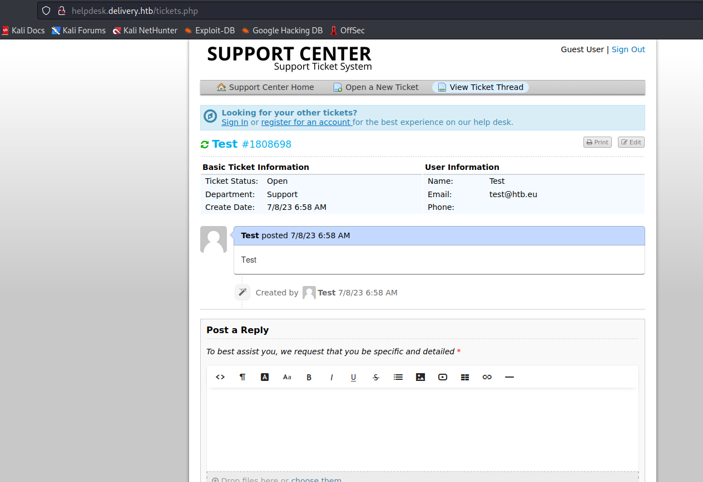
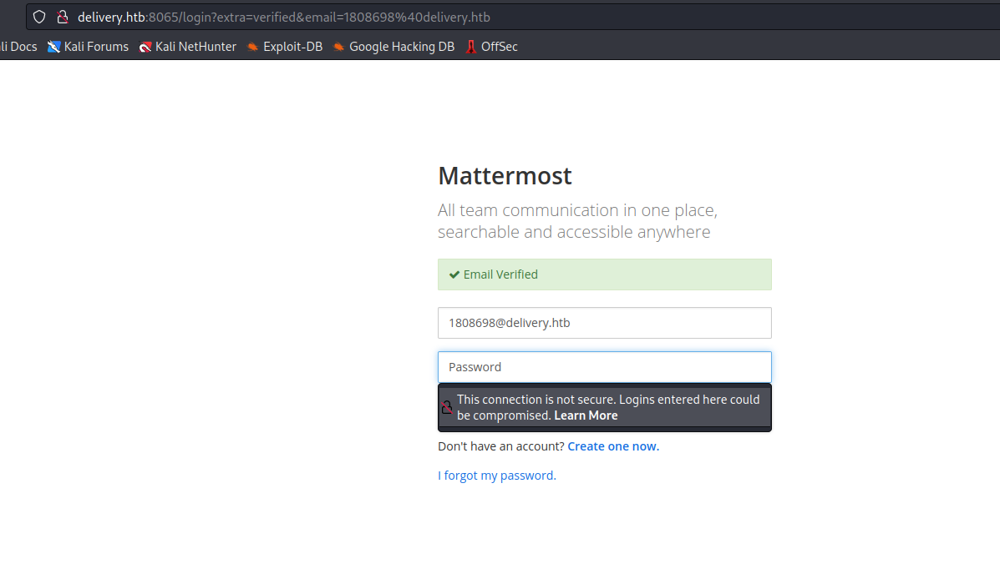
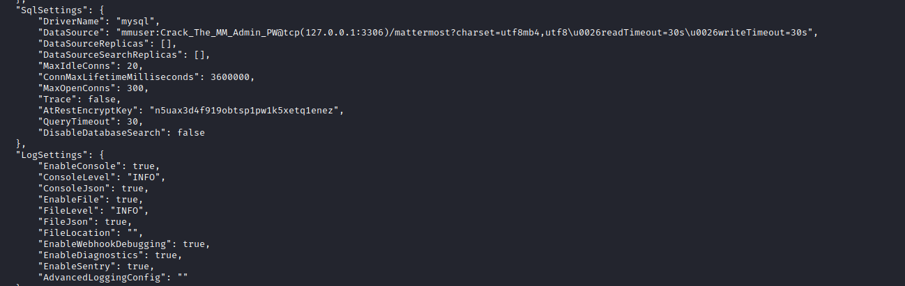
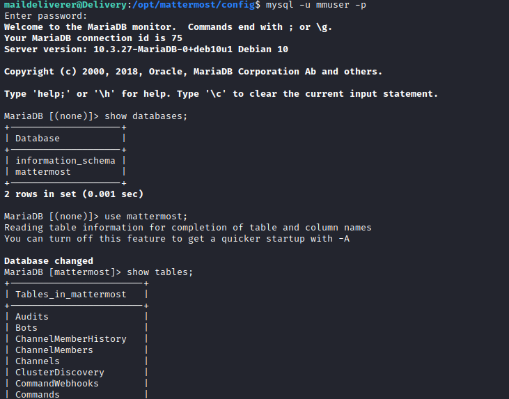

# Delivery
## Enumeration
- ```Nmap```
```
└─$ nmap -sC -sV -Pn 10.10.10.222
Starting Nmap 7.93 ( https://nmap.org ) at 2023-07-08 11:18 BST
Nmap scan report for 10.10.10.222 (10.10.10.222)
Host is up (0.12s latency).

PORT     STATE SERVICE VERSION
22/tcp   open  ssh     OpenSSH 7.9p1 Debian 10+deb10u2 (protocol 2.0)
| ssh-hostkey: 
|   2048 9c40fa859b01acac0ebc0c19518aee27 (RSA)
|   256 5a0cc03b9b76552e6ec4f4b95d761709 (ECDSA)
|_  256 b79df7489da2f27630fd42d3353a808c (ED25519)
80/tcp   open  http    nginx 1.14.2
|_http-server-header: nginx/1.14.2
|_http-title: Welcome
8065/tcp open  unknown
| fingerprint-strings: 
|   GenericLines, Help, RTSPRequest, SSLSessionReq, TerminalServerCookie: 
|     HTTP/1.1 400 Bad Request
|     Content-Type: text/plain; charset=utf-8
|     Connection: close
|     Request
|   GetRequest: 
|     HTTP/1.0 200 OK
|     Accept-Ranges: bytes
|     Cache-Control: no-cache, max-age=31556926, public
|     Content-Length: 3108
|     Content-Security-Policy: frame-ancestors 'self'; script-src 'self' cdn.rudderlabs.com
|     Content-Type: text/html; charset=utf-8
|     Last-Modified: Sat, 08 Jul 2023 09:51:21 GMT
|     X-Frame-Options: SAMEORIGIN
|     X-Request-Id: 6oxj36iapprdtktd5691zuzu4r
|     X-Version-Id: 5.30.0.5.30.1.57fb31b889bf81d99d8af8176d4bbaaa.false
|     Date: Sat, 08 Jul 2023 10:17:53 GMT
|     <!doctype html><html lang="en"><head><meta charset="utf-8"><meta name="viewport" content="width=device-width,initial-scale=1,maximum-scale=1,user-scalable=0"><meta name="robots" content="noindex, nofollow"><meta name="referrer" content="no-referrer"><title>Mattermost</title><meta name="mobile-web-app-capable" content="yes"><meta name="application-name" content="Mattermost"><meta name="format-detection" content="telephone=no"><link re
|   HTTPOptions: 
|     HTTP/1.0 405 Method Not Allowed
|     Date: Sat, 08 Jul 2023 10:17:53 GMT
|_    Content-Length: 0
1 service unrecognized despite returning data. If you know the service/version, please submit the following fingerprint at https://nmap.org/cgi-bin/submit.cgi?new-service :
SF-Port8065-TCP:V=7.93%I=7%D=7/8%Time=64A937EE%P=x86_64-pc-linux-gnu%r(Gen
SF:ericLines,67,"HTTP/1\.1\x20400\x20Bad\x20Request\r\nContent-Type:\x20te
SF:xt/plain;\x20charset=utf-8\r\nConnection:\x20close\r\n\r\n400\x20Bad\x2
SF:0Request")%r(GetRequest,DF3,"HTTP/1\.0\x20200\x20OK\r\nAccept-Ranges:\x
SF:20bytes\r\nCache-Control:\x20no-cache,\x20max-age=31556926,\x20public\r
SF:\nContent-Length:\x203108\r\nContent-Security-Policy:\x20frame-ancestor
SF:s\x20'self';\x20script-src\x20'self'\x20cdn\.rudderlabs\.com\r\nContent
SF:-Type:\x20text/html;\x20charset=utf-8\r\nLast-Modified:\x20Sat,\x2008\x
SF:20Jul\x202023\x2009:51:21\x20GMT\r\nX-Frame-Options:\x20SAMEORIGIN\r\nX
SF:-Request-Id:\x206oxj36iapprdtktd5691zuzu4r\r\nX-Version-Id:\x205\.30\.0
SF:\.5\.30\.1\.57fb31b889bf81d99d8af8176d4bbaaa\.false\r\nDate:\x20Sat,\x2
SF:008\x20Jul\x202023\x2010:17:53\x20GMT\r\n\r\n<!doctype\x20html><html\x2
SF:0lang=\"en\"><head><meta\x20charset=\"utf-8\"><meta\x20name=\"viewport\
SF:"\x20content=\"width=device-width,initial-scale=1,maximum-scale=1,user-
SF:scalable=0\"><meta\x20name=\"robots\"\x20content=\"noindex,\x20nofollow
SF:\"><meta\x20name=\"referrer\"\x20content=\"no-referrer\"><title>Matterm
SF:ost</title><meta\x20name=\"mobile-web-app-capable\"\x20content=\"yes\">
SF:<meta\x20name=\"application-name\"\x20content=\"Mattermost\"><meta\x20n
SF:ame=\"format-detection\"\x20content=\"telephone=no\"><link\x20re")%r(HT
SF:TPOptions,5B,"HTTP/1\.0\x20405\x20Method\x20Not\x20Allowed\r\nDate:\x20
SF:Sat,\x2008\x20Jul\x202023\x2010:17:53\x20GMT\r\nContent-Length:\x200\r\
SF:n\r\n")%r(RTSPRequest,67,"HTTP/1\.1\x20400\x20Bad\x20Request\r\nContent
SF:-Type:\x20text/plain;\x20charset=utf-8\r\nConnection:\x20close\r\n\r\n4
SF:00\x20Bad\x20Request")%r(Help,67,"HTTP/1\.1\x20400\x20Bad\x20Request\r\
SF:nContent-Type:\x20text/plain;\x20charset=utf-8\r\nConnection:\x20close\
SF:r\n\r\n400\x20Bad\x20Request")%r(SSLSessionReq,67,"HTTP/1\.1\x20400\x20
SF:Bad\x20Request\r\nContent-Type:\x20text/plain;\x20charset=utf-8\r\nConn
SF:ection:\x20close\r\n\r\n400\x20Bad\x20Request")%r(TerminalServerCookie,
SF:67,"HTTP/1\.1\x20400\x20Bad\x20Request\r\nContent-Type:\x20text/plain;\
SF:x20charset=utf-8\r\nConnection:\x20close\r\n\r\n400\x20Bad\x20Request");
Service Info: OS: Linux; CPE: cpe:/o:linux:linux_kernel

Service detection performed. Please report any incorrect results at https://nmap.org/submit/ .
Nmap done: 1 IP address (1 host up) scanned in 103.27 seconds
```
- Web Server



- Mattermost



## Foothold
- If we scan through web server, we will find links pointing to `helpdesk.delivery.htb`



- The hint on web server page


- We can only access `MatterMost` if we have `@delivery.htb` email
  - We can also create tickets on `helpdesk.delivery.htb`
    - When we create the ticket we get an `@delivery.htb`
  - We can try using it for registration on `MatterMost`
  - Let's create a ticket





- Create an account on `MatterMost` using ticket information
  - Check the ticket status and visit the confirmation link




- Access `MatterMost`
  - And find the creds
  - `maildeliverer:Youve_G0t_Mail!`


- We have our `ssh` connection


## Root
- Let's enumerate
  - `linpeas` showed `mattermost`'s location
  - We have `mysql` credentials in the config file
  - `mmuser:Crack_The_MM_Admin_PW`




- Connect to `mysql`
  - We found users table with creds




- Let's crack it using hashcat
  - I remembered the `PleaseSubscribe!` that was mentioned in the comments
  - We can use the hashcat's rules to generate different variations of the same password
  - And we have our password


- Rooted


