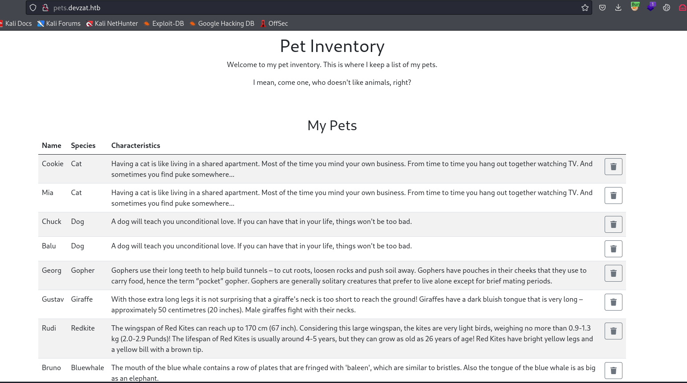

# Devzat
## Enumeration
- `nmap`
```
└─$ nmap -Pn -p- 10.10.11.118 --min-rate 1000
Starting Nmap 7.94 ( https://nmap.org ) at 2023-11-07 18:09 GMT
Nmap scan report for 10.10.11.118 (10.10.11.118)
Host is up (0.17s latency).
Not shown: 65527 closed tcp ports (conn-refused)
PORT      STATE    SERVICE
22/tcp    open     ssh
80/tcp    open     http
5178/tcp  filtered unknown
8000/tcp  open     http-alt
10716/tcp filtered unknown
28278/tcp filtered unknown
40190/tcp filtered unknown
48590/tcp filtered unknown

Nmap done: 1 IP address (1 host up) scanned in 91.00 seconds
```
```
└─$ nmap -Pn -p22,80,8000 -sC -sV 10.10.11.118 --min-rate 1000                                                                             
Starting Nmap 7.94 ( https://nmap.org ) at 2023-11-07 18:09 GMT
Nmap scan report for 10.10.11.118 (10.10.11.118)
Host is up (0.18s latency).

PORT     STATE SERVICE VERSION
22/tcp   open  ssh     OpenSSH 8.2p1 Ubuntu 4ubuntu0.2 (Ubuntu Linux; protocol 2.0)
| ssh-hostkey: 
|   3072 c2:5f:fb:de:32:ff:44:bf:08:f5:ca:49:d4:42:1a:06 (RSA)
|   256 bc:cd:e8:ee:0a:a9:15:76:52:bc:19:a4:a3:b2:ba:ff (ECDSA)
|_  256 62:ef:72:52:4f:19:53:8b:f2:9b:be:46:88:4b:c3:d0 (ED25519)
80/tcp   open  http    Apache httpd 2.4.41
|_http-title: Did not follow redirect to http://devzat.htb/
|_http-server-header: Apache/2.4.41 (Ubuntu)
8000/tcp open  ssh     (protocol 2.0)
| ssh-hostkey: 
|_  3072 6a:ee:db:90:a6:10:30:9f:94:ff:bf:61:95:2a:20:63 (RSA)
| fingerprint-strings: 
|   NULL: 
|_    SSH-2.0-Go
1 service unrecognized despite returning data. If you know the service/version, please submit the following fingerprint at https://nmap.org/cgi-bin/submit.cgi?new-service :
SF-Port8000-TCP:V=7.94%I=7%D=11/7%Time=654A7D5F%P=x86_64-pc-linux-gnu%r(NU
SF:LL,C,"SSH-2\.0-Go\r\n");
Service Info: Host: devzat.htb; OS: Linux; CPE: cpe:/o:linux:linux_kernel

Service detection performed. Please report any incorrect results at https://nmap.org/submit/ .
Nmap done: 1 IP address (1 host up) scanned in 41.72 seconds

```

- Web server


- `gobuster`
```
└─$ gobuster dir -u http://devzat.htb/ -w /usr/share/wordlists/dirbuster/directory-list-2.3-medium.txt -x txt,html,js,php --no-error    

===============================================================
Gobuster v3.6
by OJ Reeves (@TheColonial) & Christian Mehlmauer (@firefart)
===============================================================
[+] Url:                     http://devzat.htb/
[+] Method:                  GET
[+] Threads:                 10
[+] Wordlist:                /usr/share/wordlists/dirbuster/directory-list-2.3-medium.txt
[+] Negative Status codes:   404
[+] User Agent:              gobuster/3.6
[+] Extensions:              js,php,txt,html
[+] Timeout:                 10s
===============================================================
Starting gobuster in directory enumeration mode
===============================================================
/.html                (Status: 403) [Size: 275]
/images               (Status: 301) [Size: 309] [--> http://devzat.htb/images/]
/index.html           (Status: 200) [Size: 6527]
/assets               (Status: 301) [Size: 309] [--> http://devzat.htb/assets/]
/README.txt           (Status: 200) [Size: 877]
/javascript           (Status: 301) [Size: 313] [--> http://devzat.htb/javascript/]
/generic.html         (Status: 200) [Size: 4851]
/elements.html        (Status: 200) [Size: 18850]
/LICENSE.txt          (Status: 200) [Size: 17128]

```

- `vhosts`
```
└─$ wfuzz -u http://devzat.htb/ -H 'Host: FUZZ.devzat.htb' -w /usr/share/seclists/Discovery/DNS/subdomains-top1million-20000.txt --hw 26
 /usr/lib/python3/dist-packages/wfuzz/__init__.py:34: UserWarning:Pycurl is not compiled against Openssl. Wfuzz might not work correctly when fuzzing SSL sites. Check Wfuzz's documentation for more information.
********************************************************
* Wfuzz 3.1.0 - The Web Fuzzer                         *
********************************************************

Target: http://devzat.htb/
Total requests: 19966

=====================================================================
ID           Response   Lines    Word       Chars       Payload                                                                                                                                                                    
=====================================================================

000003745:   200        20 L     35 W       510 Ch      "pets"
000009532:   400        12 L     53 W       423 Ch      "#www" 
```

- `pets.devzat.htb`



- `gobuster`
```
└─$ gobuster dir -u http://pets.devzat.htb/ -w /usr/share/wordlists/dirbuster/directory-list-2.3-medium.txt -x txt,html,js,php --no-error --exclude-length 510
===============================================================
Gobuster v3.6
by OJ Reeves (@TheColonial) & Christian Mehlmauer (@firefart)
===============================================================
[+] Url:                     http://pets.devzat.htb/
[+] Method:                  GET
[+] Threads:                 10
[+] Wordlist:                /usr/share/wordlists/dirbuster/directory-list-2.3-medium.txt
[+] Negative Status codes:   404
[+] Exclude Length:          510
[+] User Agent:              gobuster/3.6
[+] Extensions:              txt,html,js,php
[+] Timeout:                 10s
===============================================================
Starting gobuster in directory enumeration mode
===============================================================
/css                  (Status: 301) [Size: 40] [--> /css/]
/build                (Status: 301) [Size: 42] [--> /build/]

```

- Rerun `nmap` on new vhost
```
└─$ nmap -Pn -p80 -sC -sV pets.devzat.htb --min-rate 1000
Starting Nmap 7.94 ( https://nmap.org ) at 2023-11-07 19:06 GMT
Nmap scan report for pets.devzat.htb (10.10.11.118)   
Host is up (0.25s latency).
rDNS record for 10.10.11.118: devzat.htb

PORT   STATE SERVICE VERSION
80/tcp open  http    Apache httpd 2.4.41
|_http-title: Pet Inventory
| http-git: 
|   10.10.11.118:80/.git/
|     Git repository found!
|     Repository description: Unnamed repository; edit this file 'description' to name the...
|_    Last commit message: back again to localhost only 
| http-server-header: 
|   Apache/2.4.41 (Ubuntu)
|_  My genious go pet server

Service detection performed. Please report any incorrect results at https://nmap.org/submit/ .
Nmap done: 1 IP address (1 host up) scanned in 13.24 seconds
```

- We can download the repo with `wget -r <URL>`, [git-dumper](https://github.com/arthaud/git-dumper), [GitTools](https://github.com/internetwache/GitTools)

## Foothold

## User


## Root