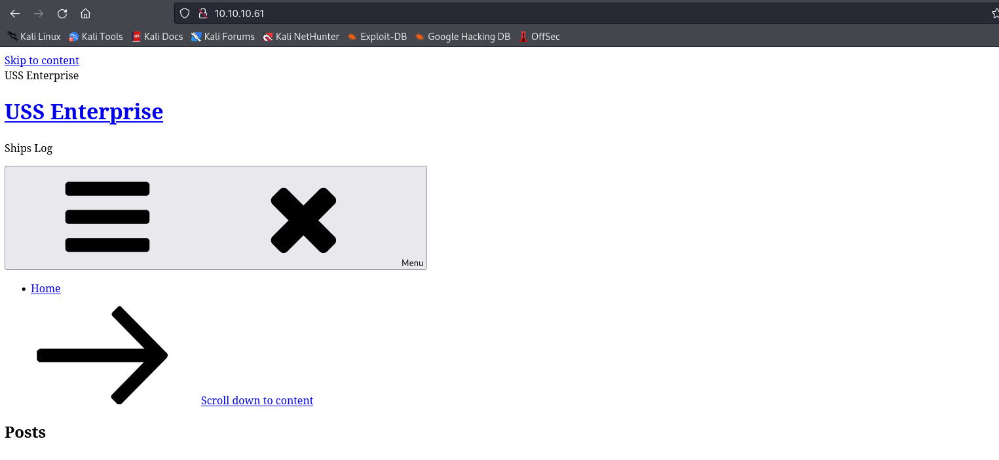
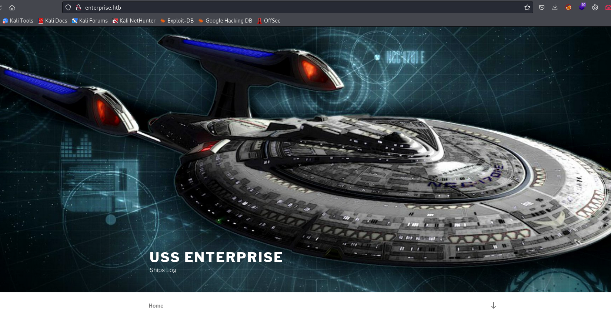
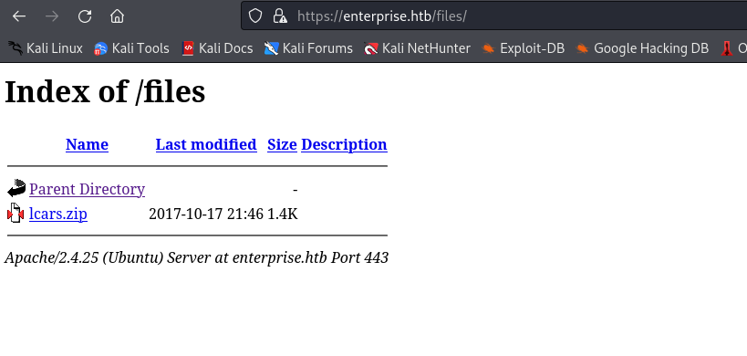

# Enterprise
## Enumeration
- `nmap`
```
└─$ nmap -Pn -p- 10.10.10.61                
Starting Nmap 7.94 ( https://nmap.org ) at 2023-10-19 18:42 BST
Nmap scan report for enterprise.htb (10.10.10.61)
Host is up (0.14s latency).
Not shown: 65529 closed tcp ports (conn-refused)
PORT      STATE    SERVICE
22/tcp    open     ssh
80/tcp    open     http
443/tcp   open     https
5355/tcp  filtered llmnr
8080/tcp  open     http-proxy
32812/tcp open     unknown

Nmap done: 1 IP address (1 host up) scanned in 26.39 seconds
```
```
└─$ nmap -Pn -p22,80,443,8080 -sC -sV 10.10.10.61 --min-rate 5000
Starting Nmap 7.94 ( https://nmap.org ) at 2023-10-19 18:02 BST
Nmap scan report for 10.10.10.61 (10.10.10.61)
Host is up (0.14s latency).

PORT     STATE SERVICE  VERSION
22/tcp   open  ssh      OpenSSH 7.4p1 Ubuntu 10 (Ubuntu Linux; protocol 2.0)
| ssh-hostkey: 
|   2048 c4:e9:8c:c5:b5:52:23:f4:b8:ce:d1:96:4a:c0:fa:ac (RSA)
|   256 f3:9a:85:58:aa:d9:81:38:2d:ea:15:18:f7:8e:dd:42 (ECDSA)
|_  256 de:bf:11:6d:c0:27:e3:fc:1b:34:c0:4f:4f:6c:76:8b (ED25519)
80/tcp   open  http     Apache httpd 2.4.10 ((Debian))
|_http-server-header: Apache/2.4.10 (Debian)
|_http-generator: WordPress 4.8.1
|_http-title: USS Enterprise &#8211; Ships Log
443/tcp  open  ssl/http Apache httpd 2.4.25 ((Ubuntu))
|_http-server-header: Apache/2.4.25 (Ubuntu)
| tls-alpn: 
|_  http/1.1
|_ssl-date: TLS randomness does not represent time
|_http-title: Apache2 Ubuntu Default Page: It works
| ssl-cert: Subject: commonName=enterprise.local/organizationName=USS Enterprise/stateOrProvinceName=United Federation of Planets/countryName=UK
| Not valid before: 2017-08-25T10:35:14
|_Not valid after:  2017-09-24T10:35:14
8080/tcp open  http     Apache httpd 2.4.10 ((Debian))
| http-open-proxy: Potentially OPEN proxy.
|_Methods supported:CONNECTION
| http-robots.txt: 15 disallowed entries 
| /joomla/administrator/ /administrator/ /bin/ /cache/ 
| /cli/ /components/ /includes/ /installation/ /language/ 
|_/layouts/ /libraries/ /logs/ /modules/ /plugins/ /tmp/
|_http-generator: Joomla! - Open Source Content Management
|_http-title: Home
|_http-server-header: Apache/2.4.10 (Debian)
Service Info: OS: Linux; CPE: cpe:/o:linux:linux_kernel

Service detection performed. Please report any incorrect results at https://nmap.org/submit/ .
Nmap done: 1 IP address (1 host up) scanned in 23.13 seconds

```

- Web server





- Port `443`


- Port `8080`


- `gobuster`
```
└─$ gobuster dir -u http://enterprise.htb -w /usr/share/wordlists/dirbuster/directory-list-lowercase-2.3-small.txt -t 50  -x txt,php -k
===============================================================
Gobuster v3.6
by OJ Reeves (@TheColonial) & Christian Mehlmauer (@firefart)
===============================================================
[+] Url:                     http://enterprise.htb
[+] Method:                  GET
[+] Threads:                 50
[+] Wordlist:                /usr/share/wordlists/dirbuster/directory-list-lowercase-2.3-small.txt
[+] Negative Status codes:   404
[+] User Agent:              gobuster/3.6
[+] Extensions:              php,txt
[+] Timeout:                 10s
===============================================================
Starting gobuster in directory enumeration mode
===============================================================
/index.php            (Status: 301) [Size: 0] [--> http://enterprise.htb/]
/wp-content           (Status: 301) [Size: 321] [--> http://enterprise.htb/wp-content/]
/wp-login.php         (Status: 200) [Size: 2428]
/license.txt          (Status: 200) [Size: 19935]
/wp-includes          (Status: 301) [Size: 322] [--> http://enterprise.htb/wp-includes/]
/wp-trackback.php     (Status: 200) [Size: 135]
/wp-admin             (Status: 301) [Size: 319] [--> http://enterprise.htb/wp-admin/]
/xmlrpc.php           (Status: 405) [Size: 42]
/wp-signup.php        (Status: 302) [Size: 0] [--> http://enterprise.htb/wp-login.php?action=register]
Progress: 244929 / 244932 (100.00%)
===============================================================
Finished
===============================================================

```
```
└─$ gobuster dir -u https://enterprise.htb -w /usr/share/wordlists/dirbuster/directory-list-lowercase-2.3-small.txt -t 50  -x txt,php -k
===============================================================
Gobuster v3.6
by OJ Reeves (@TheColonial) & Christian Mehlmauer (@firefart)
===============================================================
[+] Url:                     https://enterprise.htb
[+] Method:                  GET
[+] Threads:                 50
[+] Wordlist:                /usr/share/wordlists/dirbuster/directory-list-lowercase-2.3-small.txt
[+] Negative Status codes:   404
[+] User Agent:              gobuster/3.6
[+] Extensions:              txt,php
[+] Timeout:                 10s
===============================================================
Starting gobuster in directory enumeration mode
===============================================================
/.php                 (Status: 403) [Size: 294]
/files                (Status: 301) [Size: 318] [--> https://enterprise.htb/files/]

```

- `wpscan`
```
└─$ wpscan --url http://enterprise.htb --enumerate ap,at,u,tt
_______________________________________________________________
         __          _______   _____
         \ \        / /  __ \ / ____|
          \ \  /\  / /| |__) | (___   ___  __ _ _ __ ®
           \ \/  \/ / |  ___/ \___ \ / __|/ _` | '_ \
            \  /\  /  | |     ____) | (__| (_| | | | |
             \/  \/   |_|    |_____/ \___|\__,_|_| |_|

         WordPress Security Scanner by the WPScan Team
                         Version 3.8.25
       Sponsored by Automattic - https://automattic.com/
       @_WPScan_, @ethicalhack3r, @erwan_lr, @firefart
_______________________________________________________________

[+] URL: http://enterprise.htb/ [10.10.10.61]
[+] Started: Thu Oct 19 18:20:38 2023

Interesting Finding(s):

[+] Headers
 | Interesting Entries:
 |  - Server: Apache/2.4.10 (Debian)
 |  - X-Powered-By: PHP/5.6.31
 | Found By: Headers (Passive Detection)
 | Confidence: 100%

[+] XML-RPC seems to be enabled: http://enterprise.htb/xmlrpc.php
 | Found By: Direct Access (Aggressive Detection)
 | Confidence: 100%
 | References:
 |  - http://codex.wordpress.org/XML-RPC_Pingback_API
 |  - https://www.rapid7.com/db/modules/auxiliary/scanner/http/wordpress_ghost_scanner/
 |  - https://www.rapid7.com/db/modules/auxiliary/dos/http/wordpress_xmlrpc_dos/
 |  - https://www.rapid7.com/db/modules/auxiliary/scanner/http/wordpress_xmlrpc_login/
 |  - https://www.rapid7.com/db/modules/auxiliary/scanner/http/wordpress_pingback_access/

[+] WordPress readme found: http://enterprise.htb/readme.html
 | Found By: Direct Access (Aggressive Detection)
 | Confidence: 100%

[+] The external WP-Cron seems to be enabled: http://enterprise.htb/wp-cron.php
 | Found By: Direct Access (Aggressive Detection)
 | Confidence: 60%
 | References:
 |  - https://www.iplocation.net/defend-wordpress-from-ddos
 |  - https://github.com/wpscanteam/wpscan/issues/1299

[+] WordPress version 4.8.1 identified (Insecure, released on 2017-08-02).
 | Found By: Rss Generator (Passive Detection)
 |  - http://enterprise.htb/?feed=rss2, <generator>https://wordpress.org/?v=4.8.1</generator>
 |  - http://enterprise.htb/?feed=comments-rss2, <generator>https://wordpress.org/?v=4.8.1</generator>

[+] WordPress theme in use: twentyseventeen
 | Location: http://enterprise.htb/wp-content/themes/twentyseventeen/
 | Last Updated: 2023-03-29T00:00:00.000Z
 | Readme: http://enterprise.htb/wp-content/themes/twentyseventeen/README.txt
 | [!] The version is out of date, the latest version is 3.2
 | Style URL: http://enterprise.htb/wp-content/themes/twentyseventeen/style.css?ver=4.8.1
 | Style Name: Twenty Seventeen
 | Style URI: https://wordpress.org/themes/twentyseventeen/
 | Description: Twenty Seventeen brings your site to life with header video and immersive featured images. With a fo...
 | Author: the WordPress team
 | Author URI: https://wordpress.org/
 |
 | Found By: Css Style In Homepage (Passive Detection)
 |
 | Version: 1.3 (80% confidence)
 | Found By: Style (Passive Detection)
 |  - http://enterprise.htb/wp-content/themes/twentyseventeen/style.css?ver=4.8.1, Match: 'Version: 1.3'

[+] Enumerating All Plugins (via Passive Methods)

[i] No plugins Found.

[+] Enumerating All Themes (via Passive and Aggressive Methods)
 Checking Known Locations - Time: 00:13:19 <========================================================================================================================================================> (26352 / 26352) 100.00% Time: 00:13:19
[+] Checking Theme Versions (via Passive and Aggressive Methods)

[i] Theme(s) Identified:

[+] twentyfifteen
 | Location: http://enterprise.htb/wp-content/themes/twentyfifteen/
 | Last Updated: 2023-08-08T00:00:00.000Z
 | Readme: http://enterprise.htb/wp-content/themes/twentyfifteen/readme.txt
 | [!] The version is out of date, the latest version is 3.5
 | Style URL: http://enterprise.htb/wp-content/themes/twentyfifteen/style.css
 | Style Name: Twenty Fifteen
 | Style URI: https://wordpress.org/themes/twentyfifteen/
 | Description: Our 2015 default theme is clean, blog-focused, and designed for clarity. Twenty Fifteen's simple, st...
 | Author: the WordPress team
 | Author URI: https://wordpress.org/
 |
 | Found By: Known Locations (Aggressive Detection)
 |  - http://enterprise.htb/wp-content/themes/twentyfifteen/, status: 200
 |
 | Version: 1.8 (80% confidence)
 | Found By: Style (Passive Detection)
 |  - http://enterprise.htb/wp-content/themes/twentyfifteen/style.css, Match: 'Version: 1.8'

[+] twentyseventeen
 | Location: http://enterprise.htb/wp-content/themes/twentyseventeen/
 | Last Updated: 2023-03-29T00:00:00.000Z
 | Readme: http://enterprise.htb/wp-content/themes/twentyseventeen/README.txt
 | [!] The version is out of date, the latest version is 3.2
 | Style URL: http://enterprise.htb/wp-content/themes/twentyseventeen/style.css
 | Style Name: Twenty Seventeen
 | Style URI: https://wordpress.org/themes/twentyseventeen/
 | Description: Twenty Seventeen brings your site to life with header video and immersive featured images. With a fo...
 | Author: the WordPress team
 | Author URI: https://wordpress.org/
 |
 | Found By: Urls In Homepage (Passive Detection)
 | Confirmed By: Known Locations (Aggressive Detection)
 |  - http://enterprise.htb/wp-content/themes/twentyseventeen/, status: 200
 |
 | Version: 1.3 (80% confidence)
 | Found By: Style (Passive Detection)
 |  - http://enterprise.htb/wp-content/themes/twentyseventeen/style.css, Match: 'Version: 1.3'

[+] twentysixteen
 | Location: http://enterprise.htb/wp-content/themes/twentysixteen/
 | Last Updated: 2023-03-29T00:00:00.000Z
 | Readme: http://enterprise.htb/wp-content/themes/twentysixteen/readme.txt
 | [!] The version is out of date, the latest version is 2.9
 | Style URL: http://enterprise.htb/wp-content/themes/twentysixteen/style.css
 | Style Name: Twenty Sixteen
 | Style URI: https://wordpress.org/themes/twentysixteen/
 | Description: Twenty Sixteen is a modernized take on an ever-popular WordPress layout — the horizontal masthead ...
 | Author: the WordPress team
 | Author URI: https://wordpress.org/
 |
 | Found By: Known Locations (Aggressive Detection)
 |  - http://enterprise.htb/wp-content/themes/twentysixteen/, status: 200
 |
 | Version: 1.3 (80% confidence)
 | Found By: Style (Passive Detection)
 |  - http://enterprise.htb/wp-content/themes/twentysixteen/style.css, Match: 'Version: 1.3'

[+] Enumerating Timthumbs (via Passive and Aggressive Methods)
 Checking Known Locations - Time: 00:01:32 <==========================================================================================================================================================> (2575 / 2575) 100.00% Time: 00:01:32

[i] No Timthumbs Found.

[+] Enumerating Users (via Passive and Aggressive Methods)
 Brute Forcing Author IDs - Time: 00:00:02 <==============================================================================================================================================================> (10 / 10) 100.00% Time: 00:00:02

[i] User(s) Identified:

[+] william.riker
 | Found By: Author Posts - Display Name (Passive Detection)
 | Confirmed By:
 |  Rss Generator (Passive Detection)
 |  Login Error Messages (Aggressive Detection)

[+] william-riker
 | Found By: Author Id Brute Forcing - Author Pattern (Aggressive Detection)

[!] No WPScan API Token given, as a result vulnerability data has not been output.
[!] You can get a free API token with 25 daily requests by registering at https://wpscan.com/register

[+] Finished: Thu Oct 19 18:35:51 2023
[+] Requests Done: 29001
[+] Cached Requests: 17
[+] Data Sent: 7.538 MB
[+] Data Received: 4.803 MB
[+] Memory used: 352.156 MB
[+] Elapsed time: 00:15:13
                               
```

- `droopescan`
```
└─$ droopescan scan joomla --url http://enterprise.htb:8080 
[+] Possible version(s):                                                        
    3.7.0
    3.7.0-beta2
    3.7.0-beta3
    3.7.0-beta4
    3.7.0-rc4
    3.7.1
    3.7.1-rc1
    3.7.1-rc2
    3.7.2
    3.7.3
    3.7.3-beta1
    3.7.3-rc2
    3.7.4
    3.7.4-beta1
    3.7.4-rc1
    3.7.5
    3.8.0
    3.8.0-beta1
    3.8.0-beta2
    3.8.0-beta3
    3.8.0-beta4
    3.8.1
    3.8.1-rc
    3.8.2
    3.8.2-rc
    3.8.3
    3.8.3-rc

[+] Possible interesting urls found:
    Detailed version information. - http://enterprise.htb:8080/administrator/manifests/files/joomla.xml
    Login page. - http://enterprise.htb:8080/administrator/
    License file. - http://enterprise.htb:8080/LICENSE.txt
    Version attribute contains approx version - http://enterprise.htb:8080/plugins/system/cache/cache.xml

[+] Scan finished (0:00:02.427451 elapsed)

```

## Foothold
- https://enterprise.htb/files/ contains archive



- Content
```
└─$ ls -lha
total 28K
drwx------ 2 kali kali 4.0K Oct 19 18:40 .
drwxr-xr-x 5 kali kali  12K Oct 19 18:40 ..
-rw-r--r-- 1 kali kali  501 Oct 17  2017 lcars_db.php
-rw-r--r-- 1 kali kali  624 Oct 17  2017 lcars_dbpost.php
-rw-r--r-- 1 kali kali  377 Oct 17  2017 lcars.php
```
```
└─$ cat lcars.php       
<?php
/*
*     Plugin Name: lcars
*     Plugin URI: enterprise.htb
*     Description: Library Computer Access And Retrieval System
*     Author: Geordi La Forge
*     Version: 0.2
*     Author URI: enterprise.htb
*                             */

// Need to create the user interface. 

// need to finsih the db interface

// need to make it secure

?> 

```
```
└─$ cat lcars_db.php 
<?php
include "/var/www/html/wp-config.php";
$db = new mysqli(DB_HOST, DB_USER, DB_PASSWORD, DB_NAME);
// Test the connection:
if (mysqli_connect_errno()){
    // Connection Error
    exit("Couldn't connect to the database: ".mysqli_connect_error());
}


// test to retireve an ID
if (isset($_GET['query'])){
    $query = $_GET['query'];
    $sql = "SELECT ID FROM wp_posts WHERE post_name = $query";
    $result = $db->query($sql);
    echo $result;
} else {
    echo "Failed to read query";
}


?> 
```
```
└─$ cat lcars_dbpost.php
<?php
include "/var/www/html/wp-config.php";
$db = new mysqli(DB_HOST, DB_USER, DB_PASSWORD, DB_NAME);
// Test the connection:
if (mysqli_connect_errno()){
    // Connection Error
    exit("Couldn't connect to the database: ".mysqli_connect_error());
}


// test to retireve a post name
if (isset($_GET['query'])){
    $query = (int)$_GET['query'];
    $sql = "SELECT post_title FROM wp_posts WHERE ID = $query";
    $result = $db->query($sql);
    if ($result){
        $row = $result->fetch_row();
        if (isset($row[0])){
            echo $row[0];
        }
    }
} else {
    echo "Failed to read query";
}


?> 

```