# FriendZone
## Enumeration
- `nmap`
```
└─$ nmap -Pn -sC -sV 10.10.10.123 -T4
Starting Nmap 7.93 ( https://nmap.org ) at 2023-06-18 15:55 BST
Nmap scan report for 10.10.10.123 (10.10.10.123)
Host is up (0.13s latency).
Not shown: 993 closed tcp ports (conn-refused)
PORT    STATE SERVICE     VERSION
21/tcp  open  ftp         vsftpd 3.0.3
22/tcp  open  ssh         OpenSSH 7.6p1 Ubuntu 4 (Ubuntu Linux; protocol 2.0)
| ssh-hostkey: 
|   2048 a96824bc971f1e54a58045e74cd9aaa0 (RSA)
|   256 e5440146ee7abb7ce91acb14999e2b8e (ECDSA)
|_  256 004e1a4f33e8a0de86a6e42a5f84612b (ED25519)
53/tcp  open  domain      ISC BIND 9.11.3-1ubuntu1.2 (Ubuntu Linux)
| dns-nsid: 
|_  bind.version: 9.11.3-1ubuntu1.2-Ubuntu
80/tcp  open  http        Apache httpd 2.4.29 ((Ubuntu))
|_http-server-header: Apache/2.4.29 (Ubuntu)
|_http-title: Friend Zone Escape software
139/tcp open  netbios-ssn Samba smbd 3.X - 4.X (workgroup: WORKGROUP)
443/tcp open  ssl/http    Apache httpd 2.4.29
| tls-alpn: 
|_  http/1.1
| ssl-cert: Subject: commonName=friendzone.red/organizationName=CODERED/stateOrProvinceName=CODERED/countryName=JO
| Not valid before: 2018-10-05T21:02:30
|_Not valid after:  2018-11-04T21:02:30
|_http-server-header: Apache/2.4.29 (Ubuntu)
|_ssl-date: TLS randomness does not represent time
|_http-title: 404 Not Found
445/tcp open  netbios-ssn Samba smbd 4.7.6-Ubuntu (workgroup: WORKGROUP)
Service Info: Hosts: FRIENDZONE, 127.0.1.1; OSs: Unix, Linux; CPE: cpe:/o:linux:linux_kernel

Host script results:
|_clock-skew: mean: -1h00m29s, deviation: 1h43m54s, median: -30s
| smb2-time: 
|   date: 2023-06-18T14:55:52
|_  start_date: N/A
| smb-security-mode: 
|   account_used: guest
|   authentication_level: user
|   challenge_response: supported
|_  message_signing: disabled (dangerous, but default)
|_nbstat: NetBIOS name: FRIENDZONE, NetBIOS user: <unknown>, NetBIOS MAC: 000000000000 (Xerox)
| smb-os-discovery: 
|   OS: Windows 6.1 (Samba 4.7.6-Ubuntu)
|   Computer name: friendzone
|   NetBIOS computer name: FRIENDZONE\x00
|   Domain name: \x00
|   FQDN: friendzone
|_  System time: 2023-06-18T17:55:53+03:00
| smb2-security-mode: 
|   311: 
|_    Message signing enabled but not required

Service detection performed. Please report any incorrect results at https://nmap.org/submit/ .
Nmap done: 1 IP address (1 host up) scanned in 40.94 seconds

```
- `smbmap`
```
└─$ smbmap -H 10.10.10.123  -R
[+] Guest session       IP: 10.10.10.123:445    Name: 10.10.10.123                                      
        Disk                                                    Permissions     Comment
        ----                                                    -----------     -------
        print$                                                  NO ACCESS       Printer Drivers
        Files                                                   NO ACCESS       FriendZone Samba Server Files /etc/Files
        general                                                 READ ONLY       FriendZone Samba Server Files
        .\general\*
        dr--r--r--                0 Wed Jan 16 20:10:51 2019    .
        dr--r--r--                0 Tue Sep 13 15:56:24 2022    ..
        fr--r--r--               57 Wed Oct 10 00:52:42 2018    creds.txt
        Development                                             READ, WRITE     FriendZone Samba Server Files
        .\Development\*
        dr--r--r--                0 Sun Jun 18 16:10:05 2023    .
        dr--r--r--                0 Tue Sep 13 15:56:24 2022    ..
        IPC$                                                    NO ACCESS       IPC Service (FriendZone server (Samba, Ubuntu))
```

- Creds

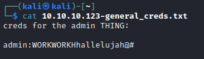

- Web server


- `gobuster`


- `dig axfr`


## Foothold
- `https://administrator1.friendzone.red/`
  - Use the creds from `smb`

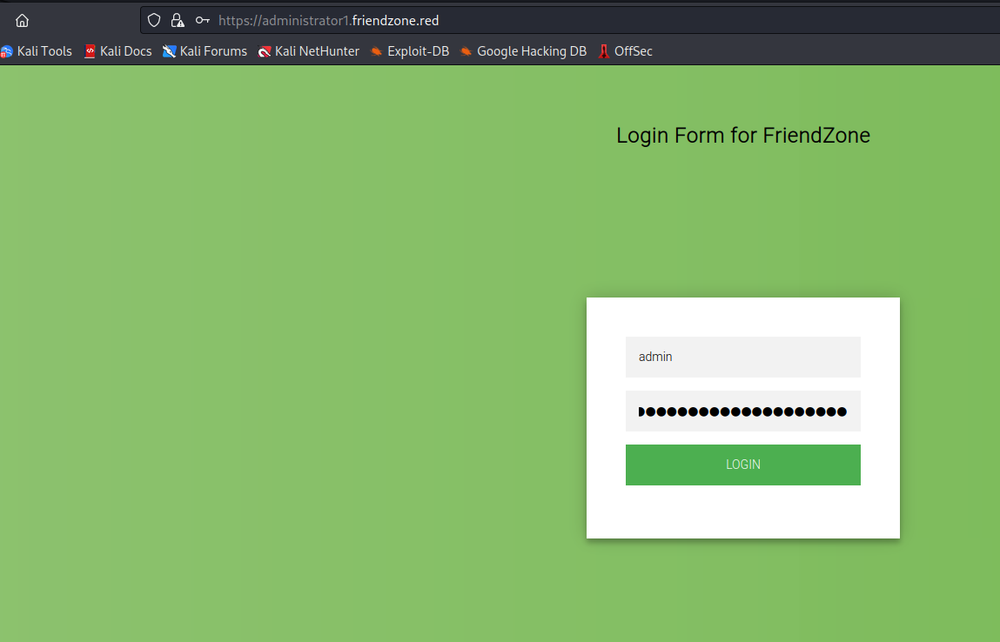


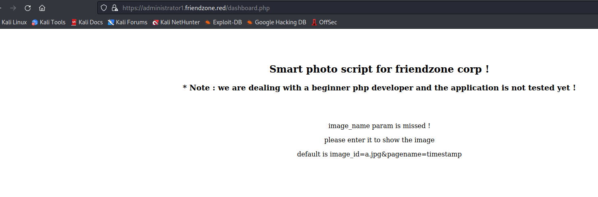

- Let's test params


- It seems like `image_id` provides nothing
  - Let's try `pagename`
  - It seems like it appends `.php` to parameter


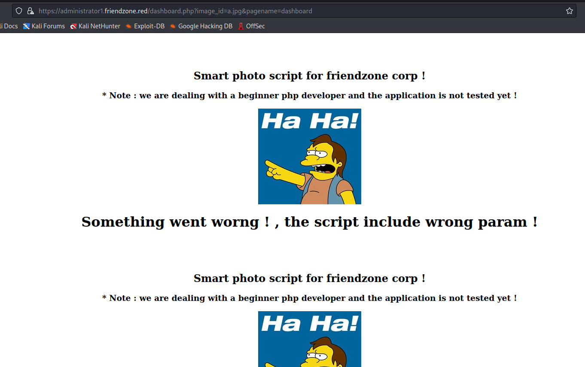

- Let's get source code
  - Used [CyberChef](https://gchq.github.io/CyberChef) for decoding
  - We can have a `LFI`


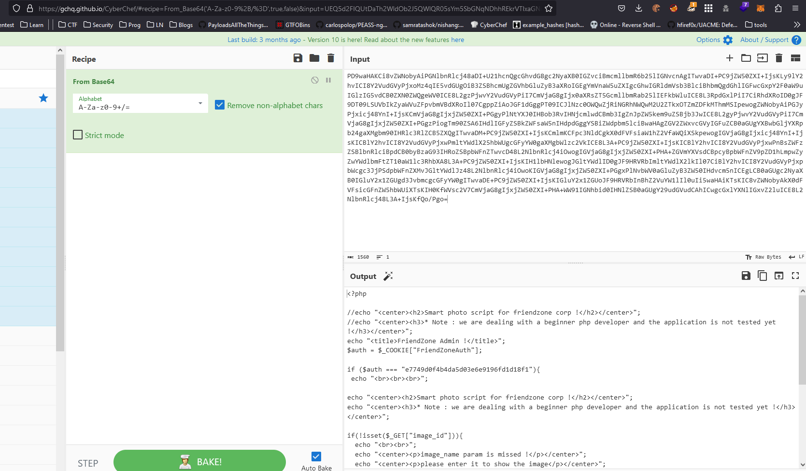

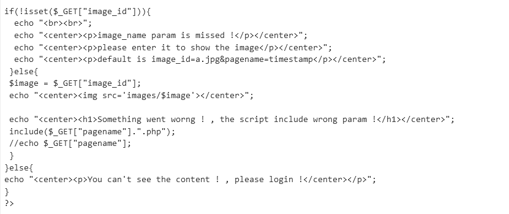


- We had a `read, write` permissions on `Development` share
  - Maybe we can put our web-shell, but we have to find the location of the `Development` folder
  - Let's upload a `web-shell` and search for it

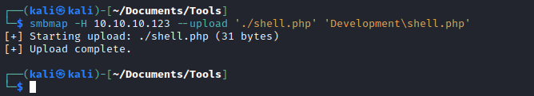

- Let's generate wordlist for root directories
  - And use it for fuzzing
  - `wfuzz -c -w ./root_dirs -H 'Cookie: FriendZoneAuth=e7749d0f4b4da5d03e6e9196fd1d18f1' 'https://administrator1.friendzone.red/dashboard.php?image_id=&pagename=../../..FUZZ/Development/shell&cmd=id'`
  - And we find the location, which is `/etc`


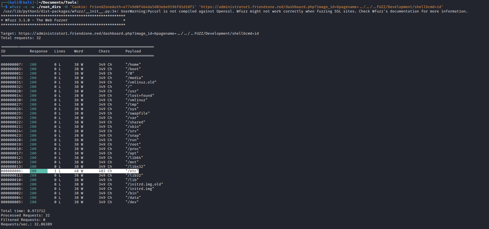

- Let's check

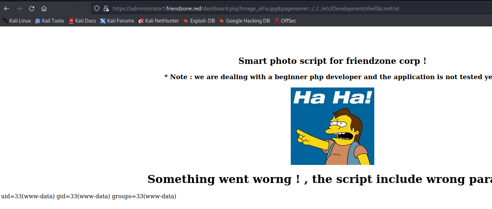

- Time to get our reverse-shell


## User
- Upload and run `linpeas`

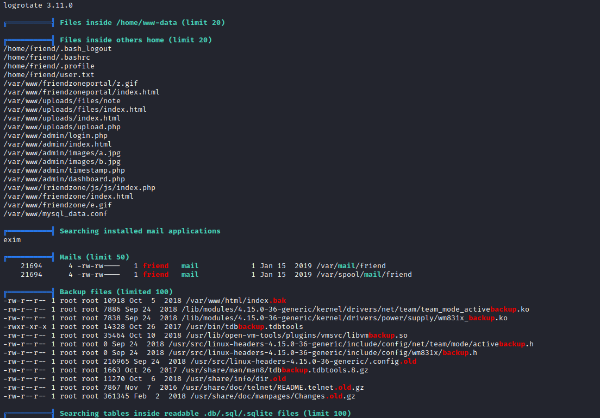

- Let's check `mysql_data.conf`
  - Try `su - friend` in case of cred reuse

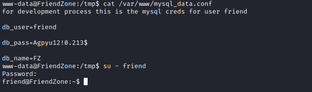

## Root
- Let's check `/opt/server_admin`

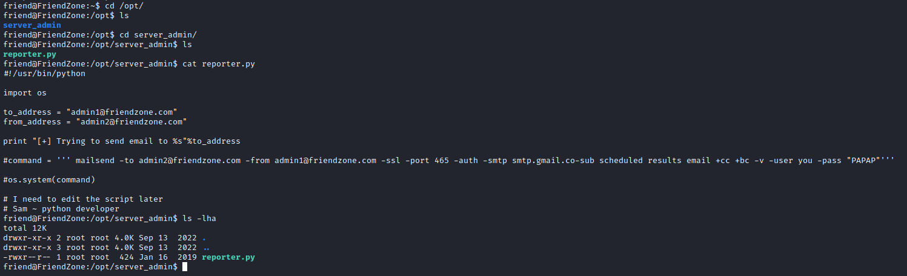

- We see that this job is automated

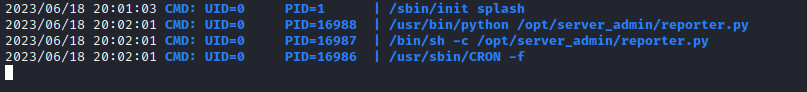

- We see a writable module `os.py`, which is included in the script above
  - We can hijack it according to this [post](https://rastating.github.io/privilege-escalation-via-python-library-hijacking/)

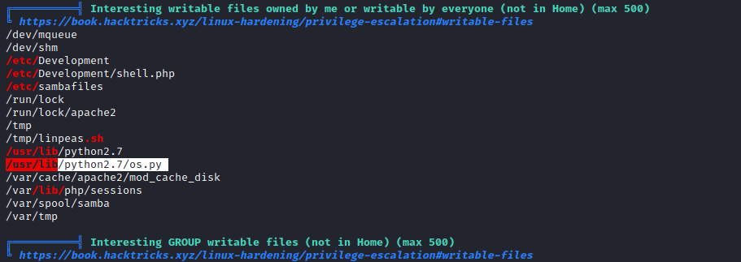
 
- Check the python path order

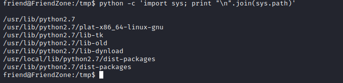
 
- We see the first line is blank, which is according to the post is the `Directory of the script being executed`
  - We can try creating `os.py` there or simply add payload to existing `os.py` since we can write to it
  - Let's simply add payload to existing file
  - Set up listener and for connection


