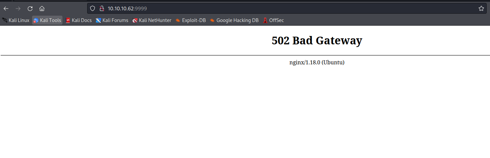

# Fulcrum
## Enumeration
- `nmap`
```
└─$ nmap -p- 10.10.10.62 --min-rate 10000
Starting Nmap 7.94 ( https://nmap.org ) at 2023-09-26 20:44 BST
Nmap scan report for 10.10.10.62 (10.10.10.62)
Host is up (0.093s latency).
Not shown: 65468 filtered tcp ports (no-response), 65 closed tcp ports (conn-refused)
PORT   STATE SERVICE
4/tcp     open  unknown
22/tcp    open  ssh
80/tcp    open  http
88/tcp    open  kerberos-sec
9999/tcp  open  abyss
56423/tcp open  unknown

Nmap done: 1 IP address (1 host up) scanned in 13.80 seconds
```
```
─$ nmap -p4,22,80,88,9999,56423 -sC -sV 10.10.10.62
Starting Nmap 7.94 ( https://nmap.org ) at 2023-09-26 20:47 BST
Nmap scan report for 10.10.10.62 (10.10.10.62)
Host is up (0.14s latency).

PORT      STATE SERVICE VERSION
4/tcp     open  http    nginx 1.18.0 (Ubuntu)
|_http-title: Site doesn't have a title (text/html; charset=UTF-8).
|_http-server-header: nginx/1.18.0 (Ubuntu)
22/tcp    open  ssh     OpenSSH 8.2p1 Ubuntu 4ubuntu0.2 (Ubuntu Linux; protocol 2.0)
| ssh-hostkey: 
|   3072 48:ad:d5:b8:3a:9f:bc:be:f7:e8:20:1e:f6:bf:de:ae (RSA)
|   256 b7:89:6c:0b:20:ed:49:b2:c1:86:7c:29:92:74:1c:1f (ECDSA)
|_  256 18:cd:9d:08:a6:21:a8:b8:b6:f7:9f:8d:40:51:54:fb (ED25519)
80/tcp    open  http    nginx 1.18.0 (Ubuntu)
|_http-title: Input string was not in a correct format.
| http-methods: 
|_  Potentially risky methods: TRACE
|_http-server-header: nginx/1.18.0 (Ubuntu)
88/tcp    open  http    nginx 1.18.0 (Ubuntu)
|_http-title: phpMyAdmin
| http-robots.txt: 1 disallowed entry 
|_/
|_http-server-header: nginx/1.18.0 (Ubuntu)
9999/tcp  open  http    nginx 1.18.0 (Ubuntu)
|_http-title: Input string was not in a correct format.
| http-methods: 
|_  Potentially risky methods: TRACE
|_http-server-header: nginx/1.18.0 (Ubuntu)
56423/tcp open  http    nginx 1.18.0 (Ubuntu)
|_http-server-header: Fulcrum-API Beta
|_http-title: Site doesn't have a title (application/json;charset=utf-8).
Service Info: OS: Linux; CPE: cpe:/o:linux:linux_kernel

Service detection performed. Please report any incorrect results at https://nmap.org/submit/ .
Nmap done: 1 IP address (1 host up) scanned in 19.53 seconds

```

- Port `4`


```
└─$ feroxbuster -u http://10.10.10.62:4 -w /usr/share/seclists/Discovery/Web-Content/raft-medium-directories-lowercase.txt -k -x php

 ___  ___  __   __     __      __         __   ___
|__  |__  |__) |__) | /  `    /  \ \_/ | |  \ |__
|    |___ |  \ |  \ | \__,    \__/ / \ | |__/ |___
by Ben "epi" Risher 🤓                 ver: 2.10.0
───────────────────────────┬──────────────────────
 🎯  Target Url            │ http://10.10.10.62:4
 🚀  Threads               │ 50
 📖  Wordlist              │ /usr/share/seclists/Discovery/Web-Content/raft-medium-directories-lowercase.txt
 👌  Status Codes          │ [200, 204, 301, 302, 307, 308, 401, 403, 405, 500]
 💥  Timeout (secs)        │ 7
 🦡  User-Agent            │ feroxbuster/2.10.0
 💉  Config File           │ /etc/feroxbuster/ferox-config.toml
 🔎  Extract Links         │ true
 💲  Extensions            │ [php]
 🏁  HTTP methods          │ [GET]
 🔓  Insecure              │ true
 🔃  Recursion Depth       │ 4
───────────────────────────┴──────────────────────
 🏁  Press [ENTER] to use the Scan Management Menu™
──────────────────────────────────────────────────
200      GET        1l        6w      110c http://10.10.10.62:4/index.php
200      GET        1l        6w      110c http://10.10.10.62:4/
200      GET        1l        6w       54c http://10.10.10.62:4/upload.php
200      GET       13l       27w      312c http://10.10.10.62:4/home.php
```

- Port `80`


```
└─$ feroxbuster -u http://10.10.10.62 -w /usr/share/seclists/Discovery/Web-Content/raft-medium-directories-lowercase.txt -k -x asp,aspx 

 ___  ___  __   __     __      __         __   ___
|__  |__  |__) |__) | /  `    /  \ \_/ | |  \ |__
|    |___ |  \ |  \ | \__,    \__/ / \ | |__/ |___
by Ben "epi" Risher 🤓                 ver: 2.10.0
───────────────────────────┬──────────────────────
 🎯  Target Url            │ http://10.10.10.62
 🚀  Threads               │ 50
 📖  Wordlist              │ /usr/share/seclists/Discovery/Web-Content/raft-medium-directories-lowercase.txt
 👌  Status Codes          │ [200, 204, 301, 302, 307, 308, 401, 403, 405, 500]
 💥  Timeout (secs)        │ 7
 🦡  User-Agent            │ feroxbuster/2.10.0
 💉  Config File           │ /etc/feroxbuster/ferox-config.toml
 🔎  Extract Links         │ true
 💲  Extensions            │ [asp, aspx]
 🏁  HTTP methods          │ [GET]
 🔓  Insecure              │ true
 🔃  Recursion Depth       │ 4
───────────────────────────┴──────────────────────
 🏁  Press [ENTER] to use the Scan Management Menu™
──────────────────────────────────────────────────
200      GET      108l      372w     5252c http://10.10.10.62/
```

- Port `88`


- Port `9999`



- Port `56423`


```
└─$ feroxbuster -u http://10.10.10.62:56423 -m GET,POST,PUT,DELETE

 ___  ___  __   __     __      __         __   ___
|__  |__  |__) |__) | /  `    /  \ \_/ | |  \ |__
|    |___ |  \ |  \ | \__,    \__/ / \ | |__/ |___
by Ben "epi" Risher 🤓                 ver: 2.10.0
───────────────────────────┬──────────────────────
 🎯  Target Url            │ http://10.10.10.62:56423
 🚀  Threads               │ 50
 📖  Wordlist              │ /usr/share/seclists/Discovery/Web-Content/raft-medium-directories.txt
 👌  Status Codes          │ [200, 204, 301, 302, 307, 308, 401, 403, 405, 500]
 💥  Timeout (secs)        │ 7
 🦡  User-Agent            │ feroxbuster/2.10.0
 💉  Config File           │ /etc/feroxbuster/ferox-config.toml
 🔎  Extract Links         │ true
 🏁  HTTP methods          │ [GET, POST, PUT, DELETE]
 🔃  Recursion Depth       │ 4
───────────────────────────┴──────────────────────
 🏁  Press [ENTER] to use the Scan Management Menu™
──────────────────────────────────────────────────
405      PUT        7l       12w      166c Auto-filtering found 404-like response and created new filter; toggle off with --dont-filter
405   DELETE        7l       12w      166c Auto-filtering found 404-like response and created new filter; toggle off with --dont-filter
200      GET        2l        1w       31c http://10.10.10.62:56423/
200     POST        2l        1w       31c http://10.10.10.62:56423/

```
