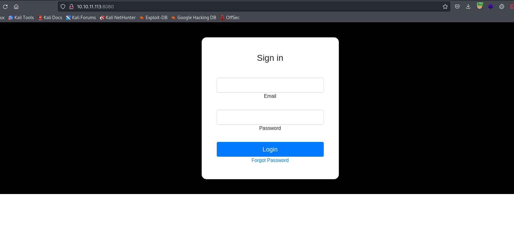

# Gobox
## Enumeration
- `nmap`
```
└─$ nmap -Pn -p- 10.10.11.113 --min-rate 1000 
Starting Nmap 7.94 ( https://nmap.org ) at 2023-11-06 17:09 GMT
Warning: 10.10.11.113 giving up on port because retransmission cap hit (10).
Nmap scan report for 10.10.11.113 (10.10.11.113)
Host is up (0.18s latency).
Not shown: 65508 closed tcp ports (conn-refused)
PORT      STATE    SERVICE
22/tcp    open     ssh
80/tcp    open     http
4566/tcp  open     kwtc
8080/tcp  open     http-proxy

```
```
└─$ nmap -Pn -p22,80,4566,8080 -sC -sV 10.10.11.113 --min-rate 1000
Starting Nmap 7.94 ( https://nmap.org ) at 2023-11-06 17:11 GMT
Nmap scan report for 10.10.11.113 (10.10.11.113)
Host is up (0.23s latency).

PORT     STATE SERVICE VERSION
22/tcp   open  ssh     OpenSSH 8.2p1 Ubuntu 4ubuntu0.3 (Ubuntu Linux; protocol 2.0)
| ssh-hostkey: 
|   3072 d8:f5:ef:d2:d3:f9:8d:ad:c6:cf:24:85:94:26:ef:7a (RSA)
|   256 46:3d:6b:cb:a8:19:eb:6a:d0:68:86:94:86:73:e1:72 (ECDSA)
|_  256 70:32:d7:e3:77:c1:4a:cf:47:2a:de:e5:08:7a:f8:7a (ED25519)
80/tcp   open  http    nginx
|_http-title: Hacking eSports | {{.Title}}
4566/tcp open  http    nginx
|_http-title: 403 Forbidden
8080/tcp open  http    nginx
|_http-title: Hacking eSports | Home page
Service Info: OS: Linux; CPE: cpe:/o:linux:linux_kernel

Service detection performed. Please report any incorrect results at https://nmap.org/submit/ .
Nmap done: 1 IP address (1 host up) scanned in 23.09 seconds
                                                              
```

- Web Server


- Port `8080`



- `gobuster`
```
└─$ gobuster dir -u http://10.10.11.113/ -w /usr/share/wordlists/dirbuster/directory-list-2.3-medium.txt -x txt,html,js,php --no-error

===============================================================
Gobuster v3.6
by OJ Reeves (@TheColonial) & Christian Mehlmauer (@firefart)
===============================================================
[+] Url:                     http://10.10.11.113/
[+] Method:                  GET
[+] Threads:                 10
[+] Wordlist:                /usr/share/wordlists/dirbuster/directory-list-2.3-medium.txt
[+] Negative Status codes:   404
[+] User Agent:              gobuster/3.6
[+] Extensions:              html,js,php,txt
[+] Timeout:                 10s
===============================================================
Starting gobuster in directory enumeration mode
===============================================================
/index.html           (Status: 200) [Size: 5]
/index.php            (Status: 200) [Size: 1803]
/css                  (Status: 301) [Size: 162] [--> http://10.10.11.113/css/]
```
```
└─$ gobuster dir -u http://10.10.11.113:8080/ -w /usr/share/wordlists/dirbuster/directory-list-2.3-medium.txt -x txt,html,js,php --no-error -t 50 --exclude-length 1752
===============================================================
Gobuster v3.6
by OJ Reeves (@TheColonial) & Christian Mehlmauer (@firefart)
===============================================================
[+] Url:                     http://10.10.11.113:8080/
[+] Method:                  GET
[+] Threads:                 50
[+] Wordlist:                /usr/share/wordlists/dirbuster/directory-list-2.3-medium.txt
[+] Negative Status codes:   404
[+] Exclude Length:          1752
[+] User Agent:              gobuster/3.6
[+] Extensions:              php,txt,html,js
[+] Timeout:                 10s
===============================================================
Starting gobuster in directory enumeration mode
===============================================================
/forgot               (Status: 301) [Size: 43] [--> /forgot/]

```

