# Haystack
## Enumeration
- `nmap`
```
└─$ nmap -sC -sV -Pn 10.10.10.115
Starting Nmap 7.93 ( https://nmap.org ) at 2023-06-23 19:36 BST
Nmap scan report for 10.10.10.115 (10.10.10.115)
Host is up (0.55s latency).
Not shown: 922 filtered tcp ports (no-response), 75 filtered tcp ports (host-unreach)
PORT     STATE SERVICE VERSION
22/tcp   open  ssh     OpenSSH 7.4 (protocol 2.0)
| ssh-hostkey: 
|   2048 2a8de2928b14b63fe42f3a4743238b2b (RSA)
|   256 e75a3a978e8e728769a30dd100bc1f09 (ECDSA)
|_  256 01d259b2660a9749205f1c84eb81ed95 (ED25519)
80/tcp   open  http    nginx 1.12.2
|_http-title: Site doesn't have a title (text/html).
|_http-server-header: nginx/1.12.2
9200/tcp open  http    nginx 1.12.2
|_http-title: Site doesn't have a title (application/json; charset=UTF-8).
| http-methods: 
|_  Potentially risky methods: DELETE
|_http-server-header: nginx/1.12.2

Service detection performed. Please report any incorrect results at https://nmap.org/submit/ .
Nmap done: 1 IP address (1 host up) scanned in 89.56 seconds
```
- Web server


- Port `9200`

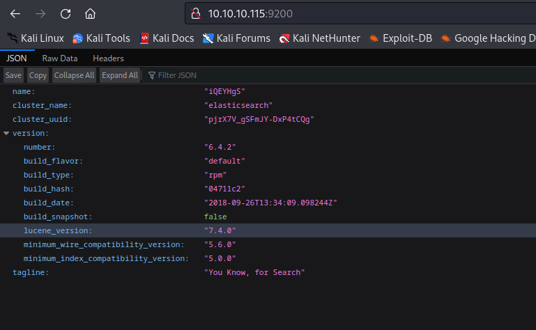

## Foothold
- Let's download the image and check it
  - Run:
    -  `file needle.jpg`
    -  `xxd needle.jpg`
    -  `strings needle.jpg`
 - You will notice a base64 string

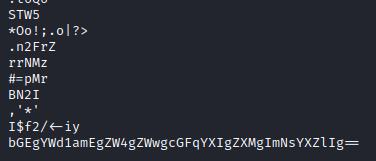


- Nothing else
  - Let's check `elasticsearch`
  - `curl http://10.10.10.115:9200/_cat/indices?v`

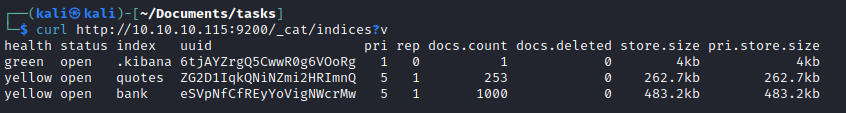

- Let's check `bank` and `quotes` indeces
  - `curl -s -X GET "http://10.10.10.115:9200/bank/_search?size=1000" | jq -c '.hits.hits[]'`
  - `curl -s -X GET "http://10.10.10.115:9200/quotes/_search?size=1000" | jq -c '.hits.hits[]'`
  - We don't find a clue that we had from image in `bank` index
  - But we find it in `quotes`

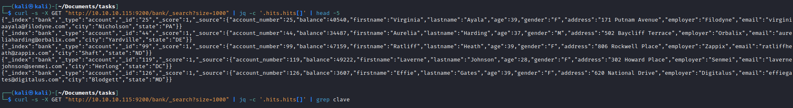


- Let's decode them

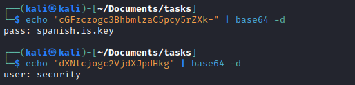

- SSH to box as `security`


## User
- Enumerate for privesc

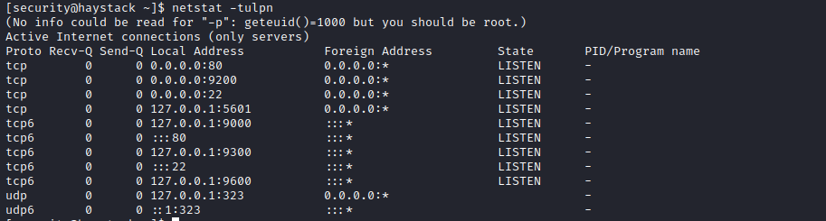

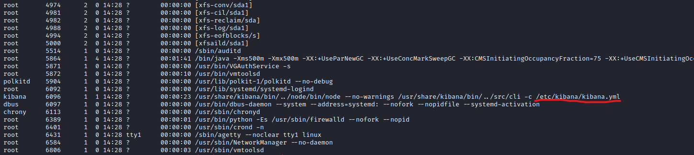


- So let's port forward `5601` 
  - `ssh -L 5601:localhost:5601 security@10.10.10.115`

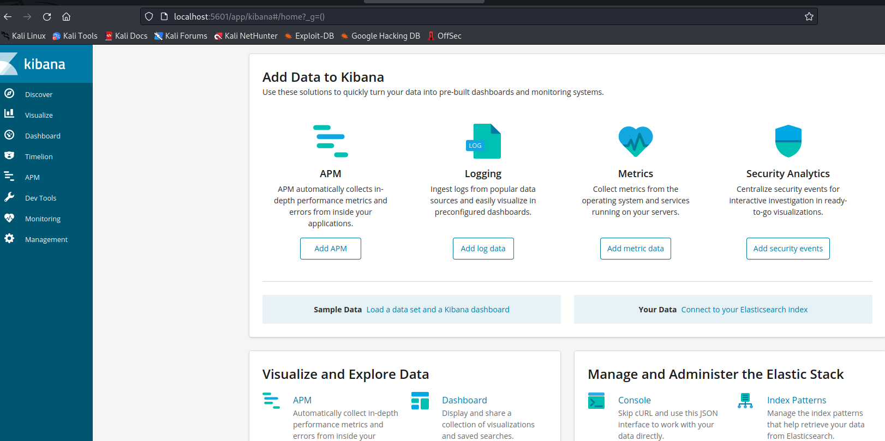


- We have a `LFI` in the kibana
  - https://github.com/mpgn/CVE-2018-17246


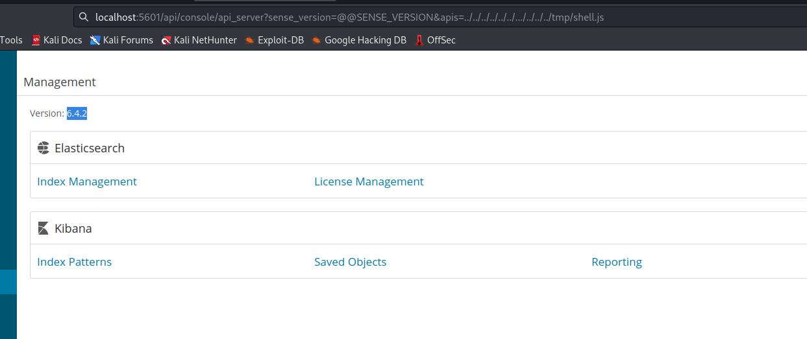


## Root
- We have a logstash running as root

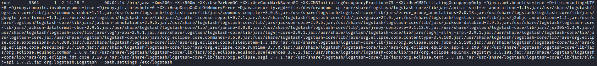


- Let's open `conf` files
  - According to `input.conf` every 10 seconds checks `/opt/kibana/logstash_*` and inputs files to `filter.conf` which eventually get executed based on `output.conf`

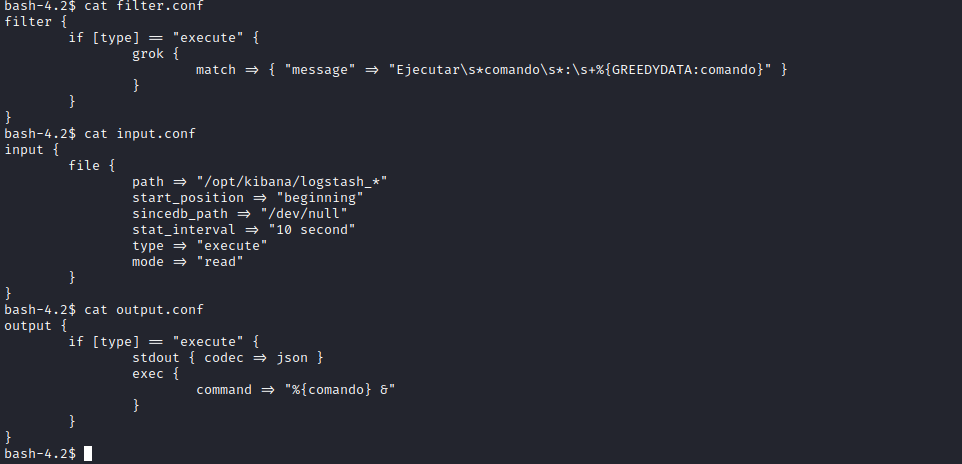

- Let's exploit the exec plugin by crafting the payload that passes the filter
  - Launch listener and wait for connection 
  - Rooted


