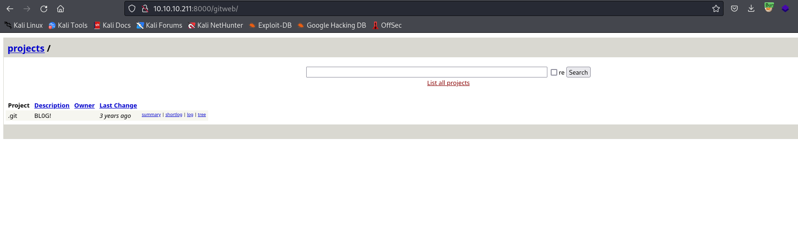
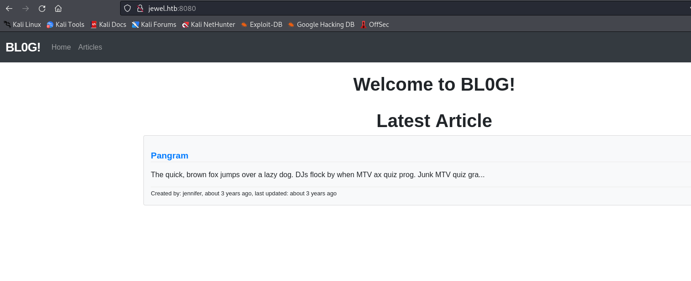

# Jewel
## Enumeration
- `nmap`
```
└─$ nmap -Pn -p- 10.10.10.211 --min-rate 5000               
Starting Nmap 7.94 ( https://nmap.org ) at 2023-10-29 17:03 GMT
Nmap scan report for 10.10.10.211 (10.10.10.211)
Host is up (0.18s latency).
Not shown: 65532 filtered tcp ports (no-response)
PORT     STATE SERVICE
22/tcp   open  ssh
8000/tcp open  http-alt
8080/tcp open  http-proxy

```
```
└─$ nmap -Pn -p22,8000,8080 -sC -sV 10.10.10.211 --min-rate 5000
Starting Nmap 7.94 ( https://nmap.org ) at 2023-10-29 17:08 GMT
Nmap scan report for 10.10.10.211 (10.10.10.211)
Host is up (0.21s latency).

PORT     STATE SERVICE VERSION
22/tcp   open  ssh     OpenSSH 7.9p1 Debian 10+deb10u2 (protocol 2.0)
| ssh-hostkey: 
|   2048 fd:80:8b:0c:73:93:d6:30:dc:ec:83:55:7c:9f:5d:12 (RSA)
|   256 61:99:05:76:54:07:92:ef:ee:34:cf:b7:3e:8a:05:c6 (ECDSA)
|_  256 7c:6d:39:ca:e7:e8:9c:53:65:f7:e2:7e:c7:17:2d:c3 (ED25519)
8000/tcp open  http    Apache httpd 2.4.38
| http-title: 10.10.10.211 Git
|_Requested resource was http://10.10.10.211:8000/gitweb/
| http-open-proxy: Potentially OPEN proxy.
|_Methods supported:CONNECTION
|_http-generator: gitweb/2.20.1 git/2.20.1
|_http-server-header: Apache/2.4.38 (Debian)
8080/tcp open  http    nginx 1.14.2 (Phusion Passenger 6.0.6)
|_http-title: BL0G!
|_http-server-header: nginx/1.14.2 + Phusion Passenger 6.0.6
Service Info: Host: jewel.htb; OS: Linux; CPE: cpe:/o:linux:linux_kernel

Service detection performed. Please report any incorrect results at https://nmap.org/submit/ .
Nmap done: 1 IP address (1 host up) scanned in 22.22 seconds

```

- Port `8000`



- Port `8080`



- `gobuster`
```
└─$ gobuster dir -u http://jewel.htb:8080/ -w /usr/share/wordlists/dirbuster/directory-list-2.3-medium.txt -x txt,html,js,php
===============================================================
Gobuster v3.6
by OJ Reeves (@TheColonial) & Christian Mehlmauer (@firefart)
===============================================================
[+] Url:                     http://jewel.htb:8080/
[+] Method:                  GET
[+] Threads:                 10
[+] Wordlist:                /usr/share/wordlists/dirbuster/directory-list-2.3-medium.txt
[+] Negative Status codes:   404
[+] User Agent:              gobuster/3.6
[+] Extensions:              txt,html,js,php
[+] Timeout:                 10s
===============================================================
Starting gobuster in directory enumeration mode
===============================================================
/login.js             (Status: 200) [Size: 1149]
/login.txt            (Status: 406) [Size: 0]
/login                (Status: 200) [Size: 2652]
/articles             (Status: 200) [Size: 3476]
/login.html           (Status: 200) [Size: 2652]
/login.php            (Status: 200) [Size: 2652]
/articles.txt         (Status: 406) [Size: 0]
/articles.html        (Status: 200) [Size: 3491]
/articles.js          (Status: 200) [Size: 1982]
/articles.php         (Status: 200) [Size: 3488]
/users                (Status: 500) [Size: 1635]
/users.txt            (Status: 406) [Size: 0]
/users.html           (Status: 500) [Size: 1635]
/users.php            (Status: 500) [Size: 1635]
/users.js             (Status: 500) [Size: 1635]
/signup.html          (Status: 200) [Size: 2800]
/signup               (Status: 200) [Size: 2800]
/signup.php           (Status: 200) [Size: 2800]
/signup.txt           (Status: 406) [Size: 0]
/signup.js            (Status: 200) [Size: 1297]
/404                  (Status: 200) [Size: 1722]
/404.html             (Status: 200) [Size: 1722]
/robots.txt           (Status: 200) [Size: 98]
/500                  (Status: 200) [Size: 1635]
/500.html             (Status: 200) [Size: 1635]
/422                  (Status: 200) [Size: 1705]
/422.html             (Status: 200) [Size: 1705]
```

## Foothold/User
- `http://10.10.10.211:8000` contains a `BLOG!` repo
  - Only `Initial commit` is present


- There we see a source code
  - Click `snapshot` to download an archive


- Let's start analysing
```
└─$ ls -lha
total 88K
drwxrwxr-x 13 kali kali 4.0K Sep 17  2020 .
drwxr-xr-x  3 kali kali 4.0K Oct 29 17:36 ..
drwxrwxr-x 10 kali kali 4.0K Sep 17  2020 app
-rw-rw-r--  1 kali kali 5.4K Sep 17  2020 bd.sql
drwxrwxr-x  2 kali kali 4.0K Sep 17  2020 bin
drwxrwxr-x  6 kali kali 4.0K Sep 17  2020 config
-rw-rw-r--  1 kali kali  130 Sep 17  2020 config.ru
drwxrwxr-x  2 kali kali 4.0K Sep 17  2020 db
-rw-rw-r--  1 kali kali 2.4K Sep 17  2020 Gemfile
-rw-rw-r--  1 kali kali 5.9K Sep 17  2020 Gemfile.lock
drwxrwxr-x  4 kali kali 4.0K Sep 17  2020 lib
drwxrwxr-x  2 kali kali 4.0K Sep 17  2020 log
-rw-rw-r--  1 kali kali  143 Sep 17  2020 package.json
drwxrwxr-x  2 kali kali 4.0K Sep 17  2020 public
-rw-rw-r--  1 kali kali  227 Sep 17  2020 Rakefile
-rw-rw-r--  1 kali kali  374 Sep 17  2020 README.md
drwxrwxr-x  2 kali kali 4.0K Sep 17  2020 storage
drwxrwxr-x  9 kali kali 4.0K Sep 17  2020 test
drwxrwxr-x  2 kali kali 4.0K Sep 17  2020 tmp
drwxrwxr-x  2 kali kali 4.0K Sep 17  2020 vendor

```

- `bd.sql` file contains credentials
  - But couldn't crack them
```
<SNIP>
COPY public.users (id, username, email, created_at, updated_at, password_digest) FROM stdin;
1       bill    bill@mail.htb   2020-08-25 08:13:58.662464      2020-08-25 08:13:58.662464      $2a$12$uhUssB8.HFpT4XpbhclQU.Oizufehl9qqKtmdxTXetojn2FcNncJW
2       jennifer        jennifer@mail.htb       2020-08-25 08:54:42.8483        2020-08-25 08:54:42.8483        $2a$12$ik.0o.TGRwMgUmyOR.Djzuyb/hjisgk2vws1xYC/hxw8M1nFk0MQy
<SNIP>
```

- `Gemfile` contains app information
  - Plugins, their versions etc.
```
└─$ cat Gemfile                                                                                                                 
source 'https://rubygems.org'
git_source(:github) { |repo| "https://github.com/#{repo}.git" }

ruby '2.5.5'

# Bundle edge Rails instead: gem 'rails', github: 'rails/rails'
gem 'rails', '= 5.2.2.1'
# Use postgresql as the database for Active Record
gem 'pg', '>= 0.18', '< 2.0'
# Use Puma as the app server
gem 'puma', '~> 3.11'
# Use SCSS for stylesheets
gem 'sass-rails', '~> 5.0'
# Use Uglifier as compressor for JavaScript assets
gem 'uglifier', '>= 1.3.0'
# See https://github.com/rails/execjs#readme for more supported runtimes
# gem 'mini_racer', platforms: :ruby

# Use CoffeeScript for .coffee assets and views
gem 'coffee-rails', '~> 4.2'
# Turbolinks makes navigating your web application faster. Read more: https://github.com/turbolinks/turbolinks
gem 'turbolinks', '~> 5'
# Build JSON APIs with ease. Read more: https://github.com/rails/jbuilder
gem 'jbuilder', '~> 2.5'
# Use Redis adapter to run Action Cable in production
gem 'redis', '~> 4.0'
# Use ActiveModel has_secure_password
gem 'bcrypt', '~> 3.1.7'

# Use ActiveStorage variant
# gem 'mini_magick', '~> 4.8'

# Use Capistrano for deployment
# gem 'capistrano-rails', group: :development

# Reduces boot times through caching; required in config/boot.rb
gem 'bootsnap', '>= 1.1.0', require: false

gem 'jquery-rails', '= 4.3.3'
gem 'bootstrap', '~> 4.5.0'
gem 'popper_js', '1.16.0'

gem 'will_paginate', '3.3.0'
gem 'bootstrap-will_paginate', '1.0.0'

group :development, :test do
  # Call 'byebug' anywhere in the code to stop execution and get a debugger console
  gem 'byebug', platforms: [:mri, :mingw, :x64_mingw]
end

group :development do
  # Access an interactive console on exception pages or by calling 'console' anywhere in the code.
  gem 'web-console', '>= 3.3.0'
  gem 'listen', '>= 3.0.5', '< 3.2'
  # Spring speeds up development by keeping your application running in the background. Read more: https://github.com/rails/spring
  gem 'spring'
  gem 'spring-watcher-listen', '~> 2.0.0'
end

group :test do
  # Adds support for Capybara system testing and selenium driver
  gem 'capybara', '>= 2.15'
  gem 'selenium-webdriver'
  # Easy installation and use of chromedriver to run system tests with Chrome
  gem 'chromedriver-helper'
end

# Windows does not include zoneinfo files, so bundle the tzinfo-data gem
gem 'tzinfo-data', platforms: [:mingw, :mswin, :x64_mingw, :jruby]
```

- If we visit https://rubygems.org/gems/rails/versions, we see `5.2.2.1 - March 13, 2019`
  - So if we search for `cves` based on date on https://cve.mitre.org/cgi-bin/cvekey.cgi?keyword=rails 
  - We see that it's vulnerable to [deserialization attack](https://www.rapid7.com/db/vulnerabilities/ruby_on_rails-cve-2020-8164/)


- There is a [github repo](https://github.com/masahiro331/CVE-2020-8165)
  - With a [link](https://groups.google.com/g/ruby-security-ann/c/OEWeyjD7NHY) to google groups
  - It states about `unexpected behaviour in the MemCacheStore and RedisCacheStore where, when untrusted user input is written to the cache store using the `raw: true` parameter`
  - So let's `grep` it
```
└─$ grep -r "raw: true" .                                                                                                                                                                        
./app/controllers/application_controller.rb:      @current_username = cache.fetch("username_#{session[:user_id]}", raw: true) do
./app/controllers/users_controller.rb:      @current_username = cache.fetch("username_#{session[:user_id]}", raw: true) {user_params[:username]}
```

- If we open the `users_controller.rb`, we see that the `cache.fetch` is used in `update` function
```
<SNIP>
  def update
    @user = User.find(params[:id])
    if @user && @user == current_user
      cache = ActiveSupport::Cache::RedisCacheStore.new(url: "redis://127.0.0.1:6379/0")
      cache.delete("username_#{session[:user_id]}")
      @current_username = cache.fetch("username_#{session[:user_id]}", raw: true) {user_params[:username]}
      if @user.update(user_params)
        flash[:success] = "Your account was updated successfully"
        redirect_to articles_path
      else
        cache.delete("username_#{session[:user_id]}")
        render 'edit'
      end
    else
      flash[:danger] = "Not authorized"
      redirect_to articles_path
    end
  end

  private
    def user_params
    params.require(:user).permit(:username, :email, :password)
  end
end
<SNIP>
```

- So we can perform it only when we `update` the user
  - But we need to create a user and create our payload
  - Install `rbenv` via `apt install rbenv`
    - Then we can install specific `ruby` version `rbenv install <VERSION>`
    - https://github.com/rbenv/rbenv
```

```
# Root